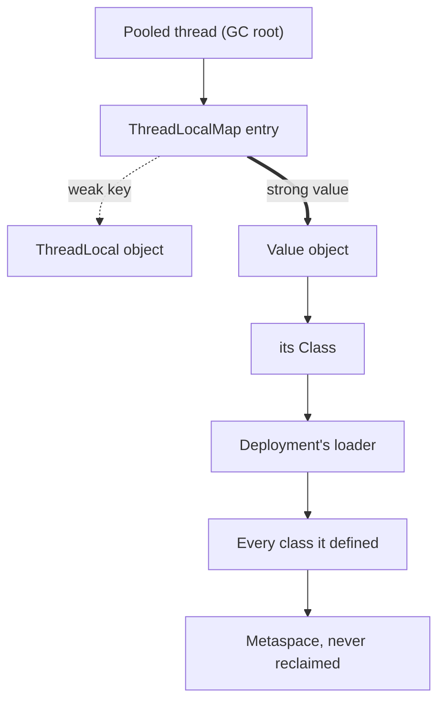

> **Recall layer.** The interview answer is
> [Q81](/docs/java/jvm-memory-gc#q81). This page builds the model.

## 1. The problem it exists to solve

A plugin host loads connector jars at runtime. Someone reports this:

```
java.lang.ClassCastException: class com.acme.Config cannot be cast to
class com.acme.Config (com.acme.Config is in unnamed module of loader
'app'; com.acme.Config is in unnamed module of loader
com.acme.PluginLoader @6d06d69c)
```

The same fully-qualified name on both sides of the word `cast`. There is one
`Config.java` in the repository, one `Config.class` in the build output, and the
message says it cannot be cast to itself.

The first instinct is that something is corrupt — a stale build, a duplicate jar
on the classpath, a broken IDE. None of those is the cause, and chasing them
wastes a day. The message is precisely accurate: there are two `com.acme.Config`
types in this JVM, they are different types, and the JVM is telling you so with
the only piece of information that distinguishes them.

That piece of information is the loader. Everything else on this page follows
from it, including a failure mode that looks completely unrelated — a service
that runs out of Metaspace after the fourth deploy.

## 2. A class loader is a namespace, not a file reader

The name misleads. Reading bytes is the least interesting thing a `ClassLoader`
does, and a custom one often reads no files at all.

The load-bearing rule is this:

> **A class's runtime identity is the pair (binary name, defining loader).**

`com.acme.Config` loaded by the application loader and `com.acme.Config` loaded
by `PluginLoader` are two distinct types, with distinct `Class` objects,
distinct static fields, and no assignability between them. Byte-for-byte
identical input; two types.

Three consequences worth holding separately:

- **Statics multiply.** [Q14](/docs/java/core-language#q14) says static state is
  "one per class" — the precise statement is *one per class per defining
  loader*. A singleton registry, a cache, a `static` counter: each loader gets
  its own. In a plugin host that is the feature. In a leak it is why the old
  copy still has your data.
- **Package-private access is scoped to the *runtime package*** — the pair
  (package name, defining loader), not the package name alone. Two classes in
  `com.acme` from different loaders cannot touch each other's package-private
  members.
- **A cast is not a name comparison.** The JVM compares `Class` objects. That is
  why the error in section 1 reads the way it does, and why the fix is never
  "rebuild".

Isolation is the whole point. A plugin host, an application server, an IDE, a
build daemon and a test runner all want to run code that disagrees about which
version of a library it needs, in one process, without the versions seeing each
other. A loader is the only unit the JVM offers for that.

## 3. Delegation, and the three places it is deliberately inverted

The default is **parent-first**. `loadClass` asks its parent, which asks its
parent, up to the bootstrap loader, and only defines the class itself if
everyone above said no.

```
Bootstrap (java.base, native)  ->  Platform  ->  Application  ->  your loader
```

The reason is integrity, not tidiness: parent-first is what makes it impossible
for a jar on the classpath to supply its own `java.lang.String`. If delegation
went the other way by default, every security property of the platform would be
negotiable by whoever controlled the classpath.

But parent-first also means a plugin can never override a class the host already
has, which defeats isolation. So three inversions exist, and knowing which one
you are in explains most surprising loading behaviour:

- **Parent-last (child-first) loaders.** Servlet containers, plugin frameworks
  and Spring Boot DevTools' `RestartClassLoader` all search themselves before
  delegating, so the deployed unit can carry its own version of a library. The
  container then carves out exceptions — `jakarta.servlet.*` must still come
  from the parent, or the plugin's `HttpServlet` would be a different type from
  the one the container invokes.
- **The thread-context classloader.** A class in the parent cannot see classes
  in the child by ordinary delegation, yet JDBC, JAXP, JNDI and every
  `ServiceLoader` lookup need exactly that: platform code locating an
  implementation supplied by the application. The escape hatch is
  `Thread.currentThread().getContextClassLoader()` — a mutable, per-thread
  pointer that framework code consults instead of its own loader. It is a
  deliberate hole in the delegation model, it is why `ServiceLoader` works at
  all, and it is a prime suspect in section 6.
- **Modules, which change accessibility rather than loading.**
  [JPMS](/docs/java/modern-java#q90) added a layer *above* this hierarchy, not a
  replacement for it. The three built-in loaders still exist and still delegate;
  what modules changed is whether a successfully loaded class is *accessible* to
  the code asking. That distinction is why the failure mode is
  `IllegalAccessError` or `InaccessibleObjectException` rather than
  `ClassNotFoundException`, and why `--add-opens` is a separate concept from the
  classpath. Most application code still runs as an unnamed module on the
  classpath, so for a typical service the loader hierarchy is what you actually
  reason about.

## 4. Loading, linking, initialisation — and which errors come from where

One class becoming usable is five steps, and they fail differently:

1. **Loading** — find the bytes, call `defineClass`, get a `Class` object.
   Failure here is `ClassNotFoundException`, a checked exception thrown by a
   *lookup* that came up empty.
2. **Verification** — prove the bytecode is type-safe and cannot corrupt the
   operand stack. Failure is `VerifyError`, and in practice it means a
   bytecode-generating library emitted something for a class-file version this
   JVM does not accept.
3. **Preparation** — allocate static fields and set them to default values
   (`0`, `null`, `false`). Not to their initialisers yet.
4. **Resolution** — turn symbolic constant-pool references into direct ones.
   Lazy in HotSpot, which is why a missing dependency can surface on first call
   rather than at startup, as `NoClassDefFoundError`.
5. **Initialisation** — run static initialisers and static field assignments, in
   source order, as the synthetic `<clinit>` method.

Two details from that list earn their keep.

**`ClassNotFoundException` and `NoClassDefFoundError` are not synonyms.** The
first means someone asked for a class by name and it was not there — usually
`Class.forName` on a driver or a plugin, so look at the classpath. The second
means the class was linked against successfully at compile time and is missing
now, or — the case that eats afternoons — the class exists but its `<clinit>`
threw. The JVM marks the class erroneous, and every later use reports
`NoClassDefFoundError: Could not initialize class X`, with the real
`ExceptionInInitializerError` and its cause present only in the *first*
occurrence. If you are reading the fifth stack trace, the actual error scrolled
past hours ago.

**`<clinit>` runs lazily, exactly once, under a per-class lock.** Lazily, on
first active use — which is why `Class.forName(name, false, loader)` can load a
class without triggering it, and why the three-argument form exists at all.
Under a lock, which is why two threads that each initialise a class whose
`<clinit>` touches the other will deadlock, in a way `jstack` reports as two
threads blocked with no `synchronized` block anywhere in your source. The JVM
does not detect it and there is no timeout.

## 5. Unloading is all-or-nothing, and that is where leaks come from

Class metadata lives in **Metaspace** — native memory, outside `-Xmx`, and
[unbounded by default](/docs/concepts/jvm-memory). It is reclaimed on exactly one
condition:

> **A class can be unloaded only when its defining loader is unreachable.** Not
> the class — the loader, and then every class it defined, together.

This is a sound rule. The loader, its classes, their static fields and the
objects those fields reference form one interdependent graph, and there is no
safe way to unload half of it. But it turns the loader into a single point of
retention with enormous fan-out: hold one reference to one object and you hold
thousands of classes.

Which is how a `ThreadLocal` becomes Metaspace exhaustion:



Read the two edges out of the map entry. The **key** is weak, so the
`ThreadLocal` object itself is collectable and the leak looks handled. The
**value** is strong, and nothing clears it until the thread dies or someone
calls `remove()`. On a pooled thread the thread never dies — that is the point
of a pool — so the value survives, and with it the entire class graph behind it.
[Q52](/docs/java/concurrency#q52) states the rule, "always `remove()` in a
`finally`"; this is the mechanism that makes it non-negotiable rather than
merely tidy.

## 6. What actually pins a loader

The `ThreadLocal` path is the common one, not the only one. Every entry below is
a strong reference living somewhere that **outlives the deployment**, which is
the shape to recognise:

| The pin | Why it outlives the loader |
|---|---|
| `ThreadLocal` value on a pool thread | the thread survives the deployment |
| A thread the deployment started and never joined | a running thread is a GC root |
| A JDBC driver left in `DriverManager` | `DriverManager` is in the platform loader |
| `Runtime.addShutdownHook` never removed | held by the JVM until exit |
| A registered JMX MBean | the MBean server is container-scoped |
| A JUL or log4j logger holding a custom formatter | logging is usually parent-scoped |
| A `static` cache in a *shared* library keyed by `Class` | shared means parent loader |
| An RMI, timer or `ForkJoinPool` thread factory | captures the loader implicitly |

Two properties make this class of bug distinctive.

**The pin is always in the parent.** A reference from the deployment to itself is
harmless — it dies with the loader. Only a reference held by something with a
longer lifetime keeps it alive, so the culprit is by definition code you did not
deploy: the container, the JDK, a shared library.

**It is invisible until the third or fourth cycle.** One retained deployment
just looks like Metaspace being larger than you expected. The graph is a
staircase, and the pager fires on a Friday after a week of routine deploys.

## 7. Diagnosing one

Order matters here; the first two steps are cheap and usually sufficient.

- **`-Xlog:class+unload=info`.** Deploy twice and watch. Silence after the second
  deployment *is* the finding. This is the fastest possible confirmation and
  almost nobody reaches for it first.
- **`jcmd <pid> VM.classloaders`** for the loader tree, and
  **`VM.classloader_stats`** for classes and bytes per loader. Two loader trees
  for one application is the diagnosis; you do not need a heap dump to see it.
- **A heap dump, then paths to GC roots.** In Eclipse MAT, list all
  `ClassLoader` instances, exclude weak and soft references, and ask for the
  shortest path to a GC root on the one that should be dead. That path names the
  pin, and MAT's leak-suspects report frequently identifies it unassisted.
- **`jcmd <pid> VM.native_memory summary`** with
  `-XX:NativeMemoryTracking=summary`, to attribute the growth to `Class` rather
  than to the heap — the discipline from the [JVM memory
  page](/docs/concepts/jvm-memory), and what stops this being diagnosed as a heap
  problem for a week.

The trap: **do not set `-XX:MaxMetaspaceSize` to make the alert quieter.** It
converts an unbounded native leak into a bounded one that throws
`OutOfMemoryError: Metaspace`, which is genuinely better — but only because it
fails fast and loudly. Set it *and* fix the pin; a cap alone turns a slow
degradation into a crash loop.

## 8. What this does not cover, and where the ground has shifted

- **Hot redeploy in production is dead.** Immutable images and rolling
  deployments replaced it, which is why this failure mode feels historical. It
  is not gone; it moved to processes that are long-lived by design and load
  classes repeatedly — build daemons, IDEs, test runners reusing a forked JVM,
  Spring Boot DevTools, and hosts with a plugin API (Kafka Connect, Trino,
  Elasticsearch, CI agents).
- **Generated classes are the modern churn.** Proxies, mocks and mappers
  generate classes at runtime. Since JDK 15 the right target is a **hidden
  class** ([JEP 371](https://openjdk.org/jeps/371),
  `MethodHandles.Lookup::defineHiddenClass`): not discoverable by name, and
  unloadable independently of the loader that created it — exactly the property
  ordinary generated classes lack. It replaced `Unsafe::defineAnonymousClass`,
  removed in JDK 17. A library that still generates a class per instance into an
  application loader is a Metaspace growth curve waiting to happen.
- **Bytecode generation has a supported API now.** The [Class-File
  API](/docs/java/modern-java-22-25#q148) (JEP 484, final in JDK 24) is the
  JDK-supplied replacement for ASM, which matters here because the
  ASM-lags-the-JDK cycle is the usual cause of `VerifyError` on upgrade.
- **`sun.misc.Unsafe` is closing on a published schedule.** Its memory-access
  methods warn in JDK 24 and **default to `deny` in JDK 26**
  (`--sun-misc-unsafe-memory-access`), with removal in JDK 28 or later. Loader
  and instrumentation tricks built on them have a deadline.
- **AOT caching does not cover custom loaders — by specification.** Project
  Leyden's cache ([JEP 483](https://openjdk.org/jeps/483) in JDK 24, extended by
  JEP 514 and JEP 515 in 25 and made GC-agnostic by JEP 516 in 26) stores classes
  already *loaded and linked* during a training run. Its stated limit: only
  classes loaded from the class path, the module path and the JDK itself, by the
  JDK's built-in loaders, can be cached. It also refuses JVMTI agents that
  rewrite classes through `ClassFileLoadHook`. **A custom loader is now a
  startup-cost decision, not only an isolation one** — see
  [Q150](/docs/java/modern-java-22-25#q150) for the cache itself.
- **GraalVM native image removes dynamic loading entirely.** Closed-world
  analysis at build time means no runtime class definition at all, and reflection
  and proxies become build configuration. It is the far end of the same axis, and
  the reason "we use a plugin loader" is an architectural commitment rather than
  an implementation detail.
- **Isolation is not security.** The Security Manager is [permanently
  disabled](/docs/java/modern-java-22-25#q153) (JEP 486, JDK 24), so protection
  domains and `ClassLoader`-based sandboxing are gone as a strategy. A custom
  loader gives you namespace separation and never a security boundary — run
  untrusted code in a separate process.

## 9. Lab: build the failure, then watch it stop

### Lab 1 — two of the same class

Compile a trivial `com.acme.Config` into `plugin/`. Then, with the *same* class
also on the application classpath:

```java
var loader = new URLClassLoader("plugin",
        new URL[]{ Path.of("plugin").toUri().toURL() },
        ClassLoader.getSystemClassLoader());
Object o = loader.loadClass("com.acme.Config").getConstructor().newInstance();
com.acme.Config c = (com.acme.Config) o;   // ClassCastException?
```

It will *not* throw yet — parent-first delegation finds the classpath copy, so
there is only one type. Now pass `null` as the parent, or override `loadClass`
to search locally first, and reproduce the error from section 1 exactly. **The
two-line difference between working and not working is the whole of section 3.**

### Lab 2 — watch delegation

```bash
java -Xlog:class+load=info -cp app.jar com.example.App | grep -i config
```

Each line names the source and the defining loader. Run Lab 1 both ways and put
the two outputs side by side.

### Lab 3 — initialisation is lazy, and locked

Give `Config` a `static { System.out.println("clinit"); }`. Call
`Class.forName("com.acme.Config", false, loader)`, then the same with `true`.
Only the second prints. Then write two classes whose static initialisers
reference each other, initialise one from each of two threads, and take a
`jstack`: a deadlock with no `synchronized` anywhere in your source.

### Lab 4 — leak a loader on purpose

```java
static final ExecutorService POOL = Executors.newFixedThreadPool(1);
static final ThreadLocal<Object> HOLDER = new ThreadLocal<>();

void deploy() throws Exception {
    var cl = new URLClassLoader("v" + n++, urls, null);
    Class<?> c = cl.loadClass("com.acme.Leaky");
    POOL.submit(() -> HOLDER.set(c.getConstructor().newInstance())).get();
    cl.close();                       // does not help
}
```

Loop `deploy()` under `-Xlog:class+unload=info -XX:MaxMetaspaceSize=64m`. Nothing
unloads; you get `OutOfMemoryError: Metaspace`. Note what `close()` did and did
not do — it releases file handles and stops *further* loading, and does nothing
about reachability. That is the single most common misunderstanding about the
API.

### Lab 5 — remove the pin

Wrap the submitted task in `try { ... } finally { HOLDER.remove(); }` and rerun.
`class+unload` starts logging and the loop runs indefinitely. **That diff is the
page.**

### Lab 6 — find it from a heap dump instead

Rerun Lab 4, take `jcmd <pid> GC.heap_dump leak.hprof`, and open it in Eclipse
MAT. Find all `URLClassLoader` instances, pick one that should be dead, and run
"Path to GC Roots" excluding weak references. Confirm it names the
`ThreadLocalMap`. Practise on a leak you built so you can do it on one you did
not.

### Lab 7 — measure what a custom loader costs at startup

Take any Spring Boot application and build an AOT cache:

```bash
java -XX:AOTCacheOutput=app.aot -jar app.jar     # train (JEP 514, JDK 25+)
java -XX:AOTCache=app.aot -jar app.jar           # run
```

Record the startup delta. Then move part of the application behind a
`URLClassLoader` and repeat. Those classes are absent from the cache — confirm
with `-Xlog:class+load=info`, which reports a shared source for cached classes
and an ordinary one for the rest. This turns section 8's specification limit
into a number you have measured yourself.

## 10. Leading on this

**Insist on the loader in the bug report.** "Same class, different loader" is a
five-second diagnosis for someone who has seen it and a lost day for someone who
has not. Teach the `ClassCastException` message in section 1 to the whole team;
it is the highest-value thirty seconds of JVM teaching available.

**Make redeploy leaks a pre-merge check, not a production discovery.** If your
platform has any long-lived JVM that loads classes repeatedly, add a test that
deploys and drops a loader N times under a `-XX:MaxMetaspaceSize` cap and
asserts that `class+unload` fired. It costs an afternoon and moves an entire
failure class out of production, where it only ever appears on the fourth deploy
of a Friday.

**Treat every custom classloader as a decision with a written justification.** It
buys namespace isolation and costs you the AOT cache, native-image
compatibility, some agent-based tooling, and a permanent leak risk. Genuine
plugin hosts and true version conflicts justify it; "because the framework does
it" does not. Per section 8 that price went *up*, so a loader introduced in 2015
deserves re-examination now rather than grandfathering.

**Standardise the `ThreadLocal` rule and enforce it mechanically.** A `set()`
with no `finally { remove() }` on a pooled thread is a review block, and ArchUnit
or an Error Prone check can enforce it without relying on reviewer attention.
Where a request-scoped value is the real need on Java 25, prefer
[`ScopedValue`](/docs/java/modern-java#q91), which is bounded by construction and
cannot outlive its scope.

**Own the class-file version in your dependency policy.** `VerifyError` on a JDK
upgrade is almost never your bytecode; it is a bytecode library one release
behind. Track ASM, Byte Buddy, Mockito and every agent in your build as explicit
upgrade blockers, and prefer libraries that have moved to the Class-File API.

## 11. Where to go deeper

- *The Java Virtual Machine Specification*, chapter 5, "Loading, Linking, and
  Initializing" — the actual rules, including the initialisation procedure and
  its locking. Shorter and more readable than its reputation.
- [JEP 371: Hidden Classes](https://openjdk.org/jeps/371) — the design rationale
  for unloadable generated classes, and the clearest statement anywhere of what a
  defining loader costs.
- [JEP 483: Ahead-of-Time Class Loading &amp; Linking](https://openjdk.org/jeps/483)
  — read the limitations section specifically; it is a precise statement of what
  custom loaders now cost at startup.
- Eclipse MAT's documentation on the leak-suspects report and "path to GC roots"
  — the tool skill the whole of section 7 depends on.
- Tomcat's `JreMemoryLeakPreventionListener` source and its
  [listener documentation](https://tomcat.apache.org/tomcat-11.0-doc/config/listeners.html)
  — a catalogue, written by people who fixed each one, of the JDK APIs that pin a
  webapp loader.
- Frank Kieviet's and Nicholas Frankel's classloader-leak write-ups — the
  canonical worked examples. Old, and the mechanism has not changed.

## 12. Self-check

1. A `ClassCastException` reports the same fully-qualified name on both sides.
   What is the one piece of information that resolves it, and where in the
   message do you find it?
2. Why is "a static field is one per class" incomplete, and what is the complete
   statement?
3. Why is parent-first delegation the default, and what specific property would
   be lost if child-first were?
4. What problem does the thread-context classloader solve that ordinary
   delegation cannot, and which JDK APIs depend on it?
5. Distinguish `ClassNotFoundException` from `NoClassDefFoundError`, and say
   which of them can hide its own root cause from you.
6. State the exact condition under which a class can be unloaded, and explain why
   it is all-or-nothing.
7. A `ThreadLocal`'s key is a weak reference, yet it is the classic classloader
   leak. Explain the asymmetry.
8. A team wants to add a plugin classloader to a service that autoscales from
   zero. What does that cost them beyond the leak risk, and what would you ask
   for before agreeing?
