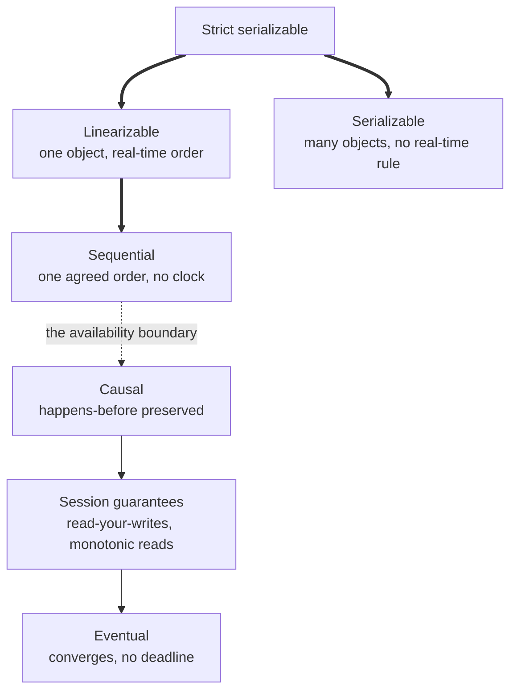

> **Recall layer.** The interview answers are
> [Q40](/docs/data/transactions-mvcc#q40),
> [Q46](/docs/data/scaling-operations#q46) and
> [Q124](/docs/java/distributed-systems#q124). This page builds the model.

## 1. The problem it exists to solve

A payments API deduplicates on an idempotency key. The write path is careful:
the payment row and the key row go in one transaction, the key column has a
unique constraint, and a retry that races the original loses on the constraint
rather than on a read. It is the design from the
[idempotency page](/docs/concepts/idempotency), and it is correct.

Then the read path gets a performance review. Ninety percent of traffic is
reads, the primary is at 70% CPU, and someone adds a read replica and routes
every `readOnly` transaction to it. The dedup lookup is a `readOnly`
transaction.

```
t=0ms    POST /payments  Idempotency-Key: k-991  -> primary: INSERT, COMMIT
t=40ms   client times out, retries
t=41ms   POST /payments  Idempotency-Key: k-991  -> replica: SELECT ... k-991
                                                    replica replayed to t=12ms
                                                    0 rows
t=42ms                                           -> primary: INSERT
```

Two payouts. Nothing in that trace is a bug in the usual sense: the constraint
is right, the transaction is right, the retry is right, and the two inserts were
41ms apart, so the constraint never even had a race to arbitrate. The defect is
that a *latency and capacity* decision — read from a replica — silently changed
the *consistency model* of one operation that could not survive the change, and
nothing in the schema, the type system or the code review made that visible.

The purpose of this page is to make it visible: to give the models names, so
that "this read must be linearizable and that one may be a minute stale" is a
sentence you can write in a design document and enforce in CI, rather than
something the routing layer decides for you by accident.

## 2. Two different letters C

The `C` in ACID and the `C` in CAP are unrelated, and conflating them is the
most common error in this subject.

- **ACID's C — consistency.** Your invariants hold: the ledger balances, the
  foreign key resolves. This is mostly the application's job. The database
  contributes atomicity and isolation and enforces the constraints you declared;
  it has no idea what your invariants are otherwise.
- **CAP's C — linearizability.** A single, real-time-respecting order over the
  operations on one object. Every read sees the most recently completed write,
  where "most recent" means by the wall clock, not by some internal order.

They are different dials on different axes, and neither implies the other.
`SERIALIZABLE` on the primary tells you nothing about what a replica shows —
[isolation levels](/docs/concepts/isolation-levels) governs one node, and says
so explicitly in its own section 6. A DynamoDB strongly consistent read tells
you nothing about whether two items changed atomically.

The combination of both, precisely stated, is **strict serializability**:
serializability's total order over multi-object transactions, plus
linearizability's real-time constraint. That is the strongest thing on offer,
and it is what Spanner sells and what Cassandra's Accord protocol implements.

## 3. The hierarchy, and where availability is lost



Downwards is weaker: each model implies the ones below it. Read the *edges*
rather than the boxes, because the dotted one is the whole argument.

**Above the boundary**, a model needs nodes to agree before answering. Under a
network partition some or all nodes must therefore stop serving, because a node
that cannot reach its peers cannot know whether a newer write exists. This is
not an implementation weakness waiting to be engineered away; it is proved.

**Below the boundary**, the models are *sticky available* — a client that keeps
talking to the same server can make progress right through a partition, and its
own view stays coherent. Causal consistency, the session guarantees and eventual
consistency all live in this region, and that is the reason to know their names.

The models themselves:

- **Linearizable** — one object behaves as if there were a single copy, and every
  operation takes effect instantaneously at some moment between its invocation
  and its response. A compare-and-set needs this. So does a dedup lookup.
- **Sequential** — every node sees the same order of operations, but that order
  need not match real time. A read may be stale, as long as it is stale in a way
  consistent with an order everybody agrees on.
- **Causal** — operations connected by happens-before are seen in that order
  everywhere; concurrent operations may be seen in different orders by different
  nodes. The term is deliberate: it is the same partial order as the
  [JMM's happens-before](/docs/concepts/jmm), moved from cores and caches to
  nodes and networks.
- **Session guarantees** — a per-client slice of causal, covered in section 5.
- **Eventual** — if writes stop, replicas converge. It says nothing about when,
  and nothing about what you see meanwhile. Treat "eventually consistent" as a
  statement that no model has been chosen yet, and ask the follow-up: eventually
  by *when*, and what does a user see in the meantime?

## 4. CAP is about partitions; PACELC is the one you use daily

CAP says: during a network partition, you must choose between consistency and
availability. That is all it says. It makes no claim about the other 99.9% of
the time, and "we are an AP system" as a product label is mostly marketing.

Abadi's **PACELC** is the useful version. If **P**artitioned, choose
**A**vailability or **C**onsistency; **E**lse, choose **L**atency or
**C**onsistency. The else-branch is the one you pay for every day. A quorum write
across three availability zones costs a round trip — a millisecond or two. Across
three regions it costs a hundred. Almost nobody's partition budget dominates
their latency budget, so almost every real consistency decision is being made in
the branch CAP does not discuss.

The honest design question is therefore never "are we CP or AP". It is, per
operation: how much staleness can this survive, and how much latency will we pay
to remove it?

## 5. Session guarantees are the useful middle, and you implement them yourself

The four guarantees are Terry et al.'s, from the Bayou project in 1994, and they
remain the right vocabulary:

- **Read-your-writes** — you see your own write.
- **Monotonic reads** — your view never goes backwards in time.
- **Monotonic writes** — your writes apply in the order you issued them.
- **Writes-follow-reads** — if you read X and then write Y, anyone who sees Y
  also sees X.

Three implementations, in increasing order of precision:

**(a) Sticky-to-primary for N seconds after a write.** Crude, works, and wastes
the read capacity the replica was bought for. The real problem is that N is a
guess, and it becomes wrong the first time replay lag spikes.

**(b) Sticky sessions to one replica.** Gives monotonic reads almost for free.
Gives nothing across a failover, and nothing across a service hop.

**(c) Token-based.** Capture a replication position at write time, carry it in
the session, and require the reader to be at or past it. This is the general
solution, and every serious system exposes the primitive:

- **PostgreSQL.** `pg_current_wal_lsn()` on the primary,
  `pg_last_wal_replay_lsn()` on the standby. As of 18 — the current stable line —
  those are the primitives and there is no built-in wait, so you poll, or you
  pick a replica that has already caught up. PostgreSQL 19, in beta as of
  September 2026, adds a first-party
  `WAIT FOR LSN '0/3A8F1C8' WITH (MODE 'standby_replay', TIMEOUT '500')`. Read
  its restrictions before designing around it: it must be a top-level command,
  not inside a function, procedure or `DO` block; it requires that no snapshot be
  held; and it cannot run above `READ COMMITTED`.
- **MongoDB.** A causally consistent session tracks `operationTime` and
  `clusterTime` for you. The catch is in the documentation and is easy to miss:
  all four guarantees hold **only** with `readConcern: "majority"` *and*
  `writeConcern: "majority"`. Weaker concerns do not error; they quietly give you
  less than you believe you configured.
- **Kafka.** The consumer offset is already the token, which is why this problem
  looks easy there and is not.

The design point that outlives the specific APIs: **the token has to cross your
API boundary.** It lives in a header, a cookie or a response field, and every
service in the hop has to pass it along. A system that "has read-your-writes"
because its database exposes an LSN, but discards the LSN at the edge, does not
have read-your-writes.

## 6. Choosing per operation

This is the whole page in one table, and the column that matters is the middle
one, because it is the one nobody writes down.

| Operation | Weakest model it survives | Mechanism |
|---|---|---|
| Authorise a payment, decrement stock | Linearizable, one key | Primary; conditional update or unique constraint |
| Idempotency-key lookup on retry | Linearizable | Primary only, never a replica |
| "Your payment succeeded", right after the POST | Read-your-writes | LSN token, or render from the write response |
| A customer's own transaction history | Monotonic reads | Sticky replica |
| Merchant dashboard, yesterday's totals | Eventual | Replica, read model or warehouse |
| Order joined with customer, across services | Eventual, bounded | CQRS read model, or API composition when freshness wins ([Q89](/docs/design/microservices-data#q89)) |
| Events for one account, in order | Causal, per entity | Partition by account key end to end ([Q138](/docs/data/cross-cutting#q138)) |

Two rules transfer out of that table.

**Default to the weakest model the operation can survive, and keep the
exceptions explicit and few.** A codebase where every read goes to the primary
has no consistency problem and no read scaling. One where every read goes to a
replica has read scaling and the incident in section 1. The value is not in
which default you pick; it is in having labelled the exceptions at all.

**Never let the routing layer choose the model.** `@Transactional(readOnly =
true)` dispatching to a replica means a data-freshness decision is being encoded
by an annotation whose name is about transaction demarcation, and inherited by
every method that happens to carry it. If replica routing is something your
application does, it needs a marker of its own — and the
[proxy page](/docs/concepts/spring-proxy) explains why that annotation is such an
attractive and such a wrong place to hang it.

## 7. How five systems expose the dial

The dial exists everywhere. What differs is how honestly it is labelled.

**PostgreSQL.** `synchronous_commit` runs `off`, `local`, `remote_write`, `on`
(the default — flushed on the standby) and `remote_apply` (replayed and
*visible* on the standby). Only `remote_apply` gives a reader on that standby
read-your-writes with no token at all. It is settable per transaction:
`SET LOCAL synchronous_commit = 'remote_apply'` around the few writes that need
it is choosing per operation, literally. `synchronous_standby_names = 'ANY 2 (s1,
s2, s3)'` is a quorum; `FIRST 2 (...)` is a priority list. The foot-gun is that
when `synchronous_standby_names` is empty, `remote_apply`, `remote_write` and
`on` all collapse to plain local commit — not an error, not a warning, the
setting simply means nothing.

**MongoDB.** `writeConcern` of `w: 1` or `w: "majority"`, with or without
journalling; `readConcern` of `local`, `available`, `majority`, `linearizable` or
`snapshot`. The implicit default write concern is `majority`, dropping to `w: 1`
when the count of data-bearing voting members cannot support a majority.
`readConcern: "linearizable"` exists, applies to a single document, and is
expensive enough that reaching for it should prompt a conversation.

**DynamoDB.** Single-region, reads are eventually consistent by default and
`ConsistentRead=true` costs double and reads from the leader. Multi-region is
where the received wisdom has actually changed, so check the date on anything you
read about it. Global tables used to mean eventual replication with
last-writer-wins, full stop. Since **30 June 2025** you choose a consistency mode
at creation time: MREC — the default, multi-active, last-writer-wins, publishing
a `ReplicationLatency` metric — or **MRSC**, where a write is replicated
synchronously to at least one other Region before it returns. MRSC's terms read
best as a list, because they are the price of the guarantee: exactly three
Regions, either three full replicas or two plus a *witness* that stores only
replicated change data rather than a copy of the table; no TTL; no
`TransactWriteItems` or `TransactGetItems`; no `ReplicationLatency` metric;
same-account only; and the mode cannot be changed after the table is created.

**Cassandra.** Tunable per query. At replication factor 3, `QUORUM` reads and
`QUORUM` writes overlap in at least one replica, so a read sees the last
acknowledged write — but that is not linearizability, and a compare-and-set needs
a lightweight transaction (`IF NOT EXISTS`), which runs Paxos and costs several
times a normal write. The 5.0 line is current stable — 5.0.9, August 2026. **6.0
is in alpha**, carrying **Accord**: a leaderless consensus protocol offering
strictly serializable multi-partition transactions in one WAN round trip in the
common case, shipped off by default so that upgrading does not mean adopting it.
It is the most interesting thing happening in this space; it is also not
released, and is worth describing that way.

**Kafka.** `acks=all` with `min.insync.replicas=2` is a quorum write, and the
high watermark means consumers read only records that are already replicated. The
ordering guarantee is per partition, which makes "partition by account ID" the
causal-consistency mechanism of [Q138](/docs/data/cross-cutting#q138) wearing
different clothes — see [Kafka internals](/docs/concepts/kafka-internals) and
[partitioning](/docs/concepts/partitioning).

## 8. What this does *not* give you

- **A consistency model is not a correctness proof.** A linearizable store still
  permits a write-skew-shaped bug if you never expressed the invariant. Reads and
  writes being ordered says nothing about what they are allowed to *be*.
- **Strong on one key is not atomic across keys.** MRSC giving up the transaction
  API is the crispest example in production today: across regions you can have
  strong single-item consistency, or multi-item transactions, and not both.
- **A lease is not a lock.** A TTL-based lock over any store, however strongly
  consistent, cannot detect the holder's own pause — GC, hypervisor steal, a
  partition. Fencing tokens, where the *protected resource* rejects a token lower
  than one it has already seen, are the fix
  ([Q128](/docs/java/distributed-systems#q128)). Notice the shape: a
  monotonically increasing position that the reader must be at or past. It is the
  same primitive as the LSN in section 5, doing a different job.
- **Consensus is not free availability.** A Raft group survives a minority
  failure, not a majority one. "We put it in etcd" relocates the CAP choice; it
  does not escape it.
- **Cross-service atomicity.** No consistency model gives you a transaction
  across two services. That is sagas and compensation — see
  [aggregates](/docs/concepts/aggregates), and
  [Q124](/docs/java/distributed-systems#q124), where the argument against XA is
  precisely that it buys atomicity by making every participant's availability a
  shared fate.
- **Clocks as a free lunch.** Spanner buys external consistency by *waiting out*
  clock uncertainty before committing — an explicit latency payment, PACELC's
  else-branch turned into hardware plus a commit-wait. Systems that use
  wall-clock timestamps without the wait are choosing last-writer-wins and
  calling it something else.

## 9. Lab: make a replica lie to you, then stop it

All of this is observable on one laptop in about twenty minutes.

### Lab 1 — a primary and a standby

```bash
docker network create cons
docker run -d --name pri --network cons -e POSTGRES_PASSWORD=pw postgres:18 \
  -c wal_level=replica -c max_wal_senders=5 -c hot_standby=on
docker exec -u postgres pri psql -c \
  "SELECT pg_create_physical_replication_slot('s1');"
docker run -d --name sby --network cons -e PGPASSWORD=pw postgres:18 \
  bash -c "rm -rf /var/lib/postgresql/data/* &&
           pg_basebackup -h pri -U postgres -D /var/lib/postgresql/data -S s1 -R &&
           postgres -c hot_standby=on"
```

Confirm the standby is in recovery — `SELECT pg_is_in_recovery();` returns `t`.

### Lab 2 — reproduce section 1

On the primary, create the dedup table and insert a key. Immediately — in the
same shell command, so there is no human-scale delay — select it from the
standby. Repeat in a loop while a second shell generates write load on the
primary. The standby returning zero rows is the incident, reproduced.

### Lab 3 — measure the lag you just exploited

```sql
-- on the primary
SELECT pg_current_wal_lsn();
-- on the standby
SELECT pg_last_wal_replay_lsn(), now() - pg_last_xact_replay_timestamp();
```

Watch the byte gap and the time gap move independently. They answer different
questions, and alerting on only one of them is a common mistake: a quiet system
can be seconds behind with almost no byte gap.

### Lab 4 — implement read-your-writes with a token

Capture `pg_current_wal_lsn()` after the write. Before the read, poll
`pg_last_wal_replay_lsn()` on the standby until it is at or past that value, with
a timeout that falls back to the primary. That is mechanism (c) from section 5 in
about fifteen lines of Java. If you have a PostgreSQL 19 beta to hand, replace
the poll with `WAIT FOR LSN` and notice what its restrictions cost you in
call-site shape.

### Lab 5 — buy the guarantee with latency instead

```sql
ALTER SYSTEM SET synchronous_standby_names = 'ANY 1 (walreceiver)';
SELECT pg_reload_conf();
SET synchronous_commit = 'remote_apply';
```

Time a thousand single-row inserts before and after. You have just measured
PACELC's else-branch in your own environment, in milliseconds.

### Lab 6 — now cause the partition

With `synchronous_standby_names` still set, `docker pause sby` and try to commit.
The write blocks indefinitely. That is CAP in one command: you chose consistency,
so you do not get availability. `docker unpause sby` and watch the commit
complete. Then bring up a second standby, set `ANY 1 (s1, s2)`, and repeat — a
quorum survives one loss, which is what quorums are for.

### Lab 7 — the same dial in a different system

```bash
docker run -d --name m --network cons -p 27017:27017 mongo:8.0 \
  --replSet rs0 --bind_ip_all
```

Initiate the replica set, then run a write followed immediately by a read from a
secondary, twice: once in a causally consistent session with
`majority`/`majority`, once with `w: 1` and `readConcern: "local"`. Only one of
them is permitted to return stale data, and only one of them does.

## 10. Leading on this

**Make the model a property of the endpoint, not of the deployment.** The durable
fix for section 1 is not "remember not to read dedup rows from a replica". It is
that each read path carries a declared freshness requirement — an annotation, a
routing key, a parameter on the repository method — and the infrastructure
honours it. A decision that lives only in someone's head is one reorganisation
away from being lost.

**Make the dangerous path impossible rather than discouraged.** The dedup and
idempotency-key tables should be unreachable from the replica data source at all,
by configuration. It is the cheapest thing on this page and the only one that
reliably prevents a recurrence.

**Write the staleness budget in numbers, and alert on it.** "The dashboard may be
up to 30 seconds stale" is a specification; "eventually consistent" is not. Then
monitor lag in both bytes and seconds and pull a replica out of rotation when it
breaches, because an unmonitored budget is a wish.

**Argue in PACELC, not CAP.** When someone proposes multi-region active-active,
the question that moves the conversation is not "what happens in a partition" —
it is "what does this add to p99 write latency in the normal case, and which
operations can pay it". Partitions are rare; the latency is every request.

**Interrogate the phrase "eventually consistent" every time you hear it.** Two
questions: by when, and what does a user see in the meantime? Usually the answer
reveals that nobody has decided, which is the actual finding.

**Prefer the boring default until you have measured.** One primary, synchronous
commit, no replica reads is a perfectly respectable architecture for a surprising
volume of traffic, and it has no consistency bugs at all. Replicas, quorums and
multi-region are purchases — make someone name the read they are scaling and the
staleness it tolerates before you buy.

## 11. Where to go deeper

- Gilbert and Lynch, "Brewer's Conjecture and the Feasibility of Consistent,
  Available, Partition-Tolerant Web Services" (2002) — the actual proof, and much
  narrower than the folklore version.
- Brewer, "CAP Twelve Years Later: How the 'Rules' Have Changed" (IEEE Computer,
  2012) — the author disowning the two-out-of-three framing.
- Abadi, "Consistency Tradeoffs in Modern Distributed Database System Design"
  (IEEE Computer, 2012) — PACELC, in nine pages.
- Terry et al., "Session Guarantees for Weakly Consistent Replicated Data" (1994)
  — where the four guarantees in section 5 come from, named and proved.
- Herlihy and Wing, "Linearizability: A Correctness Condition for Concurrent
  Objects" (1990) — the definition everything else is stated against.
- Jepsen's consistency model map at `jepsen.io/consistency` — the lattice in
  section 3 with its availability annotations, each model linked to its own page.
  The best single reference on the subject, and free.
- Bailis et al., "Highly Available Transactions: Virtues and Limitations" (VLDB
  2014) — the constructive half: exactly what you *can* have without giving up
  availability.
- Kleppmann, *Designing Data-Intensive Applications*, chapters 5 and 9; and his
  post "How to do distributed locking", which is where the fencing-token argument
  in section 8 comes from.
- Corbett et al., "Spanner: Google's Globally-Distributed Database" (OSDI 2012) —
  read section 3 for TrueTime and commit-wait specifically.
- Cassandra's CEP-15 (Accord) design document, for what strict serializability
  costs when you refuse to have a leader.
- The PostgreSQL documentation for `synchronous_commit`,
  `synchronous_standby_names`, and 19's `WAIT FOR` — three short pages containing
  most of section 7.

## 12. Self-check

1. A read-only endpoint moved to a replica and started returning 404 for
   resources that definitely exist. Name the model it needed, the model it got,
   and two fixes that differ in what they cost.
2. Explain the difference between the C in ACID and the C in CAP to someone who
   has just used them interchangeably in a design review.
3. Why can linearizability not be sticky available, when causal consistency can?
4. Your team says "we're an AP system". Restate the actual trade-off in PACELC
   terms, and say which branch you are paying for right now.
5. You have `pg_current_wal_lsn()` from the write and a pool of three replicas.
   Describe the read path, including what happens when none of them has caught
   up.
6. Why does MRSC give up `TransactWriteItems`, and what general rule about
   consistency does that illustrate?
7. A service takes a five-second Redis lock and then writes to the database. The
   process pauses for six seconds in GC. Trace what happens, and explain why a
   more strongly consistent lock store would not have helped.
8. Pick two endpoints from a system you have worked on: name the weakest
   consistency model each could survive, and say what you would have to change to
   run them that way.
