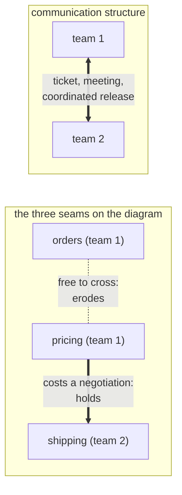

> **Recall layer.** The interview answer is
> [Q69](/docs/design/microservices-boundaries#q69). This page builds the model.

## 1. The problem it exists to solve

The architecture diagram has four services on it. Someone drew it eighteen
months ago, it is still on the wall, and it is still what everyone says when a
new joiner asks how the system is structured.

Run Lab 1 against it — thirty lines that count which files keep appearing in the
same commit — and you will usually find the number that ends the conversation:
somewhere north of half of all changes touch **two** of the four services, and
they are always the same two.

There are two teams.

Nothing here is a discipline failure. Nobody was lazy, nobody skipped a review,
and nobody set out to merge two services. The two services that fused in
practice are the two owned by the same team, and the one boundary that held is
the one the team line runs along. That is not a coincidence in this
organisation and it will not be a coincidence in yours.

This page is about the mechanism that produces that result, why it is a
constraint rather than a tendency, and what it changes about the architecture
you are able to propose.

## 2. What the law actually says

Melvin Conway, *How Do Committees Invent?*, published in *Datamation* in April
1968. The sentence everyone quotes is that organisations which design systems
"are constrained to produce designs which are copies of the communication
structures" of those organisations.

Two words in it do most of the work.

**"Constrained"** — not *tend to*, not *are influenced towards*. Conway's claim
is that the communication structure bounds the set of designs the organisation
is *able* to produce. His argument is short and hard to escape: a design
decision at an interface requires the people on either side of it to agree.
Agreement requires a communication path. Where no path exists, the decision
cannot be made, so any design that depends on making it cannot be produced.
The reachable design space is therefore a function of the communication graph,
before anyone's competence or intentions enter the picture at all.

**"Communication structures"** — not the org chart. The org chart is one input
to the communication graph, and often not the dominant one. The rest is who
sits together, who is in which channel, who reviews whose pull requests, who
shares an on-call rotation, who has ever actually spoken. This distinction is
where most of the practical leverage lives, because you can frequently change
the communication graph without a reorganisation — and a reorganisation that
does not change the communication graph changes nothing at all.

The relationship Conway describes is a **homomorphism**: structure-preserving,
but not one-to-one. Four teams do not mean exactly four modules. What it means
is that the design cannot contain a boundary the organisation has no way to
negotiate across. Conway's own example is the one everybody repeats: four groups
working on a compiler will produce a four-pass compiler.

## 3. The evidence that it holds

Conway's paper was an argument, not a study. The studies came later, and they
are considerably more persuasive than the folklore.

**The mirroring hypothesis.** MacCormack, Rusnak and Baldwin took advantage of a
natural experiment: matched pairs of software products that do the same job, one
built by a tightly-coupled commercial firm and one by a loosely-coupled
open-source community. They measured modularity as *propagation cost* — the
probability that a change to one component reaches another. In every pair, the
product built by the loosely-coupled organisation was significantly more modular,
and the differences ran up to a factor of eight. Same function, same industry,
different communication structures, systematically different architectures.

**Organisational structure out-predicts every code metric.** Nagappan, Murphy and
Basili studied 3,404 Windows Vista binaries using eight organisational measures —
among them *depth of master ownership* (how far up the reporting tree you go
before reaching a manager who owns a majority of the edits) and *organisation
intersection factor* (how many distinct organisations contribute meaningfully to
one component). They then predicted post-release failure-proneness with each
metric family in turn:

| Model | Precision | Recall |
|---|---|---|
| **Organisational structure** | **86.2%** | **84.0%** |
| Code coverage | 83.8% | 54.4% |
| Code complexity | 79.3% | 66.0% |
| Code churn | 78.6% | 79.9% |
| Dependencies | 74.4% | 69.9% |
| Pre-release bugs | 73.8% | 62.9% |

*Who* edited a component predicted its defects better than anything measurable
about the code inside it. Take the usual care: this is one system at one company,
and the measures are proxies. It is also the largest study of its kind, and
nothing smaller has contradicted it.

**It is baked into the delivery research.** DORA lists *loosely coupled teams* as
one of its named capabilities and quotes Conway directly on the page. Its
operational test is whether a team can change, test and deploy without
coordinating with another team — which is exactly the test the reference bank
gives for whether a service boundary is real at all
([Q63](/docs/design/microservices-boundaries#q63)).

## 4. The core model: coordination cost decides which boundaries survive

The law is usually presented as a curiosity, as though organisations mysteriously
stamp their shape onto their software. The mechanism is not mysterious, and
knowing it is the difference between quoting the law and using it.

A boundary is a rule about what may not be done directly. Every boundary has a
**cost of respecting it** — define an interface, publish a schema, version it,
deprecate carefully — and a **cost of crossing it** — reach into the other side,
share a table, add one more parameter.

*Within* a team, crossing is nearly free. It is a conversation at a desk, one
pull request, one deployment, one person who understands both sides. Respecting
the boundary is the expensive option, because you are paying interface-design
costs to protect yourself from yourself.

*Across* teams, the ordering inverts. Crossing costs a meeting, a ticket in
someone else's backlog, a negotiation about relative priorities, and often a
coordinated release. Respecting is cheap by comparison: publish the contract
once, and both sides get on with their week.

So over any period long enough for delivery pressure to matter, **the boundaries
that survive are the ones where crossing costs more than respecting** — which is
to say, the ones lying on a team line. Every other boundary is under continuous
pressure from the cheapest available option, and it loses, one locally reasonable
decision at a time. Nobody has to be careless for this to happen. It happens
fastest on the teams trying hardest to ship.



Two corollaries follow, and both are load-bearing.

**You cannot enforce a boundary with discipline against its own cost structure.**
You can enforce it by *adding a cost to crossing* — a separate repository, a
separate deployment pipeline, an ArchUnit rule as a build gate
([Q56](/docs/design/architecture-styles#q56)), a published schema in place of a
shared type — or by moving the team line so the cost appears on its own.
Reminders in code review are not a mechanism. They are one person spending their
credibility against an incentive gradient, and that person runs out.

**A boundary you cannot afford is worse than no boundary.** Splitting a service
across a team line you did not move buys you the coordination cost *and* the
network: partial failure, distributed debugging, two deployments, and a change
that still needs both teams. That is the definition of a
[distributed monolith](/docs/design/microservices-boundaries#q65) — strictly
worse than the monolith you started from, which is why it is the most expensive
failure mode in this whole area.

## 5. Measuring your own congruence

None of this has to be argued from intuition. Every input is already in version
control.

The formal version is **socio-technical congruence**, from Cataldo, Herbsleb and
Carley: take the technical dependencies actually exercised in a period — the
files that changed together — and ask what fraction of them had a matching
communication path between the people who changed them. Congruence is that
fraction, and low congruence predicts slow resolution of exactly the work that
crosses the gap.

You can compute a usable approximation from two artefacts you already have: the
git history, and `CODEOWNERS`. The lab below does it in about thirty lines. What
comes out is one number and one list — the congruence percentage, and the
co-changing file pairs that are *not* co-owned. That list is your Conway debt:
technical dependencies the organisation has no cheap way to service.

Three more numbers, all cheap, all better than an opinion:

- **Teams per change.** For the last hundred merges, the distribution of how many
  distinct owning teams each one touched. A healthy service architecture is
  overwhelmingly 1. If the mode is 2, your boundaries are decorative no matter
  how many deployment units you have.
- **Cross-boundary review latency.** Median time-to-merge for pull requests that
  needed an approval from outside the authoring team, against those that did not.
  The ratio is your coordination tax, denominated in hours, and it is the kind of
  number that actually moves an architecture argument
  ([Q103](/docs/design/operations-organisation#q103)).
- **Organisations per component.** Nagappan's *organisation intersection factor*,
  approximated as the count of distinct owning teams appearing in a component's
  commit history over a year. The components with the highest values are where
  this page's failure mode has already happened.

None of these is precise. All of them beat "I feel like these teams are stepping
on each other," which is what the conversation sounds like without them — the
same argument [coupling and cohesion](/docs/concepts/coupling-and-cohesion) makes
one level down, using the same instrument.

## 6. The inverse manoeuvre

If communication structure constrains architecture, then getting an architecture
means first being able to sustain it. The **Inverse Conway Manoeuvre** is the
deliberate move: change the team structure, and let the architecture follow the
new cost gradient instead of fighting the old one.

*Team Topologies* is the standard vocabulary for doing this on purpose — Skelton
and Pais, **second edition, IT Revolution, September 2025**. The edition is worth
naming: the second is the one that promotes **cognitive load** from a chapter to
the organising principle of the whole book, and clarifies that a "platform team"
is better understood as a **platform grouping**, itself composed of the other
team types, because the pattern is fractal rather than a flat taxonomy.

Four team types:

- **Stream-aligned** — owns a flow of work end to end, usually a slice of the
  business domain. This is the default and the point; every other type exists to
  make these effective.
- **Enabling** — helps a stream-aligned team over a capability gap, then leaves.
  The leaving is part of the definition.
- **Complicated-subsystem** — owns a part requiring specialist depth (a pricing
  engine, a matching engine, a risk model) where that depth genuinely does not
  fit inside a stream-aligned team's head.
- **Platform** (grouping) — provides an internal product whose entire purpose is
  reducing everyone else's cognitive load.

Three interaction modes, and this is the half people skip:

- **Collaboration** — two teams working closely to discover something. High
  bandwidth, high cost, and **explicitly temporary**.
- **X-as-a-Service** — one team consumes what another provides, with minimal
  conversation. This is what a settled boundary looks like.
- **Facilitation** — one team helps or mentors another for a period.

The mode is a **design variable, not a description**. Two teams stuck in
permanent Collaboration are telling you the boundary between them is in the wrong
place: you are paying discovery-mode communication costs on a relationship that
should long since have settled into a service. That is the sharpest read-out the
model gives, and it costs nothing to check — list your standing cross-team
meetings and ask, for each one, what it is discovering.

**Cognitive load is also the honest answer to "how big should a service be?"**
([Q64](/docs/design/microservices-boundaries#q64)). Not lines of code, and
certainly not "micro". The constraint is that one team can hold the whole thing —
domain, code, operations, on-call — without exceeding what a team can carry. A
service can legitimately be fifty thousand lines if the domain genuinely is that
size; a five-hundred-line service that no single team fully understands is still
too big. And splitting something that is over the load line only helps if you
also have a team for the second half. Otherwise you have converted a
comprehension problem into a network problem, which is not an improvement.

**A platform is a cognitive-load transfer**
([Q72](/docs/design/microservices-boundaries#q72)), and it comes with one hard
constraint from the same book: the platform must be **optional and attractive**,
not mandated. A platform that teams are forced onto is not X-as-a-Service; it is
a dependency with a monopoly, and it becomes precisely the bottleneck the
architecture was meant to remove. The test is whether a team could plausibly opt
out and chooses not to.

The evidence is encouraging and qualified in equal measure. DORA's 2025 report —
the most recent as of September 2026 — finds internal developer platforms close
to universal, with 90% of organisations reporting one and 76% running a dedicated
platform team. It also finds that platforms can **decrease** throughput and
change stability when they are not carefully managed, and that benefits often
follow a J-curve: an initial gain, a dip as complexity grows, then stabilisation.
A platform is a product with users, and it fails the way products fail.

## 7. What it does not give you

**It does not say your architecture will be good.** It says it will match. A
tangled organisation reliably produces a tangled system, and the match is not a
quality guarantee. "It reflects how we're organised" is a diagnosis, never a
defence.

**It is not a licence to reorganise instead of designing.** A reorganisation is
among the most expensive instruments available to you — months of throughput and
a chunk of everyone's goodwill — and it only pays if the target architecture was
right in the first place. Get the boundary evidence first — linguistic seams
([Q47](/docs/design/ddd#q47)), co-change, data ownership — and move the
organisation to a boundary you have already justified on its own terms.

**The causation runs both ways.** The mirroring literature finds coupling in both
directions over time: an existing architecture also constrains which team
structures are viable, because you cannot hand a team end-to-end ownership of
something that is not yet separable. This is why the manoeuvre so often fails
when performed alone. Reorganising around four services you have not extracted
gives you four teams that all still work in the same monolith, with the
coordination cost now formalised in the org chart rather than removed from it.
Extraction and reorganisation have to move together, which is why
[strangler-fig migration](/docs/design/microservices-boundaries#q68) and team
change are one project rather than two.

**Copying another company's org chart does not import their architecture.** The
Spotify model is the standard cautionary tale — squads, tribes, chapters and
guilds, adopted worldwide off the back of a 2012 video. Jeremiah Lee's 2020
account from inside is that the matrix had already failed at Spotify before it
scaled: collaboration between squads was treated as a cultural given rather than
something designed, and with no engineering manager accountable for a squad's
engineers, product managers had no counterpart. What travels between
organisations is the *method* of matching structure to intended flow. What does
not travel is a particular structure, because that structure encoded somebody
else's domain, size and history.

**It is not deterministic.** It is an empirical regularity with real exceptions.
A small enough group communicates densely enough to build whatever it decides to,
which is exactly why
[a modular monolith](/docs/design/architecture-styles#q55) is available to a team
that could not sustain four services — and why "we're too small for
microservices" ([Q61](/docs/design/microservices-boundaries#q61)) is a Conway
argument rather than a capability argument.

## 8. Where it touches the rest of the library

**A shared library is an unintended communication path**
([Q66](/docs/design/microservices-boundaries#q66)). This is the sharpest single
instance of the law. A shared jar containing domain types creates a standing
coordination requirement between its owner and every consumer: a version bump
becomes a negotiation, so either everyone upgrades together — independent
deployment gone — or you maintain several versions, which is its own tax.
Publishing a *schema* instead (Avro, Protobuf, OpenAPI) and letting each side
generate its own types keeps the contract and deletes the path; compatibility
checking in CI ([Q117 in the data bank](/docs/data/kafka#q117)) is what replaces
the conversation. The duplicated DTO is the price, and it is the right price:
[DRY is about knowledge](/docs/design/solid-principles#q22), and each consumer's
view of a payload is genuinely its own knowledge.

**A shared database is the same mistake without version numbers**
([Q88](/docs/design/microservices-communication#q88)). Every table becomes a
contract with every reader, and no schema change is ever a single-team change
again.

**Cross-service change is the coordination cost made visible**
([Q70](/docs/design/microservices-boundaries#q70)). Expand / migrate / contract
exists precisely to convert one synchronised multi-team release into three
independent single-team deployments: the provider adds the new capability
alongside the old, consumers move on their own schedule, and the provider removes
the old path when telemetry shows nobody is on it. DORA's guidance on the same
point is to keep at most two live API versions with a transition capped at six
months, because "support both indefinitely" defers the coordination cost rather
than removing it. And the *frequency* is itself the diagnostic: if changes
routinely span services, the boundary is wrong, and better coordination process
is not the fix — it is the symptom being institutionalised.

**Bounded contexts and team boundaries usually coincide, and the interesting case
is when they don't.** [Bounded contexts](/docs/concepts/bounded-contexts) finds
boundaries from language, co-change and data ownership; this page finds them from
who can afford to cross what. When the linguistic seam and the team seam
disagree, one of them is going to move, and deciding which is a real
architectural decision rather than an oversight to be tidied away.

**Coupling and cohesion measure the same thing one level down.** Co-change is the
shared instrument:
[coupling and cohesion](/docs/concepts/coupling-and-cohesion) applies it to files,
this page applies it to files joined against owners. The Common Closure Principle
([Q24](/docs/design/solid-principles#q24)) — things that change together belong
together — is Conway's law restated for packages.

## 9. Lab

Run these against a repository you actually work in. The numbers only mean
anything when they are yours, and they are usually worse than you expect.

### Lab 1 — build the co-change matrix

```bash
git log --since=1.year --no-merges --name-only --format='%H' > changes.txt
```

```python
import collections, itertools

sets, cur = [], []
for line in open('changes.txt', encoding='utf-8'):
    line = line.strip()
    if not line:
        continue
    if len(line) == 40 and all(c in '0123456789abcdef' for c in line):
        if cur:
            sets.append(cur)
        cur = []
    else:
        cur.append(line)
if cur:
    sets.append(cur)

pairs = collections.Counter()
for s in sets:
    if len(s) > 30:            # skip mass renames, reformats, dependency bumps
        continue
    for a, b in itertools.combinations(sorted(set(s)), 2):
        pairs[(a, b)] += 1

for (a, b), n in pairs.most_common(25):
    print(n, a, b)
```

Look at the top twenty-five. For each pair, ask whether the two files are in what
you would call the same component. The ones that are not are the interesting rows.

### Lab 2 — join it to ownership and compute congruence

You need a `CODEOWNERS` file. If you do not have one, that is itself a finding —
write the crudest possible version first, one line per top-level directory, and
you will learn something during the argument about whose name goes on each line.

```python
import fnmatch

rules = []
for line in open('.github/CODEOWNERS', encoding='utf-8'):
    parts = line.split('#')[0].split()
    if len(parts) >= 2:
        rules.append((parts[0].strip('/'), set(parts[1:])))

def owners(path):
    match = set()
    for pattern, who in rules:          # last matching rule wins, as git does
        if path.startswith(pattern + '/') or fnmatch.fnmatch(path, pattern):
            match = who
    return match or {'(unowned)'}

total = sum(pairs.values())
same = sum(n for (a, b), n in pairs.items() if owners(a) & owners(b))
print('congruence: {:.0%}'.format(same / total))

print('\ntop co-change pairs with no shared owner:')
for (a, b), n in pairs.most_common():
    if not (owners(a) & owners(b)):
        print(n, a, b)
```

The percentage is the headline. The list underneath it is the actionable part.

### Lab 3 — teams per change

```python
dist = collections.Counter()
for s in sets:
    if len(s) > 30:
        continue
    teams = set()
    for f in s:
        teams |= owners(f)
    dist[len(teams)] += 1

for k in sorted(dist):
    print(k, 'team(s):', dist[k])
```

If the mass of the distribution sits at 1, the boundaries are real. If a third or
more of your changes touch two or more owners, they are not — and every
improvement you make to the coordination *process* is treating the symptom.

### Lab 4 — the coordination tax, in hours

```bash
gh pr list --state merged --limit 100 --json number --jq '.[].number' \
  | while read n; do
      gh pr view "$n" --json number,createdAt,mergedAt,files \
        --jq '{n:.number, hours:(((.mergedAt|fromdate)-(.createdAt|fromdate))/3600), files:[.files[].path]}'
    done > prs.jsonl
```

That is one API call per pull request, so start with a small limit. Then split the
results by whether a pull request's files span more than one owner, and compare
the medians. The ratio between them is the number to bring to the next
architecture conversation — not because it is precise, but because it is *yours*,
and nobody in the room can wave it away with a different opinion.

### Lab 5 — time one shared library's propagation

Find your most-depended-on internal artefact — `grep -rl "$ARTIFACT_ID" --include=pom.xml .`
across your repositories, or the Gradle equivalent. Take its most recent version
bump. For each consumer, find the commit that adopted the new version, and record
the date.

The spread between the first adoption and the last is how long your organisation
takes to push one change through a build-time dependency. That single number is
the strongest argument available the next time somebody proposes putting a domain
type in that jar.

### Lab 6 — audit the interaction modes

List every standing recurring meeting that includes people from more than one
team. For each, name the intended Team Topologies mode: Collaboration,
X-as-a-Service or Facilitation. Then check how long it has been running.

Any pair of teams in Collaboration for more than a quarter is either genuinely
discovering something — in which case you should be able to say what, in one
sentence — or is a boundary in the wrong place, held together by a recurring
meeting. This lab takes twenty minutes and is the highest-yield one here.

## 10. Leading on this

**Never propose an architecture without proposing its ownership.** A
decomposition with no ownership model is half a design, and it is the half that
does not survive contact with a quarter's delivery pressure. Put the team names on
the diagram before the meeting, and be ready for the boundary discussion to turn
into an organisational one — that is not the conversation going off the rails, it
is the conversation arriving.

**Bring the congruence number, not the intuition.** "These teams keep colliding"
invites an equally unfalsifiable rebuttal. "Sixty-one per cent of our changes in
the last year touched two owners, and here are the twenty file pairs driving it"
is a fact both sides can check, and agreement on the facts collapses most
disagreements about what to do next.

**Put a cost on the boundaries you care about, and be honest about the ones you
cannot afford.** A boundary defended only by convention is already gone; the team
just has not noticed yet. Either give it a build gate, a repository split or a
schema, or take it off the diagram so the diagram stops lying.

**Say the organisational part of microservices out loud.** They buy independent
deployment for independent teams, at real technical cost. If you do not have the
teams, you are paying the cost and collecting none of the benefit — and saying so
early is worth more than any amount of careful implementation later.

**Design the interaction mode, and put an expiry date on Collaboration.** When two
teams start working closely, agree at the outset what you are discovering and when
you expect it to settle into a service. Collaboration that nobody ever declared
finished is the most common way a boundary quietly stops existing.

**In review, look for the new communication path, not just the new dependency.** A
pull request that adds a domain type to the shared library, or reads another
team's table, adds a standing meeting. That is the review comment worth writing,
and it lands considerably better than "this increases coupling".

**Teach the law as a constraint, not as a slogan.** Most engineers can recite the
sentence; very few can say why it is true. The coordination-cost argument in
section 4 takes two minutes on a whiteboard, and it is the thing that turns
Conway's law from a fatalistic observation into something you can act on.

## 11. Where to go deeper

- Melvin Conway, *How Do Committees Invent?*, **Datamation**, April 1968 — four
  pages, free at `melconway.com`, and still the clearest statement of the idea.
  Read the original before any summary; the argument is more careful and more
  interesting than the slogan it became.
- Alan MacCormack, John Rusnak and Carliss Baldwin, *Exploring the Duality Between
  Product and Organizational Architectures: A Test of the "Mirroring" Hypothesis*
  — Harvard Business School working paper 08-039, published in **Research Policy**
  41(8), 2012. The empirical test, with the propagation-cost measure worked
  through.
- Nachiappan Nagappan, Brendan Murphy and Victor Basili, *The Influence of
  Organizational Structure on Software Quality: An Empirical Case Study* — **ICSE
  2008**. The eight organisational measures and the comparison table in section 3.
- Marcelo Cataldo, James Herbsleb and Kathleen Carley, *Socio-Technical Congruence:
  A Framework for Assessing the Impact of Technical and Work Dependencies on
  Software Development Productivity* — **ESEM 2008**. The formal version of what
  Lab 2 approximates.
- Matthew Skelton and Manuel Pais, *Team Topologies*, **second edition** (IT
  Revolution, September 2025). The four team types, the three interaction modes,
  and cognitive load as the organising principle. Read the second edition rather
  than the first: it reframes the platform team as a platform grouping and moves
  cognitive load to the centre.
- DORA's *loosely coupled teams* and *platform engineering* capability pages at
  `dora.dev` — short, evidence-backed, and the first one quotes Conway directly.
- Jeremiah Lee, *Spotify's Failed #SquadGoals* (2020) — the inside account of the
  most-copied org chart in the industry, and the best available argument against
  copying one.
- Adam Tornhill, *Your Code as a Crime Scene* — co-change and knowledge-map
  analysis with real tooling, well beyond this page's one-liners.

## 12. Self-check

1. State Conway's law and explain, in terms of design decisions and communication
   paths, why "constrained" is the accurate word rather than "influenced".
2. Two teams own four services. Predict which boundaries will erode and which will
   hold, and give the cost argument that makes it a prediction rather than an
   observation after the fact.
3. Your team agrees a module boundary in review and it erodes anyway over six
   months, with nobody behaving badly. Explain how, and name two mechanisms that
   would have held it.
4. Organisational metrics out-predicted code churn, complexity, coverage and
   dependencies for failure-proneness in Windows Vista. Give the plausible causal
   story, and the strongest reason to be cautious about the result.
5. Define socio-technical congruence, and describe how you would approximate it
   from a git repository and a `CODEOWNERS` file.
6. Two teams have had a standing weekly sync for a year. Name the Team Topologies
   interaction mode they are in, say what that implies about the boundary between
   them, and describe what you would check next.
7. Why does the Inverse Conway Manoeuvre fail when a reorganisation happens
   without extraction — and what does that imply about sequencing the two?
8. A team proposes moving a shared domain type into the common library "to stop
   the duplication". Give the Conway objection in one sentence, the alternative,
   and the number you would measure to make the case.
