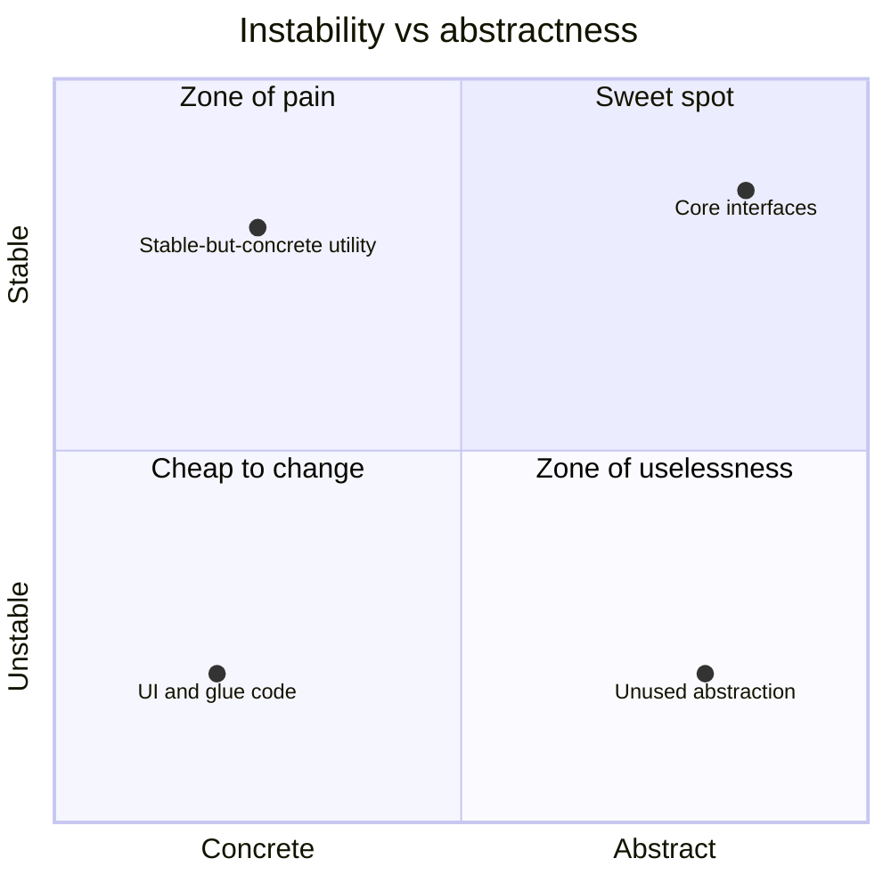

> **Recall layer.** The interview answers are
> [Q4](/docs/design/oop-fundamentals#q4) and
> [Q24](/docs/design/solid-principles#q24). This page builds the model.

## 1. The problem it exists to solve

"This codebase is too coupled" is not a claim anyone can act on. It's an
opinion, stated with confidence, that another engineer can disagree with just
as confidently, and neither of you has anything to point at.

Compare: "the billing module has 34 outgoing dependencies, three of them cyclic,
and 70% of our last hundred commits touched both `PaymentService` and
`NotificationService` in the same diff." That's not an opinion. It's a
measurement, and a specific one — and it's the kind of sentence that ends
architecture debates instead of starting longer ones.

Coupling and cohesion are usually taught as vague good-design vocabulary —
"high cohesion, low coupling," said and nodded at, rarely operationalised.
They are actually **measurable properties with named degrees**, and the
measurement is what turns architecture from taste into engineering.

## 2. Two properties, one relationship

**Cohesion** — how strongly the elements *inside* one module belong together.
Do they share a purpose, act on the same data, change for the same reasons?

**Coupling** — how much *separate* modules depend on each other.

They are related but not identical, and the relationship matters: pulling
apart things that don't belong together (raising cohesion within each piece)
usually **reduces** coupling as a side effect, because the accidental
dependencies that only existed due to the mixing disappear along with the
mixing. This is why "split the god class" so often fixes coupling problems
that look, at first glance, unrelated to the split.

## 3. Coupling has degrees — most people only know two

The textbook taxonomy, worst to best, is worth knowing in full because most
engineers only distinguish "coupled" from "not coupled," and the middle
categories are where real design judgement lives.

| Degree | What's shared | Example |
|---|---|---|
| **Content** | One module reaches into another's internals | Reflection to set a private field; reading another class's mutable static |
| **Common** | Shared global mutable state | A static `Config` field both modules read *and* write |
| **Control** | A flag that changes the callee's behaviour | `process(data, boolean skipValidation)` |
| **Stamp** | A whole object passed when one field is needed | `calculateTax(Customer c)` when only `c.getCountry()` is used |
| **Data** | Exactly the needed primitives/values | `calculateTax(Country country)` |
| **Message** | A method call, knowing nothing of internals | `gateway.authorise(request)` returning a result |

Content and common coupling are close to always wrong — they make change
unpredictable because a dependency exists that isn't visible in any signature.
Control coupling is a specific, checkable smell: a boolean parameter that
branches behaviour inside the callee is often two methods pretending to be
one, and splitting it usually clarifies both call sites. Stamp coupling is
subtler and extremely common — passing a whole `Customer` when the callee only
reads `country` couples the caller to `Customer`'s entire shape for no reason,
and it's exactly the smell the [Law of Demeter](/docs/design/oop-fundamentals#q5)
targets from a different angle.

Message coupling is the goal, and it's precisely what depending on an
interface rather than an implementation gives you — the same instinct as the
[dependency inversion page](/docs/concepts/dependency-inversion), restated at
the level of individual method calls rather than whole modules.

## 4. Measuring it: instability, and what it tells you to do

Robert Martin's metrics give coupling an actual number, computed from the
dependency graph:

- **Ca (afferent coupling)** — how many other modules depend on this one.
- **Ce (efferent coupling)** — how many other modules this one depends on.
- **Instability, I = Ce / (Ca + Ce)** — ranges 0 to 1.

A module with **I near 0** has many dependents and few dependencies: everyone
relies on it, it relies on almost nothing. That's a *stable* module — and the
design conclusion that follows is specific: a stable module **should be
abstract**, because every change to it ripples through everyone who depends on
it. Interfaces, core domain types, and foundational contracts belong here.

A module with **I near 1** has many dependencies and few dependents: it's
*unstable*, changeable, and that's fine precisely because nothing much relies
on it. Volatile implementation detail, application glue, and UI code belong
here.

The actionable rule this produces — the **Stable Abstractions Principle** —
is: instability and abstractness should move together. A stable-but-concrete
module is a trap, because it's hard to change (many dependents) *and* offers no
seam to change behind (no abstraction). That combination is where the most
painful refactors in a codebase live, and the metric names exactly where to
look for it before you're forced to.



Tools compute this directly, though the toolset has shifted: ArchUnit is the
one actively used today, enforced as a build-time rule rather than run as a
report. Structure101, long the standard tool for a visual dependency graph,
was acquired by SonarSource in 2024 and folded into Sonar's Clean Code
offering rather than continuing as a standalone product — IntelliJ IDEA's
built-in Dependency Matrix or CodeScene's X-ray view are the current options
for the same picture. JDepend, which originated the Ca/Ce/I metrics below, is
itself unmaintained; cite its documentation as the source of the definitions,
not as a tool to run. None of this requires manual counting — it's a build
artefact once you set it up.

## 5. Measuring cohesion the same way you measure coupling: by evidence, not feel

Formal cohesion metrics (LCOM and its variants — lack of cohesion in methods)
exist, but in practice the more useful and far cheaper measurement is **git
history**, because it directly answers the question that matters: *do these
things actually change together?*

```bash
git log --format='%H' --since=1.year | while read c; do
  git show --format= --name-only $c | grep '\.java$' | sort -u | paste -sd,
done | sort | uniq -c | sort -rn | head -30
```

Two readings from this:

**Files that always co-change but live in different packages** are low
cohesion at the wrong granularity — they're one conceptual unit, physically
scattered. This is the practical, measurable form of the [Common Closure
Principle](/docs/concepts/bounded-contexts): things that change together
belong together.

**A class with 40 methods where every commit touches only 3–4 of them, in
shifting subsets** is low cohesion within a single file — several
responsibilities wearing one name, discoverable by the same technique applied
at file granularity instead of package granularity. It's the git-log version
of asking "does this class have one reason to change?" — evidence instead of
introspection.

This is the same underlying method used to find bounded-context boundaries on
the [bounded contexts page](/docs/concepts/bounded-contexts) — co-change data
answering "what belongs together" — applied one level down, at class and
package granularity instead of context granularity. One technique, three
scales.

## 6. Why coupling is the thing that actually costs money

Cohesion mostly costs *comprehension* — a low-cohesion class is confusing to
read, but reading it once and understanding it is a bounded cost.

**Coupling costs *change*, and that cost compounds with every dependent
added.** A tightly coupled module isn't merely hard to understand once — every
future change to it requires understanding and often touching every dependent,
forever, for the life of the module. That's why coupling, not cohesion, is the
property that predicts **shotgun surgery**: one conceptual change requiring
edits across many files.

Shotgun surgery is itself measurable, using the exact co-change technique from
section 5: a genuinely single conceptual change (a field rename, a new
required parameter, a business rule update) that lands in a commit touching
eight unrelated-looking files is coupling made visible in the historical
record. If you want early warning before it becomes painful, the signal is
already there — grep the last quarter's commits for average files-per-commit
on a given subsystem and watch the trend.

## 7. Where this connects outward

**Package-by-feature vs package-by-layer**
([Q54](/docs/design/architecture-styles#q54)) is this principle applied to
directory structure: layer-based packages group things with low cohesion
(different reasons to change) and force high coupling (everything must be
public because collaborators live in different packages). Feature-based
packages do the reverse, and the reason it works is entirely this page.

**Distributed monolith** detection
([Q65](/docs/design/microservices-boundaries#q65)) is coupling measurement
applied across a network boundary: services deployed separately but coupled
as tightly as a monolith — evidenced by services that must deploy together,
share a database, or show up in the same commit constantly despite being
"separate."

**The Acyclic Dependencies Principle** is a coupling constraint at package
level: no cycles in the dependency graph, because a cycle means the modules in
it can't be built, tested, or reasoned about independently — they're really
one module that happens to be split into files.

**Architectural fitness functions** are the enforcement mechanism for
everything on this page: an ArchUnit rule asserting no package cycles, or a
maximum instability threshold on an abstract package, converts a measured
property into a build-time guarantee instead of a norm someone has to keep
noticing violations of.

## 8. What this does *not* cover

- **Temporal coupling** — operations that must happen in a specific order with
  no enforcement (call `init()` before `process()`), which is a related but
  distinct smell not captured by Ca/Ce.
- **Coupling to data formats and wire contracts**, which behaves differently
  from code coupling — see event and API versioning material in the design
  bank's microservices sections.
- **The cost of *reducing* coupling.** Every abstraction that lowers coupling
  adds indirection, and indirection has its own cost — covered on the
  [dependency inversion page](/docs/concepts/dependency-inversion), section 4.
  This page measures the problem; that one discusses when the cure is worse.

## 9. Lab: measure your own codebase

Run this against a real repository you know well — the numbers are the point,
and they're only interesting when they're yours.

### Lab 1 — find your least cohesive class

```bash
git log --format='%H' --since=1.year -- src/main/java/YourBigClass.java | while read c; do
  git show $c -- src/main/java/YourBigClass.java | grep -E '^\+.*\w+\(' 
done
```

More usefully, for each commit touching the file, note which *methods* the
diff falls within. Classes with 30+ methods where each commit touches a small,
shifting subset are the low-cohesion candidates worth splitting.

### Lab 2 — compute Ca, Ce and instability

If you have an ArchUnit setup (or JDepend, if the codebase already has one),
run it against your package
structure and pull out the top five most unstable packages and the top five
most stable. Cross-reference: are the stable ones abstract (interfaces,
domain types)? Are any stable packages concrete — and therefore trapped?

### Lab 3 — the co-change command, for real

Run the git command from section 5 against your actual repository. Look at the
top ten pairs. For each: are they in the same module? If not, that's a
candidate merge or, at minimum, evidence for the next design conversation —
backed by a number rather than a feeling.

### Lab 4 — enforce acyclicity and watch it fail on real code

```java
@ArchTest
static final ArchRule no_cycles =
    slices().matching("com.acme.(*)..").should().beFreeOfCycles();
```

Run it against your actual package structure — not a toy example — and count
the violations. **That count is your codebase's current coupling debt,
measured in a single command.** It's usually higher than anyone expects on a
codebase that's been evolving under deadline pressure for more than a year.

### Lab 5 — measure a control-coupled method

Find (or write) a method with a boolean flag parameter that branches
internally:

```java
void process(Order order, boolean skipValidation) { ... }
```

Split it into two named methods, `processValidated` and
`processSkippingValidation` (or better, remove the skip path if it's a smell
covering something else). Note whether the split clarified the call sites —
this is the fastest hands-on way to internalise why control coupling is a
distinct, checkable category rather than just "coupling in general."

## 10. Leading on this

**Bring numbers to architecture arguments, always.** "This is too coupled" is
unfalsifiable and invites an equally unfalsifiable rebuttal. "This package has
34 efferent dependencies and three cycles" is a fact both sides can check and,
usually, agree on — which is most of what a lead needs from an architecture
conversation, because agreement on the facts collapses most disagreements
about what to do next.

**Track co-change as a standing signal, not a one-off exercise.** A quarterly
"what files changed together most" report, even a crude one, surfaces coupling
drift while it's still cheap to fix — the same principle as catching bloat
early rather than during an incident. Waiting until a refactor is painful to
measure it means measuring it too late to act cheaply.

**Enforce the Acyclic Dependencies Principle from day one on any new
service.** A cycle-freedom ArchUnit rule costs one file and catches
architectural erosion at PR time, which is the only point at which it's cheap
to reject. Retrofitting acyclicity onto a codebase that's had cycles for two
years is a project; preventing the first cycle is a five-line test.

**Watch for stable-but-concrete packages specifically.** They're the ones
about to become genuinely expensive: too many dependents to change safely, and
no abstraction to change behind. Finding one *before* the painful refactor
that forces the issue, via the Ca/Ce metric, is strictly cheaper than finding
it during one.

**Teach the coupling taxonomy, not just "high/low."** An engineer who can
name control coupling when they see a boolean flag parameter, or stamp
coupling when they see a whole object passed for one field, catches these
smells in their own code before review rather than after — which is a much
cheaper place to catch them.

## 11. Where to go deeper

- Larry Constantine & Edward Yourdon, *Structured Design* (1979) — the
  original coupling taxonomy in full (content, common, control, stamp, data,
  message and more). Dated examples, the categories haven't aged.
- Robert Martin, *Agile Software Development, Principles, Patterns, and
  Practices* — the chapters on package design principles: REP, CCP, CRP, ADP,
  SDP, SAP, with the instability metric worked through in detail.
- Adam Tornhill, *Your Code as a Crime Scene* — co-change analysis developed
  properly, with tooling, well beyond the one-liner in this page's lab.
- The ArchUnit user guide, "Checking for Cycles" and the slice-based rules —
  the direct path from this page's ideas to an enforced build gate.
- JDepend's original metrics documentation, for the formal Ca/Ce/I definitions
  if you want the source rather than a restatement.

## 12. Self-check

1. Give an example each of content, control, and stamp coupling, and explain
   why message coupling is preferable to all three.
2. Why does splitting a low-cohesion class often *reduce* coupling as a side
   effect, even though you didn't touch any dependency?
3. Compute instability for a package with 20 dependents and 2 dependencies.
   What does that number recommend about whether the package should be
   abstract or concrete?
4. What is a "stable but concrete" package, and why is it specifically
   dangerous rather than merely inconvenient?
5. Two files are in different top-level packages but appear together in 80% of
   commits touching either. What does that suggest, and what would you check
   next?
6. Why does coupling predict the cost of *change* while cohesion predicts the
   cost of *comprehension* — and why does that distinction matter for which
   one to prioritise fixing first?
7. Give the Acyclic Dependencies Principle and explain, in terms of
   independent build/test/reason-about, why a cycle violates it.
8. A method takes a `boolean skipValidation` parameter. Name the coupling
   category and describe the refactor that removes it.
