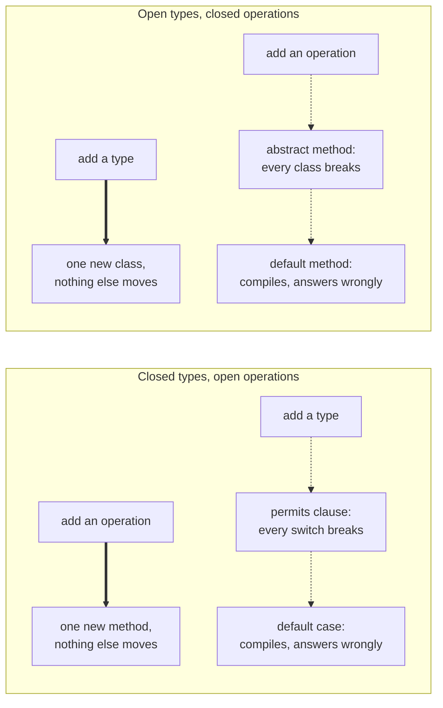

> **Recall layer.** The interview answers are
> [Q16](/docs/design/solid-principles#q16),
> [Q39](/docs/design/design-patterns#q39) and
> [Q88](/docs/java/modern-java#q88). This page builds the model.

## 1. The problem it exists to solve

A payments service models its ledger events as an interface with one
implementation per event, and each event knows how to apply itself:

```java
interface PaymentEvent { void apply(Ledger ledger); }

final class Authorised implements PaymentEvent { ... }
final class Captured   implements PaymentEvent { ... }
final class Refunded   implements PaymentEvent { ... }
// four more
```

This is textbook. It is Open/Closed applied correctly: a new event type is a new
file, and nothing existing is edited or retested.

Then the service acquires an audience. Compliance wants a human-readable line
per event for the audit log. The webhook service wants a JSON payload shape per
event. The fraud team wants a risk contribution per event. Reconciliation wants
a matching key. Four requests over six months, each of them reasonable, and each
of them arrives as one more method on `PaymentEvent`:

```java
interface PaymentEvent {
    void apply(Ledger ledger);
    String auditLine();
    JsonNode webhookPayload();
    int riskContribution(FraudModel model);
    String reconciliationKey();
}
```

Every one of those four changes edited all seven event classes. Each event class
now imports `Ledger`, `FraudModel` and a JSON library, and its seven methods
answer to four different teams who never talk to each other. The commit history
shows all seven files changing together, every time, which is the signature of
a cohesion failure — see
[coupling and cohesion](/docs/concepts/coupling-and-cohesion). Nobody made a
mistake, and the design got worse anyway.

Meanwhile a second team on the same codebase read the newer guidance, modelled
their reservation events as a sealed interface of records, and wrote every
operation as a `switch`. Adding operations is free for them. Then the domain
gained one new event type, and twenty-three switches across four modules failed
to compile in a single build.

Both teams applied a principle correctly. Both got hurt. The reason is not a
skill gap — it is a structural fact about extending a datatype in a statically
typed language, it has a name, and it was described before either of them was
writing Java.

## 2. What it actually is

Philip Wadler named it in a mailing-list note on 12 November 1998. The goal, as
he put it, is to define a datatype by cases such that you can add both new cases
and new functions over it "without recompiling existing code, and while
retaining static type safety."

Lay the problem out as a grid. Rows are the cases of your datatype — the event
types. Columns are the operations over it — `apply`, `auditLine`,
`webhookPayload`. Every cell is one piece of behaviour that has to live
somewhere, and the whole question is *how the cells are grouped into compilation
units*.

|  | `apply` | `auditLine` | `webhookPayload` |
|---|---|---|---|
| `Authorised` | ▪ | ▪ | ▪ |
| `Captured` | ▪ | ▪ | ▪ |
| `Refunded` | ▪ | ▪ | ▪ |

Object-oriented dispatch groups the grid **by row**: a class is one type and all
its operations. Adding a row is adding a file; adding a column means reaching
into every row. Functional dispatch groups it **by column**: a function with a
`switch` is one operation and all its types. Adding a column is adding a
function; adding a row means reaching into every column.

That is the whole idea, and the asymmetry is not a defect of either paradigm. It
falls out of the fact that a compilation unit is one-dimensional and the problem
is two-dimensional. Whichever axis you group by, you have made the other one
expensive.

It is called the *expression* problem because the canonical instance is an
expression tree: AST node types are fixed by the grammar and change almost never,
while the passes over them — parse, typecheck, optimise, emit, format, lint —
grow indefinitely. That shape wants columns. A payment-provider integration is
the mirror image: the operations are fixed by your own API and the providers keep
arriving. That shape wants rows.

Wadler's formulation is stricter than most codebases need. "Without recompiling
existing code" rules out solutions that merely *fail loudly* when you extend the
wrong axis, and a monorepo that rebuilds everything on every commit does not care
about that clause. Torgersen (2004) and Zenger and Odersky (2005) do solve it
under the strict reading, using generics and self types, and are worth reading
for what that costs: every solution is substantially harder to read than either
simple design. In practice the useful question is not "can I be open on both
axes" but "which axis is actually going to move, and does the other one fail
loudly or quietly".

## 3. The two designs, on the same domain

Here is the same three-case datatype written both ways, so the grid above has
something to point at.

**By row.** The type axis is open. Add `Refunded` and nothing existing changes.

```java
interface PaymentEvent {
    void apply(Ledger ledger);
    String auditLine();
}

final class Authorised implements PaymentEvent {
    public void apply(Ledger l)  { l.hold(amount); }
    public String auditLine()    { return "authorised " + amount; }
}
```

**By column.** The operation axis is open. Add `webhookPayload` and nothing
existing changes.

```java
sealed interface PaymentEvent permits Authorised, Captured, Refunded {}

record Authorised(String id, Money amount)          implements PaymentEvent {}
record Captured  (String id, Money amount)          implements PaymentEvent {}
record Refunded  (String id, Money amount, String reason) implements PaymentEvent {}

static String auditLine(PaymentEvent e) {
    return switch (e) {
        case Authorised(var id, var amt)      -> "authorised " + id + " " + amt;
        case Captured(var id, var amt)        -> "captured "   + id + " " + amt;
        case Refunded(var id, var amt, var r) -> "refunded "   + id + " " + amt + ": " + r;
    };
}
```

Two things about the second form are easy to miss.

**`sealed` is not decoration — it is the entire mechanism.** Without `permits`,
the compiler cannot know the set of subtypes is complete, so it cannot prove the
`switch` exhaustive, so it demands a `default`, so you are back to a runtime
fallthrough instead of a compile-time check. Closing the type axis is the price
of opening the operation axis safely. That is the trade, stated as code.

**The operation moved outside the type.** `auditLine` is now a static method in
whatever module cares about audit logs, and the event records know nothing about
it. `Refunded` does not import a JSON library. This is the fix to §1's cohesion
collapse, and it comes from the grouping change, not from the syntax.

## 4. Both axes are compiler-checked — and both have the same escape hatch

The usual telling of this subject stops at "one axis is cheap, one is
expensive". That is incomplete in a way that matters, because on both sides the
expensive direction is *checked by the compiler* — and on both sides there is a
one-word way to turn that check off and get a silent bug instead.

On the row side, adding an operation means adding a method to the interface, and
every implementation stops compiling until you write it. That is the check
working. The escape hatch is `default`:

```java
interface PaymentEvent {
    void apply(Ledger ledger);
    default String auditLine() { return "event"; }   // nothing breaks
}
```

Now the four-month-old event types compile untouched and quietly log `"event"`
for the rest of time. Default methods exist for exactly this reason — they are
how `Collection.stream()` shipped without breaking every implementor in the
world, which was a genuine necessity for a published API. Used inside a module
you own, the same mechanism converts a compile error you wanted into a
production bug you will find in the audit log six weeks later.

On the column side, adding a type means adding it to `permits`, and every
exhaustive `switch` stops compiling until you handle it. Same check. Same escape
hatch, spelled `default`:

```java
return switch (e) {
    case Authorised a -> ...
    case Captured c   -> ...
    default           -> "unknown";     // nothing breaks
};
```

Add `Refunded` to `permits` and this compiles clean — no error, no warning, not
even under `-Xlint:all` — and every refund is logged as `"unknown"`.



The practical consequence is that **choosing the axis wrong is recoverable and
choosing the escape hatch is not**. A build with twenty-three broken switches is
a bad afternoon with a complete, compiler-generated list of everything you have
to think about. A `default` case is the same twenty-three sites, silently
wrong, with no list. So the rule that falls out of this section is not about
which design to pick — it is: in a hierarchy you own, never write the escape
hatch. Take the broken build.

## 5. What Java actually gives you, as of now

Java spent its first twenty-five years with only the row side. The column side
arrived in pieces:

| Feature | JEP | Version |
|---|---|---|
| Pattern matching for `instanceof` | 394 | 16 (final) |
| Records | 395 | 16 (final) |
| Sealed classes | 409 | 17 (final) |
| Record patterns | 440 | 21 (final) |
| Pattern matching for `switch` | 441 | 21 (final) |
| Primitive types in patterns, `instanceof` and `switch` | 532 | 27 (fifth preview) |

Everything needed for the column side has been final since Java 21. Primitive
patterns are the one piece still moving: first previewed as JEP 455 in JDK 23,
re-previewed unchanged in 24 and 25, changed in JEP 530 for JDK 26, and
re-previewed unchanged again as **JEP 532 in JDK 27** — which is in the release
candidate phase as this is written, with general availability on 15 September
2026. Five previews is unusual, and the honest reading is that the committee is
not yet finished with it; do not build on it in production, and do not describe
it as a Java 21 feature in an interview.

Two mechanisms underneath are worth knowing because they explain the costs.

**Exhaustiveness is a compile-time proof over the `permits` clause**, which is
why `permits` is restricted to the same module (or the same package, in the
unnamed module). The compiler can only close a hierarchy it can see all of at
once. This is also why a sealed hierarchy is a poor choice for a type that
crosses a published API boundary: you are asking every consumer to recompile
when you add a case.

**A pattern `switch` is not a vtable dispatch.** It compiles to an
`invokedynamic` call site bootstrapped by
`java.lang.runtime.SwitchBootstraps.typeSwitch`, which returns the index of the
first matching label — so the dispatch is a linear walk over the labels, linked
lazily on first execution, not a constant-time jump. Nested patterns compile to
one call site per level. It is fast enough that this almost never matters, but
"pattern matching is just as fast as polymorphism" is not a claim to make
without measuring, and Lab 4 shows you where to look.

## 6. What this does not give you

Java gives you both tools. It does not solve Wadler's problem as he stated it —
there is no way to write a `PaymentEvent` open on both axes without leaving the
plain, readable versions of both designs behind. Four further boundaries are
worth knowing precisely, because three of them are runtime failures that look
like impossibilities.

**Exhaustiveness is proven at compile time and enforced at run time by an
exception.** If a `switch` is compiled against a two-subtype hierarchy and the
hierarchy gains a third before the switch is recompiled, the proof is stale and
the language does not pretend otherwise: it throws `MatchException`. The
documentation names this case explicitly — a sealed interface with a different
set of permitted subtypes at run time than at compile time. This is not
theoretical in any system that ships modules independently, and Lab 3 reproduces
it in about ninety seconds.

**Nested exhaustiveness does not cover `null` in the nested position.** Given a
sealed `I` permitting `A` and `B` and a `record R(I i)`, the compiler accepts
`case R(A a)` plus `case R(B b)` as exhaustive — and `new R(null)` matches
neither, so that throws `MatchException` too. The outer `switch` handles `null`
if you write `case null`; a nested pattern has no such opportunity. If your
records permit `null` components, nested exhaustiveness is weaker than it looks.

**Only records can be destructured.** Record patterns work because a record's
state description *is* its API, so the compiler can derive the deconstruction.
An ordinary class with the same fields cannot be matched positionally at all, so
the column-side design quietly requires you to model your data as records — and
records forbid mutability, inheritance, derived or cached state, and any
representation differing from the component list. Brian Goetz calls this the
records cliff. The exploratory answer is **carrier classes**: a design note dated
January 2026 proposing classes that declare a state description like a record
without a record's restrictions, and so acquire derived accessors and
deconstruction patterns. There is no JEP, no syntax and no timeline. Treat it as
the direction of travel, not as something to wait for.

**There is no tooling for the escape hatch.** `javac` has no lint for a
`default` case in a switch over a sealed type. Error Prone ships
`UnnecessaryDefaultInEnumSwitch`, which does exactly this job for enums, and has
no sealed-type equivalent. So §4's rule is enforced by review or by a grep, not
by the build.

## 7. Choosing the axis from evidence

The decision is usually made by taste and defended by principle. It can be made
from data instead, because both axes leave tracks in version control.

Take a hierarchy you already have and count, over the last year: how many
subtypes were added, and how many methods were added to the root interface. Two
numbers. If types dominate, you are on the right design already if you are
grouping by row. If methods dominate, every one of those method additions was a
change that edited every implementation, and the grid is telling you to turn it
ninety degrees.

Three heuristics carry most of the judgement, and all three are the same
question — *who owns the axis*:

- **Closed when something outside your control fixes it.** A grammar. A wire
  protocol. A regulatory list of transaction statuses. The four outcomes of a
  card authorisation. You cannot add a case even if you want to, so closing it in
  the type system costs nothing and buys exhaustiveness.
- **Open when it is a plug-in point.** Payment providers, notification channels,
  export formats, tax jurisdictions. The whole value is that a new one is a new
  file, and sealing it would make every addition a breaking change.
- **If the axis crosses a boundary you do not own, treat it as open whatever its
  shape.** A closed hierarchy in a published API is a recompilation demand on
  your consumers, and a `MatchException` waiting for the first version skew.

A single-method interface selected at runtime is the degenerate case of the row
side, and modern Java writes it as a lambda rather than a class per algorithm —
Strategy, which is why [Q33](/docs/design/design-patterns#q33) and
[Q44](/docs/design/design-patterns#q44) are this page seen from the other end.
The pattern catalogue's functional collapse is not lambdas making patterns
obsolete; it is the row side getting cheap syntax while the column side got a
language feature.

## 8. Where this connects outward

**Open/Closed is this page with one axis hidden.**
[Q16](/docs/design/solid-principles#q16) says OCP requires you to predict the
axis of variation, and that making code open along one dimension makes it harder
to change along others. That *is* the expression problem, and the reason OCP
feels like a bet is that it is one — a bet on a row grouping. Saying "open/closed
along which axis?" in a design review is the single most useful sentence on this
page.

**Visitor was a hand-rolled implementation of the missing feature.**
[Q39](/docs/design/design-patterns#q39) gives the mechanism: `accept(Visitor)`
plus one `visitX` per type is double dispatch, which is a vtable simulated with
two virtual calls because the language had no way to switch on type. Everything
notorious about it — element classes polluted with `accept`, a new element type
breaking every visitor — is the column-side cost *paid manually*. It is worth
noticing that Visitor's own asymmetry is identical to the sealed design's: both
are cheap in operations and expensive in types, because both group by column.
Pattern matching did not make Visitor obsolete by being newer; it made it
obsolete by doing the same grouping with compiler support.

**Enums are the case everyone already accepts.** An enum is a sealed hierarchy
with one instance per case, which is why enum switches have had exhaustiveness
checking for years and why the `default`-case argument is already settled there.
Sealed types generalise it to cases that carry data. A colleague who accepts the
enum argument and resists the sealed one is holding two halves of one position.

**Serialisation and schemas want the type axis closed.** A complete schema, a
discriminated union or an exhaustive deserialiser can only be generated from a
closed set of types. The same closure that gives you a safe `switch` gives you a
total wire format — and imposes the same recompilation cost on consumers when it
changes, which makes it a versioning subject as much as a modelling one.

**Bounded contexts decide the boundary the third heuristic tests.** If a
[bounded context](/docs/concepts/bounded-contexts) owns a hierarchy end to end,
closing it is free. A hierarchy shared across two contexts should not be sealed,
and someone wanting to seal it is evidence the boundary is in the wrong place.

## 9. Lab

Everything here runs on a plain JDK with no build tool. Labs 1–4 need Java 21 or
later; Lab 5 needs JDK 27.

### Lab 1 — make each axis expensive, and count

Write the §3 domain both ways, three cases each. Then, with `git` tracking both:

1. Add a fourth case to each design. `git diff --stat`.
2. Add a fifth operation to each design. `git diff --stat`.

Four numbers, fifteen minutes. Do not skip it because you believe the result —
the useful part is how *small* the expensive direction feels at three cases,
which is exactly why teams pick the wrong axis and only find out at twenty.

### Lab 2 — watch the escape hatch swallow a case

Take the sealed design, put a `default -> "unknown"` in one switch, add a fourth
case to `permits`, and rebuild with `javac -Xlint:all`.

It compiles — no error, no warning. Run it against the new case and watch it
print `"unknown"`. Then delete the `default` line and rebuild:

```
error: the switch expression does not cover all possible input values
```

Now the row side: add a method to the interface with a `default` body, confirm
the old implementations compile untouched and answer generically, then remove the
body and watch every one of them fail. The two failures are the same failure, and
this is the lab that makes §4 stop being an abstraction.

### Lab 3 — break exhaustiveness at run time

Worth doing carefully, because it is the failure that sounds impossible.

```bash
mkdir -p v1 v2 out
cat > v1/Ev.java   <<'EOF'
public sealed interface Ev permits Auth, Cap {}
EOF
cat > v1/Auth.java <<'EOF'
public record Auth(String id) implements Ev {}
EOF
cat > v1/Cap.java  <<'EOF'
public record Cap(String id) implements Ev {}
EOF
cat > v1/Desc.java <<'EOF'
public class Desc {
    static String describe(Ev e) {
        return switch (e) {          // no default: the compiler proved this exhaustive
            case Auth a -> "auth " + a.id();
            case Cap c  -> "cap "  + c.id();
        };
    }
    public static void main(String[] args) throws Exception {
        Ev e = (Ev) Class.forName(args[0]).getConstructor(String.class).newInstance("x1");
        System.out.println(describe(e));
    }
}
EOF
javac -d out v1/*.java

# a later release widens the hierarchy; Desc is a dependency and is not rebuilt
cat > v2/Ev.java  <<'EOF'
public sealed interface Ev permits Auth, Cap, Ref {}
EOF
cat > v2/Ref.java <<'EOF'
public record Ref(String id) implements Ev {}
EOF
javac -cp out -d out v2/Ev.java v2/Ref.java

java -cp out Desc Auth      # auth x1
java -cp out Desc Ref       # java.lang.MatchException
```

The `switch` has no `default` and cannot have one, the compiler was right when
it compiled it, and the program throws anyway. Keep this in mind the next time
someone proposes a sealed hierarchy in a library that consumers depend on by
version range.

Then reproduce the nested-`null` variant from §6: a sealed `I permits A, B`, a
`record R(I i)`, a switch on `case R(A a)` and `case R(B b)`, called with
`new R(null)`. Same exception, no version skew required.

### Lab 4 — see the dispatch

```bash
javap -c -p -cp out Desc | grep invokedynamic
```

You will see a `typeSwitch` call site rather than a virtual call. Now add a
nested pattern and re-run it: you get one `typeSwitch` per level of nesting.
Read `SwitchBootstraps.typeSwitch`'s documented contract — it returns the index
of the *first matching* label — and the shape of the cost becomes obvious: label
order matters, and a deep pattern is a chain of linked call sites, not one jump.

### Lab 5 — the preview edge, deliberately

On a JDK 27 build:

```bash
javac --release 27 --enable-preview Prim.java
java --enable-preview Prim
```

Switch on a `long` and on a `boolean`, and write `i instanceof byte b` for an
`int i` too large to fit. The point is not the syntax — it is to feel how much of
this story is still moving after five previews, so that you describe it
accurately rather than confidently.

### Lab 6 — measure your own axis

On a real hierarchy in a real repository, count files added against methods added
to the root, over the last year:

```bash
git log --since=1.year --diff-filter=A --format= --name-only -- src/main/java/.../event/ | sort -u | wc -l
git log --since=1.year -p -- src/main/java/.../PaymentEvent.java | grep -cE '^\+ +[A-Za-z<].*\(.*\);'
```

Crude, and that is the point. Whichever number is larger names the axis that
actually varies; if it disagrees with the design you have, you have found real
work.

## 10. Leading on this

**Set the rule about the escape hatch, not about the design.** Teams argue
endlessly about polymorphism versus pattern matching, and that argument is mostly
unresolvable because both are right for different shapes. The part that is not a
matter of taste: inside a module you own, a `switch` over a sealed type has no
`default`, and a new method on an internal interface has no body. Both convert a
compiler-generated worklist into a silent wrong answer. Since neither `javac` nor
Error Prone catches it, this is a review rule with a CI grep behind it, and it is
worth writing down.

**In review, ask which axis.** Not "should this be sealed" but "which of these
two lists grows — the types or the operations?" A design document that answers
that in one sentence with a count from version control has done the hardest part;
one that says "for extensibility" has done nothing.

**Look for the cohesion smell rather than the pattern.** The signal that a row
design is on the wrong axis is not ugly code — it is a class importing things
that belong to four different teams, and seven files that always change
together. That shows up in `git log` before anyone feels it.

**Teach it as the grid, in five minutes, on a whiteboard.** Rows, columns, a box
around a class, a box around a function. Almost everyone has felt both failure
modes and has no name for either. Follow it with §4's duality, because
`default`-means-silence is the part people have genuinely never considered.

**The architectural choice that shrinks the problem is boundary placement.** Keep
closed hierarchies strictly inside one module, one deployable, one bounded
context — somewhere a single build closes over all of it and one commit can fix
twenty-three switches. Publish the row side across boundaries you do not control,
always. Most real pain here is not a wrong choice of axis; it is a correct choice
applied across a boundary where nobody can recompile everything at once.

## 11. Where to go deeper

- **Philip Wadler, "The Expression Problem"** (12 November 1998) — the original
  note, a page long, and worth reading in the original for how carefully the
  static-type-safety clause is stated.
- **Mads Torgersen, "The Expression Problem Revisited — Four New Solutions Using
  Generics"**, ECOOP 2004, pp. 123–146. What solving it properly costs in a
  Java-like language.
- **Matthias Zenger and Martin Odersky, "Independently Extensible Solutions to
  the Expression Problem"**, FOOL 2005. The Scala answer, and the strongest form
  of "independently extensible".
- **Brian Goetz, "Data Oriented Programming in Java"** (2022) — the style built
  on sealed interfaces, records and pattern matching, by the person who shipped
  all three.
- **Brian Goetz, "Data-Oriented Programming for Java: Beyond Records"**, Project
  Amber design note, January 2026 — the records cliff and carrier classes.
  Exploratory: no JEP, no timeline.
- **JEPs 409 (sealed), 440 (record patterns), 441 (pattern matching for
  `switch`)** for the final features, and **532** for the current state of
  primitive patterns.
- **`java.lang.MatchException` and `java.lang.runtime.SwitchBootstraps`** in the
  API documentation — both short, and both describe failure modes that are hard
  to believe until you read them from the source.
- **JLS §14.11.2** for exhaustiveness, if you want the rule rather than the
  summary.

## 12. Self-check

1. A team's event interface gained four methods in six months and every event
   class was edited four times. Name the axis that is varying, the axis the
   design is open along, and the change you would make.
2. Explain why `sealed` is a prerequisite for a `default`-free `switch`, rather
   than a stylistic preference.
3. State the duality between a `default` method on an interface and a `default`
   case in a switch. What does each one convert, and into what?
4. A `switch` over a sealed type has no `default` and the compiler accepted it as
   exhaustive. Give two distinct ways it can still throw at run time.
5. Why can a non-record class not be destructured by a record pattern, and what
   is the current status of the proposal that would change that?
6. You are asked whether a hierarchy in a published library should be sealed.
   What do you ask before answering, and what is the failure you are guarding
   against?
7. Visitor and a sealed `switch` are cheap in the same direction and expensive in
   the same direction. Explain why, in terms of the grid.
8. Your team is split between polymorphism and pattern matching for a new event
   model. What two numbers would you get from version control, and what rule
   would you set regardless of which design wins?
