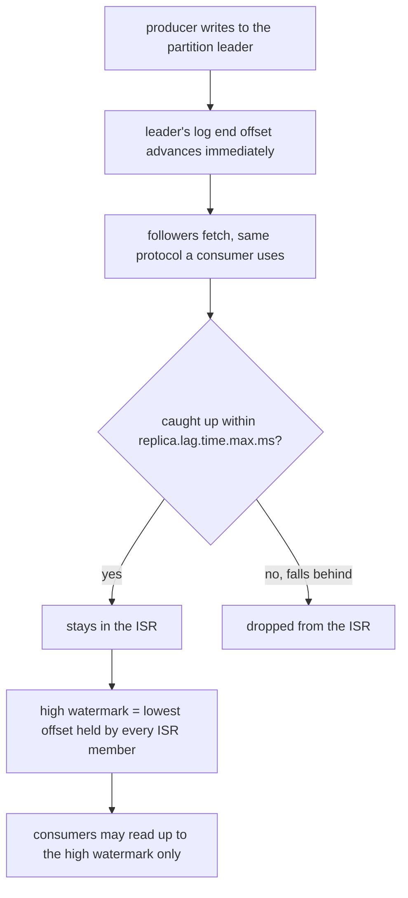
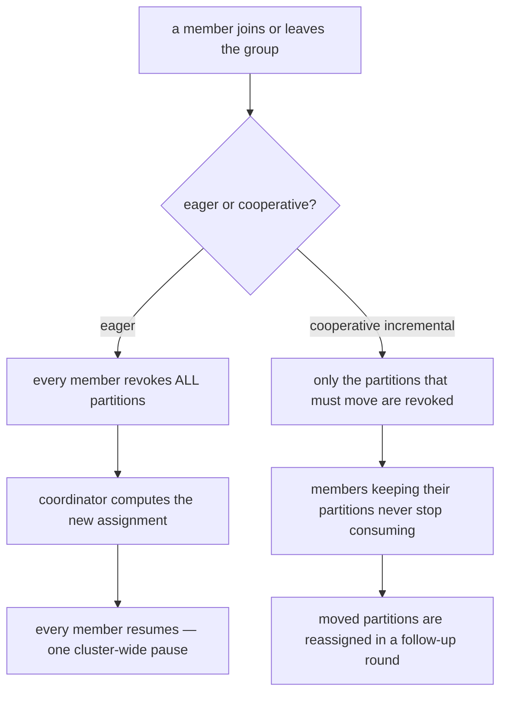

> **Recall layer.** The interview answers are [Q110](/docs/data/kafka#q110)
> and [Q116](/docs/data/kafka#q116). This page is for the model underneath
> them — read [The Log](/docs/concepts/the-log) first. That page explains why
> one partition, on one broker, is fast and durable. This page starts exactly
> where it stops: a partition doesn't live on one broker, and a topic isn't
> read by one consumer, and both of those facts need a coordination layer
> that a single append-only log has no opinion about.

**Written against Kafka 4.x.** ZooKeeper mode was **removed**, not merely
deprecated, in 4.0 (KIP-500) — every cluster this page describes is KRaft.
The consumer-group half of the page describes both the classic group
protocol (`JoinGroup`/`SyncGroup`, eager or cooperative-sticky assignment)
and the newer protocol from KIP-848, which reached general availability for
Java clients in 4.0. Which one a given client actually negotiates depends on
`group.protocol` and broker version — confirm it for your own cluster rather
than assuming; this is exactly the kind of detail that has moved twice in
two years and will likely move again.

## 1. The problem it exists to solve

The Log's model is complete for one log on one machine: append, fsync,
replay. It says nothing about what happens when that log needs to survive a
disk failure, or when more readers want to process it in parallel than one
process can. Those are the two problems this page is about, and they are not
the same problem wearing different clothes — one is "how do multiple copies
of the same data stay in agreement," the other is "how do multiple readers
divide up the work without stepping on each other." Kafka solves them with
two almost entirely separate mechanisms, and the most common source of
confusion at this level is treating them as one.

Concretely: a topic partition has a replication factor of 3, so it exists on
three brokers. What does it mean for a producer's write to be "done" if two
of those three haven't seen it yet? And a consumer group has five members
reading a twelve-partition topic. When one member crashes, who decides which
of the other four inherits its partitions, and what happens to in-flight
processing while that decision is being made? Neither question has an
answer in "append, fsync, replay." Both have precise answers in Kafka, and
both answers are why a Kafka cluster is a distributed system with its own
consensus problem, not just a fast log with a network interface bolted on.

## 2. What actually coordinates a cluster

Since KIP-500, cluster metadata — topic configuration, partition
assignments, ACLs, and controller leadership itself — lives in a Raft
quorum of **controllers**, replacing the ZooKeeper ensemble Kafka used for
its first decade. The controllers replicate a metadata log (the same
append-only-log idea, one more time, now storing "which broker leads which
partition" instead of application records) and elect one of themselves
active controller via Raft. Brokers fetch metadata updates from the active
controller the same way consumers fetch records from a partition leader.

This matters for a reason beyond trivia: it means the mechanism that decides
*who leads a data partition* and the mechanism that *replicates data within
that partition* are two different logs, running two different protocols,
for two different purposes. The controller quorum uses Raft — a small,
fixed set of voters, strict majority agreement, built for correctness over
throughput. Partition replication (next section) uses a simpler,
Kafka-specific protocol built for throughput over generality. Conflating the
two is a common way to misjudge failure scenarios: losing a majority of
controllers is a cluster-wide unavailability event with a well-defined
recovery story; losing replicas of one partition is a per-partition,
localized problem that the ISR mechanism is built to survive without ever
invoking Raft at all.

## 3. The core model, part one: ISR and the high watermark

A partition has one **leader** broker and `replication.factor - 1`
**followers**. Producers and consumers only ever talk to the leader.
Followers behave exactly like consumers of their own leader — they issue
fetch requests and advance their own local log — which is worth noticing
precisely because it means Kafka didn't invent a second replication
protocol; it reused the fetch protocol it already had and pointed it at
itself.

The **in-sync replica set (ISR)** is the leader's list of followers that
have fetched up to (within `replica.lag.time.max.ms` of) its own log end
offset. The **high watermark** is the highest offset present on *every*
member of the ISR. Consumers can only read up to the high watermark — never
the leader's raw log end offset — which is the entire mechanism by which
Kafka avoids exposing a record that a leader failure could still erase.



Trace a failure through this picture and the design falls out on its own.
Say the leader has appended up to offset 105 but the high watermark sits at
103 — two followers haven't fetched that far yet. If the leader dies right
now, the controller elects a new leader **from the ISR**, and every ISR
member already holds everything up to 103 by definition. Nothing acknowledged
to a consumer, and nothing acknowledged to a producer under `acks=all` with
`min.insync.replicas` satisfied ([Q108](/docs/data/kafka#q108)), is lost.
Offsets 104–105 simply vanish — they were never exposed to anyone, so their
disappearance is invisible from outside the cluster.

This is why `acks=all` alone is an incomplete durability story. `acks=all`
means "every member of the *current* ISR has it" — and if replica failures
have already shrunk the ISR down to the leader alone, `acks=all` degrades to
`acks=1` without telling you. `min.insync.replicas` is the other half: it
makes the broker *reject* the write outright when the ISR is too small,
rather than silently acknowledging a single copy. RF 3, `min.insync.
replicas=2`, `acks=all`, and `unclean.leader.election.enable=false` (so an
out-of-sync replica is never promoted to leader, which would mean *silently
discarding* committed data to restore availability) is the specific
combination that makes "acknowledged" mean "durable on a majority," and each
of those four settings is load-bearing — remove any one and the guarantee
degrades in a different, specific way.

## 4. The core model, part two: consumer groups and rebalancing

The second coordination problem — dividing partitions among consumers — is
handled entirely differently, by a **group coordinator**: a broker, one per
consumer group, elected by hashing the group ID. This is the piece with no
equivalent in single-log replication, because it isn't about keeping copies
of data in agreement; it's about keeping a set of independent processes in
agreement about who is responsible for what, which is a membership problem,
not a durability problem.

**The classic protocol** works by electing one group member as the *group
leader* (an unfortunate name collision with partition leaders — they are
unrelated concepts). Every member sends `JoinGroup` to the coordinator; the
coordinator picks one as leader and hands it the full member list; that
member runs the assignment algorithm client-side and returns the result via
`SyncGroup`, which the coordinator fans out to everyone else. Rebalances
trigger on membership change (a member joins, leaves, or is declared dead
after missing `session.timeout.ms` of heartbeats, or after exceeding
`max.poll.interval.ms` between polls without heartbeating).

Two assignment strategies answer "what happens to work in flight during
that rebalance," and they are not a minor tuning knob:

- **Eager** revokes *every* partition from *every* member before computing
  the new assignment. Simple, and a stop-the-world pause across the whole
  group on every single membership change — a rolling deploy of N pods
  triggers N full-group pauses.
- **Cooperative incremental** (`CooperativeStickyAssignor`) computes the new
  assignment first, and only revokes the partitions that actually need to
  move. A member whose partitions are unaffected keeps consuming through the
  entire rebalance.



**The newer protocol (KIP-848)** removes the group-leader role entirely. The
coordinator itself computes assignment server-side and reconciles it with
each member incrementally over the regular heartbeat channel, rather than
through a synchronized `JoinGroup`/`SyncGroup` barrier that every member has
to pass through together. The practical consequence is the cooperative
picture above generalized: a membership change affects only the members
whose partitions actually move, with no group-wide barrier at all, and no
client-side assignment code shipped in every consumer.

**Static membership** (`group.instance.id`) solves a specific, narrower
problem in both protocols: a consumer that restarts and rejoins with the
same instance ID within `session.timeout.ms` is treated as the *same*
member, so a rolling restart doesn't trigger a rebalance in the first place
— not "trigger a cheaper rebalance," but no rebalance at all. This is why it
composes with, rather than replaces, cooperative assignment: static
membership avoids the unnecessary rebalance; cooperative assignment softens
the ones that genuinely have to happen.

## 5. What this coordination does not give you

**No cross-partition atomicity, without asking for it.** ISR and the high
watermark make one partition's history durable and ordered. They say
nothing about a write that spans two partitions — that needs the producer
transaction protocol on top ([Q109](/docs/data/kafka#q109)), which is a
separate mechanism layered over this one, not a consequence of it.

**No online repartitioning that preserves key ordering.** Adding partitions
changes `hash(key) % partitions` for every existing key, and there is no
controller-driven migration that moves a key's history to its new partition
— the messages already written stay where they were written. Growing a
partition count is a decision about the future, never a transparent
operation on the past.

**No rebalance that is free, only rebalances that are cheaper.** Cooperative
and KIP-848 assignment shrink the *blast radius* of a membership change.
Neither eliminates the underlying cost of a partition changing owners: a
consumer picking up a partition it didn't have a moment ago still starts
from that partition's last committed offset, with whatever state-rebuild
cost that implies for a stateful consumer ([Q129] in the reference bank,
outside this page's questions list — Kafka Streams' changelog-restore cost
is the sharpest version of this).

**No protection against a hot partition.** ISR and rebalancing distribute
*ownership* evenly. Neither notices, let alone fixes, a key distribution
where one partition receives ten times the traffic of its siblings — that's
a key-design problem, and coordination machinery has no visibility into it.

## 6. Adjacent guarantees: how this composes with what's next to it

**With `acks` and the idempotent producer.** §3's ISR mechanism is what
`acks=all` *waits for*; it says nothing about what a retried write does to
the log, which is the idempotent producer's job
([Q108](/docs/data/kafka#q108), [Q109](/docs/data/kafka#q109)). The two are
independent axes — durability-of-what's-written versus
no-duplicates-from-retry — and a correct production configuration needs an
opinion on both.

**With consumer lag as an operational signal.** Lag
([Q114](/docs/data/kafka#q114)) is the observable surface of §4's
machinery: the log-end offset advances via §3's replication path regardless
of any consumer, and the committed offset advances only when a group member
processes and commits. A lag *spike* with a flat log-end offset means a
consumer problem; a lag spike that tracks a log-end-offset spike means a
producer burst the consumers haven't caught up to yet — same metric,
opposite diagnosis, and distinguishing them is the actual skill.

**With CAP.** §3 is a worked example of a system making its CP-vs-AP choice
an explicit knob rather than a fixed property
([Q131](/docs/data/kafka#q131)): `min.insync.replicas` plus
`unclean.leader.election.enable=false` chooses unavailability over data
loss under partition; flipping the latter chooses the reverse. Neither
choice is "Kafka's CAP position" — the position is per-partition, per-topic,
and set by the operator, which is the detail most CAP discussions skip.

## 7. Lab: shrink the ISR and force a rebalance, and watch both

A single-broker container (the pattern used in [The Log](/docs/concepts/the-log)'s
own lab) can't demonstrate any of this — ISR, high watermark and unclean
election all require *multiple* brokers actually disagreeing about how
caught-up they are. This lab runs three.

### Setup — a three-broker KRaft cluster

```yaml
# docker-compose.yml
services:
  kafka1: &kafka
    image: apache/kafka:4.0.0
    environment: &env
      KAFKA_NODE_ID: 1
      KAFKA_PROCESS_ROLES: broker,controller
      KAFKA_CONTROLLER_QUORUM_VOTERS: "1@kafka1:9093,2@kafka2:9093,3@kafka3:9093"
      KAFKA_LISTENERS: PLAINTEXT://:9092,CONTROLLER://:9093
      KAFKA_ADVERTISED_LISTENERS: PLAINTEXT://kafka1:9092
      KAFKA_CONTROLLER_LISTENER_NAMES: CONTROLLER
      KAFKA_LISTENER_SECURITY_PROTOCOL_MAP: CONTROLLER:PLAINTEXT,PLAINTEXT:PLAINTEXT
      CLUSTER_ID: "kafka-internals-lab-cluster-id"
  kafka2:
    <<: *kafka
    environment:
      <<: *env
      KAFKA_NODE_ID: 2
      KAFKA_ADVERTISED_LISTENERS: PLAINTEXT://kafka2:9092
  kafka3:
    <<: *kafka
    environment:
      <<: *env
      KAFKA_NODE_ID: 3
      KAFKA_ADVERTISED_LISTENERS: PLAINTEXT://kafka3:9092
```

Combined broker+controller roles on all three nodes is a lab shortcut, not a
production topology — it's enough to make ISR and leader election real
without a six-container compose file. Bring it up and create a
replicated topic:

```bash
docker compose up -d
docker compose exec kafka1 /opt/kafka/bin/kafka-topics.sh --create \
  --topic orders --partitions 1 --replication-factor 3 \
  --config min.insync.replicas=2 --bootstrap-server kafka1:9092
docker compose exec kafka1 /opt/kafka/bin/kafka-topics.sh --describe \
  --topic orders --bootstrap-server kafka1:9092
```

Note the leader and the ISR — all three, e.g. `Isr: 1,2,3`.

### Part 1 — shrink the ISR without losing availability

```bash
docker compose stop kafka3
docker compose exec kafka1 /opt/kafka/bin/kafka-topics.sh --describe \
  --topic orders --bootstrap-server kafka1:9092
```

The ISR drops to two members. Produce with `acks=all`:

```bash
docker compose exec kafka1 /opt/kafka/bin/kafka-console-producer.sh \
  --topic orders --bootstrap-server kafka1:9092 \
  --producer-property acks=all
```

It still accepts writes — `min.insync.replicas=2` is satisfied by the
remaining two. This is §3's guarantee, observed directly: one broker down,
zero durability lost, zero unavailability.

### Part 2 — cross `min.insync.replicas` and watch it refuse

```bash
docker compose stop kafka2
```

Try producing again. It now fails —
`NotEnoughReplicasException` (or the write blocks until `request.timeout.ms`
and then fails). This is `min.insync.replicas` doing exactly its job:
refusing to acknowledge a write that would exist on only one copy, rather
than silently degrading to `acks=1`. Bring both brokers back
(`docker compose start kafka2 kafka3`) and re-describe the topic — watch
the ISR grow back to three as each replica catches up.

### Part 3 — watch a rebalance, eager vs cooperative

```bash
docker compose exec kafka1 /opt/kafka/bin/kafka-topics.sh --create \
  --topic work --partitions 6 --replication-factor 3 --bootstrap-server kafka1:9092
```

Start three consumers in one group with `partition.assignment.strategy=
org.apache.kafka.clients.consumer.RangeAssignor` (eager) and watch
`kafka-consumer-groups.sh --describe --group g1` while you kill and restart
one — every member's assignment churns. Repeat with
`CooperativeStickyAssignor` and the same kill/restart: the two consumers
that kept their partitions show no gap in `CURRENT-OFFSET` progress, and
only the dead member's partitions move.

```bash
docker compose exec kafka1 /opt/kafka/bin/kafka-consumer-groups.sh \
  --bootstrap-server kafka1:9092 --describe --group g1
```

Run this in a loop (`watch -n1 ...`) through the kill/restart in both
configurations and compare how long partitions sit unassigned. That gap is
what cooperative assignment, and KIP-848 further still, exist to close.

## 8. Leading on this

**Treat `min.insync.replicas` and `unclean.leader.election.enable` as one
decision, reviewed together, not two independent defaults.** They jointly
express whether a topic prefers unavailability or silent data loss under a
partition, and that's a business decision (a payments ledger and a
clickstream topic should not make the same one), not an infrastructure
default to leave wherever the Kafka distribution ships it.

**Put static membership on every consumer that survives rolling deploys.**
It is close to a strict improvement — the failure mode it introduces (a
"member" occupying a slot during a genuine outage until its session times
out) is far cheaper than the rebalance storm it prevents on every routine
deploy.

**Alert on under-replicated partitions before anyone reports lag.**
Under-replication is the leading indicator; consumer lag and unavailability
are what it turns into if it isn't fixed. A dashboard that only shows lag
is watching the symptom.

**When someone asks "why did the rebalance take so long," ask which
protocol first.** Eager assignment, a large group, and a slow consumer's
`max.poll.interval.ms` compound into minutes of stop-the-world pause that
look like a cluster problem and are actually a client-configuration
problem. Knowing which of §4's two mechanisms is in play changes where you
look.

## 9. Where to go deeper

- KIP-500 — "Replace ZooKeeper with a Self-Managed Metadata Quorum" — the
  primary source for why the controller quorum exists and what it replaced.
- KIP-848 — "The Next Generation of the Consumer Rebalance Protocol" — read
  it after §4, not before; the motivation section explains precisely which
  classic-protocol pain points (client-side assignment, full rebalance
  barriers) it removes.
- Apache Kafka documentation, "Replication" and "Consumer Groups" sections
  of the current Kafka Design docs — by section title rather than number,
  since the docs are restructured across major versions.
- Jun Rao et al., the original Kafka replication design documents on the
  Apache Kafka wiki — dated, but the ISR concept is described there in the
  clearest form before later features were layered on top.
- Gwen Shapira, Todd Palino et al., *Kafka: The Definitive Guide*, 2nd
  edition — the chapters on reliability and on consumer internals, written
  after KRaft but should still be cross-checked against KIP-848 for the
  rebalance-protocol chapter specifically, since that KIP postdates most
  print editions.

## 10. Self-check

1. A partition's leader has a log end offset of 500; the high watermark is
   480. The leader dies right now. What is guaranteed about offsets 481–500,
   and why doesn't a client ever notice they existed?
2. `acks=all` is set, and a producer's write is acknowledged. Under what
   specific ISR condition does that acknowledgement mean the same thing as
   `acks=1`, and which setting exists purely to prevent that?
3. Two different problems are both called "rebalancing risk" in casual
   conversation about Kafka: one about data, one about group membership.
   Name the mechanism that solves each, and explain why fixing one has no
   effect on the other.
4. Why does cooperative incremental assignment change *which* partitions
   move during a rebalance, without changing *how many* members are in the
   group afterward?
5. A consumer group's lag spikes at the same moment the topic's log-end
   offset spikes. Is this a consumer problem or a producer problem, and what
   is the distinguishing observation?
6. Static membership prevents a rebalance on a routine rolling restart. What
   new failure mode does it introduce, and why is it usually the better
   trade anyway?
7. Explain Kafka's CAP position using `min.insync.replicas` and
   `unclean.leader.election.enable` as the two knobs, and say why "Kafka is
   CP" or "Kafka is AP" is not, by itself, a complete answer.
