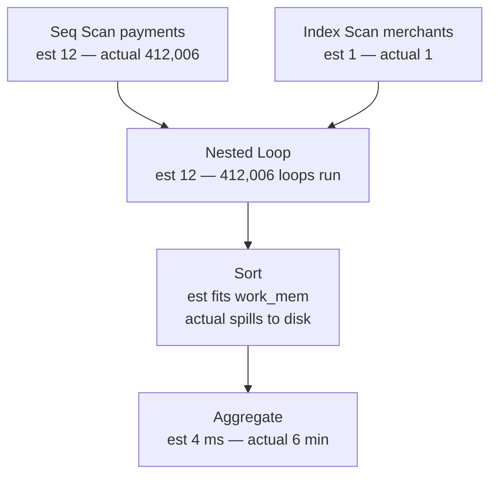

> **Recall layer.** The interview answers are
> [Q16](/docs/data/query-performance#q16),
> [Q18](/docs/data/query-performance#q18) and
> [Q19](/docs/data/query-performance#q19). This page builds the model.

## 1. The problem it exists to solve

A settlement report has run in four seconds every night for a year. On Tuesday
it takes six minutes. Nothing was deployed. The query text is identical, the
indexes are identical, the row count grew by three percent.

```
Nested Loop  (cost=0.86..2431.02 rows=12 width=48)
             (actual time=0.09..359471.22 rows=412006 loops=1)
  ->  Index Scan on merchants  (rows=1) (actual rows=1 loops=1)
  ->  Index Scan on payments   (rows=12) (actual rows=412006 loops=1)
```

One number explains everything on that page: the planner expected **12** rows and
got **412,006**. It chose a nested loop because twelve index probes are nearly
free, and then performed four hundred thousand of them.

The tempting conclusion is that the planner is defective and should be overruled
with a hint. It is not defective. It solved the problem it was given correctly,
and it was given a wrong number. Every durable fix on this page is a fix to the
*input*, and the reason that matters is arithmetic: the planner's cost model is
roughly right, and its cardinality estimates are frequently wrong by orders of
magnitude. Correcting the output of a mostly-correct function is a losing habit.

Where [B-trees and selectivity](/docs/concepts/btrees-selectivity) explains what
one access path costs, this page explains where the *numbers* that choose
between access paths come from, and what happens to a plan when they are wrong.

## 2. The planner is a search, not a lookup

For a query over `n` tables the engine faces a combinatorial space: which access
path per table, which join algorithm per join, and in which order to join. Join
order alone is `n!` in the worst case — five tables is 120 orderings, ten tables
is 3.6 million, and each ordering has several algorithm choices layered on top.

The planner does three things with that space, in order:

1. **Rewrite** the query into a canonical, more optimisable form (section 6).
2. **Enumerate** plans by dynamic programming — the System R algorithm, still the
   backbone fifty years on. Build the best plan for every single table, then for
   every pair, then every triple, keeping only the winner for each subset, plus
   any plan with a useful sort order, which may win later by avoiding a sort.
3. **Cost** each candidate and keep the cheapest.

A cost is an abstract number, not a time. PostgreSQL anchors it at
`seq_page_cost = 1.0` for one sequentially-read page and scales everything else
against that. Comparing costs between two plans for the same query is
meaningful; comparing a cost to a millisecond is not.

Every cost is a function of two things: the constants, which are configuration,
and **the estimated number of rows flowing out of each node**, which is
inference. The constants are usually approximately right and are easy to correct
once — [`random_page_cost` is the one that
matters](/docs/concepts/btrees-selectivity). The row estimates are where the
entire failure mode lives.

## 3. How a row estimate is actually computed

`ANALYZE` samples the table and stores, per column, in `pg_stats`:

- `null_frac` — the fraction of nulls
- `n_distinct` — distinct values, as a count, or as a negative fraction of the
  table when it scales with size
- `most_common_vals` / `most_common_freqs` — the MCV list, values with exact
  measured frequencies
- `histogram_bounds` — equal-frequency buckets covering everything *not* in the
  MCV list

`default_statistics_target` is 100, so that is 100 MCV entries and 100 histogram
buckets per column unless you raise it.

From those, selectivity for a single predicate is direct arithmetic:

| Predicate | Estimate |
|---|---|
| `col = 'X'`, X in the MCV list | its measured frequency — near exact |
| `col = 'Y'`, Y not in the MCV list | `(1 - sum(mcv_freqs)) / (n_distinct - n_mcv)` — a flat average |
| `col > 'Z'` | interpolate the position of Z in the histogram |
| `col IS NULL` | `null_frac` |

The node's estimate is then `selectivity × rows`, and here is where the model
earns its reputation:

> **Multiple predicates are combined by multiplying their selectivities.** The
> planner assumes the columns are independent.

For `WHERE city = 'Kuala Lumpur' AND country = 'Malaysia'`, two predicates at 1%
each are estimated at 0.01%. In the data they are very nearly the same
predicate, and the true answer is 1% — a hundredfold underestimate produced by a
modelling assumption, not by stale statistics. `ANALYZE` will never fix it,
because nothing about it is out of date. This is the most common cause of the
plan in section 1, and the remedy is to tell the planner the columns are
related:

```sql
CREATE STATISTICS city_country (dependencies, ndistinct, mcv)
  ON city, country FROM addresses;
ANALYZE addresses;
```

Joins use a different formula and the same assumption. For an equi-join the
planner estimates output rows as roughly

```
outer_rows × inner_rows / max(n_distinct_outer, n_distinct_inner)
```

which assumes every distinct key appears with uniform frequency on both sides. A
merchant table where one merchant owns 40% of the payments violates that
completely, and no amount of `ANALYZE` on either table repairs a *join* estimate
— the statistics describe each column alone, and there is no such thing as
extended statistics spanning two tables.

## 4. Why one bad estimate ruins a whole plan

An error at a leaf does not stay at the leaf. Each node's estimate is derived
from its children's, so an error propagates upward and **compounds
multiplicatively** — and, worse, it is consumed as an input to a decision at
every level above it.



Read it as a chain of consequences rather than as a picture of a query. The leaf
estimate is the only wrong number in the plan. It caused the join algorithm to
be chosen wrongly, which made the join's own output estimate wrong, which sized
the sort wrongly against `work_mem`, which spilled it to disk. One input error,
four failures, and only the first is fixable.

Three properties follow, and they are what to carry away from this page:

- **Nested loop is the sharp edge.** Hash and merge joins degrade roughly
  linearly when the estimate is wrong. A nested loop degrades by the factor of
  the error, because the estimate *is* the loop count. That is why "fast
  yesterday, 500× slower today" is nearly always a nested loop
  ([Q18](/docs/data/query-performance#q18)).
- **Underestimates are far more dangerous than overestimates.** An overestimate
  buys a hash join you did not need: wasteful, bounded. An underestimate buys a
  plan that is catastrophic rather than merely suboptimal. The asymmetry is why
  the independence assumption, which almost always underestimates, hurts as much
  as it does.
- **There is no feedback loop.** PostgreSQL does not remember that yesterday's
  estimate was wrong by 30,000×. Every execution re-derives it from the same
  statistics and reaches the same conclusion. Oracle's statistics feedback
  (cardinality feedback before 12c) and SQL Server 2022's CE feedback do exactly
  this and are the exception, not the norm — assume your engine has no memory.

So when you read a plan ([Q16](/docs/data/query-performance#q16)), the first pass
is not "what shape is this". It is: **find the lowest node whose estimate and
actual disagree by more than about 10×.** Everything above it is a consequence,
not a cause.

## 5. Join ordering, and the limits the planner sets on itself

Exhaustive dynamic programming over join orders is exponential in time and
memory, so every engine caps its own ambition. PostgreSQL's three caps are worth
knowing by name, because the defaults are low:

- **`join_collapse_limit`** (8) — how many explicit `JOIN` clauses it will
  flatten into one list and reorder freely. Above it, the order you wrote is
  partially obeyed.
- **`from_collapse_limit`** (8) — the same, for subqueries pulled into the
  parent query.
- **`geqo_threshold`** (12) — above twelve relations it abandons dynamic
  programming for a **genetic algorithm**: a randomised search that returns a
  decent plan quickly and *is not deterministic*.

That last one has a consequence people meet without recognising it. Past twelve
tables, the same query can get a different plan on different runs. A reporting
query joining fifteen tables whose performance is erratic with no data change is
GEQO, and the fix is to decompose the query or raise the threshold and accept
slower planning — not to chase the plan.

Planning time is itself a real cost for short queries. `EXPLAIN` reports
`Planning Time` next to `Execution Time`; when planning is 4 ms and execution is
0.3 ms you have found a candidate for a prepared statement, which brings its own
problem — section 7.

## 6. What the planner is allowed to rewrite

Before costing anything, the engine rewrites. Knowing what it *will* do stops
you hand-optimising something already handled; knowing what it *will not* do
tells you when rewriting is the actual fix.

It routinely does:

- **Subquery flattening.** `IN (SELECT ...)` becomes a semi-join,
  `NOT EXISTS (SELECT ...)` an anti-join. This is why `IN` vs `EXISTS` vs `JOIN`
  is mostly folklore for simple cases
  ([Q26](/docs/data/query-performance#q26)) — the plans converge.
- **Predicate pushdown.** A `WHERE` in the outer query is pushed into a view or
  subquery so it filters before the expensive work rather than after it.
- **Outer join removal**, when a left join's right side is unique and no column
  from it is selected.
- **Constant folding and transitive closure.** Given `a.id = b.id AND a.id = 5`
  it infers `b.id = 5`, and gets a second index seek for free.

Two things block all of it, and both are common:

- **An opaque expression.** `WHERE lower(email) = ?`, a `jsonb` extraction, a
  user-defined function in a predicate: none can be pushed through or estimated,
  so the planner falls back to a fixed default selectivity — 0.5% for equality on
  an expression it cannot see into. That number is a guess with no data behind
  it, and it is the quiet cause of a great many nested loops.
- **A materialisation fence.** This is what
  [CTEs](/docs/data/query-performance#q25) are really about. Before PostgreSQL 12
  every `WITH` was materialised, so a CTE was an unconditional optimisation
  barrier — used deliberately to force a plan and accidentally to destroy one.
  Since 12, a non-recursive CTE referenced once and free of side effects is
  inlined by default, and `MATERIALIZED` / `NOT MATERIALIZED` make the choice
  explicit.

The fence is a tool, not a bug. `MATERIALIZED` is exactly right when a CTE is
expensive and referenced three times, or when you want to force an aggressive
filter to happen first because you know something the statistics do not. It is
the one legitimate way to influence a plan through the query text rather than
through a hint, which is why it survives review when a hint does not.

## 7. The plan you get is not always the plan for your parameters

A prepared statement is planned once and executed many times, so the plan must
be chosen without knowing every parameter value. With a skewed column —
`WHERE tenant_id = ?` where one tenant has ten million rows and the rest have a
hundred — no single plan is right
([Q20](/docs/data/query-performance#q20)).

PostgreSQL's behaviour is specific and unusually sensible. The first five
executions are planned **custom**, using the actual parameter values. From the
sixth, it compares the average custom-plan cost against the generic plan's cost,
and switches to generic if generic is not worse. So a statement can be fast five
times and slow on the sixth, on one connection, with no deployment — a failure
mode that looks like witchcraft until you know the number five.

`plan_cache_mode = force_custom_plan`, per session or around one statement, is
the direct control. The alternatives are worth ranking, because reaching for the
setting first is a habit that scales badly:

1. A **partial index** on the outlier value, so even the generic plan is good.
2. **Two code paths** — the skewed tenant gets its own query. Ugly, honest, and
   frequently correct.
3. **`force_custom_plan`** for that statement, with a comment saying why.
4. **Partitioning** by the skewed key, if the skew is structural rather than
   incidental.

This is a *different* mechanism from SQL Server's parameter sniffing, where the
first execution's values are baked into one cached plan. Since SQL Server 2022,
Parameter Sensitive Plan optimization dispatches up to three plan variants for an
eligible skewed predicate automatically, so `OPTIMIZE FOR UNKNOWN` and
`RECOMPILE` are now the fallback for what it declines — typically a distribution
not skewed enough to qualify — rather than the first answer. Same symptom as
PostgreSQL's, different cause and different remedies; do not carry either
engine's advice into the other.

## 8. What the planner cannot do for you

- **It cannot estimate what it cannot see.** A parameter inside a function body,
  a value arriving through a `jsonb` path, a predicate on the output of a
  user-defined function: all fall back to hardcoded default selectivities.
- **It does not know your columns are correlated** until you tell it, and
  extended statistics stop at the table boundary.
- **It does not know what is in your cache.** Costs assume
  `effective_cache_size` as a hint about the machine, not knowledge of what is
  resident right now. Two identical plans can differ 100× in wall time on cache
  state alone, which is why `BUFFERS` tells you more than `cost` does.
- **It will not fix a query that asks for the wrong thing.** `OFFSET 200000`
  discards two hundred thousand rows however good the plan
  ([Q21](/docs/data/query-performance#q21)). No optimiser rewrites that into
  keyset pagination.
- **A plan is not a contract.** It changes on upgrade, on a statistics refresh,
  on a distribution shift. Anything that *requires* a particular plan needs a
  test asserting it, not an assumption.

**Two currency notes for PostgreSQL 18**, both of which change how this page's
advice is carried out rather than what it says. `BUFFERS` is now **on by default**
with `EXPLAIN ANALYZE`, so the habitual `EXPLAIN (ANALYZE, BUFFERS)` is
belt-and-braces rather than necessary. And B-tree **skip scan** lets an index on
`(a, b)` serve a query constraining only `b`, by hopping between distinct values
of `a` — which softens, without repealing, the leftmost-prefix rule from
[the B-tree page](/docs/concepts/btrees-selectivity). It appears as an ordinary
`Index Scan`; the tell is the `Index Searches: N` line, also new in 18.

## 9. Lab: do the planner's arithmetic yourself

```bash
docker run --rm -d --name pg -e POSTGRES_PASSWORD=x -p 5432:5432 postgres:18
psql postgresql://postgres:x@localhost/postgres
```

### Lab 1 — compute an estimate by hand, then check it

```sql
CREATE TABLE payments AS
SELECT g AS id,
       (ARRAY['MY','MY','MY','MY','MY','MY','SG','SG','TH','ID'])[1 + (g % 10)] AS country,
       (g % 5000) AS merchant_id,
       (g % 97) AS bucket
FROM generate_series(1, 2000000) g;
ANALYZE payments;

SELECT most_common_vals, most_common_freqs, n_distinct
FROM pg_stats WHERE tablename = 'payments' AND attname = 'country';
```

Multiply the frequency of `SG` by two million on paper. Now run
`EXPLAIN SELECT * FROM payments WHERE country = 'SG';` and compare with your
number. Then do the same for `merchant_id = 42`, which is **not** in the MCV
list, using the non-MCV formula from section 3. Landing both within a rounding
error is the moment the planner stops being a black box.

### Lab 2 — break it with correlation, then repair it

```sql
ALTER TABLE payments ADD COLUMN region text;
UPDATE payments SET region = 'APAC-' || country;
ANALYZE payments;

EXPLAIN ANALYZE SELECT * FROM payments WHERE country = 'SG' AND region = 'APAC-SG';
```

The two columns are perfectly dependent, so the true selectivity equals the
selectivity of either one alone; the estimate will be the product. Record the
ratio. Then:

```sql
CREATE STATISTICS s_cr (dependencies, ndistinct, mcv)
  ON country, region FROM payments;
ANALYZE payments;
```

Rerun and watch the estimate snap into place. **That is section 3 in two
commands.**

### Lab 3 — make a nested loop go wrong

Join `payments` to a small `merchants` table on `merchant_id`, filtered by the
correlated pair from Lab 2, and run it with and then without the extended
statistics (`DROP STATISTICS s_cr`). Watch the join method flip between nested
loop and hash join, and record the wall time of each. That flip is section 4's
whole argument, in one measurement you performed.

### Lab 4 — watch the sixth execution get slower

```sql
CREATE TABLE events AS
SELECT g AS id, CASE WHEN g % 100 = 0 THEN 1 ELSE 1 + (g % 999) END AS tenant_id
FROM generate_series(1, 3000000) g;
CREATE INDEX ON events (tenant_id);
ANALYZE events;

PREPARE p(int) AS SELECT count(*) FROM events WHERE tenant_id = $1;
EXPLAIN (ANALYZE) EXECUTE p(500);   -- six times, reading the plan each time
```

Tenant 1 holds 1% of a three-million-row table; everyone else holds about 0.03%.
Watch the plan on execution six. Then `SET plan_cache_mode = force_custom_plan;`
and confirm it reverts. You have now seen section 7 happen rather than read it.

### Lab 5 — the CTE fence, both ways

Write a query whose CTE filters aggressively and is referenced once, and run it
as `WITH x AS MATERIALIZED (...)` and as `WITH x AS NOT MATERIALIZED (...)`.
Compare `Planning Time`, `Execution Time` and the plan shape. Then make the CTE
expensive and reference it three times, and confirm the answer reverses.

### Lab 6 — hit the GEQO cliff

Join twelve tables, then thirteen. Compare `Planning Time` across five runs of
each, and compare the plans between runs. The thirteenth crosses
`geqo_threshold` and the plan stops being reproducible. `SET geqo = off` to
confirm that is the cause rather than noise.

### Lab 7 — see 18's new instrumentation

```sql
CREATE INDEX ON payments (country, bucket);
EXPLAIN (ANALYZE) SELECT count(*) FROM payments WHERE bucket = 42;
```

No predicate on the leading column, yet the index can still be chosen. Read the
`Index Searches` line: one search is an ordinary scan, several means it skipped
between distinct values of `country`. There is no separate `Skip Scan` node to
look for, and — worth knowing before you hunt for one mid-incident — **no
`enable_indexskipscan` to switch it off**, because skip scan is not a planner
method with a GUC of its own. To get the comparison, force the alternative
instead: `SET enable_indexscan = off; SET enable_bitmapscan = off;` and compare
the sequential scan's buffer count against the skip scan's.

## 10. Leading on this

**Make "estimated versus actual" the first line of every plan discussion.** The
useful question in a review is never "why did it choose a nested loop" — it is
"at which node is the estimate wrong". Teaching the team to find the lowest
divergent node turns plan reading from a specialism into a two-minute skill, and
it is the highest-leverage thing on this page.

**Treat hints as debt with an expiry date.** `pg_hint_plan`,
`SET LOCAL enable_nestloop = off` and their equivalents are legitimate as
incident mitigation and illegitimate as a fix, because they freeze a decision
against data that will keep moving. If one goes in, it goes in with a comment
naming the estimate it compensates for and a ticket to remove it. A codebase
with a dozen hints has a statistics problem nobody has looked at.

**This is about to get a first-party answer, and the argument survives it.**
PostgreSQL 19 — in beta as of September 2026, not yet released — ships a
`pg_plan_advice` contrib module. `EXPLAIN (PLAN_ADVICE)` emits a string
describing the plan's shape (join order, join method, scan methods, parallelism),
and `pg_plan_advice.advice` asks the planner to make those decisions again. Two
things make it better than `pg_hint_plan`: the advice lives outside the SQL text,
in a GUC or a stash keyed by query ID, so it never contaminates the query; and it
can only choose among plans the planner already considers viable, so it cannot
force something unworkable. Its own documentation then makes this section's
argument for it — if the data distribution shifts, advice that pins a plan
prevents the planner from adapting, and a very poor plan may be chosen. It is the
good version of the debt, not an exemption from it.

**Own statistics as a platform concern, not a per-query one.** Autovacuum's
analyze threshold is proportional, so the largest and most important tables are
analysed least often relative to their churn. Lower
`autovacuum_analyze_scale_factor` on the big tables, raise
`default_statistics_target` on known-skewed columns, and add extended statistics
for correlated pairs when you add the columns — not after the incident.

**Capture plans in production, because your laptop's plan is not the plan.**
`auto_explain` with a duration threshold and a sample rate gives you the real
plan, for the real parameters, with the real cache state. Without it every
investigation starts by trying to reproduce, and reproduction is where the day
goes.

**Put a plan regression test on the queries that carry the business.** Assert the
shape — no sequential scan on this table — or a duration bound on a seeded
dataset. It catches the upgrade that moves an estimate before your users do, and
it is the only thing that makes "a plan is not a contract" survivable.

## 11. Where to go deeper

- Selinger et al., "Access Path Selection in a Relational Database Management
  System" (1979) — the System R paper that invented cost-based optimisation.
  Every planner discussed here is still recognisably this algorithm.
- Leis et al., "How Good Are Query Optimizers, Really?" (VLDB 2015) — measures
  the argument this page makes. Cardinality estimation, not the cost model and
  not the plan enumeration, dominates the error. The best thirty pages on the
  subject.
- PostgreSQL documentation: "How the Planner Uses Statistics", the `pg_statistic`
  catalogue, and `src/backend/optimizer/README` in the source tree. The last is
  short, readable, and the only precise description of the join-order search.
- The `EXPLAIN` reference page, read properly once — specifically the difference
  between cost, actual time and loops, and what `Rows Removed by Filter` means.
- `auto_explain` and `pg_stat_statements` — the two modules that make everything
  here observable in production
  ([Q27](/docs/data/query-performance#q27)).
- The PostgreSQL 19 `pg_plan_advice` documentation, and Robert Haas's design
  write-up behind it — read for the caveats, which are a better argument against
  casual hinting than anything in section 10 of this page.
- Guy Lohman, "Is Query Optimization a 'Solved' Problem?" — short, and the
  clearest statement of why the industry spent twenty years optimising the half
  of the problem that was not the bottleneck.

## 12. Self-check

1. A plan shows `rows=12` against `actual rows=412006`. Name the separate
   decisions that one number corrupted, and say which of them you can fix.
2. Why does `WHERE city = ? AND country = ?` underestimate even when statistics
   were refreshed this morning? Name the assumption and the remedy.
3. Give the arithmetic for an equality estimate on a value that is *not* in the
   MCV list, and explain why that formula is dangerous on a skewed column.
4. Why does a nested loop punish a bad estimate hardest, when hash and merge
   joins survive the same error?
5. A fifteen-table reporting query returns different plans on different runs with
   no data change. What is happening, and what are your two options?
6. Before PostgreSQL 12 a CTE was an optimisation fence. What replaced that
   behaviour, and in which two situations do you still want the fence?
7. A prepared statement is fast five times and slow on the sixth. Explain the
   mechanism precisely, and rank the fixes.
8. Someone proposes adding `enable_nestloop = off` to the application's session
   setup because it resolved an incident. Give the argument against, and say what
   you would do instead.
