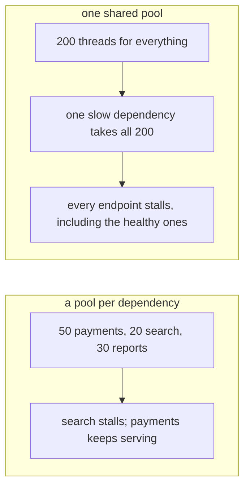

> **Recall layer.** The interview answers are
> [Q53](/docs/java/concurrency#q53) and [Q62](/docs/java/concurrency#q62).
> This page builds the model.

## 1. The problem it exists to solve

An incident, and it has the same shape almost every time.

One downstream dependency — a fraud-scoring service, say — slows from 40 ms to
4 seconds. It doesn't fail. It doesn't return errors. It just gets slow.

Within ninety seconds your service is returning 503s for **every** endpoint,
including ones that never call fraud scoring. Health checks fail. The
orchestrator restarts you, and the new instance dies the same way. CPU is near
zero throughout.

Nothing in your service is broken. Every thread is sitting in a socket read,
waiting on fraud scoring, and there are no threads left to serve anything else.

Two things would have prevented it, and both come from the same piece of
arithmetic.

## 2. Little's Law

From queueing theory, and it holds for any stable system regardless of arrival
distribution or service time distribution:

```
L = λ × W
```

- **L** — average number of items in the system (concurrency)
- **λ** — arrival rate (requests per second)
- **W** — average time in the system (latency)

Rearranged for our purposes:

> **Required concurrency = throughput × latency**

500 requests/second, each taking 200 ms → you need 100 requests in flight
simultaneously. If you have 50 threads, you cannot serve 500 rps at 200 ms.
Not "it will be slow" — arithmetically cannot.

The law is also the diagnostic. Fix two variables and the third is determined:

- Concurrency fixed at 50, latency rises to 4 s → **throughput collapses to
  12.5 rps**, no matter what your hardware is doing.

That's section 1. The fraud service didn't consume your CPU. It consumed your
**concurrency**, which was the scarce resource all along.

### Sizing from the law

**CPU-bound work.** Threads ≈ number of cores. More threads means context
switching, not more work. Add one to cover occasional page faults.

**I/O-bound work.** The thread is idle while waiting, so you want more than
cores:

```
threads = cores × targetUtilisation × (1 + waitTime / serviceTime)
```

100 ms waiting, 5 ms computing → ratio 20 → 8 cores at 90% suggests ~150
threads.

**But treat that as the start of the conversation.** The formula optimises for
saturating your CPU. It knows nothing about the downstream. If your database
pool has 20 connections, 150 threads simply queue at the pool, adding latency
without adding throughput — you've moved the queue, not removed it
([Q47](/docs/data/scaling-operations#q47) on why database pools are small).

The real constraint is almost always the narrowest resource in the chain, not
your CPU.

## 3. The ThreadPoolExecutor trap

This catches nearly everyone, and it is the most useful concrete fact on this
page.

You'd expect: fill to `corePoolSize`, then grow to `maximumPoolSize`, then
queue. What actually happens:

1. Fewer than `corePoolSize` threads → **create a thread**.
2. At core size → **enqueue the task**.
3. Queue **full** → create threads up to `maximumPoolSize`.
4. Queue full and at max → **reject**.

Threads beyond core are only created when the **queue is full**.

So with an unbounded queue, step 3 never happens. `maximumPoolSize` is dead
configuration — you can set it to 500 and never exceed core.

```java
new ThreadPoolExecutor(10, 500, 60L, SECONDS, new LinkedBlockingQueue<>());
// maximum is 10. Forever.
```

`Executors.newFixedThreadPool(n)` has exactly this shape — core = max = n with
an unbounded queue. And `Executors.newCachedThreadPool()` has the opposite
problem: a `SynchronousQueue` (zero capacity, so every task immediately needs a
thread) with `maximumPoolSize = Integer.MAX_VALUE`, which grows without limit
under load until you exhaust memory.

Neither factory method is what you want in production. Construct the executor
yourself, with a **bounded** queue.

## 4. Bounded queues, and why unbounded ones are a lie

An unbounded queue does not prevent overload. It converts "we are overloaded"
into "we allocate until we die", and it does so silently.

Three things go wrong:

**The failure signal is absorbed.** A full queue is backpressure — information
that should propagate to the caller. An unbounded queue swallows it.

**Latency becomes unbounded.** A task queued behind 200,000 others will be
processed eventually, long after the client timed out. You are now burning
capacity on work nobody is waiting for — the classic death spiral, where every
completed task is already useless.

**Memory.** In a payments consumer, buffering two million events in heap is an
OOM instead of a broker retaining messages safely
([Q30](/docs/java/collections#q30)).

So bound the queue, and choose a rejection policy deliberately:

| Policy | Behaviour | When |
|---|---|---|
| `AbortPolicy` | Throws `RejectedExecutionException` | Default. You want to surface load shedding as a 503. |
| `CallerRunsPolicy` | The submitting thread runs it | Natural backpressure for ingestion pipelines — the producer slows down |
| `DiscardPolicy` | Silently drops | Only genuinely droppable work: metrics, presence |
| `DiscardOldestPolicy` | Drops the oldest queued task | Freshness matters more than completeness |

`CallerRunsPolicy` is elegant and has one sharp edge: if the caller is your HTTP
acceptor thread, you've just stopped accepting connections. Know who the caller
is.

## 5. Bulkheads — the actual fix for section 1

One shared pool means one slow dependency can consume every thread. Separate
pools per dependency means it can consume at most its own.



```java
ExecutorService fraudPool   = boundedPool(20, 50);   // can burn 20 threads, no more
ExecutorService ledgerPool  = boundedPool(30, 100);
ExecutorService notifyPool  = boundedPool(10, 200);
```

Named for ship compartments: one flooded section doesn't sink the vessel. Now
the fraud service degrading costs you fraud-scoring capacity and nothing else,
and every other endpoint keeps serving.

Combine with a **timeout** (so a thread is never held indefinitely) and a
**circuit breaker** (so a sustained failure stops consuming threads at all), and
section 1 becomes a degraded feature instead of a total outage
([Q81](/docs/design/microservices-communication#q81)).

The general principle, worth stating separately because it generalises:
**partition your scarce resource by dependency, so failure is contained.** It's
the same idea as separate Kafka consumer groups, separate connection pools, and
separate rate-limit buckets per tenant.

## 6. What virtual threads change — and what they don't

Java 21's virtual threads (JEP 444) make threads cheap: a few kilobytes of
heap-allocated stack instead of a 1 MB reservation, scheduled onto a small pool
of carrier threads, unmounted automatically when they block on most JDK
operations.

**What changes:** you stop pooling them. Thread-per-task is now viable, and
`Executors.newVirtualThreadPerTaskExecutor()` is the idiom. Little's Law's L is
no longer bounded by how many OS threads you can afford, so the thread pool
stops being the constraint.

**What does not change — and this is the part that matters:**

Little's Law still applies. The scarce resource just moved. If you allow 10,000
concurrent virtual threads against a database with a 20-connection pool, you
have not increased throughput; you've built a 9,980-deep queue at the pool.
Unbounded concurrency against a bounded downstream is the same overload with a
different queue.

So **you still need bulkheads** — now as semaphores or rate limiters rather than
pool sizes:

```java
Semaphore fraudLimit = new Semaphore(20);
// ... acquire before the call, release in a finally
```

The bulkhead is the concept; the thread pool was only ever one implementation of
it.

Also unchanged: CPU-bound work is still bounded by cores; `ThreadLocal`-heavy
code becomes a memory problem at a million threads
([`ScopedValue`](/docs/java/modern-java#q91) is the answer); and pinning inside
`synchronized` blocks can block carriers in Java 21 specifically, which is worth
auditing before you enable them ([Q62](/docs/java/concurrency#q62)).

## 7. Lab: reproduce the outage

### Lab 1 — prove maximumPoolSize is ignored

```java
var ex = new ThreadPoolExecutor(2, 50, 60, TimeUnit.SECONDS,
        new LinkedBlockingQueue<>());          // unbounded
for (int i = 0; i < 1000; i++)
    ex.submit(() -> { try { Thread.sleep(1000); } catch (Exception e) {} });
Thread.sleep(2000);
System.out.println("pool size = " + ex.getPoolSize());       // 2
System.out.println("queued    = " + ex.getQueue().size());   // ~998
```

You asked for up to 50 threads. You got 2. **Change the queue to
`new ArrayBlockingQueue<>(10)` and re-run** — now watch it grow to 50 and start
rejecting. Thirty seconds, and it fixes a misconception most Java developers
carry for years.

### Lab 2 — measure Little's Law

```java
var pool = Executors.newFixedThreadPool(N);
var done = new AtomicLong();
long start = System.nanoTime();
for (int i = 0; i < 5000; i++)
    pool.submit(() -> { try { Thread.sleep(100); } catch (Exception e) {} finally { done.incrementAndGet(); } });
pool.shutdown(); pool.awaitTermination(5, TimeUnit.MINUTES);
double secs = (System.nanoTime()-start)/1e9;
System.out.printf("N=%d  throughput=%.1f rps%n", N, done.get()/secs);
```

Run with N = 10, 50, 100, 200. Throughput should be almost exactly
`N / 0.1` — concurrency divided by latency. Then change the sleep to 400 ms and
watch throughput drop by 4× at fixed N. **You have just measured the incident
from section 1.**

### Lab 3 — cause the cascading failure

Two endpoints, one shared pool. One calls a fast stub, one calls a stub that
sleeps 4 seconds. Drive both with a load generator and watch the *fast* endpoint's
latency and error rate.

Then split into two bounded pools and repeat. The fast endpoint stays healthy
while the slow one sheds load. **This is the single most valuable lab on the
page** — it's a production outage, reproduced on a laptop in twenty minutes, and
the fix demonstrated.

### Lab 4 — rejection policies

Take the bounded-queue version of Lab 1 and cycle through all four policies
under sustained overload. Observe: who throws, who blocks the producer, what
gets lost. Then set `CallerRunsPolicy` and submit from a single producer thread
— watch the producer's own rate self-limit.

### Lab 5 — virtual threads, and the moved bottleneck

```java
try (var ex = Executors.newVirtualThreadPerTaskExecutor()) {
    for (int i = 0; i < 100_000; i++)
        ex.submit(() -> { Thread.sleep(1000); return null; });
}
```

100,000 concurrent tasks, trivially. Compare RSS and completion time against
100,000 platform threads (which will likely fail outright).

Then add the real lesson: put a `Semaphore(20)` around a simulated database call
inside those tasks, and watch total throughput return to `20 / latency`
regardless of how many virtual threads you started. **The constraint moved; it
didn't disappear.**

### Lab 6 — thread dump forensics

While Lab 3's slow endpoint is saturated, take three thread dumps ten seconds
apart:

```bash
jcmd <pid> Thread.print > dump1.txt
```

Count threads in the same frame across all three. Note that a thread blocked in
a socket read shows as `RUNNABLE`, not `BLOCKED` — a detail that misleads people
during real incidents.

## 8. Leading on this

**One pool per dependency, as a standard.** Not a per-service decision. The
shared-pool cascading failure is the most common distributed-systems outage
there is, and the fix is structural and cheap. Make it part of the service
template.

**Instrument pools as first-class metrics.** Queue depth, active count,
rejection count, and task wait time — exported per pool. Rejections rising with
CPU flat means you're blocked downstream, and that single correlation resolves
most "the service is slow" investigations in under a minute.

**Ban `Executors.newFixedThreadPool` and `newCachedThreadPool` in review.** Both
are traps (section 3). Construct `ThreadPoolExecutor` explicitly with a bounded
queue and a named thread factory — named, because an unnamed pool in a thread
dump at 3am is a mystery.

**Teach Little's Law as arithmetic, not theory.** "We need 100 concurrent to
serve 500 rps at 200 ms" is a sentence that ends capacity arguments. It also
reframes latency work: reducing W reduces required L, so making a call faster
increases capacity as much as adding threads does — often more cheaply.

**Be the person who asks "what's the narrowest resource?"** Teams add threads,
then pods, then instances, while the constraint is a 20-connection database
pool the whole time. Little's Law applied to *each* stage of the chain finds the
real bottleneck in about five minutes.

**When adopting virtual threads, add the semaphores in the same change.**
Removing the pool without replacing the bulkhead converts a bounded overload
into an unbounded one. This is a genuine regression risk in the migration and
it's easy to miss, because everything looks faster in testing.

## 9. Where to go deeper

- Brian Goetz et al., *Java Concurrency in Practice*, chapter 8 — thread pool
  sizing and the executor's configuration, still accurate two decades on.
- The `ThreadPoolExecutor` Javadoc. Unusually good, and it states the
  core/queue/max rule explicitly — most people have simply never read it.
- Little's Law: any queueing theory text, but the striking thing is how few
  assumptions it needs. Worth reading the proof once.
- JEP 444 (Virtual Threads) and JEP 453 (Structured Concurrency) — the
  motivation sections are the best writing on why thread-per-request came back.
- Resilience4j's bulkhead documentation — both the semaphore and thread-pool
  implementations, and when each fits.
- Marc Brooker's blog on queueing, timeouts and retries — the operational
  consequences of this arithmetic in distributed systems.

## 10. Self-check

1. State Little's Law and use it to explain why a service with 50 threads
   cannot serve 500 rps at 200 ms.
2. A downstream slows from 40 ms to 4 s. CPU stays near zero and every endpoint
   returns 503. Explain the mechanism precisely.
3. `new ThreadPoolExecutor(10, 500, ..., new LinkedBlockingQueue<>())` — what is
   the effective maximum pool size, and why?
4. What is wrong with `Executors.newCachedThreadPool()` under sustained load?
5. Give three distinct harms caused by an unbounded work queue.
6. When is `CallerRunsPolicy` the right choice, and what is its sharp edge?
7. You migrate to virtual threads and remove your thread pools. What must you
   add, and what happens if you don't?
8. Your pool metrics show rising queue depth and flat CPU. What does that tell
   you, and where would you look next?
