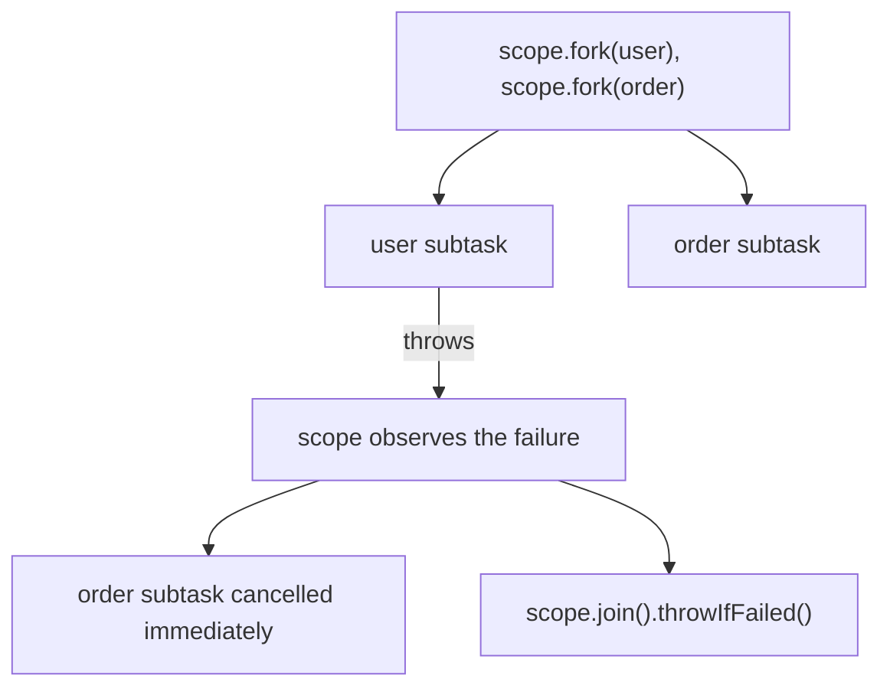

> **Recall layer.** The interview answers are
> [Q62](/docs/java/concurrency#q62) and [Q64](/docs/java/concurrency#q64).
> This page builds the model.

## 1. The problem it exists to solve

For twenty years Java backend development had one unresolved tension.

**Thread-per-request** is how humans think. A request arrives, a thread handles
it start to finish, blocking calls look like function calls, exceptions
propagate, stack traces mean something, the debugger works, a thread dump tells
you what every request is doing.

It just doesn't scale. A platform thread is an OS thread: ~1 MB of reserved
stack, a kernel object, and a context switch measured in microseconds. Ten
thousand concurrent requests means ten thousand OS threads, which no kernel is
happy about — and most of them are asleep waiting on I/O.

So the industry went **asynchronous**. Callbacks, then futures, then reactive
streams. It scales beautifully and it costs you everything that made
thread-per-request comfortable:

```java
// what you wanted to write
var user = userService.find(id);
var orders = orderService.recent(user);
return render(user, orders);

// what reactive makes you write
return userService.find(id)
    .flatMap(user -> orderService.recent(user)
        .map(orders -> render(user, orders)));
```

The second version has stack traces that name Reactor internals rather than
your code, a debugger that can't step through it, `ThreadLocal`-based context
(MDC, security) that silently breaks, and one rule you must never violate: a
single blocking call anywhere poisons the event loop.

The insight behind virtual threads is that **this was never a fundamental
trade-off.** It was an artefact of Java threads being OS threads. Make threads
cheap and the tension disappears.

## 2. A thread is a stack plus a scheduler

Strip a thread down and it's two things: somewhere to keep the call stack, and
something deciding when it runs.

A **platform thread** keeps its stack in memory the OS reserved, and the OS
kernel schedules it. Both are expensive, and neither is negotiable from inside
the JVM.

A **virtual thread** keeps its stack **on the Java heap**, as a
`Continuation` object, and the **JVM** schedules it onto a small pool of
platform threads called **carriers** (a dedicated `ForkJoinPool`, sized to
`availableProcessors` by default).

| | Platform thread | Virtual thread |
|---|---|---|
| Stack | ~1 MB reserved by OS | few hundred bytes to KBs, on heap, grows |
| Created by | OS | JVM |
| Scheduled by | kernel | JVM's FJ scheduler |
| Context switch | kernel transition, ~1–10 μs | Java-level, ~100 ns |
| Practical count | thousands | millions |

Note the stack is *heap-allocated*, which links straight to the
[JVM memory page](/docs/concepts/jvm-memory): virtual thread stacks are subject
to GC, and a million idle virtual threads is a heap concern rather than a
thread-count concern.

### Mounting and unmounting

The mechanism is a **continuation** — a capturable, resumable representation of
a call stack.

- **Mount**: the JVM copies the virtual thread's stack frames onto a carrier
  thread's stack and runs them.
- **Unmount**: when the virtual thread blocks, the JVM copies its frames back
  to the heap and frees the carrier for someone else.

So `Thread.sleep(1000)` on a virtual thread does not block an OS thread. It
parks the continuation, releases the carrier, and schedules a wake-up. The JDK
was extensively rewritten so that socket I/O, `BlockingQueue`, `Lock`, `sleep`
and `join` all unmount rather than block.

The mount/unmount/pinning picture already exists on the reference answer —
see [Q62](/docs/java/concurrency#q62) rather than redrawing it here.

**This is what reactive frameworks do manually.** Every `flatMap` is a
hand-written continuation — "here's what to do when the result arrives."
Virtual threads move that into the runtime, so the compiler and JVM maintain
your stack instead of you encoding it as a chain of lambdas.

## 3. Pinning: when unmounting can't happen

If a virtual thread blocks while its continuation *cannot* be moved to the
heap, it stays **pinned** to its carrier — and now a carrier (one of your ~8)
is blocked.

In **Java 21** there are two causes:

1. **Inside a `synchronized` block or method.** The monitor is held by the OS
   thread, so unmounting would release it to the wrong thread.
2. **During a native frame** — a JNI or FFM call.

Cause 1 is the dangerous one. Consider:

```java
public synchronized Connection getConnection() {
    while (available.isEmpty()) wait();        // blocks, pinned
    return available.remove();
}
```

A connection pool shaped like that, used by 10,000 virtual threads under load,
pins every carrier and **deadlocks the application**. Not slows — deadlocks,
because there is no carrier left to run the thread that would return a
connection.

This is not hypothetical. Older JDBC drivers and connection pools synchronise
around I/O, and it is the single biggest thing to audit before enabling virtual
threads on Java 21.

**Detection:**

```
-Djdk.tracePinnedThreads=full
```

prints a stack trace whenever a virtual thread blocks while pinned. Run your
load test with it on.

**Fix:** replace `synchronized` with `ReentrantLock`, which is
virtual-thread-aware and unmounts correctly.

```java
private final ReentrantLock lock = new ReentrantLock();
public Connection getConnection() {
    lock.lock();
    try { ... } finally { lock.unlock(); }
}
```

**Version note that matters:** JDK 24 (JEP 491) removed the `synchronized`
pinning limitation — monitors became virtual-thread-aware. So this is a
**Java 21-specific** hazard. If you're on 21, audit for it; if you're on 24+,
it's history. Knowing *which* JDK you're on changes the answer, and that's
exactly the kind of version-specific detail worth being precise about.

## 4. What does not change

This is the section that matters most, because the failure mode of adopting
virtual threads is assuming they solved more than they did.

**You stop pooling them.** Virtual threads are cheap; pooling them is an
anti-pattern. `Executors.newVirtualThreadPerTaskExecutor()` creates one per
task.

**But Little's Law still applies.** From the
[thread pools page](/docs/concepts/thread-pools): required concurrency =
throughput × latency, and the scarce resource is whatever is narrowest. Allow
10,000 concurrent virtual threads against a 20-connection database pool and you
have not increased throughput — you've built a 9,980-deep queue at the pool.

**So you still need bulkheads.** The pool size *was* your concurrency limit.
Remove it and you must replace it:

```java
private final Semaphore fraudLimit = new Semaphore(20);

fraudLimit.acquire();
try { return fraudClient.score(payment); }
finally { fraudLimit.release(); }
```

**Removing the pool without adding the semaphore is a genuine regression**, and
an easy one to miss because everything looks faster in testing.

**CPU-bound work gains nothing.** You still have N cores. Virtual threads add
scheduling overhead to compute-bound work.

**`ThreadLocal` becomes a memory problem.** A per-thread copy of anything, times
a million threads, is heap you didn't budget for. `InheritableThreadLocal` is
worse — it copies the map to every child. `ScopedValue` is the replacement:
immutable, bound for a dynamic extent, automatically unbound, no copying. It
previewed alongside virtual threads in Java 21 and finalized as **JEP 506 in
Java 25** — on 25+ it needs no preview flag
([Q91](/docs/java/modern-java#q91)).

**Thread identity stops being useful.** Anything caching or pooling by thread —
some metrics libraries, some connection-per-thread patterns — breaks or leaks.

## 5. Structured concurrency — the other half

Cheap threads make a second problem visible: nothing ties a task's lifetime to
its logical parent. An executor happily leaks threads doing work nobody is
waiting for.

`StructuredTaskScope` gives concurrent tasks block scope. It previewed
alongside virtual threads in 21 (JEP 453) and is still previewing —
its **sixth** preview, JEP 525, ships in JDK 26 — because the API kept
getting reshaped release to release (JEP 462, 480, 499, 505 in between).
The `ShutdownOnFailure`/`ShutdownOnSuccess` subclass shape below is the
**original JDK 21 form**; current previews replace it with a
`StructuredTaskScope.open(Joiner)` factory. The mechanism this section
explains — a task's lifetime scoped to a block, with cancellation
propagating to its children — is the part that has stayed stable across
every reshape; check the javadoc for your JDK's exact preview syntax before
shipping code from this example.

```java
try (var scope = new StructuredTaskScope.ShutdownOnFailure()) {
    Subtask<User>  user  = scope.fork(() -> userService.find(id));
    Subtask<Order> order = scope.fork(() -> orderService.recent(id));
    scope.join().throwIfFailed();
    return new Page(user.get(), order.get());
}
```

If either fails, the other is cancelled immediately and the scope throws. No
leaked threads, no orphaned work, and the parent/child relationship appears in
thread dumps.



That cancellation edge — one subtask's failure reaching its sibling before the
sibling finishes — is the part `CompletableFuture.allOf` cannot do for you,
and it is not the same picture as Q62's mount/unmount/pinning diagram above.

Compare with `CompletableFuture.allOf`, where one failure leaves the others
burning resources until they finish, and cancellation is manual.

`ShutdownOnSuccess` gives you hedged requests — race two providers, take the
first answer, cancel the loser — in about five lines.

## 6. So, reactive or virtual threads?

**Virtual threads** give you thread-per-request scalability with blocking code,
real stack traces, working debuggers, and useful thread dumps.

**Reactive** additionally gives you *composable backpressure* — `request(n)`
flowing upstream — and a rich operator vocabulary for stream transformation.

My default for a new service on Java 21+ is thread-per-request on virtual
threads. Reactive earns its place for genuine streaming with flow control
(SSE, websockets, large pipelines), for event processing with rich operators,
or when the ecosystem you're in is already Reactor
([Q109](/docs/java/spring#q109)).

The worst outcome is half-reactive: a codebase where one blocking JDBC call
stalls an event loop, with all the complexity and none of the guarantee.

Also worth saying plainly: if most of your reactive code is `map`/`flatMap`
over a single request with no fan-out, you are paying the complexity tax for
nothing, and virtual threads are strictly better.

## 7. Lab: measure the thing

### Lab 1 — the count that doesn't work

```java
public class ThreadCount {
    public static void main(String[] a) throws Exception {
        var latch = new CountDownLatch(1);
        int n = 0;
        try {
            for (; n < 100_000; n++) {
                Thread.ofPlatform().start(() -> { try { latch.await(); } catch (Exception e) {} });
            }
        } catch (Throwable t) {
            System.out.println("died at " + n + ": " + t);
        }
    }
}
```

Run with `-Xmx512m` and watch it fail (or bring the machine to its knees).
Replace `ofPlatform()` with `ofVirtual()` and run a million. **That contrast
is the headline**, and measuring RSS for each makes it concrete.

### Lab 2 — reproduce pinning and deadlock the JVM

```java
public class Pinned {
    static final Object MONITOR = new Object();

    static void badBlockingCall() {
        synchronized (MONITOR) {                    // pins the carrier
            try { Thread.sleep(2000); } catch (Exception e) {}
        }
    }

    public static void main(String[] a) throws Exception {
        try (var ex = Executors.newVirtualThreadPerTaskExecutor()) {
            for (int i = 0; i < 64; i++) ex.submit(Pinned::badBlockingCall);
        }
    }
}
```

```bash
java -Djdk.tracePinnedThreads=full Pinned
```

You get pinning traces, and with `synchronized` serialising them the whole
thing runs in serial rather than parallel. Now swap `synchronized (MONITOR)`
for a `ReentrantLock` and re-run — the traces disappear and it completes in
roughly one sleep duration.

**This is the lab to run before enabling virtual threads on any real service**,
because it's what a badly-behaved driver does to you.

### Lab 3 — the bottleneck moves, it doesn't vanish

```java
static final Semaphore DB = new Semaphore(20);   // stand-in for a connection pool

static void handleRequest() throws Exception {
    DB.acquire();
    try { Thread.sleep(100); }                   // "query"
    finally { DB.release(); }
}
```

Run 10,000 tasks on virtual threads, measure wall-clock. Then compute
`20 / 0.1 = 200 rps` from Little's Law and check your measurement matches.

Then remove the semaphore and observe... the same throughput if the real
resource is genuinely limited, or a collapsed downstream if it isn't.
**Unbounded concurrency against a bounded resource is the regression** — this
lab is how you internalise it.

### Lab 4 — thread dumps that are actually useful

```bash
jcmd <pid> Thread.dump_to_file -format=json dump.json
```

With 10,000 virtual threads in flight, the JSON dump shows every one with its
stack. Compare against what a reactive application's thread dump tells you
(eight event-loop threads, all in `epollWait`, and no indication of what any
request is doing). **This is the operability argument for virtual threads, and
it's more persuasive than any benchmark.**

### Lab 5 — structured concurrency and cancellation

```java
try (var scope = new StructuredTaskScope.ShutdownOnFailure()) {
    var fast = scope.fork(() -> { Thread.sleep(100); return "fast"; });
    var slow = scope.fork(() -> { Thread.sleep(10_000); return "slow"; });
    scope.join().throwIfFailed();
}
```

Make `fast` throw instead. Observe that `slow` is cancelled immediately rather
than running for ten seconds. Then write the `CompletableFuture.allOf`
equivalent and watch it not do that.

(Still a preview API as of JDK 26 — needs `--enable-preview` on whichever JDK
you run it on, and `--release 21` only if you specifically want the original
JEP 453 shape used above rather than your JDK's current one.)

### Lab 6 — Spring Boot end to end

```properties
spring.threads.virtual.enabled=true
```

Load-test an endpoint that calls a slow downstream, before and after. Watch
`tomcat.threads.busy` — and check your JDBC pool and any `synchronized` in the
request path first, with `tracePinnedThreads` on.

## 8. Leading on this

**Audit for pinning before enabling, not after.** A checklist: JDBC driver
version, connection pool version, any `synchronized` in the request path,
logging framework, and anything with a native call. Run a load test with
`-Djdk.tracePinnedThreads=full` and treat any output as a blocker. On Java 21
this is the difference between a smooth migration and an outage.

**Add the semaphores in the same change as removing the pools.** Make this an
explicit migration step with a reviewer, because it's invisible in testing and
catastrophic under load. The bulkhead is the concept; the thread pool was only
ever one implementation of it.

**Audit `ThreadLocal` usage at the same time.** MDC, security context, tenant
context. Measure heap before and after under realistic concurrency, and plan
the `ScopedValue` migration rather than discovering the memory growth in
production.

**Resist rewriting working reactive code.** It's the obvious temptation and
usually poor value. Migrate at natural boundaries — new services, services
being substantially reworked — and use BlockHound to audit for blocking calls
in whatever stays reactive.

**Be precise about JDK version in this discussion.** The `synchronized` pinning
limitation is real on 21 and gone on 24+. A team making a platform decision
needs that distinction, and getting it wrong in either direction — panicking on
24, or ignoring it on 21 — costs real money.

**Frame the benefit as operability, not throughput.** Virtual threads rarely
make a service dramatically faster. They make it dramatically easier to
understand, debug and operate at the same scalability. That's the argument that
holds up, and it's the one Lab 4 demonstrates.

## 9. Where to go deeper

- JEP 444 (Virtual Threads) — the motivation section is the best short
  explanation of why thread-per-request came back. JEP 491 for the pinning
  removal (finalized Java 24). JEP 506 for scoped values (finalized Java 25).
  Structured concurrency is still previewing — JEP 453 was the original
  Java 21 shape; JEP 525 is the current sixth preview, targeted for Java 26 —
  so read whichever JEP matches the JDK you're actually deploying to.
- Ron Pressler's talks on Loom, particularly on continuations — he designed it
  and explains the stack-copying mechanism clearly.
- "Java 21 new feature: Virtual Threads" on Inside.java, plus the Loom
  networking documentation on which JDK operations unmount.
- Brian Goetz on why the JDK chose continuations over async/await — a useful
  contrast with C# and Kotlin's approaches.
- Spring Boot's virtual threads documentation, and the known pinning issues in
  common drivers.

## 10. Self-check

1. Where does a virtual thread's stack live, and what schedules it? Name one
   consequence of each answer.
2. Explain mounting and unmounting. What does `Thread.sleep` do on a virtual
   thread that it doesn't do on a platform thread?
3. Describe pinning, its two causes on Java 21, and how a connection pool can
   deadlock an entire application because of it.
4. Which JDK removed the `synchronized` pinning limitation, and why does the
   version matter to a platform decision?
5. You remove your thread pools and adopt virtual threads. What must you add,
   and what happens under load if you don't?
6. Why is pooling virtual threads an anti-pattern, and why is bounding
   concurrency still necessary?
7. What does `ThreadLocal` cost at a million virtual threads, and what is the
   intended replacement?
8. Give two cases where reactive is still the better choice, and one where a
   half-reactive codebase is worse than either.
