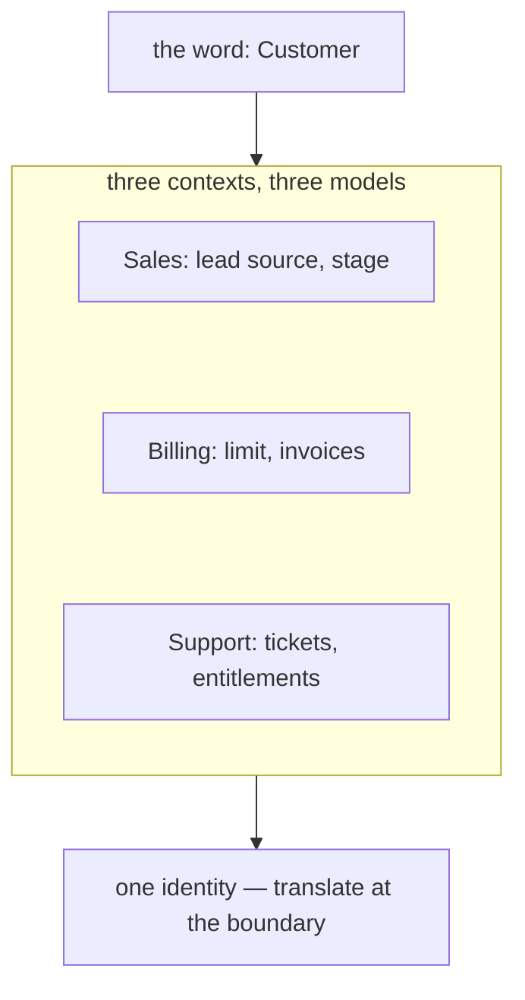

> **Recall layer.** The interview answers are
> [Q47](/docs/design/ddd#q47) and
> [Q63](/docs/design/microservices-boundaries#q63). This page builds the model.

## 1. The problem it exists to solve

Open the `Customer` class. It has 94 fields.

`creditLimit` and `paymentTerms`, added by billing. `supportTier` and
`lastTicketId`, added by support. `riskScore`, `deviceFingerprints`,
`kycStatus`, added by fraud. `marketingOptIn`, `campaignSource`, added by
growth. Roughly 60 of the fields are null for any given customer, and nobody
knows which combinations are legal.

Changing it requires agreement from four teams. Adding a field is a two-week
negotiation. The class means nothing precise, so every method that takes a
`Customer` has to defensively check which subset of it is populated.

The instinct that created this was good: *one customer, one class, don't
duplicate.* DRY.

The instinct was wrong, and knowing exactly why is the most valuable modelling
idea in this entire library — because it's also the answer to "where do service
boundaries go?"

## 2. There is no such thing as a customer

To billing, a customer is a payer: an account, a payment method, a credit limit,
a billing address, an invoice history. Whether they've ever filed a support
ticket is irrelevant.



To support, a customer is a person with a history: a name, a contact channel, a
tier, a set of interactions. Their credit limit is irrelevant.

To fraud, a customer is a risk profile: device fingerprints, behavioural
patterns, velocity, a KYC status. The name is barely relevant and may
deliberately not be loaded.

These are **three different concepts that share a word**. Merging them doesn't
eliminate duplication — it creates a model that is precise for nobody and
requires four teams to agree before it can change.

A **bounded context** is the scope within which a model and its language are
consistent. Inside billing, "customer" means exactly one thing, the team can
define it precisely, and they can change it without asking anyone.

Crucially: the same word may mean something different in the next context, and
**that is correct, not a problem to solve**. What you accept in exchange is
translation at the boundary.

### Ubiquitous language

Within a context, one language shared by engineers and domain experts, used in
conversation, in the code, in the tests, and in the database. Not a glossary
document — the actual identifiers.

The test: *could a domain expert read your class and method names and recognise
their own vocabulary?* If your code says `PaymentProcessor.process(request)`
while the business says "we authorise, then capture, then settle", the model
has already diverged and every conversation needs translation.

That translation cost is where requirements get lost. Ubiquitous language is
not about naming aesthetics; it's about removing a lossy conversion between
what the business means and what the code does.

## 3. How to find a boundary

Four signals, in rough order of reliability.

### Linguistic seams

The strongest evidence, and the easiest to gather. Look for:

- **The same word meaning different things.** "Payment" to the ledger is a
  journal entry; to the gateway it's an authorisation attempt; to the merchant
  dashboard it's a row with a status.
- **Different words for the same thing.** Fraud says "subject", billing says
  "account holder", support says "customer".
- **Fields that are null for whole categories.** A field only billing populates
  is billing's, and it's sitting in the wrong class.
- **Conditional logic on type or source.** `if (customer.isMerchant())` running
  down a hundred-line method usually means two concepts wearing one class.

### What changes together

The Common Closure Principle applied at the top level: things that change for
the same reason belong together, things that change for different reasons
belong apart ([Q24](/docs/design/solid-principles#q24)).

This one is **measurable**, which makes it unusually persuasive:

```bash
git log --format=format: --name-only --since=1.year | \
  grep -v '^$' | sort | uniq -c | sort -rn | head -40
```

and, better, which files co-change:

```bash
git log --format='%H' --since=1.year | while read c; do
  git show --format= --name-only $c | grep '\.java$' | sort -u | paste -sd,
done | sort | uniq -c | sort -rn | head -30
```

Files that always appear in the same commit belong in the same context. Files
that never co-change probably don't. This turns "I feel like these are
separate" into evidence.

### Team structure

Conway's Law is an observation that holds: systems mirror the communication
structure of the organisations that build them. So a boundary that cuts across
a team will erode — coordinating within a team is free and enforcing the
boundary is friction, and friction loses.

The practical consequence: a proposed decomposition without a matching
ownership model is half a design ([Q69](/docs/design/microservices-boundaries#q69)).

### Event storming

Put domain experts in a room with a long wall. Everyone writes **domain events**
in past tense on orange stickies — `PaymentAuthorised`, `RefundIssued`,
`KycApproved` — and arranges them in time order. Then add commands, actors, and
policies.

What emerges without being asked for: clusters of events that belong together,
and **handoff points** where one cluster stops and another begins. Those handoffs
are candidate context boundaries, and they're usually where a "pivotal event"
sits — one that several parts of the business care about.

It works because it surfaces disagreements about vocabulary in the first twenty
minutes. Two people arguing about what "settled" means, in front of a wall, is
the whole method paying for itself.

## 4. Context mapping

Boundaries define the pieces. Relationships between them are the other half, and
they are as much organisational as technical
([Q51](/docs/design/ddd#q51)):

| Pattern | Meaning |
|---|---|
| **Partnership** | Two teams succeed or fail together; coordinated releases |
| **Shared Kernel** | A shared subset of model. Powerful, dangerous — any change needs both teams |
| **Customer/Supplier** | Downstream influences upstream's priorities; there's a negotiation |
| **Conformist** | Downstream adopts upstream's model wholesale, no translation |
| **Anti-Corruption Layer** | Downstream translates to protect its own model |
| **Open Host Service** | Upstream publishes a protocol for many consumers |
| **Published Language** | A documented interchange format, often with a schema registry |
| **Separate Ways** | No integration; duplicating is cheaper than integrating |

Naming these makes an implicit power dynamic explicit. "We're Conformist to the
core banking team" is a true, useful sentence that explains why your model looks
the way it does, and it opens a conversation about whether that's the right
relationship.

### The anti-corruption layer

The one you'll use most. A translation layer between your context and an
external one, so their model doesn't leak into yours
([Q50](/docs/design/ddd#q50)).

Without one, a provider's concepts propagate: their field names, their status
codes, their odd nullability, their notion of what a transaction is. Within six
months your domain is shaped by a vendor's design and you can't replace them.

Mechanically it's a driven adapter from the
[dependency inversion page](/docs/concepts/dependency-inversion) — you define
the port in your language, and the adapter translates. Same pattern, applied at
a context boundary rather than a technology boundary.

## 5. Context, module, service

Three different things that get conflated
([Q71](/docs/design/microservices-boundaries#q71)):

- A **bounded context** is a *modelling* boundary — a scope of consistent
  language.
- A **module** is a *codebase* boundary — enforced by packages and build rules.
- A **service** is a *deployment* boundary — independently releasable.

They nest. A service should never span two contexts (it would have a confused
model), but a context can contain several services, split for scaling or team
reasons.

The important asymmetry: **the context boundary is the valuable artefact;
deploying across it is a later, separate decision.** A modular monolith with
five well-defined contexts is a better system than five services with muddled
ones — and it can become five services mechanically if it ever needs to. The
reverse is a rewrite.

This is the strongest argument available against premature microservices: do
the modelling work, defer the deployment decision
([Q62](/docs/design/microservices-boundaries#q62)).

## 6. What this does *not* solve

- **It doesn't eliminate duplication, it relocates it.** Three contexts each
  holding a customer's name is duplication. That's the price of independent
  models, and it's usually cheaper than the coordination it replaces — but
  someone must own which copy is authoritative
  ([Q92](/docs/design/microservices-data#q92)).
- **It doesn't tell you the right number of contexts.** Too few and you've
  rebuilt the canonical model. Too many and everything is translation.
- **Boundaries drift.** A context that made sense at 20 people may be two
  contexts at 100. Re-examining them is periodic work, not a one-time exercise.
- **It requires domain experts.** Without access to people who know the
  business, you get engineers inventing a model and calling it DDD
  ([Q52](/docs/design/ddd#q52)).
- **It says nothing about consistency.** Once contexts are separate, updates
  across them are eventually consistent, and that's a whole other set of
  problems — sagas, the outbox, reconciliation.

## 7. Lab: find the boundaries in your own codebase

Unlike the other concept pages, the lab here operates on a real system. Use one
you know well.

### Lab 1 — the linguistic audit

Take the three largest classes in your domain. For each field, write down which
part of the business owns it and who would request a change to it.

Then group by owner. If a class has fields owned by three groups, you have found
a canonical model, and the groups are candidate contexts.

Second pass: list every term used in the codebase for the same real-world
concept, and every concept sharing a term. Twenty minutes with a text file. It
is astonishing how much this surfaces.

### Lab 2 — measure what changes together

Run both `git log` commands from section 3 against your repository.

Look for: files that co-change constantly across apparent module boundaries
(the boundary is wrong), and clusters that never co-change with anything else
(a context hiding inside a package). Compare the result with what you'd have
guessed. The mismatch is the interesting part.

### Lab 3 — event storming, alone if necessary

Take one business process end to end — a payment from initiation to settlement.
Write every domain event in past tense on a separate line, in time order.

Then mark: which events does each part of the business care about? Where does a
different team take over? Where does the vocabulary change?

Doing this solo is worth an hour. Doing it with two domain experts and a wall is
worth a week of design discussion, and you should push for it.

### Lab 4 — enforce a boundary you've found

Pick the clearest boundary from Labs 1–3 and make it real in code, without
splitting a service:

1. Move the classes into a feature package.
2. Make everything package-private except one published interface.
3. Add an ArchUnit rule:

```java
@ArchTest static final ArchRule contexts_are_isolated =
    slices().matching("com.acme.(*)..")
        .namingSlices("$1")
        .should().notDependOnEachOther()
        .ignoreDependency(alwaysTrue(), resideInAPackage("..shared.."));
```

4. Run it. Count the violations.

**That number is your coupling, measured.** Then fix them one at a time, or
relax the rule to a documented allowlist that only ever shrinks. This turns
architecture from an opinion into a build artefact
([Q56](/docs/design/architecture-styles#q56)).

### Lab 5 — write the translation

For one dependency on another team's model, write an anti-corruption layer: a
port in your vocabulary, an adapter that maps. Note what you had to decide —
usually you discover their model has states yours doesn't care about, which is
itself the evidence that they're different contexts.

## 8. Leading on this

**Resist the canonical model, explicitly and repeatedly.** It will be proposed —
by an architect, by a data team, by anyone who sees the same word twice. The
counter-argument is concrete: name three fields that mean different things in
two contexts, and ask who signs off on a change. The coordination cost is the
argument, not the modelling purity.

**Get engineers in front of domain experts.** The single highest-leverage
intervention available. Requirements relayed through a product manager arrive
pre-translated, and the translation is where the model is lost. An engineer who
has heard the business argue about what "settled" means will model it correctly.

**Use co-change data in boundary arguments.** "These two modules appear in the
same commit 70% of the time" ends a debate that "I think these are coupled"
cannot. Same principle as everywhere else in this library: make the
architectural property measurable.

**Do the modelling before the decomposition.** Teams that split services first
and discover boundaries second pay for it permanently, because a wrong boundary
between services is a data migration and an API break, while a wrong boundary
between packages is a refactor. Push for the modular monolith when the domain
isn't understood yet ([Q61](/docs/design/microservices-boundaries#q61)).

**Match boundaries to ownership, or expect erosion.** If you cannot give each
context a single owning team, the boundary will not hold, and you should either
change the team structure or draw fewer boundaries. Proposing an architecture
that contradicts the org chart is proposing something that won't survive
contact.

**Revisit annually.** Contexts drift as the business changes. A scheduled review
— even an hour with the co-change data — catches drift while it's still cheap.

## 9. Where to go deeper

- Eric Evans, *Domain-Driven Design*, part IV (Strategic Design). The tactical
  patterns get all the attention; part IV is the valuable half. If you read one
  section, read the context mapping chapter.
- Vaughn Vernon, *Implementing Domain-Driven Design*, chapters 2–3 — more
  concrete than Evans, with worked examples.
- Alberto Brandolini, *Introducing EventStorming* — the method, from its
  inventor.
- Skelton & Pais, *Team Topologies* — the organisational half, and the Inverse
  Conway Manoeuvre.
- Adam Tornhill, *Your Code as a Crime Scene* — the co-change analysis in Lab 2,
  developed properly, with tooling.
- Nick Tune's writing on context mapping and domain discovery.

## 10. Self-check

<SelfCheck>

<SelfCheckItem n={1} where="§1 The problem it exists to solve; §2 There is no such thing as a customer.">

A `Customer` class has 94 fields and 60 are usually null. Diagnose the
problem and describe the fix without using the word "microservice".

</SelfCheckItem>

<SelfCheckItem n={2} where="§2 There is no such thing as a customer.">

Why is the same word meaning two different things in two contexts *correct*
rather than a modelling error to eliminate?

</SelfCheckItem>

<SelfCheckItem n={3} where="§3 How to find a boundary.">

Give four signals you'd use to locate a context boundary, and rank them by
how much you'd trust each.

</SelfCheckItem>

<SelfCheckItem n={4} where="§3 Event storming; §7 Lab 3 — event storming, alone if necessary.">

What exactly does event storming produce that a requirements document
doesn't?

</SelfCheckItem>

<SelfCheckItem n={5} where="§5 Context, module, service.">

Distinguish bounded context, module and service. Which can contain which?

</SelfCheckItem>

<SelfCheckItem n={6} where="§4 Context mapping.">

You're Conformist to another team's model. What does that mean, what does it
cost, and what would change it?

</SelfCheckItem>

<SelfCheckItem n={7} where="§3 Team structure.">

Your proposed three-context decomposition is owned by two teams. What
happens over the next year, and what would you do about it?

</SelfCheckItem>

<SelfCheckItem n={8} where="§6 What this does not solve.">

What duplication does this approach deliberately accept, and what must you
put in place to make that safe?

</SelfCheckItem>

</SelfCheck>
