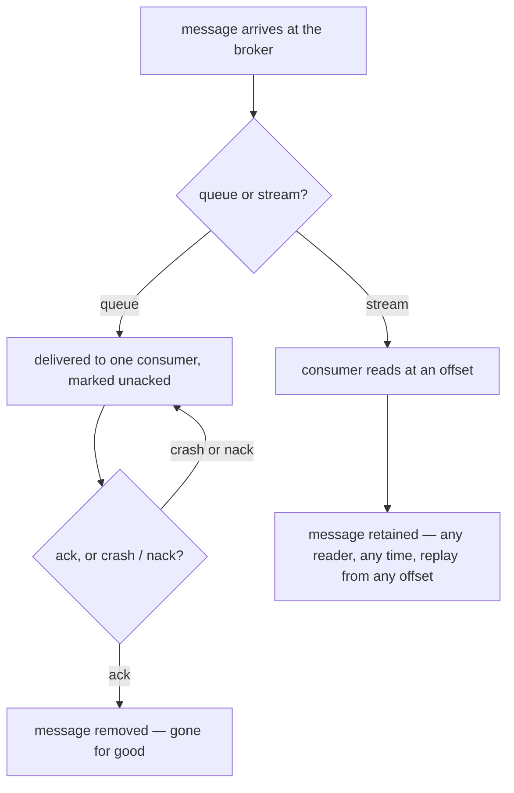

> **Recall layer.** The interview answers are [Q91](/docs/data/rabbitmq#q91)
> and [Q98](/docs/data/rabbitmq#q98). This page is for the model underneath
> them — read [The Log](/docs/concepts/the-log) first, because everything
> here is defined by contrast with it.

## 1. The problem it exists to solve

Take the [log's central claim](/docs/concepts/the-log): consumers track their
own offset, so a reader can stop, restart, replay, or run three copies of
itself, and the writer never has to know or care. That is a genuinely good
property. So why does RabbitMQ — a message broker that predates Kafka by a
decade and is still the default choice for a huge amount of production
work — throw it away?

Try to build a work queue on a log and the reason shows up immediately.
Ten workers read the same Kafka partition to process payment retries. Each
worker tracks its own offset, so each one sees *every* message — there is no
built-in way to say "exactly one of you handles this one, and if you crash
halfway through, hand it to somebody else." You can build that on top of a
log (partition per worker, rebalance on failure), but it costs you the thing
the log gave you for free: any partition you own, only you can read, so
"redistribute the work" means "reassign partitions," which is coarse and
slow compared to "the next free worker picks up the next message."

The two systems are not the same shape solving the same problem differently.
They are answers to two different questions:

- **"How do I distribute units of work to a changing pool of workers, with
  the broker managing who owns what right now?"** — RabbitMQ's question.
- **"How do I let an unbounded number of independent readers each see the
  full ordered history, at their own pace?"** — Kafka's question.

Confuse them and you get one of two failure modes: an event stream rebuilt
badly on top of a work queue (Q92 — a RabbitMQ queue asked to retain history
fills memory and blocks every publisher), or a work-distribution system
rebuilt badly on top of a log (a Kafka consumer group reimplementing
per-message retry, priority and dead-lettering that a broker gives you for
nothing).

## 2. What a broker actually is

A log's read is a cursor move: reading doesn't change the log, so any number
of readers can read the same data independently, and the log's job is just
to retain it long enough for the slowest of them. A **broker-managed queue**
makes the opposite bet: **reading removes the message** — logically, if not
always physically — and the broker's whole job is to track, for every
message, which one consumer currently owns it and what happens if that
consumer dies before saying "done."

That's [Q86](/docs/data/rabbitmq#q86)'s AMQP model made precise: a message
lands in a queue, a consumer receives it, and it stays **unacknowledged** —
the broker's word for "checked out, not yet confirmed done" — until an
explicit `basic.ack`. If the channel or connection dies with the message
still unacked, the broker requeues it. Nobody else can process it while it's
checked out; if the consumer *does* die, somebody else eventually will.

This single piece of state — one bit of "who currently owns this message,
and is it confirmed done" — is the entire mechanism. Almost everything
distinctive about broker semantics is that bit, examined from a different
angle: prefetch is "how many of these can one consumer hold checked out at
once," dead-lettering is "what to do when the same message keeps coming back
unconfirmed," and a poison message is "this bit never flips to done, no
matter how many times we hand it out."

## 3. The core model: acknowledgement as the unit of work

Compare the two systems' failure vocabulary directly, because it's the
fastest way to see they aren't variations on one idea:

| | Log (Kafka) | Broker (RabbitMQ) |
|---|---|---|
| Unit of progress | consumer's own offset | broker's per-message ack state |
| Who advances it | the consumer, whenever it likes | the broker, on receiving `basic.ack` |
| Effect of a crash mid-processing | offset simply isn't committed yet — consumer resumes from last commit | broker detects the dead channel and **requeues the unacked message** |
| Can two consumers see the same message? | yes, always — every consumer group sees everything | no — one queue, one message, one current owner |
| How you get "N workers, no duplicate work" | N partitions, one per consumer in the group | N competing consumers on one queue, `basic.qos` prefetch |
| How you get "N independent full copies" | N consumer groups, free | N separate queues, bound to the same exchange |

The bottom two rows are the ones that trip people up, because they look
identical from a distance — "just run more consumers" — and are opposite
mechanisms underneath. Kafka gets parallelism by **partitioning the log** and
handing each partition to exactly one consumer in a group; the broker gets it
by **arbitrating access to one shared queue** message-by-message. That's why
RabbitMQ's answer to "I need Kafka-style per-key ordering with parallel
consumers" is the **consistent hash exchange**
([Q93](/docs/data/rabbitmq#q93)) — it's manually building Kafka's
partition-per-key idea on top of a system that doesn't have it natively.

**Redelivery is the log's replay, shrunk to one message.** A Kafka consumer
that wants to redo work seeks its offset backward — a full-history operation,
available to it at any time because nothing was destroyed. A RabbitMQ
consumer that fails a message gets it redelivered — a single-message
operation, available only because the broker held that one message back
instead of deleting it on send. Same underlying idea (undelivered work isn't
gone until confirmed), applied at completely different granularity, which is
why RabbitMQ's retry story is built entirely around dead-letter exchanges and
TTL chains ([Q90](/docs/data/rabbitmq#q90)) rather than "seek backward."

**At-least-once, for the same structural reason in both systems.** A log
can't tell you whether you finished processing offset 41 before crashing on
offset 42 — only that you committed up to 40. A broker can't tell whether
your `basic.ack` for message 41 was lost on the wire after you'd already
applied its effect. Both gaps are unclosable without a two-phase protocol
neither system runs by default, which is why "the broker guarantees
delivery; the consumer guarantees effect"
([Q105](/docs/data/rabbitmq#q105)'s framing) is true of Kafka too, word for
word.

## 4. What broker semantics does not give you

**No replay, by design, not by omission.** Once a message is acked, it is
gone — the queue held exactly one copy for exactly one purpose. A new
consumer that subscribes tomorrow sees nothing that happened today.
**Streams** (§5, below) exist precisely because this is sometimes the wrong
trade.

**No free ordering under parallelism**
([Q93](/docs/data/rabbitmq#q93)). A single consumer on a single queue
preserves publish order; add a second consumer and messages interleave
round-robin, and a single nacked-and-requeued message can arrive *after*
messages published later than it. A log's per-partition ordering survives
parallel consumption because partitions, not messages, are the unit handed
out; a queue's ordering does not survive it because messages are the unit
handed out.

**No exactly-once**, for the reason in §3 — this is not RabbitMQ-specific,
it is true of every at-least-once system with an acknowledgement gap,
Kafka's consumer offsets included.

**No natural fit for a large, slowly-draining backlog**
([Q92](/docs/data/rabbitmq#q92)). A queue holding millions of unconsumed
messages is a system under active resistance from its own memory management —
flow control exists to protect the broker from exactly this, at the cost of
blocking every publisher, including ones that have nothing to do with the
stuck consumer. A log is unbothered by the same depth; retention was the
design goal, not a side effect to survive.

## 5. When the log shows up inside the broker

RabbitMQ **streams** (added in 3.9, current as of 4.3) are the two ideas
meeting inside one product. A stream is an append-only, replicated log — not
a queue — with **non-destructive reads**: consumers hold an offset, multiple
consumers read the same data independently, and messages are retained by
size or time rather than deleted on ack. That is Kafka's model, not the
queue model from §2 and §3, running on the RabbitMQ broker and reachable
through the same AMQP client if you want it.

This is the useful case, not an aside, because it draws the line this page
is about with unusual precision. Nothing about "streams vs queues" is a
RabbitMQ implementation detail — it is the log/broker distinction from §1
and §3, offered explicitly as a **per-topology choice within one product**:

- Need many independent readers of the same history, replay, or a backlog
  that's expected to sit around for a while? Declare a stream.
- Need one confirmed handler per message, redelivery on failure, priorities,
  or complex routing to a changing pool of workers? Declare a queue.



The fork at the top is the whole page in one picture: everything below the
left branch is §2 and §3, everything below the right branch is [The
Log](/docs/concepts/the-log) transplanted into RabbitMQ.

**Streams keep the log's properties and drop the broker's ones.** No
per-message acknowledgement state, no redelivery of a specific message (a
consumer that falls behind just re-reads from an earlier offset, exactly
like Kafka), no dead-lettering, no priority queues. You get large,
cheap-to-retain backlogs and multiple full-history readers — the two things
§4 said ordinary queues actively resist.

**And queues keep the broker's properties.** [Quorum
queues](/docs/data/rabbitmq#q91) — the default replicated queue type since
classic mirrored queues were **removed** (not merely deprecated) in RabbitMQ
4.0 — replicate the *ack-tracked queue* via Raft: a message confirmed to the
publisher is durable on a majority of nodes, and the whole apparatus of
prefetch, redelivery and dead-lettering is exactly as in §2, now with
consensus underneath it instead of a single node. Raft is doing for the
queue's ack ledger what it does for any replicated state machine; it isn't
turning the queue into a log.

So "RabbitMQ or Kafka" ([Q98](/docs/data/rabbitmq#q98)) was always really
three options, not two — classic/quorum queue, stream, or a different
product entirely — and the deciding question is never "which product" but
**"does this data want a current owner, or a full history?"** A payment
retry wants exactly one owner at a time and a broker that notices if that
owner dies. A payment-authorised event wants to be read in full by fraud,
ledger, analytics and notifications, independently, possibly next month.
Streams mean you can now get the second answer without leaving RabbitMQ —
but the question is unchanged, and asking it is still the whole job.

## 6. Lab: watch the ack bit flip, and watch it not flip

```bash
docker run --rm -d --name rmq -p 5672:5672 -p 15672:15672 rabbitmq:4.3-management
```

Open `http://localhost:15672` (guest/guest) and watch the **Queues** and
**Connections** tabs alongside each step — the management UI shows unacked
count live, which makes this lab far more concrete than reading logs.

### Part 1 — an unacked message survives a dead consumer

```bash
docker exec rmq rabbitmqadmin declare queue name=work durable=true
docker exec rmq rabbitmqadmin publish routing_key=work payload="job-1"
```

Start a consumer that receives the message but never acks it (any client
library works; the point is to hold it open):

```python
import pika
conn = pika.BlockingConnection(pika.ConnectionParameters('localhost'))
ch = conn.channel()
method, props, body = ch.basic_get('work', auto_ack=False)
print("got:", body)          # do NOT ack — then kill this process (ctrl-C)
```

Check the management UI: `work` shows one **unacked** message while the
process is alive. Kill the process (don't close cleanly — simulate a crash),
and watch it flip back to **ready** within seconds. That is §2's whole
mechanism, observed directly: the broker noticed the channel died and
requeued a message nobody had confirmed.

### Part 2 — prefetch changes who gets the backlog

```bash
for i in $(seq 1 20); do docker exec rmq rabbitmqadmin publish routing_key=work payload="job-$i"; done
```

Run two consumers, one with `basic.qos(prefetch_count=1)` and one with
`basic.qos(prefetch_count=20)`, both slow (sleep 0.5s per message) and
started at the same time. With prefetch 20, whichever consumer connects
first grabs a huge share of the backlog immediately and the other sits
mostly idle — reproduce [Q88](/docs/data/rabbitmq#q88)'s "unlimited prefetch
breaks fair distribution" directly, then set both to prefetch 1 and watch
the work interleave evenly.

### Part 3 — a queue is not a log

```bash
docker exec rmq rabbitmqadmin get queue=work count=5 ackmode=ack_requeue_false
```

This *consumes and acks* up to five messages. Now try to get them again —
there is no operation that does that, because there is nothing left to
retrieve. Contrast this with [The Log](/docs/concepts/the-log)'s own lab,
where watching WAL or a Kafka log advance never involves anything being
removed by reading it. That asymmetry, demonstrated rather than described,
is the entire page.

### Part 4 (optional) — the log inside the broker

```bash
docker exec rmq rabbitmq-streams add_replica stream1 rmq@rmq 2>/dev/null || true
docker exec rmq rabbitmqadmin declare queue name=stream1 arguments='{"x-queue-type":"stream"}'
for i in $(seq 1 5); do docker exec rmq rabbitmqadmin publish routing_key=stream1 payload="evt-$i"; done
docker exec rmq rabbitmqadmin get queue=stream1 count=5 ackmode=ack_requeue_false
docker exec rmq rabbitmqadmin get queue=stream1 count=5 ackmode=ack_requeue_false
```

The second `get` returns the same five messages again — because a stream
consumer specifies an offset, not "give me whatever's next and remove it."
Run the equivalent `get` against `work` from Part 3 a second time and
compare the (empty) result. Two queue types, two different answers to "did
reading consume this," inside one broker.

## 7. Leading on this

**Ask "owner or history" before "RabbitMQ or Kafka."** The product question
is downstream of the data-shape question in §5, and teams that skip straight
to the product question end up either bolting fan-out onto a work queue or
reimplementing per-message retry on a log. Put the question on the design
doc template for anything touching messaging.

**Treat prefetch as a capacity-planning number, not a default to leave
alone.** Q88's model — prefetch ≈ processing rate × round-trip time — is
Little's Law wearing a different name, and the unlimited default is a trap
that works fine in development and falls over the first time one consumer
is slower than the others in production. Review it explicitly on every new
consumer.

**Make redelivery and idempotency one review item, not two.** Every
consumer that acks after processing is, by construction, going to see some
messages twice ([Q96](/docs/data/rabbitmq#q96)). "Is this idempotent" belongs
next to "does this ack correctly" in code review, because a correct ack
policy with a non-idempotent handler is still a duplicate-processing bug
waiting for the first redelivery.

**Don't let a queue become a system of record by accident.** Q92's failure
mode — a queue asked to retain what it was never designed to retain — is
usually not a deliberate decision; it's a slow consumer nobody noticed
until the broker started blocking publishers. If a queue's depth graph has
a shape that looks like retention rather than throughput, that's the moment
to ask whether the data actually wanted a stream, or a different store
entirely.

## 8. Where to go deeper

- RabbitMQ documentation, **Reliability Guide** and **Streams** — by title
  rather than section number, since RabbitMQ's docs are reorganised
  periodically; both are current for 4.x.
- AMQP 0-9-1 model reference (RabbitMQ's own summary of the protocol it
  implements) — the exchange/binding/queue vocabulary in
  [Q86](/docs/data/rabbitmq#q86) traces straight back to this spec.
- Jack Vanlightly's writing on RabbitMQ quorum queues and streams internals —
  the clearest public account of why Raft was chosen for queues and how
  streams' segment-file design differs from a queue's in-memory/on-disk
  model.
- Jay Kreps, "The Log" (already cited on [The Log](/docs/concepts/the-log)) —
  read it a second time after this page; the parts about "the log as a
  unifying abstraction for state" read differently once you've seen a
  system that deliberately keeps *both* shapes side by side.
- RabbitMQ release notes for 4.0 — the classic mirrored queue removal is a
  good primary source for *why*, not just *that*: the failure modes under
  partition that quorum queues were built to close.

## 9. Self-check

<SelfCheck>

<SelfCheckItem n={1} where="§1 The problem it exists to solve.">

Why can't you get "exactly one worker handles this message, and another
worker picks it up if the first one dies" for free out of a Kafka consumer
group the way you can out of a RabbitMQ queue?

</SelfCheckItem>

<SelfCheckItem n={2} where="§2 What a broker actually is.">

What is the one piece of state that acknowledgement, prefetch, dead-lettering
and poison-message handling are all different views of?

</SelfCheckItem>

<SelfCheckItem n={3} where="§3 The core model: acknowledgement as the unit of work.">

A Kafka consumer redoes work by seeking its offset backward. What is the
structurally equivalent operation in RabbitMQ, and why does it only ever
apply to one message at a time instead of a range?

</SelfCheckItem>

<SelfCheckItem n={4} where="§4 What broker semantics does not give you.">

Why does adding a second consumer to a single RabbitMQ queue break ordering,
when adding a second consumer group to a Kafka topic doesn't touch ordering
at all?

</SelfCheckItem>

<SelfCheckItem n={5} where="§5 When the log shows up inside the broker.">

A RabbitMQ stream and a RabbitMQ quorum queue are both replicated via Raft.
Name two consumer-visible behaviours that differ between them despite that,
and explain why replication being the same mechanism doesn't make the two
the same abstraction.

</SelfCheckItem>

<SelfCheckItem n={6} where="§6 Lab, Part 3.">

Why does `rabbitmqadmin get ... ackmode=ack_requeue_false` against an
ordinary queue return different results on a second call, while the same
command against a stream queue returns the same five messages again?

</SelfCheckItem>

<SelfCheckItem n={7} where="§3, then §7 Leading on this.">

A consumer acks a message, then crashes before the ack frame reaches the
broker. What does the broker do, and what does that imply about idempotency
that has nothing to do with how careful the consumer's code is?

</SelfCheckItem>

</SelfCheck>
