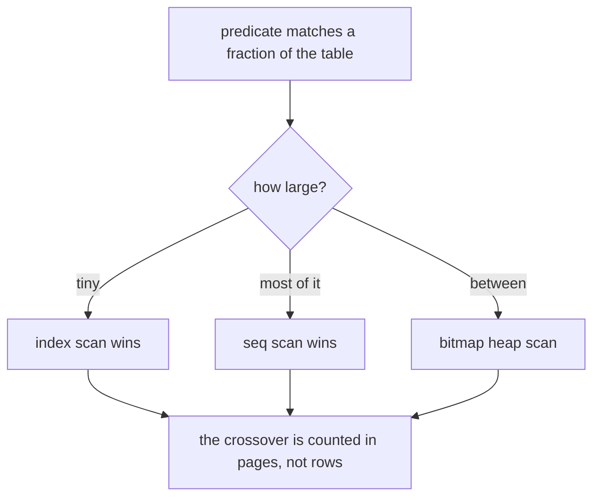

> **Recall layer.** The interview answers are
> [Q3](/docs/data/modelling-indexing#q3) and
> [Q17](/docs/data/query-performance#q17). This page builds the model.

## 1. The problem it exists to solve

You add the index. The query doesn't get faster. `EXPLAIN` shows a sequential
scan, and the index you just built sits there unused.

```sql
CREATE INDEX idx_status ON payments (status);
EXPLAIN ANALYZE SELECT * FROM payments WHERE status = 'SETTLED';
--  Seq Scan on payments  (cost=0.00..184521.00 rows=6012000 width=142)
```

The instinct is that the planner is broken. It isn't. Ninety-five percent of
payments are `SETTLED`, and reading six million rows *through an index* would be
several times slower than reading the table straight through. The planner did
arithmetic you didn't, and won.

Understanding why requires two things: what a B-tree lookup physically costs,
and how the planner estimates how many rows you'll get. Almost every "why isn't
my index used" question resolves to one of them.

## 2. What a B-tree actually is

A balanced tree of fixed-size pages, typically 8 KB. Internal pages hold
separator keys and child pointers; leaf pages hold keys plus a pointer to the
row — a heap tuple ID in PostgreSQL, the primary key value in an InnoDB
secondary index.

The property that matters is **fan-out**. With 8 KB pages and, say, 16-byte
entries, one page holds ~500 children. So:

| Level | Entries reachable |
|---|---|
| 1 (root) | 500 |
| 2 | 250,000 |
| 3 | 125,000,000 |
| 4 | 62,500,000,000 |

A table with 100 million rows has a B-tree three or four levels deep. A lookup
is three or four page reads — and the root and most of the second level are
permanently in the buffer cache, so in practice you pay one or two real reads.

That is the whole magic, and it's why B-trees beat balanced binary trees for
disk: a binary tree over 100M rows is ~27 levels deep, i.e. 27 potential I/Os.
Fan-out trades a wider node for a much shallower tree, and disk cares about the
number of accesses, not the work inside a page.

### Why B-trees and not hash indexes by default

A hash index answers equality in O(1) and nothing else. A B-tree's leaves are
**ordered and linked**, which buys you a great deal from one structure:

- range scans (`>`, `BETWEEN`) — descend once, then walk the leaf chain
- prefix matching (`LIKE 'ACC-2026%'`) — a prefix is a range
- `ORDER BY` satisfied without a sort, because the scan emits in order
- `MIN`/`MAX` as a single descent to the leftmost or rightmost leaf
- composite keys with leftmost-prefix reuse

One structure covering all of that is why it's the default everywhere.

## 3. Why the index is often the wrong choice

Here is the part that most people never internalise. **An index scan is not
free per row.**



To return a row, the engine must:

1. descend the tree — 3–4 page reads, mostly cached
2. read the leaf entry to get the row pointer
3. **fetch the actual row from the heap** — a *random* page read

Step 3 is the problem. Each matching row is potentially a separate random I/O to
an arbitrary page. A sequential scan, by contrast, reads pages in physical order
with readahead, so the OS and the storage layer prefetch aggressively.

The cost model, roughly:

```
index scan      ≈ tree descent + (matching rows × random page cost)
sequential scan ≈ total pages × sequential page cost
```

`random_page_cost` defaults to 4.0 in PostgreSQL and `seq_page_cost` to 1.0 —
a 4:1 ratio inherited from spinning disks. Cross-multiply and the crossover
lands somewhere around **5–20% selectivity**: below it the index wins, above it
the sequential scan wins.

So an index on a three-value `status` column is useless for the common value and
excellent for the rare one. Which is exactly what a **partial index** expresses:

```sql
CREATE INDEX idx_pending ON payments (created_at) WHERE status = 'PENDING';
```

If 0.1% of rows are pending, this index is tiny, stays entirely in cache, costs
almost nothing to maintain, and turns a queue query into a few page reads
([Q8](/docs/data/modelling-indexing#q8)).

### The SSD correction

`random_page_cost = 4.0` is wrong on SSDs, where random reads are perhaps
1.1–1.5× the cost of sequential. Leaving the default systematically biases the
planner *away* from index scans across your entire workload. Lowering it is one
of the highest-leverage single-parameter changes on modern hardware — and one of
the most commonly skipped.

### The three scan shapes

- **Index scan** — descend, then fetch each row. Preserves order. Wins when few
  rows match.
- **Index-only scan** — every needed column is in the index, so step 3 is
  skipped entirely. In PostgreSQL this still consults the visibility map, so an
  un-vacuumed table degrades it back to heap fetches — watch `Heap Fetches: N`
  in `EXPLAIN` ([Q5](/docs/data/modelling-indexing#q5)).
- **Bitmap heap scan** — scan the index, build a bitmap of *pages*, sort it, then
  read those pages in physical order. This converts random I/O into something
  closer to sequential, and it's why the planner sometimes combines two mediocre
  indexes with `BitmapAnd` instead of using one good one. It loses index
  ordering, so it usually implies a separate sort
  ([Q17](/docs/data/query-performance#q17)).

Seeing a `BitmapAnd` plus a `Sort` is a signal: the right composite index would
eliminate both.

## 4. Composite indexes and the leftmost prefix

An index on `(a, b, c)` sorts by `a`, then `b` within equal `a`, then `c`. That
ordering is the entire behaviour:

- it can seek on `a`, `(a,b)`, `(a,b,c)`
- it cannot seek on `b` alone, or `(b,c)` — those aren't prefixes of the sort
- **once you hit a range predicate, columns after it can only filter, not seek**

That last rule decides column order. For:

```sql
WHERE merchant_id = ? AND created_at > ? ORDER BY created_at
```

`(merchant_id, created_at)` is right: equality narrows to one merchant, then the
range walks a contiguous run of leaves already in `created_at` order — so the
`ORDER BY` is free. Reverse them and neither works.

**Equality columns first, range and sort column last.** That single heuristic
resolves most composite index questions ([Q4](/docs/data/modelling-indexing#q4)).

## 5. What the planner is actually doing

The planner doesn't know your data. It estimates from statistics gathered by
`ANALYZE`: per column, a most-common-values list with frequencies, a histogram
of the rest, and `n_distinct`. From those it estimates rows returned, then costs
each plan shape and picks the cheapest.

**Almost every bad plan is a bad estimate**, and errors compound multiplicatively
up the plan tree. The specific causes:

- **Stale statistics** — after a bulk load, or on a very large table where
  autovacuum's proportional threshold rarely triggers.
- **Correlated columns** — the planner assumes independence, so
  `WHERE city = 'Kuala Lumpur' AND country = 'Malaysia'` is estimated as the
  product of two selectivities and comes out ~100× too low. Fix with
  `CREATE STATISTICS ... (dependencies, ndistinct)`.
- **Skew beyond the histogram's resolution** — raise
  `default_statistics_target` for that column.
- **Predicates the planner can't see through** — a function on the column, an
  opaque parameter, a `jsonb` extraction.

The consequence to internalise: a 1000× row underestimate makes the planner
choose a nested loop expecting three iterations and get 300,000. That is the
single most common cause of "the query was fast yesterday".

### The other reasons an index goes unused

Beyond selectivity:

- **A function on the column.** `WHERE lower(email) = ?` cannot use an index on
  `email` — the engine can't invert `lower`. Build a functional index on
  `lower(email)`.
- **A type mismatch** that casts the *column* rather than the literal.
- **Leading wildcard** — `LIKE '%foo'` has no prefix to seek.
- **Mismatched collation** between index and query.
- **The table is small.** Below a few hundred rows a sequential scan is always
  cheaper, and the planner is right.

## 6. Lab: watch the planner change its mind

Everything here runs against a throwaway PostgreSQL:

```bash
docker run --rm -d --name pg -e POSTGRES_PASSWORD=x -p 5432:5432 postgres:18
psql postgresql://postgres:x@localhost/postgres
```

### Lab 1 — build a skewed table

```sql
CREATE TABLE payments AS
SELECT
  g AS id,
  (ARRAY['SETTLED','SETTLED','SETTLED','SETTLED','SETTLED',
         'SETTLED','SETTLED','SETTLED','SETTLED','PENDING'])[1 + (g % 10)] AS status,
  (g % 5000) AS merchant_id,
  now() - (g || ' seconds')::interval AS created_at,
  repeat('x', 100) AS payload
FROM generate_series(1, 2000000) g;

CREATE INDEX idx_status ON payments (status);
ANALYZE payments;
```

Now compare:

```sql
EXPLAIN (ANALYZE, BUFFERS) SELECT count(*) FROM payments WHERE status = 'SETTLED';
EXPLAIN (ANALYZE, BUFFERS) SELECT count(*) FROM payments WHERE status = 'PENDING';
```

Same index, same query shape, two different plans. **This is the whole lesson.**
Read the `Buffers:` line for each and note how many pages the "slow" plan
actually touched.

### Lab 2 — move the crossover

```sql
SET random_page_cost = 4.0;   -- default, spinning-disk assumption
EXPLAIN SELECT * FROM payments WHERE merchant_id = 42;
SET random_page_cost = 1.1;   -- SSD-realistic
EXPLAIN SELECT * FROM payments WHERE merchant_id = 42;
```

Find a predicate where these two settings produce different plans. You've just
seen a single cost constant change the planner's mind — and you now understand
why the default matters on your hardware.

### Lab 3 — break the estimate deliberately

```sql
CREATE TABLE corr AS
SELECT g AS id, (g % 100) AS a, (g % 100) AS b   -- perfectly correlated
FROM generate_series(1, 1000000) g;
ANALYZE corr;

EXPLAIN ANALYZE SELECT * FROM corr WHERE a = 5 AND b = 5;
```

Compare estimated vs actual rows — expect roughly 100× off, because the planner
multiplied two independent 1% selectivities. Then:

```sql
CREATE STATISTICS corr_stats (dependencies) ON a, b FROM corr;
ANALYZE corr;
EXPLAIN ANALYZE SELECT * FROM corr WHERE a = 5 AND b = 5;
```

Watch the estimate correct itself.

### Lab 4 — column order in a composite index

```sql
CREATE INDEX idx_a ON payments (merchant_id, created_at);
CREATE INDEX idx_b ON payments (created_at, merchant_id);

EXPLAIN ANALYZE SELECT * FROM payments
WHERE merchant_id = 42 AND created_at > now() - interval '1 day'
ORDER BY created_at LIMIT 20;
```

Drop one index, run, drop the other, run. Note which plan needs a separate
`Sort` node and which doesn't.

### Lab 5 — index-only scan and the visibility map

```sql
CREATE INDEX idx_cov ON payments (merchant_id) INCLUDE (created_at);
VACUUM payments;
EXPLAIN (ANALYZE, BUFFERS)
  SELECT merchant_id, created_at FROM payments WHERE merchant_id = 42;
-- note "Heap Fetches: 0"

UPDATE payments SET created_at = created_at WHERE merchant_id = 42;
EXPLAIN (ANALYZE, BUFFERS)
  SELECT merchant_id, created_at FROM payments WHERE merchant_id = 42;
-- note "Heap Fetches" is now non-zero
```

That is the visibility map degrading an index-only scan, and it's the bridge to
the MVCC concept page.

## 7. Leading on this

**Make `EXPLAIN (ANALYZE, BUFFERS)` a review artefact.** Any PR adding a query
against a large table should include the plan in the description. It costs the
author two minutes and catches sequential scans before they reach production.
It also teaches — people start reading plans because they have to produce one.

**Own `random_page_cost` as a platform decision.** It's one parameter, it
affects every query, and the default is wrong on the hardware you're running.
Set it deliberately, record it in an ADR, and don't let each service argue about
it separately.

**Audit indexes for removal, not just addition.** `pg_stat_user_indexes` with
`idx_scan = 0` finds indexes nobody uses that everybody's writes pay for. Every
index is write amplification, and on a payments table with ten indexes, inserts
cost several times what they should. Removing an index is as legitimate an
optimisation as adding one, and far rarer.

**Watch for the "add an index" reflex.** It's the second option in the
escalation ladder ([Q58](/docs/data/scaling-operations#q58)), not the first.
Often the query is fetching 200 columns to display three, or it's an N+1, and
the index papers over a design problem while adding permanent write cost.

**Teach selectivity once, with Lab 1.** Two queries, one index, two plans. It's
the fastest way to move someone from "indexes make things fast" to "indexes are
a cost model input", and everything else follows from that shift.

## 8. Where to go deeper

- Markus Winand, *SQL Performance Explained* / use-the-index-luke.com — the best
  treatment of composite index ordering anywhere, and free online.
- PostgreSQL docs: "How the Planner Uses Statistics", and the `pg_statistic`
  catalogue. Short, and more precise than any blog.
- The `EXPLAIN` documentation, read properly once — especially the difference
  between cost units, actual time, and loops.
- Goetz Graefe, "Modern B-Tree Techniques" — the survey, if you want the depth
  behind the structure.
- `pg_stat_statements`, `pgstattuple`, and `pg_buffercache` — the observability
  layer for everything on this page.

## 9. Self-check

<SelfCheck>

<SelfCheckItem n={1} where="§3 Why the index is often the wrong choice.">

Why does an index on a boolean column help for one value and not the other?
Express the answer in terms of page reads, not "selectivity".

</SelfCheckItem>

<SelfCheckItem n={2} where="§3 Why the index is often the wrong choice; §6 Lab 2 — move the crossover.">

Explain the crossover point between index scan and sequential scan. Which two
configuration parameters move it, and which direction?

</SelfCheckItem>

<SelfCheckItem n={3} where="§3 The three scan shapes.">

Why does a bitmap heap scan exist, given index scans and sequential scans
already do?

</SelfCheckItem>

<SelfCheckItem n={4} where="§4 Composite indexes and the leftmost prefix; §6 Lab 4 — column order in a composite index.">

`WHERE a = ? AND b > ? ORDER BY b` — give the correct composite index and
explain what breaks if you reverse the columns.

</SelfCheckItem>

<SelfCheckItem n={5} where="§3 The three scan shapes; §6 Lab 5 — index-only scan and the visibility map.">

An index-only scan reports `Heap Fetches: 48000`. What happened, and what
would you run?

</SelfCheckItem>

<SelfCheckItem n={6} where="§5 What the planner is actually doing; §6 Lab 3 — break the estimate deliberately.">

Estimated rows 12, actual rows 400,000, and a nested loop join. Explain the
causal chain, and name two ways to fix the estimate rather than the plan.

</SelfCheckItem>

<SelfCheckItem n={7} where="§3 The SSD correction.">

Why is `random_page_cost = 4.0` a bad default on SSD, and what is the
system-wide effect of leaving it?

</SelfCheckItem>

</SelfCheck>
