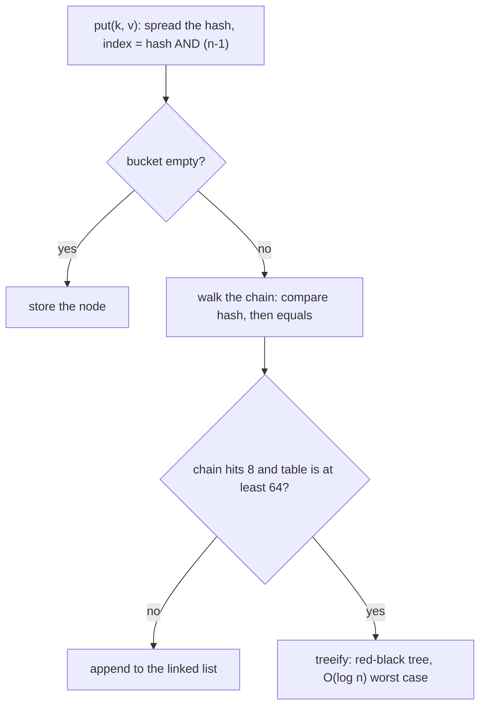

> **Recall layer.** The interview answers are
> [Q22](/docs/java/collections#q22) and [Q32](/docs/java/collections#q32).
> This page builds the model.

## 1. The problem it exists to solve

Three failures, all of which look impossible if your model of `HashMap` is
"O(1) lookup".

**One.** An endpoint accepting a JSON body starts taking 40 seconds under a
few hundred requests per second. No database involved. One CPU pegged. The
payload is a flat object with 5,000 keys, and the attacker chose the key names
deliberately.

**Two.** You put an object into a `HashSet`, then call `contains` on the exact
same object reference and get `false`. The object is in the set — iterate and
you'll see it. It cannot be found, cannot be removed, and will never be
collected.

**Three.** A `HashMap` shared across threads, no exception thrown, and one core
spinning at 100% forever in a service that appears healthy.

Each of these is a direct consequence of how the structure works. None of them
is exotic.

## 2. The structure

An array of buckets — `Node<K,V>[] table` — whose length is always a power of
two. Each `Node` holds the cached hash, the key, the value, and a `next`
pointer.

Two operations decide everything.

### Spreading the hash

```java
static int hash(Object key) {
    int h = key.hashCode();
    return h ^ (h >>> 16);
}
```

### Finding the bucket

```java
index = (table.length - 1) & hash;
```

Because the length is a power of two, `length - 1` is a mask of low bits — so
the index uses **only the bottom bits of the hash** and discards the top ones.
That's a fast `AND` instead of a modulo, which matters on a hot path.

But it means a `hashCode` whose entropy lives in the high bits collapses. That's
exactly what `Integer.hashCode()` does — it returns the value itself, so
`16`, `32`, `48` differ only above the low four bits, and with a 16-slot table
they'd all land in one bucket.

The XOR-shift fixes this: it folds the top 16 bits down onto the bottom 16, so
high-bit entropy participates in the index. One instruction, and it turns a
pathological distribution into a workable one.

**Why a power of two rather than a prime?** A prime modulus mixes better and is
what many textbook implementations use. Java chose masking for speed and
compensates with the spread function. It's a deliberate trade — cheaper per
operation, one extra instruction of mixing.

## 3. Collisions, and the tree

Two keys landing in the same bucket are chained in a linked list. Lookup walks
it comparing `hash` first (cheap int compare, and this is why the hash is
cached in the node) then `equals`.



With a good hash and load factor 0.75, chains are tiny. The Javadoc's Poisson
calculation gives the probability of a bucket having k entries:

| k | Probability |
|---|---|
| 0 | 0.606 |
| 1 | 0.303 |
| 2 | 0.076 |
| 3 | 0.013 |
| 8 | 0.00000006 |

A chain of eight is a 1-in-16-million event *by chance*. So if you see one,
chance isn't what produced it — either the hash function is bad, or someone
chose the keys.

Hence **treeification**: when a bin reaches 8 entries **and** the table is at
least 64 slots, the list converts to a red-black tree, taking worst-case lookup
from O(n) to O(log n). It untreeifies below 6 — the gap between 8 and 6 is
hysteresis, so a bin hovering at the boundary doesn't thrash.

The table-size condition matters: below 64 slots, a long chain usually means the
table is too small, not that the hash is bad, so resizing is the better fix.

### Why this feature exists at all

Failure one in section 1 is a **hash collision denial of service**
(CVE-2011-4858, disclosed at 28C3 in 2011). Every web framework parses request
parameters and JSON bodies into a `HashMap`. If an attacker can compute keys
that collide, every insert walks the whole chain and parsing becomes O(n²). A
few hundred kilobytes of crafted payload could consume minutes of CPU.

Treeification bounds the damage to O(n log n). It's a security feature that
looks like a performance feature.

Note the requirement it imposes: the tree needs an ordering. It uses
`Comparable` if the keys implement it, and otherwise falls back to comparing
class names and `System.identityHashCode` for a stable tie-break. Non-comparable
keys still get a tree, just a weaker one.

## 4. Resizing

When `size > capacity × loadFactor` (default 0.75), the table doubles and every
entry is redistributed.

Java 8 made this clever. Since capacity is a power of two and it doubles, an
entry's new index is either the same or `oldIndex + oldCapacity` — determined by
a single bit:

```java
if ((node.hash & oldCap) == 0)  // stays at index i
else                            // moves to i + oldCap
```

So the resize splits each bin into a "lo" list and a "hi" list with one bitwise
test per node, no rehashing, and relative order preserved. Java 7 recomputed
indices and reversed the list, which is what made the concurrent case explosive.

### Why 0.75

It's the space/time knob. Lower means fewer collisions and more wasted array
slots; higher means a denser table and longer chains. 0.75 is where the Poisson
distribution above gives negligible chain lengths at acceptable memory. It also
happens to make `capacity × 0.75` computable without floating point.

### Sizing matters more than people think

Inserting 1,000 entries into a default map resizes at 12, 24, 48, 96, 192, 384,
768 — seven reallocations and seven full redistributions, plus the garbage. So:

```java
new HashMap<>(1000 / 0.75f + 1)      // or, Java 19+:
HashMap.newHashMap(1000)
```

The constructor argument is *capacity*, not expected size — passing
`new HashMap<>(1000)` still resizes at 750. `newHashMap` does the arithmetic for
you and is the one to use.

## 5. What the contract actually buys

`equals` and `hashCode` are not ceremony; they are the two inputs this structure
runs on ([Q1](/docs/java/core-language#q1)).

`hashCode` chooses the bucket. `equals` picks the entry within it. So:

- **Unequal hash codes for equal objects** → the lookup goes to the wrong bucket
  and never reaches your `equals`. The entry is invisible.
- **Mutating a hashed field after insertion** → the object is stranded in the
  bucket computed from its *old* hash. `contains` returns false, `remove` fails,
  iteration still yields it, and the map holds it forever. That's failure two
  from section 1 ([Q32](/docs/java/collections#q32)).

The fix is not "be careful". It's to make keys immutable — records are ideal —
or to derive the hash only from stable fields.

This is also the JPA entity problem in miniature: an entity added to a
`HashSet` before `persist()` has a null ID; after flush the ID is populated, the
hash changes, and the set is corrupted.

## 6. What it costs in memory

A `HashMap.Node` on a 64-bit JVM with compressed oops: 12-byte header + int hash
+ three references at 4 bytes = 28, padded to 32 bytes. Plus a 4-byte table
slot, plus the key and value objects themselves.

So `Map<Integer, Integer>` with a million entries:

```
32 (node) + 4 (slot) + 16 (Integer key) + 16 (Integer value) ≈ 68 bytes
× 1,000,000 ≈ 68 MB
```

...to store 8 MB of actual data. An 8× overhead
([Q31](/docs/java/collections#q31)).

That's the whole justification for primitive-specialised collections (fastutil,
Eclipse Collections, HPPC) and for using arrays when the key space is dense. It
also explains why very large maps push people off-heap.

## 7. What this does *not* cover

- **Thread safety.** None of the above is safe under concurrency. Java 7's
  resize could produce a cycle in a bucket, making `get()` spin forever — failure
  three from section 1. Java 8's split-list resize removed the cycle, but lost
  updates and missing entries remain ([Q23](/docs/java/collections#q23)).
  `ConcurrentHashMap` uses a completely different write path: CAS to install the
  first node in an empty bin, `synchronized` on the bin head for the rest, and
  volatile reads so lookups are lock-free.
- **Ordering.** Iteration order is unspecified and changes on resize. Depending
  on it is a bug that surfaces when your data grows.
- **`LinkedHashMap`, `TreeMap`, `EnumMap`** — different structures for different
  access patterns, covered in the reference bank.
- **Value-based keys in a distributed cache** — a `hashCode` that varies across
  JVMs (like `Object`'s identity hash, or `String`'s before it was standardised)
  makes consistent hashing across nodes impossible.

## 8. Lab: break it deliberately

### Lab 1 — the collision attack

```java
public class Collide {
    record Key(String s) {
        @Override public int hashCode() { return 1; }   // maximally hostile
    }
    public static void main(String[] a) {
        for (int n : new int[]{1000, 2000, 4000, 8000, 16000}) {
            Map<Key,Integer> m = new HashMap<>();
            long t = System.nanoTime();
            for (int i = 0; i < n; i++) m.put(new Key("k" + i), i);
            System.out.printf("n=%6d  %6.1f ms%n", n, (System.nanoTime()-t)/1e6);
        }
    }
}
```

Doubling n should double the time. Watch it quadruple instead — that's O(n²).
Then make `Key` implement `Comparable<Key>` and re-run. The tree kicks in and
the curve flattens dramatically. **You have just measured the difference the
2012 security fix made.**

### Lab 2 — strand an object in a set

```java
public class Stranded {
    static class Box { int v; Box(int v){this.v=v;}
        public int hashCode(){ return v; }
        public boolean equals(Object o){ return o instanceof Box b && b.v == v; } }

    public static void main(String[] a) {
        Set<Box> set = new HashSet<>();
        Box b = new Box(1);
        set.add(b);
        System.out.println(set.contains(b));   // true
        b.v = 999;                             // mutate a hashed field
        System.out.println(set.contains(b));   // false — same reference!
        System.out.println(set.size());        // 1
        set.remove(b);
        System.out.println(set.size());        // still 1. It is unremovable.
    }
}
```

Three lines, and it demonstrates a leak you cannot debug by reading the calling
code. **Run this one — it's thirty seconds and it permanently changes how you
think about map keys.**

### Lab 3 — count the resizes

```java
Map<Integer,Integer> m = new HashMap<>();
for (int i = 0; i < 1_000_000; i++) m.put(i, i);
```

Benchmark against `HashMap.newHashMap(1_000_000)`. Then use JMH with `-prof gc`
and compare `gc.alloc.rate.norm` — the difference is every discarded table
array. This connects directly to the
[generational GC page](/docs/concepts/generational-gc): those arrays are
allocated, survive briefly, and are exactly the kind of medium-lived garbage
that gets promoted.

### Lab 4 — see the real memory cost

```bash
# add org.openjdk.jol:jol-core
```
```java
System.out.println(GraphLayout.parseInstance(map).toFootprint());
```

Fill a `HashMap<Integer,Integer>` with 100,000 entries and print the footprint.
Compare with two `int[100000]` arrays. The ratio is the number from section 6,
measured on your own JVM.

### Lab 5 — high-bit entropy

Write a key class whose `hashCode` returns `i << 16` and insert 10,000 of them.
Then remove the spread by using an `IdentityHashMap`, or simply reason about
what `(n-1) & hash` gives you. Confirm the XOR-shift is what saves you.

## 9. Leading on this

**Make immutable keys a review rule, not advice.** Any object used as a map key
or set element should be a record or an immutable class. It's a one-line rule
that eliminates an entire class of undebuggable defect, and records made it
cheap enough that there's no excuse.

**Watch for `hashCode` on entities.** The JPA case
([Q116](/docs/java/persistence#q116)) is where this bites in real codebases. Business key, or
client-generated UUID, or a constant hash — never the surrogate ID alone.

**Pre-size collections in hot paths, and only there.** `HashMap.newHashMap(n)`
when you know n is free to write and eliminates several array copies. Doing it
everywhere is noise; doing it in a request-path loop is real.

**Understand it well enough to stop the micro-optimisation debates.** Someone
will propose replacing `HashMap` with a hand-rolled open-addressing map. The
question to ask is what the profile says — usually the answer is that boxing and
the 8× memory overhead matter, and the fix is a primitive collection, not a
different collision strategy.

**Use Lab 2 as a teaching tool.** It's the fastest way to convey why the
`equals`/`hashCode` contract is a real contract with real consequences, rather
than an IDE-generated formality. Most engineers have generated those methods a
hundred times without knowing what consumes them.

## 10. Where to go deeper

- The `HashMap` source itself. It's unusually well commented — the implementation
  notes at the top explain treeification, the split resize, and the Poisson
  reasoning in the authors' own words. Read it once.
- Josh Bloch, *Effective Java*, items 10–11 on the `equals`/`hashCode` contract.
- The 28C3 talk "Efficient Denial of Service Attacks on Web Application
  Platforms" (Klink & Wälde) — the disclosure that prompted the tree change
  across every major language runtime.
- JOL, for measuring footprint rather than estimating it.
- `ConcurrentHashMap`'s source and Doug Lea's notes, once this page is
  comfortable — the contrast in write path is instructive.

## 11. Self-check

<SelfCheck>

<SelfCheckItem n={1} where="§2 Finding the bucket.">

Why does `HashMap` use `(n-1) & hash` rather than `hash % n`, and what
problem does that create?

</SelfCheckItem>

<SelfCheckItem n={2} where="§2 Finding the bucket; §8 Lab 5 — high-bit entropy.">

Explain what `h ^ (h >>> 16)` fixes. Give a concrete key type where omitting
it would be catastrophic.

</SelfCheckItem>

<SelfCheckItem n={3} where="§3 Collisions, and the tree.">

A bucket reaches 8 entries. Why is that essentially impossible by chance, and
what does the JDK do about it?

</SelfCheckItem>

<SelfCheckItem n={4} where="§3 Collisions, and the tree.">

Why does treeification require the table to be at least 64 slots?

</SelfCheckItem>

<SelfCheckItem n={5} where="§5 What the contract actually buys; §8 Lab 2 — strand an object in a set.">

You add an object to a `HashSet`, mutate one field, and `contains` returns
false for the same reference. Explain precisely where the object is.

</SelfCheckItem>

<SelfCheckItem n={6} where="§4 Resizing.">

Describe the Java 8 resize split. Why does it need no rehashing, and what did
it fix from Java 7?

</SelfCheckItem>

<SelfCheckItem n={7} where="§4 Sizing matters more than people think.">

`new HashMap<>(1000)` — how many entries can you insert before it resizes?

</SelfCheckItem>

<SelfCheckItem n={8} where="§6 What it costs in memory.">

Estimate the memory for `Map<Integer,Integer>` with 5 million entries, and
say what you'd use instead if that number is unacceptable.

</SelfCheckItem>

</SelfCheck>
