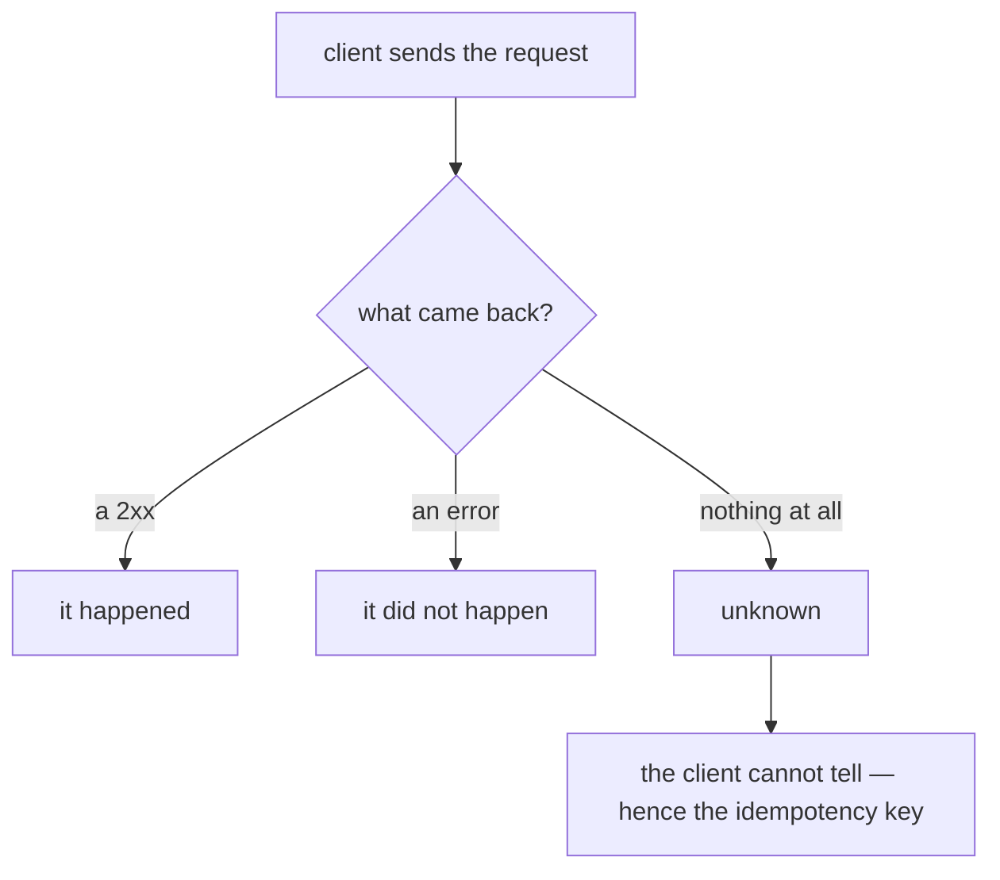

> **Recall layer.** The interview answers are
> [Q121](/docs/java/distributed-systems#q121) and
> [Q137](/docs/data/cross-cutting#q137). This page builds the model.

## 1. The problem it exists to solve

A customer is charged twice for one order. The logs show one request from the
mobile app, one `SocketTimeoutException` after 30 seconds, one automatic retry,
and two successful authorisations at the acquirer.

The code is not buggy in any way you can point at. The client did the right
thing: the call timed out, so it retried. The server did the right thing: it
processed both requests it received. The network did the right thing: it
delivered both.

The bug is an *assumption* — that a call has two outcomes.

```
success   → it happened
failure   → it didn't happen
```

There is a third:

```
unknown   → it may or may not have happened, and you cannot find out
```

A timeout is not a failure. It is the absence of information. The request may
have never arrived; it may have arrived and been processed and the response
lost; it may still be executing right now. From the caller's side these are
indistinguishable, and no amount of logging on your own side resolves it.

**Idempotency is the discipline of making the unknown outcome safe to retry.**
It is not an optimisation or a nicety. It is the only thing standing between a
timeout and a duplicate charge.

## 2. Why you cannot engineer the unknown away

The instinct is to make the window smaller — shorter timeouts, better health
checks, a confirmation call. None of it closes the gap, and it's worth knowing
why rather than just accepting it.



**The Two Generals Problem.** Two parties communicating over a lossy channel
cannot reach certain agreement on a shared fact, no matter how many messages
they exchange. Each message needs an acknowledgement; the acknowledgement needs
an acknowledgement. There is no finite protocol that terminates with both sides
certain.

This is a proof, not an engineering limitation. It's why "exactly-once delivery"
is not a thing that exists, and why every system claiming it is really doing
at-least-once delivery plus deduplication somewhere
([Q122](/docs/java/distributed-systems#q122)).

**So the possible guarantees are:**

| Guarantee | Mechanism | Failure mode |
|---|---|---|
| At-most-once | Never retry | Lost operations |
| At-least-once | Retry on unknown | Duplicate operations |
| Effectively-once | At-least-once + idempotent receiver | — |

You must pick. For a payment, losing an operation and duplicating one are both
unacceptable, which forces the third row. And the third row's work happens at
the **receiver**, not in the protocol.

The formulation worth memorising:

> **The transport guarantees delivery. The receiver guarantees effect.**

## 3. Four ways to be idempotent

They're not equivalent, and choosing wrongly is where implementations fail.

### (a) Naturally idempotent operations

Some operations are safe by construction. Setting a value is; incrementing is
not.

```sql
UPDATE payments SET status = 'SETTLED' WHERE id = ? AND status = 'PENDING';
```

Run it twice and the second affects zero rows. Note this is doing double duty —
it's also a state-machine guard, rejecting a transition from the wrong prior
state, which protects against out-of-order delivery as well as duplicates.

Prefer this when you can. It needs no extra table, no expiry policy, no
bookkeeping. The trap is the version that *looks* idempotent:

```sql
-- NOT idempotent
UPDATE accounts SET balance = balance - 100 WHERE id = ?;
```

### (b) Conditional writes with a version

```sql
UPDATE accounts SET balance = ?, version = version + 1
WHERE id = ? AND version = ?;
```

Zero rows affected means someone else won. Combined with a bounded retry this
gives optimistic concurrency and idempotency from one mechanism.

### (c) Deduplication on a business key

The receiver records what it has processed and skips repeats. The critical
detail — and the one most implementations get wrong — is that **the dedup record
and the effect must be in the same transaction**:

```sql
BEGIN;
INSERT INTO processed_events (event_id, consumer) VALUES (?, ?);  -- UNIQUE
-- unique violation here => already done => rollback and acknowledge

INSERT INTO ledger_entries (...) VALUES (...);
UPDATE balances SET amount = amount + ? WHERE account_id = ?;
COMMIT;
```

If the marker is written outside the transaction — in Redis, say, or before the
work — there is a window where you've recorded "done" and then failed to do it.
The event is now permanently lost, which is worse than the duplicate you were
preventing.

### (d) Idempotency keys (the API-boundary version)

The caller generates a key per logical operation and reuses it across retries.
The server stores it, along with a fingerprint of the request and the eventual
response ([Q121](/docs/java/distributed-systems#q121)).

The essential property: **the uniqueness constraint does the concurrency
control.** Two simultaneous retries both attempt the insert; the database picks
a winner. An application-level "check then insert" has a race between the check
and the insert, and under retry storms that race fires constantly.

## 4. Designing an idempotency key properly

Four decisions, each of which is a real bug if you get it wrong.

**Who generates it.** The *caller*, before the first attempt, and reused
identically on every retry. A server-generated key is useless — a retry gets a
new one. A key derived from request content is fragile: two genuinely separate
identical payments (a customer buying the same coffee twice) would collide.

**What it scopes.** One key per logical business operation. Not per HTTP
request, not per session. "Charge order #4471" is one operation regardless of
how many times it's attempted.

**Fingerprint mismatch.** Store a hash of the request alongside the key. Same
key + same fingerprint + completed → return the stored response. Same key +
*different* fingerprint → the client reused a key for a different request, which
is a client bug. Return 422 loudly rather than silently returning the old
response; silent handling hides a defect that will cause a wrong charge.

**Expiry.** Long enough to exceed any client's retry horizon, including a client
that retries after a weekend outage. 24 hours to 7 days is typical. Too short
and a late retry executes again; too long and the table grows unboundedly — so
partition or time-expire it.

### The in-progress state

The case people forget. A retry arrives while the first attempt is still
running. You have three options:

- Return **409 Conflict** and let the client retry later. Simplest and safest.
- Block until the first completes, then return its result. Nicer for the client,
  and it holds a connection.
- Return **202 Accepted** with a status URL. Best for genuinely long operations.

What you must not do is treat "in progress" as "not present" and start a second
execution.

## 5. Propagating it, and the limits

**Downstream.** An idempotency key protects your endpoint. It does nothing for
the acquirer call you make while handling it. Derive a deterministic downstream
key from your own — same input, same key — and pass it. Every serious payment
provider accepts one; use it
([Q85](/docs/design/microservices-communication#q85)).

**Across a saga.** Each step is independently idempotent with its own key, and
compensations need keys too — a retried refund is as bad as a retried charge.

**In message consumers.** At-least-once delivery means the broker will
redeliver. Dedup on a stable business identifier from the payload, not on a
delivery tag or a `redelivered` flag — those change on redelivery and are
explicitly documented as unreliable hints.

### What idempotency does not give you

- **It doesn't make the operation safe to run twice concurrently.** That's
  concurrency control (locks, versions, constraints). Idempotency answers "what
  if this arrives again", not "what if these arrive together" — though a unique
  constraint happens to solve both.
- **It doesn't resolve the unknown outcome, only make it survivable.** You still
  don't know whether the first attempt succeeded. If you need to *know* — and in
  finance you do — you need **reconciliation**: ask the provider later what
  actually happened, and compare against your own record. Retries and
  idempotency handle failures you can see; reconciliation handles the ones you
  can't. This is the part teams skip, and it's the part auditors ask about.
- **It doesn't survive a badly chosen key.** If the key doesn't scope the
  operation correctly, you have machinery and no protection.

## 6. Lab: create the duplicate, then prevent it

```bash
docker run --rm -d --name pg -e POSTGRES_PASSWORD=x -p 5432:5432 postgres:18
```

### Lab 1 — reproduce the race

```sql
CREATE TABLE charges (id serial primary key, order_id text, amount int);

CREATE OR REPLACE FUNCTION charge_unsafe(p_order text, p_amt int) RETURNS text AS $$
BEGIN
  IF EXISTS (SELECT 1 FROM charges WHERE order_id = p_order) THEN
    RETURN 'duplicate';
  END IF;
  PERFORM pg_sleep(0.05);                       -- the window
  INSERT INTO charges (order_id, amount) VALUES (p_order, p_amt);
  RETURN 'charged';
END $$ LANGUAGE plpgsql;
```

Now fire concurrent retries:

```bash
for i in 1 2 3 4 5; do
  psql postgresql://postgres:x@localhost/postgres \
    -c "SELECT charge_unsafe('ORDER-1', 5000);" &
done; wait
psql postgresql://postgres:x@localhost/postgres -c "SELECT count(*) FROM charges;"
```

More than one row. That `pg_sleep` is standing in for any real work — a
provider call, a ledger write — and the window exists whether or not you can see
it. **This is check-then-act, and it is the single most common way idempotency
implementations fail.**

### Lab 2 — let the constraint arbitrate

```sql
TRUNCATE charges;
CREATE UNIQUE INDEX uq_order ON charges (order_id);

CREATE OR REPLACE FUNCTION charge_safe(p_order text, p_amt int) RETURNS text AS $$
BEGIN
  INSERT INTO charges (order_id, amount) VALUES (p_order, p_amt);
  RETURN 'charged';
EXCEPTION WHEN unique_violation THEN
  RETURN 'duplicate';
END $$ LANGUAGE plpgsql;
```

Run the same five concurrent calls. Exactly one row, every time, at any
concurrency. No sleep, no lock, no coordination — the index did it.

### Lab 3 — the transactional dedup marker

Build the two-statement version from section 3(c), then deliberately break it:
put the marker insert in its own committed transaction *before* the work, and
kill the process between them. Confirm the event is now permanently lost.
Restore the single transaction and repeat.

That's a five-minute experiment that permanently fixes where the marker belongs.

### Lab 4 — simulate the unknown outcome

Point a client at a service that processes the request, then sleeps past the
client's timeout before responding. The client times out and retries. Observe:

- without a key, two effects
- with a key, one effect and the stored response returned to the retry
- with the retry arriving *during* the first execution, the in-progress path

The third case is the one to test properly, because it's the one most
implementations haven't considered.

### Lab 5 — fingerprint mismatch

Send the same key with a different amount. Confirm you get a loud 422 and not a
silent replay of the old response. Then imagine that not happening in
production, and what the customer sees.

## 7. Leading on this

**Make it a platform capability, not a per-endpoint decision.** An idempotency
filter or interceptor with a shared table and a documented policy means every
new endpoint is protected by default. Leaving each team to implement it produces
five subtly different versions, at least one of which does check-then-act.

**Add it to the review checklist for any state-changing endpoint.** Three
questions: does this have an idempotency key, is the dedup marker in the same
transaction as the effect, and is the key propagated downstream? That's a
30-second check that prevents the most expensive class of bug in a payments
system.

**Insist on reconciliation as a first-class component.** Retries and idempotency
are necessary and not sufficient. A daily job comparing your ledger against the
provider's settlement file, with unmatched count and age as monitored metrics,
is what actually catches the cases the code didn't. Growing unreconciled backlog
is the earliest signal that something is broken — often earlier than any
technical alert.

**Teach the three outcomes explicitly.** Most engineers hold a two-outcome model
of network calls, and every idempotency bug traces back to it. One whiteboard
session — success, failure, unknown, and why the third can't be eliminated —
changes how people write clients permanently. It's the highest-leverage 20
minutes available in this domain.

**Be sceptical of "exactly-once" in any vendor's documentation.** Ask what the
scope is. Kafka's EOS is real but bounded to read-process-write within Kafka
([Q109](/docs/data/kafka#q109)); it does not extend to your database or an HTTP
call. A team that believes the marketing will skip the receiver-side work.

## 8. Where to go deeper

- Stripe's idempotency documentation and their engineering post on the design.
  It's the reference implementation the industry converged on, and it's short.
- Gray & Reuter, *Transaction Processing*, on the fundamentals of retry
  semantics and recovery.
- The Two Generals Problem and the FLP impossibility result — read them once so
  you know which limits are engineering and which are proofs.
- Kleppmann, *Designing Data-Intensive Applications*, chapters 8 and 9 — the
  clearest treatment of what "exactly once" can and cannot mean.
- Pat Helland, "Life beyond Distributed Transactions" — why idempotency and
  reconciliation replace 2PC at scale.
- Your payment provider's idempotency documentation, specifically their key
  expiry window and their behaviour on fingerprint mismatch.

## 9. Self-check

<SelfCheck>

<SelfCheckItem n={1} where="§1 The problem it exists to solve; §2 Why you cannot engineer the unknown away.">

State the three outcomes of a network call and explain why the third cannot
be engineered away.

</SelfCheckItem>

<SelfCheckItem n={2} where="§3 (d) Idempotency keys (the API-boundary version); §6 Lab 1 — reproduce the race.">

Why is a unique constraint the right mechanism for idempotency, and what
exactly goes wrong with `if (!exists) insert`?

</SelfCheckItem>

<SelfCheckItem n={3} where="§3 (c) Deduplication on a business key; §6 Lab 3 — the transactional dedup marker.">

Why must the dedup marker and the side effect share a transaction? Describe
the specific failure if they don't.

</SelfCheckItem>

<SelfCheckItem n={4} where="§4 Designing an idempotency key properly.">

Who generates the idempotency key and when? Give two wrong answers and why
each fails.

</SelfCheckItem>

<SelfCheckItem n={5} where="§4 Fingerprint mismatch; §6 Lab 5 — fingerprint mismatch.">

Same key, different request body. What should the API return, and what is the
harm in silently returning the stored response?

</SelfCheckItem>

<SelfCheckItem n={6} where="§4 The in-progress state.">

A retry arrives while the first attempt is still executing. Give three valid
responses and one invalid one.

</SelfCheckItem>

<SelfCheckItem n={7} where="§5 What idempotency does not give you.">

Distinguish "idempotent" from "safe to execute concurrently". Give an
operation that is one but not the other.

</SelfCheckItem>

<SelfCheckItem n={8} where="§5 What idempotency does not give you; §7 Leading on this.">

Your idempotency implementation is correct and the acquirer still shows a
charge you have no record of. What process is supposed to catch this, and
what would you monitor?

</SelfCheckItem>

</SelfCheck>
