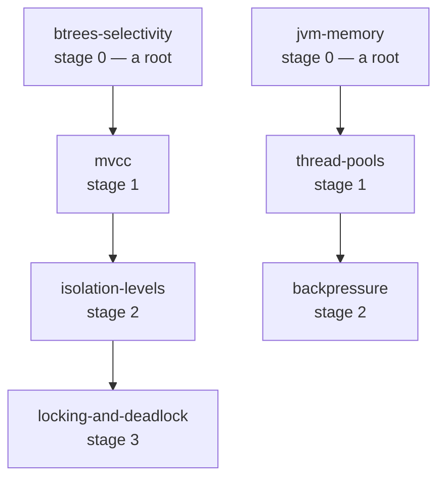

The sidebar lists the concept pages by subject. This page lists them by
**dependency**: every page declares what must be understood before it
(`prerequisites`) and what it opens up (`unlocks`), and the graph below is built
from those two fields at build time. Nothing here is hand-maintained, so it
cannot drift from the pages it describes.

If you are here because something is broken rather than because you are
studying, try [By symptom](/docs/concepts/symptoms) instead — it lists the same
pages by the failure you are looking at, which is the one thing neither the
sidebar nor this page can tell you.

**Stages are a floor, not a queue.** A page sits one stage past its deepest
prerequisite, so stage 2 means *this page has a two-page run-up*, not *read all
of stage 1 first*. Pick a page you want, read its "Read first" chain, and stop.
Each concept page carries that chain at its foot.

Both chains below are real, and they share nothing. `locking-and-deadlock` sits
at stage 3 and costs three pages; `backpressure` sits at stage 2 and costs two —
and neither reader touches a single page on the other's path, though both pass
through stage 1. The stage number measures the depth of *one* run-up, never the
width of a stage.

**The other number on a card is reach** — how many pages have this one
somewhere behind them. It is the measurable version of *how load-bearing is
this*: `btrees-selectivity` is behind eleven pages and `mvcc` behind nine, while
eighteen pages are behind nothing at all, which is not a defect. A page's own
`tier:` is deliberately not shown. It records which pages were drafted first,
and it disagrees with the graph in seven places — `generics-erasure` and
`idempotency` are foundational with nothing behind them, and core
`isolation-levels` outranks foundational `jmm`.

**Ten pages have no prerequisites at all.** Some concepts are genuine roots —
type erasure, B-trees and selectivity, the memory model — so there is no single
entry point and none is needed. Start wherever the problem you are actually
hitting lives.

**Both fields name written pages only**, so every edge below is a link you can
follow. An entry in either field that resolves to nothing is drift — a renamed
page, or a promise typed in out of habit — and the graph flags it loudly rather
than dropping it. There are none today.

One consequence worth knowing: **twenty of the thirty-four pages now declare
`unlocks: []`**, because everything they pointed at is unwritten. That does not
mean they are terminal. "Read next" on each page is the union of its `unlocks`
and every page declaring it as a prerequisite, so a page with an empty `unlocks`
still shows you where to go if anything builds on it.

<StudyPath />
