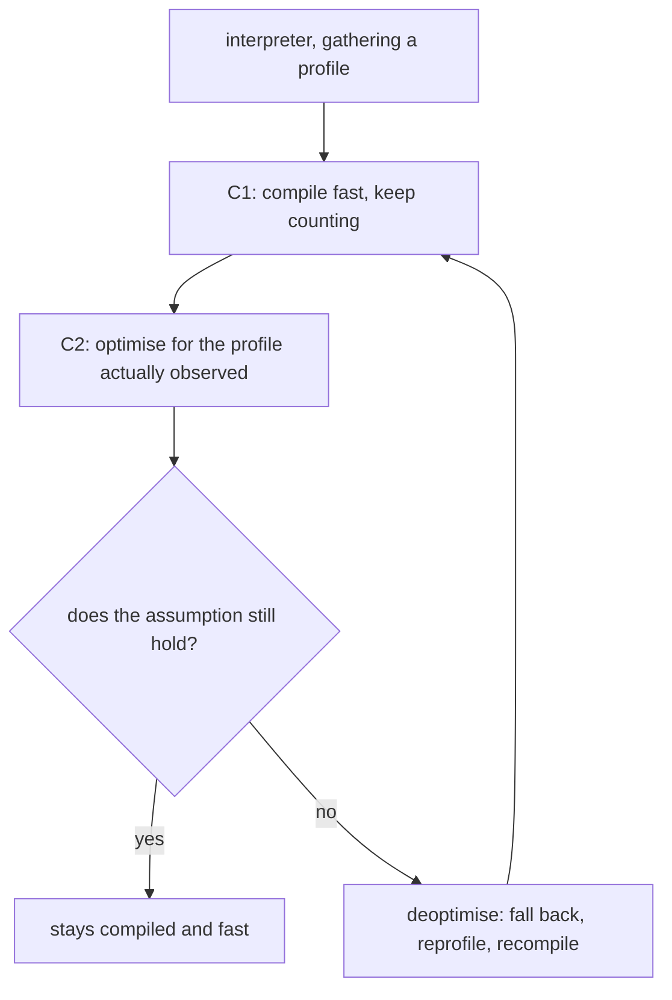

> **Recall layer.** The interview answers are
> [Q79](/docs/java/jvm-memory-gc#q79) and
> [Q80](/docs/java/jvm-memory-gc#q80). This page builds the model.

## 1. The problem it exists to solve

You benchmark two implementations. A is three times faster. You ship A. Nothing
improves.

You add a second implementation of an interface that had one. Nothing else
changes. A latency-sensitive path gets 30% slower.

You deploy. The first two hundred requests time out. Then it's fine. Every time,
every deploy, and the "fix" everyone suggests is a longer readiness delay.

These are all the JIT. Not the garbage collector, not the database. The compiler
is making decisions based on what your program has done *so far*, and those three
scenarios are what happens when the assumptions behind those decisions change —
or when your benchmark accidentally measured the compiler rather than the code.

Java is not a compiled language in the way C is, and it isn't interpreted either.
Understanding which it is at any given moment is the difference between
performance work that helps and performance work that doesn't.

## 2. Bytecode is not the program that runs

`javac` does almost no optimisation. It translates source to bytecode more or
less literally — that's why reading bytecode tells you very little about
performance. The real compiler runs at runtime.

Execution starts in the **interpreter**, which is slow but starts instantly. The
JVM counts method invocations and loop back-edges. When a counter crosses a
threshold, the method is queued for compilation.

**Tiered compilation** gives five levels:

| Level | What runs | Purpose |
|---|---|---|
| 0 | Interpreter | Start immediately, gather crude profile |
| 1 | C1, no profiling | Trivial methods — compile and forget |
| 2, 3 | C1, with profiling | Fast compile, collect rich profile |
| 4 | C2 | Slow compile, aggressive optimisation |

So a hot method typically runs interpreted, then C1-with-profiling, then C2. The
profile collected at level 3 is what C2 uses to make its decisions.

**On-stack replacement (OSR)** handles the case where a method is entered once
and loops a million times — the invocation counter never trips, so the JVM
compiles the loop body and swaps the executing frame mid-flight. This is also
why a benchmark that runs everything in `main`'s loop measures something
different from a benchmark that calls a method repeatedly.

## 3. Inlining is the optimisation that matters

Everything else depends on it.

Inlining copies the callee's body into the caller. That removes call overhead,
which is minor. What matters is what it *unlocks*: once the bodies are merged,
C2 can see across the boundary and apply constant folding, dead code
elimination, loop optimisations, null-check elimination, and escape analysis to
the combined code.

An un-inlined call is an optimisation barrier. C2 must assume the callee does
anything.

The limits are size-based and worth knowing because they explain a lot of
folklore:

- `MaxInlineSize` (35 bytes of bytecode) — inlined even if not hot
- `FreqInlineSize` (325 bytes) — inlined if hot
- `MaxInlineLevel` (default 15) — depth of the inlining chain

This is the actual, mechanical reason "small methods are fast". A 400-byte
method will not be inlined into its caller no matter how hot it is, and
everything downstream of that call site loses optimisation. Splitting a large
hot method into small ones is a real technique, not a style preference.

### The call-site problem

For a virtual or interface call, C2 must know which implementation to inline. It
uses the profile:

| Call site | Observed receiver types | What C2 does |
|---|---|---|
| Monomorphic | 1 | Inline with a type guard. Fast. |
| Bimorphic | 2 | Inline both with a branch. Still good. |
| Megamorphic | 3+ | Give up. Virtual dispatch through a vtable. |

That's the second scenario in section 1. A call site that had seen one
implementation was inlined and optimised; adding a second (or third) collapsed
it to a real dispatch, and every optimisation that depended on the inline was
lost.

It also explains a subtle production hazard: **profile pollution**. A shared
utility method called from many places with many types becomes megamorphic
globally, so even the call site that only ever sees one type pays. Generic
"framework" layers are prone to this.

C2 also uses **class hierarchy analysis** — if only one class currently
implements an interface, it can inline that implementation and record a
dependency. Load a second implementation later and the compiled code is thrown
away.

## 4. Speculation and deoptimisation

C2 optimises for what has happened, not for what could happen. Concretely, it
will:



- assume a branch never taken is never taken, and not compile it
- assume a value observed non-null is always non-null, and drop the check
- assume a call site is monomorphic, and inline
- assume an exception path is cold, and omit it

Each assumption is protected by a cheap guard — an **uncommon trap**. When a
guard fails, the JVM **deoptimises**: it discards the compiled code, reconstructs
interpreter frames from the compiled frame's state, and resumes in the
interpreter. Correct, and startlingly clever, and not free.

Normally this happens a handful of times and the method is recompiled with the
new information. The pathology is a **deopt loop**: recompile, hit the trap,
deoptimise, reprofile, recompile — forever. Throughput collapses and CPU is
consumed by the compiler threads. Causes include a rare-but-recurring exception
path, a code path that only fires for one customer, and a type that appears
occasionally.

This is why a service can be fast for hours and then permanently slow after one
unusual request pattern appears — the compiler's model of your program changed.

## 5. Why your benchmark lied

Section 1's first scenario. Naïve JVM benchmarks are wrong more often than they
are right, and the reasons are all consequences of the above.

- **No warmup.** You measured the interpreter and C1, not C2. This is the most
  common error by a distance.
- **Dead code elimination.** If you don't consume the result, C2 proves the
  computation is unobservable and deletes it. You benchmarked an empty loop.
- **Constant folding.** A constant input is folded at compile time, so you
  measured a return statement.
- **OSR vs standard compilation** producing different code for loop-in-`main`
  benchmarks.
- **Profile pollution across variants.** Benchmarking implementations A and B in
  one JVM makes the call site bimorphic, so both are slower than either would be
  alone — and the *first* one measured often looks faster purely from ordering.
- **The single-shot fallacy.** Running once measures compilation, not execution.

The answer is **JMH**, which is not "a benchmarking library" so much as a
harness that defeats each of these specifically: forked JVMs per variant,
measured warmup iterations, `Blackhole` to consume results, `@State` objects the
compiler can't constant-fold, and `-prof gc` for allocation. Anything measured
with `System.nanoTime()` around a loop should be treated as unmeasured.

## 6. What this does *not* explain

- **Startup and the cold path.** Tiered compilation improves warmup, but it
  can't remove it. AppCDS, `-XX:TieredStopAtLevel=1` for short-lived processes,
  Leyden's ahead-of-time work, and GraalVM native images all address this
  differently.
- **GC pauses.** Separate mechanism entirely, though both are attributed to
  "JVM slowness".
- **Safepoints.** A method must reach a safepoint poll to be deoptimised or for
  GC to proceed; a long counted loop with no poll delays everyone
  ([Q78](/docs/java/jvm-memory-gc#q78)).
- **Memory-bound work.** If the bottleneck is cache misses — pointer-chasing
  through a `LinkedList`, say — inlining doesn't help. Data layout does.

## 7. Lab: watch the compiler work

### Lab 1 — see the warmup curve

```java
public class Warmup {
    static int work(int[] a) { int s = 0; for (int v : a) s += v * 31; return s; }
    public static void main(String[] x) {
        int[] a = new int[10_000];
        for (int i = 0; i < a.length; i++) a[i] = i;
        for (int round = 0; round < 30; round++) {
            long t = System.nanoTime();
            int s = 0;
            for (int i = 0; i < 1000; i++) s += work(a);
            System.out.printf("%2d  %7.2f ms  (%d)%n", round, (System.nanoTime()-t)/1e6, s);
        }
    }
}
```

Run it. The first few rounds are several times slower, then it drops off a
cliff. **That cliff is C2 finishing.** Now:

```bash
java -XX:+UnlockDiagnosticVMOptions -XX:+PrintCompilation Warmup | head -40
```

Watch `work` appear at level 3, then level 4. Match the level-4 line against the
round where the time dropped.

### Lab 2 — turn the compiler off

```bash
java -Xint Warmup          # interpreter only
java -XX:TieredStopAtLevel=1 Warmup   # C1 only
java Warmup                # full
```

Three numbers, roughly an order of magnitude apart. You've now measured what the
JIT is worth, and you know what `-Xint` does to a concurrency bug's visibility
(see the [JMM page](/docs/concepts/jmm)).

### Lab 3 — make a call site megamorphic

```java
interface Op { int apply(int x); }
static final class A implements Op { public int apply(int x){ return x+1; } }
static final class B implements Op { public int apply(int x){ return x+2; } }
static final class C implements Op { public int apply(int x){ return x+3; } }
static final class D implements Op { public int apply(int x){ return x+4; } }

static int run(Op[] ops, int n) {
    int s = 0;
    for (int i = 0; i < n; i++) s += ops[i % ops.length].apply(i);
    return s;
}
```

Benchmark with an array containing only `A`, then `A` and `B`, then all four.
Use JMH. The step from two to three is the one to look for — that's the
bimorphic-to-megamorphic cliff, and it's usually a bigger drop than people
expect.

### Lab 4 — watch inlining decisions

```bash
java -XX:+UnlockDiagnosticVMOptions -XX:+PrintInlining -XX:+PrintCompilation Warmup 2>&1 | grep -i inline | head -30
```

Read the reasons: `inline (hot)`, `too big`, `callee is too large`,
`not compilable`. Then artificially inflate `work` past 325 bytes of bytecode
(add unrolled arithmetic) and confirm it stops being inlined.

### Lab 5 — prove dead-code elimination

```java
// Naive, wrong:
long t = System.nanoTime();
for (int i = 0; i < 100_000_000; i++) { Math.sqrt(i); }   // result unused
System.out.println((System.nanoTime()-t)/1e6 + " ms");
```

Then the same thing in JMH with a `Blackhole`. The naive version reports a
number that is far too good, because C2 deleted the loop. **Run both — this is
the single most convincing demonstration of why hand-rolled benchmarks can't be
trusted.**

### Lab 6 — escape analysis

Take the `dist` example from the
[generational GC page](/docs/concepts/generational-gc), benchmark with
`-prof gc`, and compare `gc.alloc.rate.norm` with `-XX:-DoEscapeAnalysis`.
Escape analysis only fires because the allocation was inlined into the caller —
so this lab is really about inlining.

## 8. Leading on this

**Ban hand-rolled benchmarks in decision-making.** Not because people are
careless, but because the failure modes are invisible — a wrong benchmark
produces a confident number. "Was this JMH, forked, with warmup and a
blackhole?" should be the first question on any performance PR. It's a
30-second check that prevents shipping the wrong implementation.

**Treat warmup as a deployment concern, not a mystery.** Load-balancer slow
start, readiness probes that account for it, and a canary that gets real traffic
before full rollout. Teams that "fix" cold-start timeouts by raising the client
timeout have hidden the problem rather than addressed it. If startup genuinely
matters, that's an architectural conversation — AppCDS, or native image, with
its own trade-offs.

**Watch for megamorphic hot paths in design review.** A plugin architecture with
seven implementations on a per-request code path has a real cost that won't
appear in a functional review. It's often the right design anyway — the point is
to make the trade knowingly rather than discovering it in a flame graph.

**Use async-profiler, and know why.** Profilers that sample only at safepoints
suffer **safepoint bias** — they can only attribute time to poll locations, so
hot loops without polls look free and the blame lands on the wrong method. A
profile can be confidently wrong. async-profiler uses `AsyncGetCallTrace` and
avoids this ([Q85](/docs/java/jvm-memory-gc#q85)).

**Push back on premature micro-optimisation with the escape-analysis argument.**
"Avoid allocating that object" is frequently advice to hand-optimise something
the compiler already removed. Measure `gc.alloc.rate.norm` before changing code
for allocation reasons.

## 9. Where to go deeper

- JITWatch — a GUI over `-XX:+LogCompilation` output. The single best tool for
  actually seeing what C2 did to your method, including the assembly.
- Aleksey Shipilëv, "JVM Anatomy Quarks" and his JMH samples. The
  `org.openjdk.jmh.samples` package in the JMH source is a tutorial on every way
  a benchmark can lie, with runnable examples.
- Chris Newland's writing on inlining and JITWatch.
- Cliff Click's papers and talks on HotSpot's C2 — dated in places, still the
  clearest explanation of speculative optimisation and deoptimisation.
- `-XX:+PrintAssembly` with hsdis, once the above is comfortable. Rarely
  necessary; occasionally decisive.

## 10. Self-check

<SelfCheck>

<SelfCheckItem n={1} where="§3 Inlining is the optimisation that matters.">

Why does inlining matter far more than the call overhead it removes?

</SelfCheckItem>

<SelfCheckItem n={2} where="§3 Inlining is the optimisation that matters; §7 Lab 4 — watch inlining decisions.">

A hot method is 400 bytes of bytecode. What does C2 do, and what is the
knock-on effect on its caller?

</SelfCheckItem>

<SelfCheckItem n={3} where="§3 The call-site problem; §7 Lab 3 — make a call site megamorphic.">

Define monomorphic, bimorphic and megamorphic call sites, and say which
transition costs the most.

</SelfCheckItem>

<SelfCheckItem n={4} where="§3 The call-site problem.">

What is profile pollution, and why can a shared utility method make an
unrelated call site slower?

</SelfCheckItem>

<SelfCheckItem n={5} where="§4 Speculation and deoptimisation.">

Explain deoptimisation. What is an uncommon trap, and what does a deopt loop
look like from outside?

</SelfCheckItem>

<SelfCheckItem n={6} where="§5 Why your benchmark lied.">

List four distinct ways a hand-written benchmark can produce a wrong number,
and say how JMH defeats each.

</SelfCheckItem>

<SelfCheckItem n={7} where="§6 What this does not explain; §8 Leading on this.">

Your service is slow for the first 200 requests after every deploy. Give two
legitimate responses and one that merely hides it.

</SelfCheckItem>

<SelfCheckItem n={8} where="§8 Leading on this.">

What is safepoint bias and why can it make a profiler blame the wrong method?

</SelfCheckItem>

</SelfCheck>
