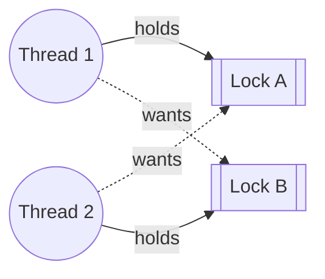

> **Recall layer.** The interview answers are
> [Q36](/docs/data/transactions-mvcc#q36) and
> [Q55](/docs/java/concurrency#q55). This page builds the model.

## 1. The problem it exists to solve

A funds transfer function, reviewed and merged without comment:

```java
void transfer(Account from, Account to, Money amount) {
    synchronized (from) {
        synchronized (to) {
            from.debit(amount);
            to.credit(amount);
        }
    }
}
```

It is correct for any single call. It compiles. Every unit test passes,
because a unit test calls it once.

Under concurrent load it deadlocks within minutes: `transfer(A, B, ...)` on one
thread and `transfer(B, A, ...)` on another. Thread 1 holds A's lock and wants
B's; thread 2 holds B's lock and wants A's. Neither can proceed, and neither
will time out, because a JVM monitor has no timeout.

The database version of the same bug produces a message the first one doesn't:
`ERROR: deadlock detected` — one transaction is killed automatically. That
difference between "the JVM hangs forever" and "the database picks a loser and
tells you" is one of the most useful facts in this whole area, and it's worth
knowing exactly why it's true.

## 2. The four conditions, and why breaking one is enough

A deadlock is a cycle of threads, each holding a resource another one in the
cycle wants. It requires all four of these simultaneously — a formalisation
from Coffman (1971) that's worth knowing precisely, because each condition
suggests a distinct prevention strategy:

1. **Mutual exclusion** — the resource can't be shared.
2. **Hold and wait** — a thread holds one resource while waiting for another.
3. **No preemption** — a resource can't be forcibly taken away.
4. **Circular wait** — a cycle of threads each waiting on the next.

Break any single one and deadlock becomes structurally impossible for that
resource type. In practice, condition 4 is the cheapest to attack, which is why
lock ordering is the standard fix.

The transfer example above is exactly this cycle, drawn as a wait-for graph —
the same shape `jcmd`'s "Found one Java-level deadlock" report describes in
text:



Two nodes, two solid "holds" edges, two dashed "wants" edges — and the dashed
edges close the cycle. Any deadlock, no matter how many locks or threads, is
this same shape with more nodes: a cycle in the wait-for graph is necessary
and sufficient for deadlock, which is precisely what both `jstack` and a
database's lock-manager check for.

## 3. Lock ordering: the fix that costs nothing

If every thread that needs two locks always acquires them in the same
**global** order, a cycle cannot form — there is no way for thread 1 to want
what thread 2 holds while thread 2 wants what thread 1 holds, because both
threads approach the pair from the same direction.

```java
void transfer(Account a, Account b, Money amount) {
    Account first  = a.id() < b.id() ? a : b;    // consistent order, always
    Account second = (first == a) ? b : a;
    synchronized (first) {
        synchronized (second) {
            a.debit(amount);
            b.credit(amount);
        }
    }
}
```

Now `transfer(A, B)` and `transfer(B, A)` both lock in ascending ID order.
Neither can hold the higher one while wanting the lower. This costs nothing —
same number of locks, same work — and it's the correct default response to any
"acquire two locks" situation, not just this textbook example.

**The generalisation, worth carrying beyond bank accounts:** any time your code
acquires more than one lock, sort the acquisition order by something intrinsic
and total — an ID, a hash, a fixed priority — never by argument position or
call-site convenience. If IDs can tie, add an explicit tie-breaker lock for the
equal case.

## 4. Why an unindexed WHERE clause turns into a deadlock

This is the database-specific trap, and it catches people who understand
locking perfectly well in Java and get surprised by SQL.

InnoDB locks the rows it **examines**, using whatever index the query planner
chose — not the rows that match your predicate.

```sql
UPDATE payments SET status = 'FLAGGED' WHERE merchant_id = 42;
```

With an index on `merchant_id`, this locks exactly the matching rows. Without
one, it scans and **locks every row it examines**, which under `REPEATABLE
READ` includes gap locks between them
([Q35](/docs/data/transactions-mvcc#q35)). Two concurrent statements touching
overlapping unindexed ranges now hold overlapping lock sets in different
orders, and you get a deadlock from two statements that never explicitly
"chose" an order at all — the query planner chose it for them, implicitly, via
whichever index it selected.

**This makes adding the right index a correctness fix, not merely a
performance one** — a fact that genuinely surprises people the first time they
trace a production deadlock back to a missing index rather than to application
code.

Gap locks compound this: even a `DELETE` matching **zero rows** takes a gap
lock on the range it scanned, blocking inserts into that range from other
transactions. That's deadlock-adjacent behaviour arising from a statement that
changed nothing.

## 5. Detection: the JVM tells you nothing, the database tells you everything

This asymmetry is worth understanding structurally, not just as trivia.

**The JVM** has no built-in deadlock timeout for intrinsic locks — a thread
waiting on a monitor waits forever unless you jump through hoops. Detection is
external and after the fact: `jstack` or `jcmd <pid> Thread.print` walk the
"waiting to lock / locked by" chains and explicitly print **"Found one
Java-level deadlock"** with both stacks when a cycle exists. `ReentrantLock`'s
`tryLock(timeout)` is the only built-in escape, and it requires the developer
to have chosen it up front.

**The database** actively runs a wait-for graph in the background specifically
to catch this, because letting transactions block forever would eventually
starve the whole system. When it finds a cycle, it kills one participant — the
one with the least work to undo, by internal heuristic — rolls it back, and
returns a specific, catchable error (`deadlock detected`, SQLSTATE 40P01 in
PostgreSQL; error 1213 in MySQL). The **other** transaction proceeds as if
nothing happened.

The practical consequence: **your application must treat a deadlock error as an
expected, retryable outcome**, not an exceptional failure to log and give up
on. Code that surfaces SQLSTATE 40P01 as a 500 to the caller has correctly
detected a deadlock and then discarded the one piece of information — "just
retry, you'll probably win" — that made detection worth having.

## 6. The rules that prevent most database deadlocks

In order of how much they buy you:

**Acquire locks in a consistent order** — the database version of section 3.
Sort account IDs, sort resource IDs, always ascending, in every code path that
touches more than one row across multiple statements.

**Keep transactions short.** Never span user think-time, never span an
external HTTP call. A transaction open for the duration of a payment
provider's response holds every lock it's acquired for that entire window —
this is the same "don't hold a transaction across a network call" discipline
from the [MVCC page](/docs/concepts/mvcc) and the [Spring proxy
page](/docs/concepts/spring-proxy), showing up here as lock contention instead
of bloat or connection exhaustion. Three pages, one underlying mistake.

**Prefer a single statement.** `UPDATE ... WHERE ...` is atomic and cannot
deadlock against itself. Two separate `SELECT` then `UPDATE` statements create
a window an interleaving competitor can exploit; one statement doesn't.

**Index what you filter and update on.** Section 4 — an unindexed predicate
locks far more than intended and does so unpredictably depending on scan order.

**Take the most contended lock last**, so a thread holding it finishes fastest.

**Never call unknown code while holding a lock.** A callback, a listener, code
in another module — you don't know what it locks, and "don't call out while
holding a lock" is the single highest-leverage discipline for avoiding the
Java-level version of this problem entirely, independent of ordering.

**Use `SELECT ... FOR UPDATE SKIP LOCKED`** for queue-like access patterns,
where the goal is "grab any unclaimed row" rather than "grab this specific
row" — it sidesteps lock contention structurally rather than managing it.

## 7. What this does *not* cover

- **Distributed deadlock**, across services or databases with no shared lock
  manager to detect a cycle at all. That's a different, harder problem, usually
  addressed by avoiding distributed locks in favour of sagas and idempotent
  compensations.
- **Livelock.** Threads that are active, not blocked, but make no progress —
  two threads each backing off and retrying in lockstep. Fixed with randomised
  jitter, not lock ordering.
- **Starvation.** A thread that never gets a resource because others are
  consistently favoured, under an unfair lock or a priority scheme. Different
  cause, different fix (fair locks, or a queue).
- **Deadlock on `ReentrantLock`.** The JVM's built-in detector cannot always
  see cycles involving `ReentrantLock` the way it sees `synchronized` monitor
  cycles — worth verifying on your JDK version rather than assuming parity.

## 8. Lab: cause it, see it, fix it

### Lab 1 — deadlock two Java threads on purpose

```java
public class Deadlock {
    static final Object A = new Object(), B = new Object();

    public static void main(String[] args) {
        Thread t1 = new Thread(() -> {
            synchronized (A) {
                sleep(100);
                synchronized (B) { System.out.println("t1 done"); }
            }
        });
        Thread t2 = new Thread(() -> {
            synchronized (B) {
                sleep(100);
                synchronized (A) { System.out.println("t2 done"); }
            }
        });
        t1.start(); t2.start();
    }
    static void sleep(long ms) { try { Thread.sleep(ms); } catch (Exception e) {} }
}
```

Run it. Nothing prints, and nothing ever will. Now:

```bash
jcmd <pid> Thread.print | grep -A5 "Found one Java-level deadlock"
```

Read the output — it names both threads, both locks, and the exact cycle.
**This is the tool you reach for in production**, and running it against a
deadlock you caused yourself is the fastest way to know what to look for later.

### Lab 2 — fix it with ordering

Replace both threads' bodies with the consistent-order pattern from section 3
(order by `System.identityHashCode` or an assigned ID, with a tie-break). Run
it a thousand times in a loop. It always completes.

### Lab 3 — cause a SQL deadlock without an index

```sql
CREATE TABLE payments (id serial primary key, merchant_id int, status text);
INSERT INTO payments (merchant_id, status)
  SELECT (g % 50), 'PENDING' FROM generate_series(1,100000) g;
```

Two concurrent sessions, no index on `merchant_id`:

```sql
-- session A
BEGIN;
UPDATE payments SET status='A' WHERE merchant_id = 10;
-- session B (before A commits)
BEGIN;
UPDATE payments SET status='B' WHERE merchant_id = 20;
-- session A, still open
UPDATE payments SET status='A2' WHERE merchant_id = 20;
-- session B, still open
UPDATE payments SET status='B2' WHERE merchant_id = 10;
```

One session gets `ERROR: deadlock detected`. Read the detail line — PostgreSQL
names the exact lock each transaction was waiting for. Now add
`CREATE INDEX ON payments(merchant_id);`, truncate and repeat: the same
interleaving no longer conflicts, because each transaction touches a narrow,
indexed row set instead of scanning broadly.

### Lab 4 — watch the database pick a loser

Rerun Lab 3 and note: **one session's client library throws immediately** with
the deadlock error; **the other session's `UPDATE` simply completes**, as if
nothing happened. That asymmetry — one loser, chosen automatically, one clean
winner — is section 5 made concrete, and it's worth seeing on your own screen
once rather than only reading about it.

### Lab 5 — write the retry wrapper, then prove you need it

```java
@Retryable(retryFor = DeadlockDetectedException.class, maxAttempts = 3,
           backoff = @Backoff(delay = 50, multiplier = 2, random = true))
@Transactional
public void updateStatus(long merchantId, String status) { ... }
```

Drive Lab 3's interleaving from a load test with many concurrent threads and
no retry logic; measure the failure rate. Add the retry wrapper and re-run —
failures at the application boundary should approach zero, with the retries
themselves invisible to callers.

### Lab 6 — reproduce the gap-lock surprise

On MySQL/InnoDB, under `REPEATABLE READ`:

```sql
-- session A
BEGIN;
DELETE FROM payments WHERE merchant_id = 999;   -- matches zero rows
-- session B
INSERT INTO payments (merchant_id, status) VALUES (999, 'NEW');   -- blocks
```

Session B blocks despite session A's `DELETE` matching nothing. The gap lock
from the scan is still held. Commit or roll back session A and watch B
proceed immediately.

## 9. Leading on this

**Make lock ordering a review rule wherever more than one lock or row is
acquired in sequence**, in Java or in SQL. "Sorted by what?" is the one
question that catches this class of bug before it reaches production, and it
takes seconds to ask.

**Treat a missing index as a correctness bug when it's on a frequently-updated
column, not only a performance one.** Section 4 is the argument: an unindexed
`WHERE` on a hot update path is latent lock contention waiting for the right
interleaving, and "it's been fine so far" is not evidence it will stay fine
under different traffic.

**Build the retry wrapper once, centrally, and require it on every
multi-statement write path.** Deadlocks under real concurrency are not rare
edge cases — they're an expected, designed-for outcome of running transactions
concurrently, and application code that doesn't retry them is incomplete, not
merely unlucky when one occurs.

**Insist on "never call unknown code while holding a lock"** as a Java-specific
discipline distinct from ordering — a callback, a listener notification, or a
call into another module from inside a `synchronized` block is a debt that
only comes due once that code changes underneath you.

**Use Lab 1 as onboarding material.** Watching a program hang forever, running
`jcmd`, and reading its own name back out of the deadlock report is one of the
fastest ways to make "always order your locks" feel like earned knowledge
instead of a rule to memorise.

## 10. Where to go deeper

- Coffman, Elphick & Shoshani, "System Deadlocks" (1971) — the original
  four-conditions formulation. Short and still the clearest statement of it.
- *Java Concurrency in Practice*, chapter 10 — lock ordering, the dynamic
  lock-order deadlock case, and resource deadlocks beyond just monitors.
- PostgreSQL docs, section 13.3.3 (Deadlocks) — how the detector works and what
  it does when it finds one.
- MySQL/InnoDB documentation on locking reads and "Locks Set by Different SQL
  Statements" — the definitive reference for which statement takes which lock.
- `jstack`/`jcmd Thread.print` documentation, and practising reading a real
  deadlock report until the "waiting to lock ... which is held by" chain is
  immediately legible.

## 11. Self-check

<SelfCheck>

<SelfCheckItem n={1} where="§2 The four conditions, and why breaking one is enough.">

State the four Coffman conditions. Which one does lock ordering break, and
why is that usually the cheapest to attack?

</SelfCheckItem>

<SelfCheckItem n={2} where="§3 Lock ordering: the fix that costs nothing.">

Write the account-transfer deadlock, then fix it with consistent ordering.
What happens if two accounts can have the same ID?

</SelfCheckItem>

<SelfCheckItem n={3} where="§4 Why an unindexed WHERE clause turns into a deadlock.">

Why does an unindexed `UPDATE ... WHERE merchant_id = ?` risk a deadlock that
an indexed version of the identical statement doesn't?

</SelfCheckItem>

<SelfCheckItem n={4} where="§5 Detection: the JVM tells you nothing, the database tells you everything.">

Explain precisely why the JVM can hang forever on a `synchronized` deadlock
while a database transaction cannot.

</SelfCheckItem>

<SelfCheckItem n={5} where="§4 Why an unindexed WHERE clause turns into a deadlock — the gap-lock paragraph.">

A `DELETE` matches zero rows. Under what circumstances can it still block a
later `INSERT`, and why?

</SelfCheckItem>

<SelfCheckItem n={6} where="§5 Detection — the practical-consequence paragraph.">

Your application logs `deadlock detected` as an ERROR and returns a 500 to
the caller. What has gone wrong with the response, given that the database
already did its job correctly?

</SelfCheckItem>

<SelfCheckItem n={7} where="§6 The rules that prevent most database deadlocks.">

Name two disciplines that prevent Java-level lock deadlocks beyond ordering
alone.

</SelfCheckItem>

<SelfCheckItem n={8} where="§7 What this does not cover.">

Distinguish deadlock from livelock from starvation, and give the
characteristic fix for each.

</SelfCheckItem>

</SelfCheck>
