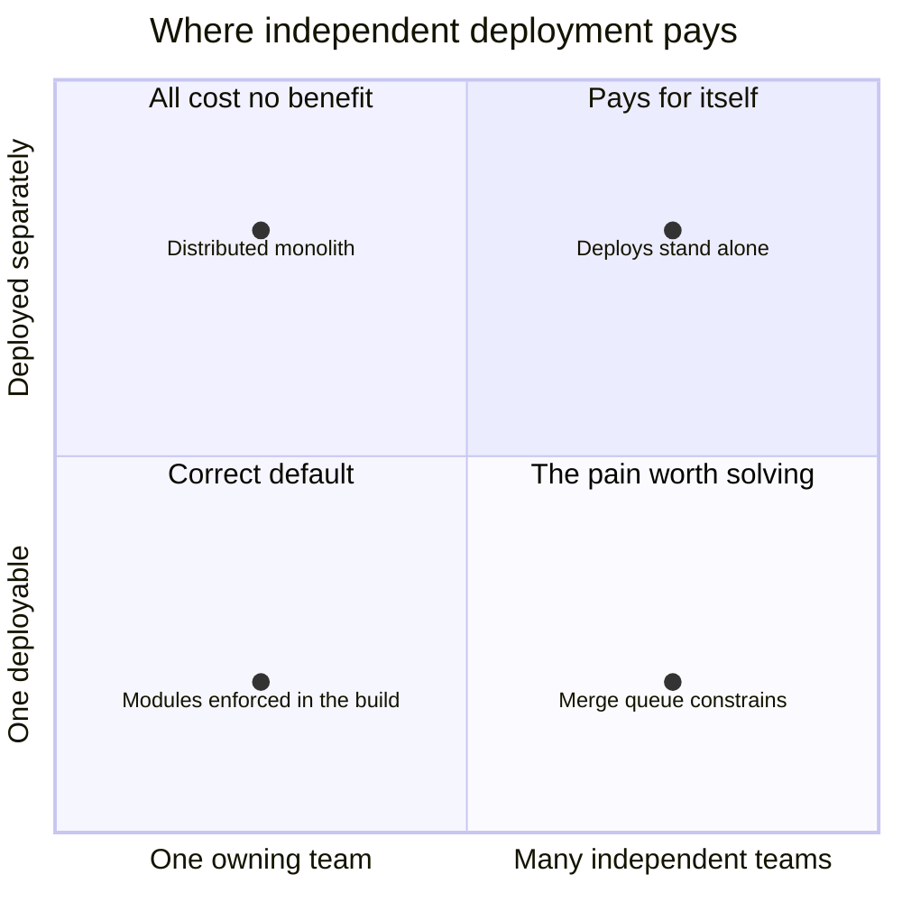

> **Recall layer.** The interview answers are
> [Q61](/docs/design/microservices-boundaries#q61) and
> [Q73](/docs/design/microservices-boundaries#q73). This page builds the model
> underneath them.

## 1. The problem it exists to solve

Fourteen engineers. Nine services. The release process is a shared spreadsheet
with a tab per service and a column for "blocked by", and there is a Thursday
call to work out the order.

Ask what the split bought and you will get honest answers, all of them
technical: the payment logic is isolated, the search index scales on its own,
the notification worker can be restarted without touching checkout. All true.
Now ask the question that decides it — *how often does a service go to
production without anyone outside its authors being involved?* — and the
spreadsheet answers for you. Roughly never.

This is not a team that failed at microservices. It is a team that bought the
costs and never qualified for the benefit, and every one of those nine splits
was individually defensible when it was made.

The failure is upstream of all of them. Microservices solve a problem this
organisation does not have, and this page is an attempt to say what that
problem is, precisely enough that you can check whether it is yours.

## 2. What microservices actually buy

One thing.

**A unit of software can go to production on the decision of the people who own
it, without synchronising that decision with anyone else.** That is the entire
benefit. Everything else attributed to microservices is either a consequence of
that, or available without them.

It is worth testing that claim against the usual list, because the list is what
gets said in the room.

- **"It gives us clear boundaries."** Module boundaries give you clear
  boundaries, and a compiler enforces them faster and more precisely than a
  network does ([Q55](/docs/design/architecture-styles#q55)). The network
  enforces nothing; it only makes violations expensive *after* you have written
  them.
- **"It lets us scale the hot part."** Sometimes genuinely true — a GPU-bound
  scoring model beside a CRUD service is a real reason
  ([Q63](/docs/design/microservices-boundaries#q63)). Far more often the hot
  path is one query, and the monolith runs on more instances behind the same
  load balancer for a fraction of the effort.
- **"It isolates failure."** Only if the call graph is asynchronous. A
  synchronous chain converts one service's outage into everyone's, with
  availability multiplying down the chain — a *worse* failure profile than one
  process, not a better one
  ([Q65](/docs/design/microservices-boundaries#q65)).
- **"We can use the right language for each job."** You can, and you will then
  maintain N toolchains, N dependency-upgrade streams and N sets of CVEs. A real
  option with a real price, and not what anyone buys microservices for.
- **"It's easier to reason about."** One service is. The *system* is
  emphatically not: understanding a flow now means reading several repositories
  and a tracing UI, which is a cognitive-load increase the moment anybody needs
  an end-to-end answer.

Strip those out and the residue is independent deployment, and independent
deployment is only worth anything to an organisation that has independent
*deciders*. One team with nine deployables can already ship whenever it likes;
splitting gave it nothing it did not have. Nine teams with one deployable
cannot, and that is the pain worth paying to remove.

So the honest sentence — the one worth being able to say plainly in a design
review and in an interview — is this: **microservices are an organisational
solution with a technical bill.** They make teams independent. They do not make
code better, faster, or simpler, and the asymmetry between the one benefit and
the many costs ([Q73](/docs/design/microservices-boundaries#q73)) is the whole
decision.

## 3. The core model: one conditional benefit, many unconditional costs

Put the two axes that actually matter on a plane. On one, how many groups
independently decide what the software does. On the other, how many units are
deployed separately.



The diagonal is where architectures are healthy, and it has two ends, not one.
Bottom-left is a small organisation with a well-factored single deployable — a
correct resting place, not a waiting room. Top-right is a large organisation
whose boundaries match its team lines, paying the distribution bill and
collecting the autonomy.

The off-diagonals are the two failure modes, and only one has a well-known
name.

**Top-left is the distributed monolith** — deployables split further than
ownership. Every cost of distribution arrives in full, and the benefit does not
arrive at all, because the deployment decision still needs the same
conversation it always did. This is the expensive quadrant
([Q65](/docs/design/microservices-boundaries#q65)), and the reason it is common
is that *nothing about it is visible from inside a single service*. Each
service looks fine. The architecture is diagnosed by counting releases, not by
reading code.

**Bottom-right is the release train**, and it is the pain microservices exist
to relieve: many teams sharing one pipeline, where merge contention, a shared
integration environment and a coordinated cut are the constraint on throughput.
This quadrant is under-diagnosed because it is uncomfortable rather than
broken — everything works, it just takes three weeks.

The cost structure is what makes the two off-diagonals behave differently over
time. The costs of distribution are **unconditional**: network calls, partial
failure, no cross-service transactions, N pipelines, N on-call rotations,
versioning forever. You pay them from the moment the second deployable exists,
regardless of how the organisation is shaped. The benefit is **conditional**:
it materialises only when somebody who is *not you* would otherwise have had to
agree to your release.

So the decision is not "monolith or microservices". It is: **do we have, or can
we get, a separately-deciding owner for each piece we are proposing to split?**
If the answer is no, the split has an unbounded bill and a zero benefit, and no
amount of implementation quality changes that — the same coordination-cost
argument [Conway's law](/docs/concepts/conways-law) makes about boundaries in
general, applied to the one boundary that costs the most to get wrong.

## 4. The preconditions, and how to check you have them

Four, and they are checkable rather than rhetorical.

**A separately-deciding team per service.** Not a named owner in a wiki — a
group with its own backlog and its own authority to ship. DORA's test is the
sharp one, and it is worth carrying in its own words: teams can make
large-scale changes to the design of their systems *without the permission of
somebody outside the team*, and can deploy and release on demand,
*independently of the services it depends on or of other services that depend
on it*. Both halves matter. A team that can deploy but cannot redesign is doing
maintenance on somebody else's boundary.

**A platform that makes the Nth service nearly free.** Fowler's 2014
prerequisites piece — *You must be this tall to use microservices* — still
names the right three, because they are capabilities rather than products:
rapid provisioning (a new environment in hours, not days), basic monitoring
that will actually tell you something broke, and rapid application deployment
through a pipeline measured in hours. Add distributed tracing before you pass a
handful of services; without it a cross-service bug is unanswerable rather than
merely hard.

**A domain you understand well enough to cut.** Boundaries are the most
expensive thing here to get wrong, and a service boundary drawn across a false
seam becomes a network call plus a data migration to repair, rather than a
refactor. This is where [bounded contexts](/docs/concepts/bounded-contexts)
does the actual work — linguistic seams, co-change, data ownership — and it is
the precondition most often waved through.

**Data that can be separated.** If most operations need an atomic update across
what you propose to split, you are not choosing between a monolith and
microservices; you are choosing between a transaction and a saga
([Q123 in the Java bank](/docs/java/distributed-systems#q123)). Sometimes that
is right. It is never cheap, and it should be a decision rather than a
discovery.

**The number everyone wants, and the honesty it needs.** The reference answers
put the threshold around fifteen to twenty engineers
([Q61](/docs/design/microservices-boundaries#q61)) and around thirty
([Q55](/docs/design/architecture-styles#q55)). Be clear about what those are:
distilled practitioner experience, not findings. No study establishes a
headcount at which microservices begin to pay, and anyone quoting one to a
decimal place is inventing it. They are useful because they sit roughly where
the number of *separately-deciding teams* passes two or three, which is the
thing that actually matters — so twenty-five engineers on a single backlog
under one product owner make the headcount heuristic say the wrong thing.

## 5. What this model does not give you

**It does not say microservices are wrong.** For an organisation in the
top-right quadrant they are the only known way to keep dozens of teams shipping
independently, and the costs below are worth paying. The claim is about *why*
you would pay, not whether.

**It does not license the reverse inference.** "We are small, therefore a
monolith, therefore we need not think about boundaries" is the most common way
this argument is abused. A monolith with no internal structure is not the cheap
option; it is the option that forecloses the expensive one later, because you
cannot extract a service from something that has no seams
([Q67](/docs/design/microservices-boundaries#q67)).

**It is not a licence to reorganise on demand.** Changing team structure to get
an architecture is a real move, covered in
[Conway's law](/docs/concepts/conways-law), but a reorganisation costs months of
throughput. "We need more teams so we can have more services" is a
correct-shaped argument that is almost always the wrong way round.

**It does not settle service *size*.** Only that a service needs an owner. How
big it should be is a cognitive-load question, answered in
[Conway's law §6](/docs/concepts/conways-law) and
[Q64](/docs/design/microservices-boundaries#q64), and the answer is not "micro".

**It says nothing about whether your boundaries are in the right places.** Two
organisations with identical team structures can draw completely different
service maps, and one of them can be wrong. This page tells you whether to
split at all; [bounded contexts](/docs/concepts/bounded-contexts) tells you
where.

## 6. The default, and the on-ramp

The alternative to premature distribution is not "a monolith". It is a
**modular monolith**: one deployable, internally divided into modules that own
their data, communicate through published interfaces or in-process events, and
are **prevented by the build** from reaching into each other
([Q55](/docs/design/architecture-styles#q55)).

That last clause is the whole thing. A module boundary defended by convention
is already gone and the team simply has not noticed yet — the result
[Conway's law §4](/docs/concepts/conways-law) predicts for any boundary whose
cost of crossing is lower than its cost of respecting. Inside one repository
with one compiler, crossing is free, so the boundary needs a mechanical cost
added to it. Three current ways to add one, in ascending order of commitment:

- **ArchUnit**, as a failing test rather than a report — dependency direction
  and package-cycle rules, run in CI. This is the cheapest thing on the list
  and the one to reach for first
  ([Q56](/docs/design/architecture-styles#q56)).
- **Spring Modulith** (2.1.1 as of September 2026, aligned with Spring Boot 4),
  which infers modules from package structure and verifies three rules for you:
  no cycles between modules, no reaching into another module's internal
  packages, and — optionally — only the dependencies a module explicitly
  declares. It also gives you module-scoped integration tests and generated
  documentation, which matters more than it sounds: an enforced boundary nobody
  can see is hard to defend in review.
- **JPMS**, where you want the boundary enforced by the runtime as well as the
  build. Strongest and least flexible; worth it when the modules are genuinely
  long-lived libraries rather than parts of one application.

**Monolith first** ([Q62](/docs/design/microservices-boundaries#q62)) is the
sequencing argument that follows, and it is usually heard wrong. Fowler's point
is not "defer thinking about structure". It is that boundary quality depends on
domain knowledge, domain knowledge comes from having built the thing, and
starting with services means guessing boundaries at the moment of maximum
ignorance. The version worth defending is: **build one deployable with
deliberate internal modules, at the seams you suspect will matter, and enforce
them mechanically.** Extraction is then a mechanical exercise rather than an
archaeology project — and, the part that gets forgotten, by that point you will
have learned which of your guessed seams were wrong, which is information you
could not have bought any other way.

The qualification is genuine. An experienced team, in a domain it knows, with a
team structure already settled, can correctly start with a few services. The
failure mode is not microservices. It is microservices chosen without evidence.

## 7. What has actually changed, and the cases people misread

Two things are different in 2026 than in 2019, and only one of them moves the
decision.

**The per-service infrastructure tax has genuinely fallen.** Istio's ambient
mode reached general availability in v1.24 on 7 November 2024, moving the proxy
out of every pod and into shared per-node components; for new deployments it is
now the mode to evaluate, with the sidecar treated as legacy. Add managed
control planes, OpenTelemetry as a default rather than a project, and internal
developer platforms in around 90% of organisations by DORA's 2025 report — still
the most recent as of September 2026 — and the marginal cost of the Nth service
is materially lower than it was.

**The coordination cost has not moved at all**, because it is not a technology.
If two teams must agree before a release, no amount of mesh improves that, and
a falling per-service tax only makes the *distributed monolith* cheaper to run.
It does not make it less pointless. The break-even has shifted a little to the
left; the shape of the argument is untouched.

A third thing might matter and is too early to call. InfoQ's Culture and
Methods trends report of August 2026 has its panel arguing that the two-pizza
team is becoming a one-pizza team — two people plus agents. Treat that as a
panel's reading of an early-market trend rather than as evidence; it sits at
the visionary end of their own adoption curve. If it holds, it changes the
*supply* of separately-deciding units, which is exactly the input this page's
decision runs on. Worth watching, not worth architecting around yet.

Then the cases, which get quoted constantly and mostly wrongly.

**Amazon Prime Video, 2023 — usually misread.** The Video Quality Analysis team
moved one audio/video monitoring component from Step Functions plus Lambda to a
single ECS task and reported a 90% cost reduction. Read the post: the saving
came from eliminating S3 round trips for video frames and Step Functions state
transitions by keeping the data in memory. It is a data-transfer argument about
one component owned by one team, and it is not an organisational argument at
all — which is precisely why it fits this page's model rather than contradicting
it. There was no cross-team autonomy to lose, so there was nothing to weigh
against the saving. Anyone citing it as "Amazon abandoned microservices" has
not read it.

**Istio's own control plane, 2020 — the cleanest case there is.** Istio 1.5
merged Pilot, Galley, Citadel and the sidecar injector into a single binary,
`istiod`. The reasons the maintainers give are, almost word for word, the
criteria in section 3: the components were all in one language, all installed
and operated by a single team, always released at the same version at the same
time, and their cost was dominated by one feature, so independent scaling
bought nothing. Four services, one team, one release cadence — the top-left
quadrant, recognised and corrected by the project the industry most associates
with distributed complexity.

**Uber's DOMA, 2020 — the scale case, and it points the same way.** Around
2,200 critical microservices, and the answer was not to merge them. It was to
group them into roughly 70 **domains** with published interfaces, so that
onboarding a feature touches a domain rather than a list of services; Uber
reported onboarding times falling by 25–50%. The remedy for microservice sprawl
at scale turned out to be a coarser *ownership and interface* layer imposed on
top — an organisational structure, added back.

**Google's Service Weaver, 2023–2025 — the one that failed, and why.** A Go
framework for writing a logical monolith and letting the runtime decide the
deployment topology: components as interfaces, the split as a deployment-time
decision. It is the most interesting recent attempt to make this page's
question go away, and it is over — maintenance mode from 5 December 2024, the
repository archived in 2025, the GitHub organisation marked archived in March
2026, with adoption difficulty the stated reason: it required rewriting large
parts of existing applications. The deeper reason is worth sitting with.
Making the split a purely technical, late-bound decision does not help, because
*the split was never a technical decision*. It is about who decides, and no
runtime can decide that for you.

## 8. Reversing the decision

If the split is an organisational bet, then a lost bet has a specific remedy,
and being able to execute it is a stronger signal than having drawn a good
diagram in the first place
([Q74](/docs/design/microservices-boundaries#q74)).

The evidence that a boundary is wrong is deployment-shaped and already in your
tooling: the two services are always released together, most changes touch
both, they are chattier with each other than with anyone else, a saga is needed
on the ordinary path, one being unavailable makes the other useless anyway, and
the same team owns both with no plan to change that. Any three of those is a
case. All six is a distributed monolith with extra steps.

Merge in the order that keeps you safe. **Bring the code into one deployable as
separate modules, keeping the existing interface intact** — same method
signatures, same DTOs, just no network in between. Deploy that and confirm it
behaves. **Then remove the network hop and its error handling.** **Then, only
if it is genuinely correct, relax the module boundary** — and often it is not
correct, and you should stop at two enforced modules in one process, which is a
perfectly good end state. Do not merge the code and the data model in one step;
the data merge is the part that cannot be rolled back at 3am.

The hard part is cultural rather than technical. Merging reads as retreat, and
somebody's design is being undone in public. The framing that works is neither
apology nor blame: *we are paying distribution costs and collecting no
distribution benefit, and here are the release dates that show it.* A team that
can merge services back has a healthier relationship with its architecture than
one that can only add to it.

## 9. Lab

All of these run against a system you already have, and none needs anybody's
permission. The first three take under an hour between them and are the ones
that change conversations.

### Lab 1 — the independence ratio

Take the last hundred production deployments across all services, from whatever
holds that record — your CD tool's API, deployment tags, or the release channel.

```bash
git tag --sort=-creatordate --format="%(creatordate:short) %(refname:short)" | head -100
```

For each deployment, ask whether another service was deployed within the same
hour *as part of the same change*. The fraction that were not is your
independence ratio, and it is the single number that says whether you are in
the top-right quadrant or the top-left one. Below about half, the split is not
buying what it is supposed to buy.

### Lab 2 — the deciders count

Count two things and divide. First, deployable units in production. Second,
groups that can independently decide to release one — not people, and not
squads on a slide, but groups with their own backlog and their own authority.
Be strict: if a change routinely needs a second group's approval, those are one
decider, not two.

A ratio near 1 is healthy in either direction. Several services per decider is
the distributed-monolith reading, and should send you to Lab 1 for
confirmation. Several deciders per service is the release-train reading, and it
is the case *for* splitting.

### Lab 3 — the merge-back candidate list

Reuse the co-change matrix from
[Conway's law Lab 1](/docs/concepts/conways-law), but join across repositories
rather than within one. For each pair of services, count the changes in the
last year that touched both, and rank. Then, for the top five pairs, look up
who owns each side.

Any pair that is high on co-change *and* has one owner is a merge candidate
under section 8. Any pair that is high on co-change with two owners is a
boundary in the wrong place — the same finding, needing a different remedy.

### Lab 4 — enforce a module boundary in a monolith

In a Spring Boot application, add the test starter and one test:

```xml
<dependency>
  <groupId>org.springframework.modulith</groupId>
  <artifactId>spring-modulith-starter-test</artifactId>
  <scope>test</scope>
</dependency>
```

```java
class ModularityTests {

  @Test
  void verifiesModularStructure() {
    ApplicationModules.of(Application.class).verify();
  }
}
```

Run it against an existing codebase and it will almost certainly fail, which is
the point of the lab. Read the violations before fixing anything: they list
every place your intended structure and your actual structure disagree,
produced in seconds, and the list is usually shorter and more surprising than
anyone expects.

Then deliberately break it. Add an import from one module's internals into
another, watch the test fail, and note how long that would have taken to notice
without it. That gap is the difference between a boundary and an intention.

### Lab 5 — price one cross-service request

Pick a user-facing operation and pull one trace for it. Count the service hops,
and sum the time spent in network and serialisation rather than in work. The
same operation as in-process calls would cost roughly zero, so that sum is the
price of the split.

Then say what you bought with it. Sometimes the answer is "a team can deploy
search without us", which is a fine trade. Sometimes it is "nothing", and you
have found your first merge candidate with a latency number attached.

### Lab 6 — count the operational surface

For one service, list everything that exists solely because it is a separate
deployable: pipeline, dashboards, alert rules, on-call runbook, dependency
upgrade stream, CVE surface, infrastructure cost, contract tests, secrets
scope. Multiply by your service count.

That is the bill from [Q73](/docs/design/microservices-boundaries#q73) with your
own numbers in it, and it is the most effective way to explain to a non-engineer
why the next service is not free.

## 10. Leading on this

**Say the organisational case out loud, first.** The strongest signal in this
whole area is stating plainly that microservices buy one thing, buy it only
under specific conditions, and cost a great deal. Leading with the benefit's
precondition rather than with the diagram changes what the meeting is about,
and it is much harder to argue with than a preference.

**Never propose a split without naming its owner.** If you cannot name the
group that will independently decide this service's releases, and they are not
in the room agreeing, you are proposing the top-left quadrant. This is the same
rule [Conway's law](/docs/concepts/conways-law) gives for boundaries generally,
and it bites hardest here because the bill is largest.

**Make the modular monolith an argued default, not a fallback.** It carries
real design discipline and preserves optionality; presented apologetically, it
reads as being unable to do the real thing. The credible version comes with an
enforcement mechanism attached, which is why Lab 4 matters more than the
advocacy does.

**Bring the independence ratio to the argument.** "I don't think we're really
independent" invites an equally unfalsifiable rebuttal. "Thirty-one per cent of
our deployments last quarter stood alone" does not, and agreement on the facts
collapses most disagreements about what to do next.

**Make merging back sayable.** Establish early, while nothing is on fire, that
a boundary is a bet on the evidence available at the time and that revisiting it
is ordinary engineering. A team that cannot merge keeps an expensive mistake
forever, out of politeness.

**In review, look for the new coordination requirement, not just the new
dependency.** A synchronous call added to another team's service, a domain type
added to the shared library, a read of another service's table: each creates a
standing agreement between two groups. That is the comment worth writing, and
it lands better than "this increases coupling".

**Watch the platform's direction of travel.** The technical costs here fall
every year and the coordination costs do not, so investing in the platform
moves your own break-even. That is a genuine strategy — just do not let it
become an argument for splitting things that still have one owner.

## 11. Where to go deeper

- Martin Fowler, *MicroservicePrerequisites* ("You must be this tall to use
  microservices"), **August 2014**, and *MonolithFirst*, **June 2015** — both
  short, both on `martinfowler.com`, and both still the clearest statements of
  the preconditions and of the sequencing argument.
- Sam Newman, *Building Microservices*, **second edition** (O'Reilly, August
  2021) — the standard reference, and notably more sceptical than the first
  edition about when to adopt. There is no third edition. Pair it with his
  *Monolith to Microservices* (2019) for the extraction mechanics.
- DORA's *loosely coupled teams* capability page at `dora.dev` — the five
  architectural practices, phrased as testable statements about permission and
  coordination rather than about technology.
- The Istio blog post announcing `istiod` (**Istio 1.5, March 2020**) — a
  primary source giving the criteria for merging services back, written by the
  team that did it.
- Uber's engineering blog, *Introducing Domain-Oriented Microservice
  Architecture* (**2020**) — 2,200 services grouped into roughly 70 domains, and
  the reasoning for adding an ownership layer rather than reducing the count.
- The Prime Video Video Quality Analysis post (**March 2023**) — read the
  original rather than the commentary, and note where the saving came from.
- The Spring Modulith reference documentation (**2.1.1**, aligned with Spring
  Boot 4) — the verification rules, `@ApplicationModuleTest`, and the generated
  module documentation.
- Ruoyu Su and Xiaozhou Li, *Modular Monolith: Is This the Trend in Software
  Architecture?* (arXiv 2401.11867, **January 2024**) — a grey-literature review
  rather than a controlled study, useful mainly as a survey of frameworks and
  cases. Note that the Google Service Weaver work which motivated it has since
  been archived.

## 12. Self-check

<SelfCheck>

<SelfCheckItem n={1} where="§2 What microservices actually buy.">

State, in one sentence, what microservices buy — then name three benefits
commonly attributed to them that are available without them.

</SelfCheckItem>

<SelfCheckItem n={2} where="§3 The core model: one conditional benefit, many unconditional costs.">

An organisation has one product team and seven services. Name the quadrant,
predict what its deployment record will look like, and say why each individual
split was probably defensible when it was made.

</SelfCheckItem>

<SelfCheckItem n={3} where="§3 The cost structure is what makes the two off-diagonals behave differently.">

Why is the benefit of microservices conditional while the costs are
unconditional, and what follows from that asymmetry for a team deciding whether
to split?

</SelfCheckItem>

<SelfCheckItem n={4} where="§4 The preconditions, and how to check you have them.">

Give the four preconditions, and for each one name something you could check
this week rather than argue about.

</SelfCheckItem>

<SelfCheckItem n={5} where="§5 It does not license the reverse inference, and §6 The default, and the on-ramp.">

"We're too small for microservices, so we don't need to worry about
boundaries." Explain what is right and what is wrong in that sentence.

</SelfCheckItem>

<SelfCheckItem n={6} where="§7 Amazon Prime Video, 2023, and Istio's own control plane, 2020.">

Amazon Prime Video's monitoring component and Istio's control plane both merged
back. Explain why only one of them is evidence for the argument on this page.

</SelfCheckItem>

<SelfCheckItem n={7} where="§7 Google's Service Weaver, 2023–2025 — the one that failed, and why.">

Google's Service Weaver let you write a logical monolith and decide the
deployment topology at runtime. Explain why that is a plausible idea, and why it
does not resolve the question this page asks.

</SelfCheckItem>

<SelfCheckItem n={8} where="§8 Reversing the decision, and §10 Make merging back sayable.">

You have concluded that two services should be merged. Give the order of
operations, say which step is irreversible, and give the framing you would use
with the engineer who designed the split.

</SelfCheckItem>

</SelfCheck>
