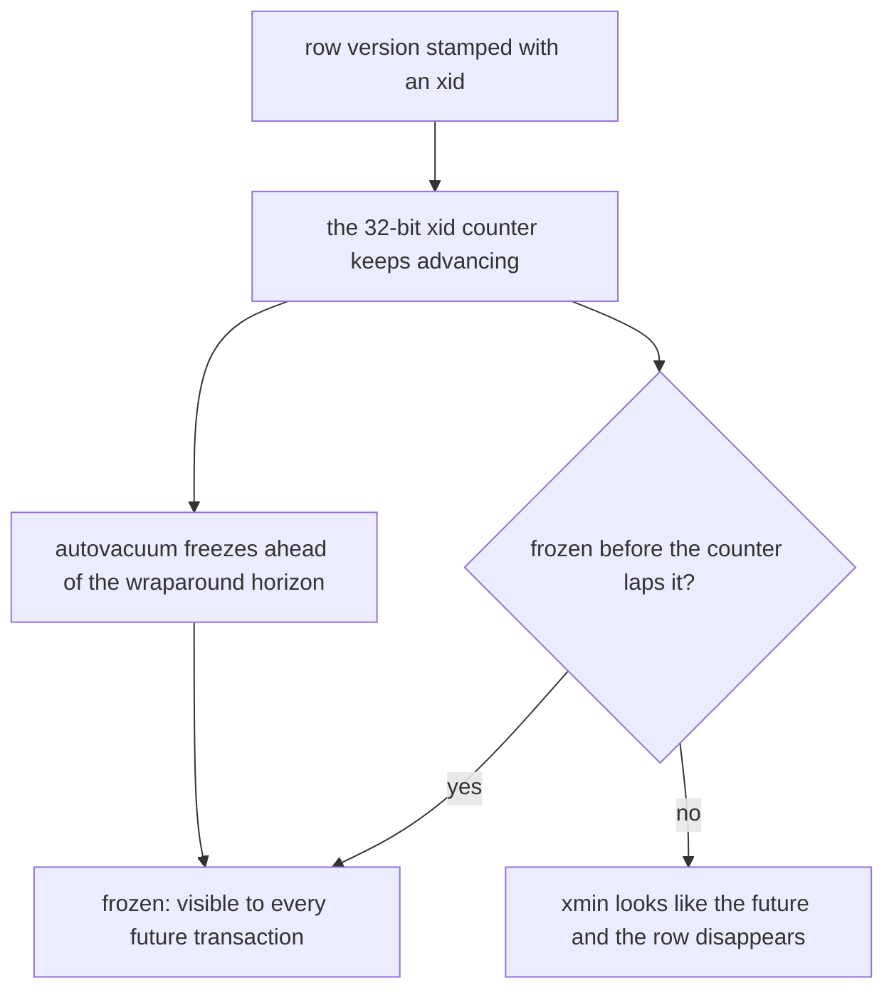

> **Recall layer.** The interview answers are
> [Q33](/docs/data/transactions-mvcc#q33) and
> [Q34](/docs/data/transactions-mvcc#q34). This page builds the model.

## 1. The problem it exists to solve

A table holding 400,000 rows occupies 14 GB. Every sequential scan reads 14 GB
to find 400,000 rows' worth of data. `SELECT count(*)` takes forty seconds on
something that should take under one.

Nobody deleted anything. The row count is stable. Disk usage has been climbing
for three weeks.

Elsewhere, a colleague has an analytics session open in a `psql` window from
Tuesday. They ran one query, didn't commit, went to a meeting, and closed their
laptop.

Those two facts are the same fact. Understanding why requires knowing what
PostgreSQL physically does when you run an `UPDATE` — and the answer is: not
what you think.

## 2. Rows are never updated

The design problem MVCC solves is that readers and writers contend. If a writer
locks a row, readers block; if readers lock, writers block. Under any real
concurrency that serialises the system.

MVCC's answer: **never modify a row in place — write a new version and let each
transaction see the version appropriate to it.** Readers never block writers,
writers never block readers. That single property is why PostgreSQL scales
across concurrent sessions.

The implementation is startlingly simple. Every row (a *tuple*) carries two
hidden system columns:

- **`xmin`** — the ID of the transaction that created this version
- **`xmax`** — the ID of the transaction that deleted or superseded it (0 if live)

A transaction takes a **snapshot** at its start: the set of transaction IDs that
had committed by then, plus the list of ones still in flight. A tuple is visible
if its `xmin` is committed-and-in-snapshot, and its `xmax` is not.

So:

| Operation | What physically happens |
|---|---|
| `INSERT` | write a new tuple with `xmin = my_txid`, `xmax = 0` |
| `DELETE` | set `xmax = my_txid` on the existing tuple. **Nothing is removed.** |
| `UPDATE` | set `xmax = my_txid` on the old tuple, **and insert a new tuple** |

An `UPDATE` is a delete plus an insert. That is the sentence to remember,
because every consequence on this page follows from it.

You can see the columns directly:

```sql
SELECT xmin, xmax, * FROM accounts WHERE id = 1;
```

## 3. What that costs

### Dead tuples accumulate

Every update leaves the previous version behind, occupying its page, until
something reclaims it. Update one row a million times and you have a million
tuples, 999,999 of them invisible to everyone. That is **bloat**, and it's
the 14 GB table from section 1.

Bloat is not just disk. It's *pages*, and pages are what scans read and what the
buffer cache holds. A 10× bloated table means every sequential scan does 10× the
I/O and your working set no longer fits in cache. Bloat is a performance
problem that presents as a capacity problem.

### Every index must be updated

Because the new tuple is at a different physical location, **every index on the
table must get a new entry pointing at it** — even indexes on columns that
didn't change. Update one column on a table with eight indexes and you write
one heap tuple plus eight index entries, plus WAL for all of it.

The escape hatch is **HOT** (Heap-Only Tuple): if no *indexed* column changed
**and** the new version fits on the same page, PostgreSQL chains it from the old
tuple and skips the index updates entirely. That's a large win, and it's
conditional on two things you control:

- don't index columns that change frequently
- leave free space on the page — `ALTER TABLE x SET (fillfactor = 85)` on
  update-heavy tables, so there's room for the new version alongside the old

This is the concrete reason "add another index" is not free
([Q7](/docs/data/modelling-indexing#q7)).

### `count(*)` cannot be O(1)

There is no maintained row counter, because "how many rows" has no single
answer — it depends on the asking transaction's snapshot. Two concurrent
sessions can correctly get different counts. So counting means visiting every
tuple and testing visibility ([Q22](/docs/data/query-performance#q22)).

### Index-only scans need the visibility map

An index entry doesn't record whether its tuple is visible to you — only the
heap does. So an index-only scan would still need a heap fetch, defeating the
purpose. The **visibility map** solves this: one bit per page meaning "every
tuple on this page is visible to every transaction". If the bit is set, the scan
can trust the index and skip the heap.

That bit is set by `VACUUM`. Which is why vacuum is a **read performance**
concern, not just a space one — and why Lab 5 on the B-tree page showed heap
fetches appearing after an update.

## 4. Enter VACUUM — and what stops it

`VACUUM` does three jobs:

1. **Reclaim dead tuples** so their space is reusable *within the table*. It
   does not return space to the OS — that's `VACUUM FULL`, which rewrites the
   table under an `ACCESS EXCLUSIVE` lock and is therefore an outage.
2. **Update the visibility map**, enabling index-only scans and letting future
   vacuums skip untouched pages.
3. **Freeze** old tuples to prevent transaction ID wraparound (section 5).

Autovacuum does this in the background. The critical question is when it
*can't*.

### The rule that explains everything

**A dead tuple cannot be removed while any snapshot might still need to see it.**

So vacuum can only clean up tuples deleted before the **oldest running
transaction** in the database. One long-running transaction anywhere pins that
horizon, and dead tuples accumulate across **every table**, not just the ones
that transaction touched.

That is the connection from section 1: your colleague's forgotten `psql`
session, idle in transaction since Tuesday, is why the payments table is 14 GB.

The things that pin the horizon:

- **long-running transactions**, especially `idle in transaction`
- **abandoned replication slots** — a slot whose consumer stopped holds WAL
  *and* the xmin horizon. This one also fills your disk.
- **orphaned prepared transactions** — a 2PC that was prepared and never
  resolved pins the horizon indefinitely, which is why
  `max_prepared_transactions` defaults to 0
- **hot standby feedback** — a long query on a replica blocks vacuum on the
  primary

Autovacuum also simply falls behind: cost-limit throttling tuned for 2010
hardware (`autovacuum_vacuum_cost_limit`), too few workers for the table count,
or a scale-factor threshold that a huge table rarely crosses.

## 5. Transaction ID wraparound

Transaction IDs are 32 bits, so they wrap after ~4 billion. PostgreSQL compares
them modulo 2³¹, meaning "half the space is in the past, half in the future" —
so a tuple whose `xmin` gets more than 2 billion transactions old would appear
to be *in the future* and become invisible. Silent, total data loss.



Freezing prevents this: vacuum marks sufficiently old tuples as frozen, meaning
"visible to everyone, ignore `xmin`". If freezing falls far enough behind,
PostgreSQL **refuses new writes** to protect the data — a hard outage, preceded
by weeks of warnings in the log that nobody read.

Monitor `age(datfrozenxid)` against `autovacuum_freeze_max_age`. This is one of
the few database problems that is genuinely catastrophic and entirely
preventable by one graph.

## 6. How InnoDB differs, and why it matters

MySQL/InnoDB also does MVCC, differently: old versions go into **undo logs** in
the rollback segment rather than staying in the table, and a background purge
thread removes them. Consequences worth knowing:

- The table doesn't bloat the same way; the undo tablespace grows instead — and
  a long transaction there causes *history list length* to grow, which is the
  same problem wearing a different hat.
- Reads may need to reconstruct an older version by walking undo, so
  long-running reads get progressively more expensive.
- No `VACUUM` to tune, and no wraparound risk of this kind.

Neither design avoids the fundamental trade. **Keeping multiple versions means
someone must clean them up, and cleanup is blocked by anyone who might still
need them.** Postgres makes that visible as bloat and vacuum; InnoDB makes it
visible as undo growth and purge lag.

## 7. Lab: watch tuples die

```bash
docker run --rm -d --name pg -e POSTGRES_PASSWORD=x -p 5432:5432 postgres:18
psql postgresql://postgres:x@localhost/postgres
```

### Lab 1 — see the version change

```sql
CREATE TABLE t (id int primary key, v int);
INSERT INTO t VALUES (1, 100);
SELECT ctid, xmin, xmax, * FROM t;

UPDATE t SET v = 200 WHERE id = 1;
SELECT ctid, xmin, xmax, * FROM t;
```

`ctid` is the physical location `(page, offset)`. It changed. `xmin` changed.
You did not update a row — you created a new one.

### Lab 2 — make bloat, then watch vacuum fail

Session A:

```sql
CREATE TABLE bloat AS SELECT g AS id, 0 AS v FROM generate_series(1,100000) g;
CREATE EXTENSION IF NOT EXISTS pgstattuple;
SELECT pg_size_pretty(pg_relation_size('bloat'));

DO $$ BEGIN FOR i IN 1..20 LOOP UPDATE bloat SET v = i; END LOOP; END $$;
SELECT pg_size_pretty(pg_relation_size('bloat'));
SELECT dead_tuple_count, dead_tuple_percent FROM pgstattuple('bloat');
```

100,000 logical rows now occupy 20× the space. Then:

```sql
VACUUM bloat;
SELECT dead_tuple_count FROM pgstattuple('bloat');   -- reclaimed
SELECT pg_size_pretty(pg_relation_size('bloat'));    -- but still large
```

Note the second result: vacuum reclaimed the tuples for *reuse*, it did not
shrink the file. That distinction is the one people miss.

### Lab 3 — block vacuum with an idle transaction

**Session A** (leave this open):

```sql
BEGIN;
SELECT 1;
-- do nothing else. This is your colleague's laptop.
```

**Session B**:

```sql
DO $$ BEGIN FOR i IN 1..20 LOOP UPDATE bloat SET v = i; END LOOP; END $$;
VACUUM bloat;
SELECT dead_tuple_count FROM pgstattuple('bloat');   -- still high!
```

Vacuum ran, reported success, and reclaimed nothing. Now find the culprit the
way you would in production:

```sql
SELECT pid, state, now() - xact_start AS age, query
FROM pg_stat_activity
WHERE state <> 'idle' OR state = 'idle in transaction'
ORDER BY xact_start;
```

Commit session A, re-run vacuum, watch the tuples disappear. **This is the most
important lab on this page** — it's the causal chain behind a large fraction of
real PostgreSQL incidents, and running it once makes it permanent knowledge.

### Lab 4 — index-only scan degradation

Reuse Lab 5 from the B-tree page, then `VACUUM` and re-run. Watch
`Heap Fetches` go to zero. You've now connected vacuum to query performance.

### Lab 5 — wraparound headroom

```sql
SELECT datname, age(datfrozenxid),
       current_setting('autovacuum_freeze_max_age')::int AS max_age
FROM pg_database ORDER BY 2 DESC;
```

Not dramatic on a fresh database, but you should know where this number lives
before you need it.

## 8. Leading on this

**Alert on the oldest transaction, not on bloat.** Bloat is the lagging
indicator; transaction age is the leading one. An alert on
`max(now() - xact_start)` over ~5 minutes, plus one on
`idle in transaction`, catches the problem hours before anyone notices disk.
Add `idle_in_transaction_session_timeout` so the database kills them itself.

**Monitor replication slot lag as a disk-space risk.** A slot whose consumer
died holds WAL until the volume fills and the database stops. Set
`max_slot_wal_keep_size`. This and wraparound are the two PostgreSQL failure
modes that are total rather than degraded, and both are preventable by a graph.

**Make "never hold a transaction open across a network call" a review rule.** The
most common source of long transactions is a `@Transactional` method that calls
an HTTP API. It looks harmless, it works in testing, and under load it pins the
xmin horizon for the whole database
([Q37](/docs/data/transactions-mvcc#q37), and
[Q101](/docs/java/spring#q101) for why the boundary is often invisible).

**Tune autovacuum per table, not globally.** A high-churn table wants a much
lower `autovacuum_vacuum_scale_factor` than the 0.2 default, which on a
100-million-row table means waiting for 20 million dead tuples. Per-table
`ALTER TABLE ... SET (autovacuum_vacuum_scale_factor = 0.01)` on your hot tables
is usually the highest-value vacuum change available.

**Set `fillfactor` on update-heavy tables** so HOT can apply, and resist
indexing columns that change often. Both are design decisions that show up as
write throughput, and neither is visible in a code review unless someone knows
to look.

## 9. Where to go deeper

- PostgreSQL docs, "Concurrency Control" and "Routine Vacuuming" — read the
  vacuuming one in full once; it is short and it is the operational manual for
  this page. Go by title rather than number: chapters renumber between major
  versions, and routine vacuuming is 24.1 in PostgreSQL 18.
- Hironobu Suzuki, *The Internals of PostgreSQL*, chapters 5–6 — free online,
  with the clearest diagrams of tuple visibility and HOT anywhere.
- `pgstattuple`, `pg_visibility`, `pg_freespacemap` — the tooling for observing
  everything here directly.
- Peter Geoghegan's talks and commit messages on B-tree deduplication and
  bottom-up index deletion — how modern PostgreSQL fights index bloat
  specifically.
- For contrast: the InnoDB documentation on undo logs, purge, and history list
  length.

## 10. Self-check

<SelfCheck>

<SelfCheckItem n={1} where="§3 Every index must be updated.">

Explain precisely why `UPDATE accounts SET balance = ...` writes to every
index on the table, and the two conditions under which it doesn't.

</SelfCheckItem>

<SelfCheckItem n={2} where="§4 The rule that explains everything; §7 Lab 2 — make bloat, then watch vacuum fail.">

A table holds 400,000 rows and occupies 14 GB. `VACUUM` completes
successfully and changes nothing. Give the most likely cause and the query
you'd run to confirm it.

</SelfCheckItem>

<SelfCheckItem n={3} where="§3 count(*) cannot be O(1).">

Why can't `count(*)` be O(1) in PostgreSQL, and why is that a consequence of
MVCC rather than an implementation shortcoming?

</SelfCheckItem>

<SelfCheckItem n={4} where="§3 Index-only scans need the visibility map; §7 Lab 4 — index-only scan degradation.">

What is the visibility map, which operation maintains it, and which query
plan silently degrades without it?

</SelfCheckItem>

<SelfCheckItem n={5} where="§4 The rule that explains everything; §7 Lab 3 — block vacuum with an idle transaction.">

Your colleague's idle transaction is on an unrelated table. Explain why it
still causes bloat in the payments table.

</SelfCheckItem>

<SelfCheckItem n={6} where="§5 Transaction ID wraparound; §7 Lab 5 — wraparound headroom.">

What is transaction ID wraparound, why is it a hard outage rather than a
slowdown, and which single number would you graph to prevent it?

</SelfCheckItem>

<SelfCheckItem n={7} where="§4 The rule that explains everything; §8 Leading on this.">

A `@Transactional` service method makes an HTTP call to a payment provider
with a 30-second timeout. Describe the database-wide consequence under load.

</SelfCheckItem>

<SelfCheckItem n={8} where="§6 How InnoDB differs, and why it matters.">

How does InnoDB's approach differ, and what is the equivalent symptom to
PostgreSQL bloat?

</SelfCheckItem>

</SelfCheck>
