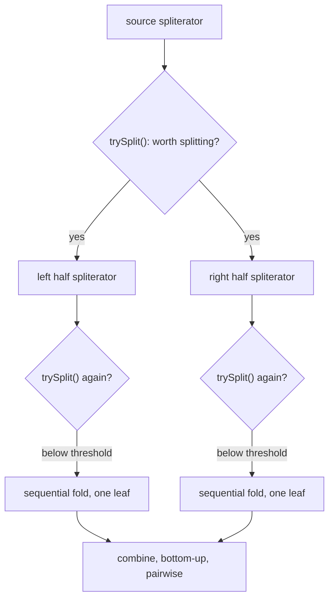

> **Recall layer.** The interview answers are [Q37](/docs/java/streams#q37)
> and [Q41](/docs/java/streams#q41). This page is for the model underneath
> them: what a pipeline actually does between `.stream()` and the terminal
> operation, and what changes when you insert `.parallel()`.

## 1. The problem it exists to solve

Run this:

```java
List<Integer> nums = IntStream.rangeClosed(1, 1_000_000).boxed().toList();

int seq = nums.stream().reduce(0, (a, b) -> a - b);
int par = nums.parallelStream().reduce(0, (a, b) -> a - b);

System.out.println(seq);
System.out.println(par);
```

`seq` prints the same number every time you run it — a large negative value,
because sequential reduction folds left to right in a fixed order.
`par` prints a *different* number nearly every run. Not an exception, not a
crash. A silently wrong, silently non-reproducible answer, from code that
type-checks, compiles, and looks like the textbook example of "just add
`.parallel()`."

Nothing is broken. `reduce`'s contract requires the accumulator to be
**associative** — `(a op b) op c == a op (b op c)` — because parallel
reduction doesn't fold left to right at all. It builds a tree: the source is
split into chunks, each chunk is folded independently, and the partial
results are combined pairwise, in whatever order the splits happened to
produce. Subtraction isn't associative, so which sub-results get combined
with which, and in what order, changes the answer — and that order is an
implementation detail of how the source happened to split on that particular
run, not something your code controls or can see.

**The insight to carry away:** a stream pipeline is not "a fancy loop." A
sequential pipeline behaves like one, which is exactly what hides the
assumption — `reduce`, `collect`, and every stateful lambda you write for a
stream secretly promise associativity and non-interference, and Java only
checks that promise by refusing to compile the *type* signature, never the
*algebraic* property. The loop-shaped code and the tree-shaped execution are
different models, and this page is about the second one.

## 2. What a pipeline actually is

A stream pipeline is three things layered together, and confusing them is
where most misunderstanding starts.

**A description, not a computation.** `stream().filter(f).map(g)` builds a
linked chain of `Stage` objects — a plan — and does nothing else. No element
of the source is touched. This is why `Stream.iterate(1, i -> i + 1).filter(
i -> i % 7 == 0)` doesn't hang on construction: construction allocates a
chain, it doesn't run one.

**A pull, not a push.** When the terminal operation runs, it doesn't ask
"give me all your output" — it asks the *source* to hand over one element at
a time, and each element is driven through the *entire* chain of stages
before the next element is even requested. The mechanism is a chain of
`Sink` objects, each stage wrapping the next: `source.forEachRemaining(sink)`
where `sink.accept(x)` calls `filterSink.accept(x)`, which — if `x` passes —
calls `mapSink.accept(x)`, which calls the next stage, and so on down to the
terminal sink. One element goes all the way through before the next one is
pulled. This is **fusion**: `list.stream().filter(f).map(g).collect(toList())`
is one pass over the source with no intermediate `List` ever allocated for
the filtered or mapped values, regardless of how many `.map`/`.filter` stages
sit in between.

**Why this design and not another.** The alternative most people have
already used is Guava's `FluentIterable` or a hand-rolled `for` loop that
materialises a `List` between each step — call it two, three, four passes,
one per stage, with a full collection allocated at every boundary. That's
simple to implement and easy to reason about, and it is exactly what streams
were built to avoid: for a million-element source and four stages, that's
three million-element lists allocated and discarded for information that a
single pass could produce without any of them. The pull/fusion model buys
back that allocation at the cost of a real constraint — see §4 — and it is
also what makes parallel decomposition possible at all: a push-based design
(RxJava's `Observable`, reactive streams' `Publisher`) has the producer drive
the consumer directly, which composes naturally with asynchronous, unbounded,
possibly-never-finishing event sources, but has no equivalent of "split the
work into a tree and fold it bottom-up," because there is no bounded,
splittable *source* to divide — only a sequence of events arriving over time.
Streams chose pull because the target workload is a **bounded, in-memory (or
file-backed) data set you want processed once, fast, optionally in
parallel** — not an event feed.

## 3. The core model: spliterators and the split-compute-combine tree

Sequential execution is the pull model from §2, end to end. Parallel
execution keeps the same Sink chain but wraps it in a fork/join computation,
and the object that makes this possible is the **`Spliterator`** — a
"splittable iterator." Its defining method:

```java
Spliterator<T> trySplit();
```

`trySplit()` claims roughly half of the remaining elements, returns a new
spliterator covering them, and leaves the original covering the rest. Calling
it repeatedly, recursively, on both halves, is how a bounded sequential
source becomes a balanced binary tree of chunks small enough to fold cheaply
and combine back together.



Each leaf runs the ordinary sequential pull from §2 — the Sink chain is
identical in both modes, which is the point: parallelism is entirely a
property of how the *source* is decomposed, not a different execution
strategy for the stages themselves. Leaves are submitted as
`ForkJoinTask`s on `ForkJoinPool.commonPool()` (see §5), and results climb
back up the tree through the **combiner** — the third argument to
`collect(supplier, accumulator, combiner)`, or the second argument to
three-arg `reduce`. That combiner is called exactly at every join in the
tree above, in whatever pairing the split structure produced, which is
precisely why §1's subtraction example is non-deterministic: the *shape* of
that tree is decided by `trySplit()`, not by your code.

**How well a source splits is not a detail, it's the whole performance
story.** `Spliterator` reports *characteristics* — `SIZED`, `SUBSIZED`,
`ORDERED`, `IMMUTABLE`, among others — that tell the framework how cheaply
and evenly it can divide:

- **`ArrayList` / arrays** report `SIZED` and `SUBSIZED`: the spliterator
  knows the exact remaining count and can split by index range in O(1),
  producing a perfectly balanced tree with no traversal cost.
- **`LinkedList`** has no random access, so its spliterator can't jump to a
  midpoint — it has to *walk* to find one, an O(n) operation on every split.
  The splitting itself competes with the work being parallelised.
- **`Stream.iterate(seed, next)`** (unbounded, two-arg form) reports an
  estimated size of `Long.MAX_VALUE` and effectively refuses to split
  usefully at all, because there's no way to know where "half" is in an
  infinite sequence. `HashMap`/`HashSet` split reasonably well by walking
  hash-table buckets, worse than an array but far better than a linked
  structure.

This is why Q40's "which sources parallelise well" answer isn't a rule of
thumb to memorise — it's a direct consequence of one method on one interface,
and it's checkable: call `spliterator().characteristics()` on any source and
read off `SIZED`/`SUBSIZED` yourself instead of guessing.

## 4. What this does not give you

**Not automatic correctness for non-associative or stateful operations.**
§1 is the whole lesson: `reduce` and `collect` are contracts, not runtime
checks. `Collector.Characteristics.CONCURRENT` on a hand-written collector
(Q41's follow-up) is an even sharper version — it tells the framework "skip
the tree, hand every thread the *same* mutable container," which is only
safe if your accumulator is genuinely thread-safe. Get any of this wrong and
the failure is silent and data-dependent, never a compile error.

**Not a query optimiser.** SQL and LINQ providers can push a `WHERE` before
a `JOIN` because a query planner examines the whole expression tree before
running anything. A Java stream pipeline has no such phase — stage order is
executed exactly as written, one sink calling the next. `list.stream()
.map(expensive).filter(cheap)` does the expensive map on every element,
including ones the filter would have discarded, and nothing rewrites it to
`.filter(cheap).map(expensive)` for you. Whatever fusion happens (§2) is
about *avoiding intermediate collections*, not about *reordering* your
stages — that optimisation is on you.

**Not free parallelism, and not always faster.** Splitting, forking,
scheduling and combining are themselves work. Below roughly the tens-of-
thousands-of-elements mark, or with a cheap per-element operation, that
overhead outweighs anything gained — Q40's rule of thumb, now visible as a
direct trade against the tree in §3, not folklore.

**Not a substitute for a bounded, splittable design when you don't have
one.** A page's own lab (§6) will show a source that resists splitting
turning `.parallel()` from a speedup into a wash or a regression; the fix
is never "parallelise harder," it's picking or building a source
(`Spliterator`) with real `trySplit()` support.

## 5. Adjacent guarantees and interactions

**With the shared `ForkJoinPool` ([Thread Pools and Little's Law](/docs/concepts/thread-pools)).**
Every parallel stream, everywhere in the JVM, submits its leaf tasks to
`ForkJoinPool.commonPool()` unless it's invoked from inside a task already
running on a different pool. This is not a stream-pipelines guarantee at
all — it's a consequence of which thread pool §3's tree happens to run on,
and Little's Law governs it exactly the way it governs any other pool: one
parallel stream doing blocking I/O starves every other parallel stream, and
every library, running anywhere in that process at that moment. This is a
cross-cutting fact about the pool, not a special stream failure mode — it
just surfaces here because parallel streams are the most common accidental
way to submit blocking work to a pool that was never sized or reviewed for
it.

**With the JIT ([The JIT](/docs/concepts/jit)).** A stream pipeline compiles
down to a chain of virtual calls through `Sink.accept` — exactly the kind of
call site the JIT needs to see as monomorphic to inline and, from there,
scalar-replace away the per-stage wrapper objects entirely. A stable,
unchanging pipeline shape in a hot loop is a strong inlining candidate; a
pipeline built differently on every call (a lambda captured fresh, a
different `Collector` chosen per invocation) defeats exactly the
speculation the JIT relies on, and Q47's "streams are sometimes slower"
answer is this mechanism from the other side.

## 6. Lab: measure the fusion claim and the splitting claim

Both claims in this page — "fusion means one pass, not one pass per stage"
and "splitting quality decides whether parallel helps" — are measurable, not
just plausible. Use JMH; a hand-timed loop measures JIT warm-up, not the
pipeline.

### Lab 1 — fused pipeline vs materialising chain

```java
@State(Scope.Benchmark)
public class FusionBenchmark {
    List<Integer> data;

    @Setup
    public void setup() {
        data = IntStream.range(0, 1_000_000).boxed().toList();
    }

    @Benchmark
    public long fused() {
        return data.stream()
            .filter(x -> x % 2 == 0)
            .map(x -> x * 3)
            .filter(x -> x % 5 != 0)
            .mapToLong(x -> x)
            .sum();
    }

    @Benchmark
    public long materialising() {
        List<Integer> a = new ArrayList<>();
        for (int x : data) if (x % 2 == 0) a.add(x);
        List<Integer> b = new ArrayList<>();
        for (int x : a) b.add(x * 3);
        List<Integer> c = new ArrayList<>();
        for (int x : b) if (x % 5 != 0) c.add(x);
        long sum = 0;
        for (int x : c) sum += x;
        return sum;
    }
}
```

Run with `-prof gc` alongside the timing. The interesting number isn't just
throughput — it's allocation rate. `materialising` allocates three
intermediate `ArrayList`s per invocation; `fused` allocates none, and
`-prof gc`'s `norm alloc rate` column should show it directly.

### Lab 2 — splittable vs unsplittable source under `.parallel()`

```java
@State(Scope.Benchmark)
public class SplitBenchmark {
    List<Integer> arrayBacked;
    LinkedList<Integer> linkedBacked;

    @Setup
    public void setup() {
        arrayBacked = new ArrayList<>(IntStream.range(0, 2_000_000).boxed().toList());
        linkedBacked = new LinkedList<>(arrayBacked);
    }

    @Benchmark
    public long arraySequential() { return arrayBacked.stream().mapToLong(this::costly).sum(); }

    @Benchmark
    public long arrayParallel()   { return arrayBacked.parallelStream().mapToLong(this::costly).sum(); }

    @Benchmark
    public long linkedSequential() { return linkedBacked.stream().mapToLong(this::costly).sum(); }

    @Benchmark
    public long linkedParallel()   { return linkedBacked.parallelStream().mapToLong(this::costly).sum(); }

    private long costly(int x) {
        long h = x;
        for (int i = 0; i < 50; i++) h = h * 31 + i;   // cheap but non-trivial per element
        return h;
    }
}
```

Expect `arrayParallel` to scale close to core count over `arraySequential`.
Expect `linkedParallel` to barely beat, or lose to, `linkedSequential` —
confirm it by printing `linkedBacked.spliterator().characteristics()` and
`arrayBacked.spliterator().characteristics()` side by side; the array reports
`SIZED | SUBSIZED`, the linked list does not. That flag difference is the
entire explanation for whatever the benchmark shows.

## 7. Leading on this

**Treat `.parallel()` as a decision requiring a benchmark, not a keyword you
add when something feels slow.** §6's second benchmark is the review
question to ask: "what does `.spliterator().characteristics()` report for
this source, and did you measure it against sequential?" A `.parallel()`
added without either is a guess, and §3 shows exactly why the guess can be
wrong in either direction.

**Ban blocking calls inside any parallel-stream lambda, full stop.** The
shared-pool fact in §5 means one team's forgotten `.parallel()` around a
database call can degrade an unrelated team's request-handling code in the
same JVM. This is worth a static-analysis rule, not just a code-review
reminder, because the damage is non-local — the offending line and the
victim are in different files, sometimes different services sharing a
runtime.

**Require associativity as an explicit code-review question on any
`reduce`/`collect` that might ever run in parallel.** "Would this still be
correct if the accumulator ran on chunks in an arbitrary order and the
results were combined pairwise?" is a question with a checkable yes/no
answer, and §1 is the canonical demonstration of what happens when nobody
asked it.

**Teach the Sink chain once, with a whiteboard trace of one element.**
Walking a single value through `filter → map → filter → terminal` by hand —
the way §2 describes it — is what converts "streams are a fancy loop" into
an accurate mental model, and it's the same 30-minute investment the JMM
page's piggyback trace is for concurrency.

## 8. Where to go deeper

- Brian Goetz, "State of the Lambda" and the `java.util.stream` package
  design documents on the OpenJDK Lambda project pages — the primary source
  for *why* pull-based fusion was chosen over a push-based design.
- Doug Lea, "A Java Fork/Join Framework" — the paper behind
  `ForkJoinPool`, which every parallel stream runs on; read this before
  assuming parallel streams have their own scheduler.
- JDK source: `java.util.stream.AbstractPipeline`, `ReduceOps`, and
  `Spliterators` — the Sink-chain and split-tree mechanisms in §2 and §3 are
  not black boxes; they're a few thousand lines of unusually readable JDK
  code.
- `Stream.mapMulti` (JDK 16) and the three-argument bounded
  `Stream.iterate` plus `Stream.ofNullable` (both JDK 9) — none of the three
  shipped under their own JEP, just as ordinary `java.util.stream` API
  additions, so check the Javadoc for the version you're targeting rather
  than assuming an API existed earlier than it did or looking for a JEP
  number that isn't there.
- Urma, Fusco & Mycroft, *Java 8 in Action* — still the clearest worked
  treatment of collectors and parallel decomposition for anyone meeting the
  Sink/Spliterator model for the first time.

## 9. Self-check

<SelfCheck>

<SelfCheckItem n={1} where="§1 The problem it exists to solve; §3 The core model: spliterators and the split-compute-combine tree.">

Why does `nums.parallelStream().reduce(0, (a, b) -> a - b)` produce a
different wrong answer on different runs, when the sequential version is
perfectly deterministic — and whose fault is it, the JVM's or the code's?

</SelfCheckItem>

<SelfCheckItem n={2} where="§2 What a pipeline actually is.">

`list.stream().filter(f).map(g).collect(toList())` over a million-element
list. How many intermediate collections does this allocate, and what
mechanism makes that number possible?

</SelfCheckItem>

<SelfCheckItem n={3} where="§3 The core model: spliterators and the split-compute-combine tree.">

`ArrayList` parallelises well and `LinkedList` mostly doesn't, even
though both implement the same `Stream` API. What single method call
explains the entire difference?

</SelfCheckItem>

<SelfCheckItem n={4} where="§5 Adjacent guarantees and interactions, with the JIT.">

A hot pipeline's shape changes on every invocation — a different
`Collector` is chosen per call based on a runtime flag. What does this
cost you that a stable pipeline shape doesn't?

</SelfCheckItem>

<SelfCheckItem n={5} where="§4 What this does not give you.">

Why doesn't `list.stream().map(expensiveThing).filter(cheapCheck)`
automatically get reordered to filter first, the way a SQL planner would
reorder a `WHERE` before a `JOIN`?

</SelfCheckItem>

<SelfCheckItem n={6} where="§5 Adjacent guarantees and interactions, with the shared ForkJoinPool.">

Two teams share a JVM. Team A adds `.parallel()` around a stream that
calls a slow external HTTP client. Team B's unrelated request-handling
code, which does no stream processing at all, starts timing out. Explain
the connection.

</SelfCheckItem>

<SelfCheckItem n={7} where="§3 The core model: spliterators and the split-compute-combine tree.">

`Stream.iterate(1, i -> i + 1)` (two-arg form) and `IntStream.range(0,
1_000_000)` are both bounded-in-practice-enough to parallelise usefully.
Would you expect them to split equally well? Why or why not?

</SelfCheckItem>

</SelfCheck>
