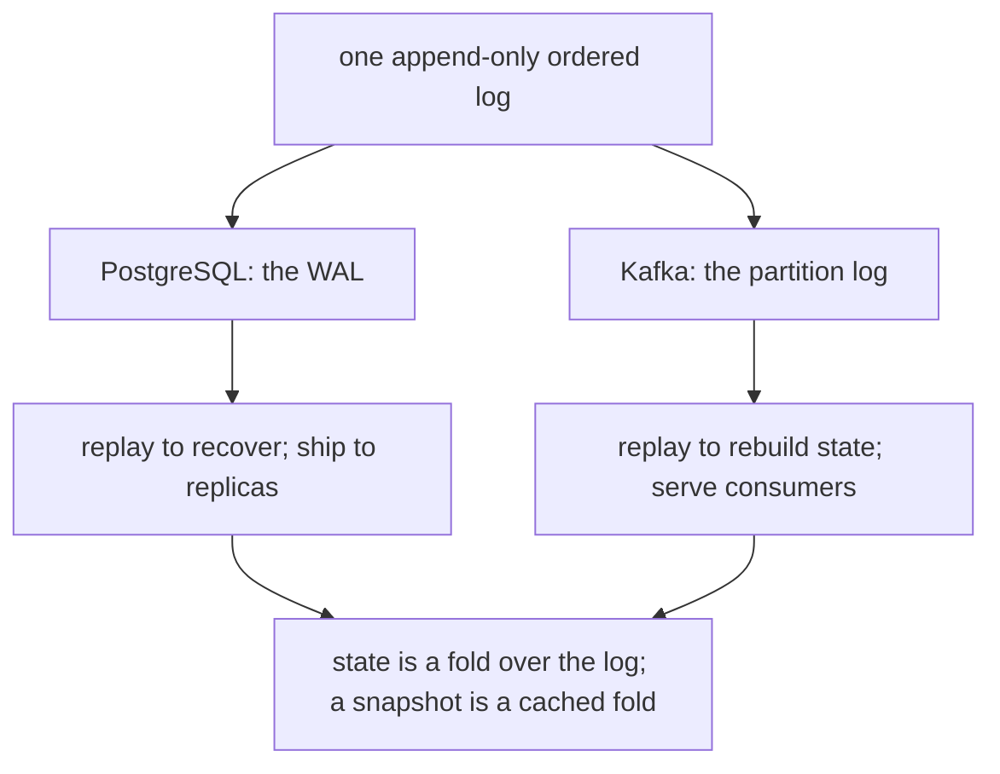

> **Recall layer.** The interview answers are
> [Q38](/docs/data/transactions-mvcc#q38) and
> [Q106](/docs/data/kafka#q106). This page builds the model that connects them.

## 1. The problem it exists to solve

Four things that look unrelated:

- PostgreSQL survives a power cut without losing committed transactions.
- A read replica stays in sync with its primary.
- Kafka handles a million messages a second on ordinary disks.
- Debezium streams every row change into your data warehouse without touching
  the application.

They are the same mechanism. Not analogous — *the same*. An append-only ordered
log, and a set of cursors into it.

Once you see it, a large amount of infrastructure stops being separate things to
memorise. Replication lag, consumer lag, and CDC lag become one concept.
Replication slots, consumer offsets, and `restart_lsn` become one concept. And
the failure modes rhyme: in all three, a stalled reader causes the writer to
accumulate storage until something breaks.

## 2. Why append-only is fast

The physical fact underneath everything else: **sequential writes are one to
three orders of magnitude faster than random writes**, on spinning disks and on
SSDs both.

On a spinning disk that's seek time — no seek if the head is already there. On
an SSD it's the flash translation layer: sequential writes fill erase blocks
cleanly, while random writes cause read-modify-write cycles and write
amplification. And at both layers, the OS can batch, coalesce and prefetch
sequential access in ways it cannot for random access.

So a design that turns random writes into sequential ones wins enormously. That
is the trick, and it's the same trick in all four systems above.

A database's data pages are inherently random-access — you update the row where
it lives. So instead of making every commit wait for random page writes, you
**append a description of the change to a log**, flush that (sequential, fast),
and acknowledge. The pages get written later, in the background, in whatever
order is efficient.

## 3. Write-ahead logging

The rule that gives WAL its name: **the log record describing a change must
reach durable storage before the changed page does.**

The commit path in PostgreSQL:

1. Modify the page in shared buffers (in memory only).
2. Append a WAL record describing the change to the WAL buffer.
3. On commit, flush WAL up to this transaction's LSN — an `fsync`.
4. Acknowledge the commit.
5. Later, a background writer flushes dirty pages. At a **checkpoint**, all of
   them.

Durability comes entirely from step 3. If the machine dies at step 5, recovery
replays the log from the last checkpoint and reconstructs everything.

Two details worth carrying:

**The LSN** (Log Sequence Number) is a monotonic position in the log. It is the
system's clock. Replication position, recovery target, and consistency
comparisons are all expressed in LSNs — exactly as Kafka expresses everything in
offsets.

**Group commit.** Many concurrent transactions share one `fsync`, so throughput
improves with concurrency up to a point. This is why a single-threaded writer
often has worse throughput than eight concurrent ones.

**The checkpoint trade-off.** Checkpoints bound recovery time — you only replay
from the last one — but flushing gigabytes of dirty pages at once creates an I/O
storm. Hence `max_wal_size` (how much log before forcing a checkpoint) and
`checkpoint_completion_target` (spread the writes across the interval instead of
bunching them). Frequent checkpoints mean fast recovery and worse steady-state
latency. That is a dial, not a setting.

## 4. The log is also the replication stream

Here's the leap. You have already written a complete, ordered, durable
description of every change. A replica doesn't need anything else — ship it the
log and let it replay.

That's **physical replication**: byte-level WAL streamed to a standby that
applies it. The replica is, precisely, *a consumer at a position in the log*.
Replication lag is the distance between the primary's LSN and the replica's.

**Synchronous vs asynchronous** is just: does the primary wait for the replica
to confirm a position before acknowledging the commit? Async means your RPO is
the lag at the moment of failure ([Q39](/docs/data/transactions-mvcc#q39)).

**Logical replication / CDC** is the same stream, decoded. Logical decoding
turns physical WAL records into logical row changes — insert, update, delete
with column values. Debezium consumes that and publishes to Kafka
([Q43](/docs/data/transactions-mvcc#q43)).

So CDC is not a separate integration technology bolted onto the database. It is
the replication stream, read by something that isn't a replica.

### And a replication slot is a consumer offset

A slot records how far a consumer has read, and **guarantees the primary retains
WAL until then**. If the consumer stops, WAL accumulates.

That should sound familiar, because it's Kafka's retention problem exactly. And
it's the same failure: a dead consumer fills the producer's disk. In PostgreSQL
that stops the database. Which is why `max_slot_wal_keep_size` exists, and why
slot lag is one of the alerts that matters most.

There's a second, subtler cost specific to PostgreSQL: a slot also pins the xmin
horizon, so an abandoned slot blocks vacuum across the whole database and causes
bloat — connecting directly to the [MVCC page](/docs/concepts/mvcc).

## 5. Kafka: when the log stops being an implementation detail

In a database, the log is a mechanism that supports the tables. Kafka's
insight was to **expose the log itself as the product** and delete the tables.

The structure is exactly what you'd now expect. A partition is an append-only
log on disk, split into segment files with sparse offset and timestamp indexes.
Every record has a monotonic offset. Producers append. Consumers hold an offset
and read forward.

Everything Kafka is fast at follows from the same physics as WAL:

- **Sequential I/O**, as above.
- **The page cache instead of an application cache** — Kafka writes to the OS
  page cache and lets the kernel handle writeback and readahead, so recently
  written data is served from memory with no copy and no JVM heap pressure.
- **Zero-copy** — `sendfile` moves bytes from page cache straight to the socket
  without passing through user space. (Note it's disabled by TLS or by
  recompression for older clients, which explains sudden throughput drops.)

And the properties that make it useful for integration follow from the log being
*retained* rather than consumed:

- **Consumers track their own offsets**, so several independent consumer groups
  read the same data with no coordination.
- **Replay is trivial** — seek to an earlier offset.
- **Ordering is per-partition**, because a log is ordered and partitions are
  independent logs.

The difference from a queue is not throughput. It's that a queue's read is
destructive and a log's read is a cursor move.

### Retention vs compaction

Two policies over the same structure ([Q113](/docs/data/kafka#q113)):

- **delete** — drop segments past a time or size bound. The log is a buffer.
- **compact** — retain at least the latest record per key forever, with null
  values as tombstones. The log becomes a *changelog of current state*.

A compacted topic is a table expressed as a log. Replay it from the start and
you have materialised the current value of every key. That is precisely what a
database replica does with WAL, and precisely what Kafka Streams does to restore
a state store.

## 6. The unifying idea

> **State is a fold over an ordered log. A snapshot is a cached fold.**



Every system on this page is an instance:

| System | The log | The fold | The snapshot |
|---|---|---|---|
| PostgreSQL | WAL | crash recovery replay | checkpointed data pages |
| Replica | streamed WAL | apply process | the replica's data files |
| Kafka Streams | changelog topic | state store restore | RocksDB store + standby |
| Event sourcing | event stream | replay into an aggregate | periodic snapshot |
| Outbox → CDC | WAL / outbox table | consumer projection | the read model |

This is why the same three questions apply everywhere: *how far behind is the
reader* (lag), *what happens if it stops* (retention pressure on the writer),
and *can we rebuild from the log if the snapshot is lost* (replay).

If you can answer those three for any log-shaped system, you can operate it.

## 7. What this does *not* explain

- **Consensus.** The log gives you ordering and durability on one node. Agreeing
  on the log's contents across nodes is Raft/Paxos, which is a different problem
  — and it's why Kafka's KRaft controller and etcd exist.
- **Transactions across partitions.** A single log is ordered; two logs are not
  jointly ordered without extra machinery (Kafka's transactional markers,
  two-phase commit).
- **Query.** A log supports sequential reads by position. Answering "where is
  account 42's balance" requires a materialised view. Kafka is not a database
  ([Q123](/docs/data/kafka#q123)).
- **Erasure.** An append-only, retained log makes GDPR deletion structurally
  hard. Crypto-shredding is the usual answer, and it must be designed in.

## 8. Lab: the same shape twice

### Lab 1 — watch WAL advance

```bash
docker run --rm -d --name pg -e POSTGRES_PASSWORD=x -p 5432:5432 postgres:18
psql postgresql://postgres:x@localhost/postgres
```

```sql
SELECT pg_current_wal_lsn();
CREATE TABLE t (id serial primary key, v text);
INSERT INTO t (v) SELECT repeat('x',100) FROM generate_series(1,100000);
SELECT pg_current_wal_lsn();
```

Take the difference:

```sql
SELECT pg_size_pretty(pg_wal_lsn_diff('<after>','<before>'));
```

You just measured how many bytes of log 100,000 rows produced. Now add five
indexes and repeat — watch WAL volume multiply. That is the write amplification
from the [MVCC page](/docs/concepts/mvcc) made visible as bytes.

### Lab 2 — look inside the log

```bash
docker exec -it pg bash -c 'ls -la $PGDATA/pg_wal | head'
docker exec -it pg bash -c 'pg_waldump $PGDATA/pg_wal/$(ls $PGDATA/pg_wal | head -1) | head -20'
```

Read a few records. Seeing `INSERT`, `HEAP`, `BTREE_INSERT` entries makes the
abstraction concrete in a way no diagram does.

### Lab 3 — create a slot and starve it

```sql
SELECT pg_create_logical_replication_slot('test_slot', 'test_decoding');
INSERT INTO t (v) SELECT repeat('y',100) FROM generate_series(1,200000);

SELECT slot_name, active,
       pg_size_pretty(pg_wal_lsn_diff(pg_current_wal_lsn(), restart_lsn)) AS retained
FROM pg_replication_slots;
```

Nobody is consuming, so `retained` grows and never shrinks. **This is the
mechanism that fills production disks.** Then consume it and watch it drop:

```sql
SELECT count(*) FROM pg_logical_slot_get_changes('test_slot', NULL, NULL);
SELECT slot_name, pg_size_pretty(pg_wal_lsn_diff(pg_current_wal_lsn(), restart_lsn)) FROM pg_replication_slots;
```

Then drop it — an orphaned slot on a real system is an outage waiting to happen:

```sql
SELECT pg_drop_replication_slot('test_slot');
```

### Lab 4 — the same thing in Kafka

```bash
docker run --rm -d --name kafka -p 9092:9092 apache/kafka:latest
docker exec -it kafka bash
cd /opt/kafka/bin
./kafka-topics.sh --create --topic demo --partitions 3 --bootstrap-server localhost:9092
./kafka-console-producer.sh --topic demo --bootstrap-server localhost:9092
# type some lines, ctrl-D
ls -la /tmp/kraft-combined-logs/demo-0/
./kafka-dump-log.sh --files /tmp/kraft-combined-logs/demo-0/00000000000000000000.log --print-data-log | head
```

You are looking at the same structure as `pg_waldump` output: ordered records
with positions, in a segment file.

### Lab 5 — consumer lag is replication lag

```bash
./kafka-consumer-groups.sh --bootstrap-server localhost:9092 --describe --group g1
```

`LOG-END-OFFSET` minus `CURRENT-OFFSET` is lag. Compare with:

```sql
SELECT pg_wal_lsn_diff(pg_current_wal_lsn(), restart_lsn) FROM pg_replication_slots;
```

Same quantity, different units. **If you do one thing from this page, run Labs 3
and 5 back to back** — the moment those two feel like one concept, the page has
done its job.

## 9. Leading on this

**Alert on lag as time, not as bytes or messages.** "40,000 messages behind"
means nothing to anyone outside the team; "settlement events are 12 minutes
late" is actionable and communicates to the business. Same for replication:
graph seconds, not LSN distance.

**Treat every log-shaped system as having the same three risks**, and audit for
them together: reader lag, writer-side retention pressure from a stalled reader,
and whether the downstream can be rebuilt by replay. A single runbook covering
replication slots, Kafka consumer groups and CDC connectors is better than three
separate ones, because the operator's mental model transfers.

**Make replay a tested capability, not a theory.** If you cannot rebuild the
search index or the read model from the log in an afternoon, that store has
quietly become a system of record and you have an undiscovered data-loss
problem. Schedule the drill.

**Push back on "we'll just publish an event".** Inside a process that's cheap;
across a boundary it's the dual-write problem, and the fix is the outbox, which
is itself a log ([Q136](/docs/data/cross-cutting#q136)). Recognising that the
outbox table *is* a WAL you built yourself is what makes the pattern obvious
rather than arbitrary.

**Use the shared shape when teaching.** Explaining Kafka to someone who knows
PostgreSQL is dramatically easier if you start from "you already know this — it's
WAL, but the log is the product." One good analogy replaces a week of
documentation.

## 10. Where to go deeper

- Jay Kreps, "The Log: What every software engineer should know about real-time
  data's unifying abstraction" — the essay that made this connection famous, and
  still the best single thing to read on it.
- Mohan et al., "ARIES" (1992) — the write-ahead logging and recovery algorithm
  that essentially every relational database implements.
- PostgreSQL docs, "Reliability and the Write-Ahead Log" and "High
  Availability, Load Balancing, and Replication" — by title, because the
  numbering moves between major versions (28 and 26 in PostgreSQL 18).
- Martin Kleppmann, *Designing Data-Intensive Applications*, chapters 3 and 5 —
  storage engines and replication, in that order.
- Kafka's design documentation on the log, and KIP-405 (tiered storage) for how
  retention economics change when the log outgrows local disk.

## 11. Self-check

<SelfCheck>

<SelfCheckItem n={1} where="§2 Why append-only is fast; §3 Write-ahead logging.">

Why does writing a log record *and then* a data page make commits faster than
writing the data page directly?

</SelfCheckItem>

<SelfCheckItem n={2} where="§3 Write-ahead logging, the LSN.">

What is an LSN, and what is its exact counterpart in Kafka?

</SelfCheckItem>

<SelfCheckItem n={3} where="§4 And a replication slot is a consumer offset; §8 Lab 3 — create a slot and starve it.">

Explain a PostgreSQL replication slot as a consumer offset. What does each
guarantee to its writer, and what happens when the reader dies?

</SelfCheckItem>

<SelfCheckItem n={4} where="§4 And a replication slot is a consumer offset.">

Why does an abandoned replication slot cause both disk exhaustion *and* table
bloat? (Two independent mechanisms.)

</SelfCheckItem>

<SelfCheckItem n={5} where="§3 Write-ahead logging, the checkpoint trade-off.">

What does a checkpoint trade against what? Name the two settings that move
the dial and which direction each goes.

</SelfCheckItem>

<SelfCheckItem n={6} where="§5 Retention vs compaction.">

What is a compacted Kafka topic equivalent to in database terms, and what
does replaying it from offset 0 produce?

</SelfCheckItem>

<SelfCheckItem n={7} where="§7 What this does not explain.">

Why can't you answer "what is account 42's balance" from a log alone, and
what do you need to build?

</SelfCheckItem>

<SelfCheckItem n={8} where="§5 Kafka: when the log stops being an implementation detail.">

Zero-copy is disabled in two situations. Name them and explain the observable
symptom.

</SelfCheckItem>

</SelfCheck>
