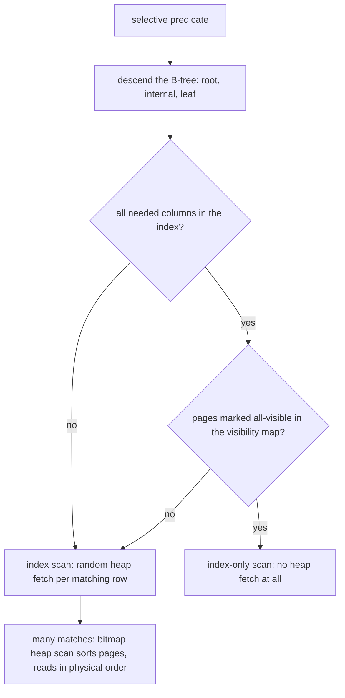

## Q16. How do you read `EXPLAIN ANALYZE`? [#q16]

<Question id="q16">

**Answer.** Read it inside-out, bottom-up: leaf nodes are scans, parents are joins and aggregations. For each node I look at four things:

1. **Estimated vs actual rows.** A 1000× discrepancy is the root cause of most bad plans — the planner chose a nested loop because it expected 3 rows and got 300,000. Fix the estimate (statistics, extended statistics, a rewritten predicate), not the plan.
2. **Actual time and loops.** The displayed time is *per loop*; total cost is `time × loops`. A 0.05 ms node executed 200,000 times is your 10-second query.
3. **Rows removed by filter.** High values mean you're reading far more than you need — a missing or wrong index.
4. **Buffers** (`EXPLAIN (ANALYZE, BUFFERS)`) — shared hit vs read tells you whether you're cache-resident or hitting disk, which is the difference between "this query is fine" and "this query is fine on my laptop".

I also watch for spills: `Sort Method: external merge Disk: 250MB` means `work_mem` is too low for this query, and raising it (per session) can be a 10× win.

<FollowUp q="What's the difference between `EXPLAIN` and `EXPLAIN ANALYZE`?">

`EXPLAIN` shows the plan and estimates without running. `EXPLAIN ANALYZE` actually executes — so on an `UPDATE` or `DELETE` it will modify data unless you wrap it in a transaction and roll back. That's a mistake you only make once.

</FollowUp>

</Question>

## Q17. Explain sequential scan, index scan, index-only scan, and bitmap heap scan. [#q17]

<Question id="q17">

**Answer.**
- **Sequential scan** — read every page in order. High throughput per page, and it's the *right* choice for low-selectivity predicates or small tables. Seeing one isn't automatically a bug.
- **Index scan** — descend the tree, then fetch each matching row from the heap. Random I/O per row, so it wins only when few rows match. Preserves index order, so it can satisfy `ORDER BY` for free.
- **Index-only scan** — all needed columns are in the index; no heap fetch (subject to the visibility map, Q5).
- **Bitmap heap scan** — the middle ground. Scan the index, build a bitmap of *pages* to visit, sort it, then read those pages in physical order. This converts random I/O into something closer to sequential, and it lets the planner combine multiple indexes with `BitmapAnd`/`BitmapOr`. It loses index ordering, so it usually implies a separate sort.



**Why it matters.** Knowing that bitmap scans exist explains why the planner sometimes uses two mediocre indexes together instead of one good one, and why adding the right composite index eliminates a `BitmapAnd` and a sort in one move.

</Question>

## Q18. Compare the join algorithms and when each is chosen. [#q18]

<Question id="q18">

**Answer.**
- **Nested loop** — for each outer row, probe the inner. Optimal when the outer side is tiny and the inner has an index on the join key. Catastrophic when the outer row estimate is wrong: 10 estimated rows becomes 1M actual, and you do a million index probes. This is the single most common cause of a query that was fast yesterday and is 500× slower today.
- **Hash join** — build a hash table on the smaller side, probe with the larger. Great for large, unindexed equi-joins. Needs memory; spills to disk in batches when it exceeds `work_mem`, which is a big slowdown worth spotting in the plan.
- **Merge join** — sort both inputs (or use index order) and walk them together. Good for very large joins where both sides are already sorted, and for range joins. The sort is the cost.

The planner picks by estimated cardinality and available indexes and memory, so the fix for a bad join choice is almost always to fix the estimate or the index, not to hint the join.

<FollowUp q="How do you deal with a persistently bad plan?">

In order: `ANALYZE` and check statistics targets; add extended statistics for correlated columns; rewrite the query to be more estimable (materialise a CTE, split into two queries); add or reorder an index; and only as a last resort use engine-specific hints (`pg_hint_plan`, MySQL optimizer hints) or `SET LOCAL enable_nestloop = off` for one statement — with a comment explaining why, because it will rot.

</FollowUp>

</Question>

## Q19. Why does the planner make bad decisions? [#q19]

<Question id="q19">

**Answer.** Almost always cardinality estimation error, and it compounds multiplicatively up the plan tree. The specific causes:

- **Stale statistics** — a bulk load or a large delete without `ANALYZE`. Autovacuum's analyze threshold is proportional, so very large tables get analysed rarely.
- **Correlated columns** — the planner assumes independence, so `WHERE city = 'Kuala Lumpur' AND country = 'Malaysia'` is estimated as the product of two selectivities and comes out ~100× too low. Fix with `CREATE STATISTICS ... (dependencies, ndistinct)`.
- **Skewed distributions** — the histogram and most-common-values list have limited resolution; raise `default_statistics_target` (or per-column) for skewed columns.
- **Opaque predicates** — a function the planner can't estimate through, a parameter it can't see, or a join through a `jsonb` extraction.
- **Wrong cost constants** — `random_page_cost` at its default of 4.0 assumes spinning disks. On SSDs, 1.1–1.5 is realistic, and leaving it at 4 systematically biases the planner *away* from index scans.

**Why it matters.** The senior answer treats the planner as a cost model with inputs, not as a black box that's "being stupid". Almost every plan complaint is an input problem.

</Question>

## Q20. What is parameter sniffing / the generic plan problem? [#q20]

<Question id="q20">

**Answer.** When a prepared statement is planned once and reused, the plan is chosen for either the first parameter values seen (SQL Server-style sniffing) or for a generic estimate. If the data is skewed — `WHERE tenant_id = ?` where one tenant has 10 million rows and the rest have 100 — the plan that's optimal for one is disastrous for the other.

PostgreSQL's behaviour is specific and worth knowing: it uses custom plans for the first five executions, then compares the average custom cost against the generic plan cost, and switches to the generic plan if it isn't worse. You can force either with `plan_cache_mode = force_custom_plan` / `force_generic_plan`.

<FollowUp q="How do you fix it?">

Force custom plans for the affected statement; or split the query into two code paths for the skewed and normal cases; or add a partial index for the outlier; or, if the skew is a tenant, consider partitioning by tenant. In SQL Server the classic hints are `OPTIMIZE FOR UNKNOWN` and `RECOMPILE`.

</FollowUp>

</Question>

## Q21. How do you paginate a large result set? [#q21]

<Question id="q21">

**Answer.** `LIMIT ... OFFSET n` is O(n) — the engine must generate and discard the first n rows, so page 10,000 reads a million rows to return twenty. It also produces inconsistent results when rows are inserted or deleted between page requests: users see duplicates and skipped rows.

**Keyset (seek) pagination** fixes both. Remember the last row's sort key and continue from it:

```sql
SELECT * FROM payments
WHERE (created_at, id) < (:last_created_at, :last_id)   -- row comparison, stable tiebreak
ORDER BY created_at DESC, id DESC
LIMIT 20;
```

With an index on `(created_at, id)` this is O(log n) regardless of depth, and it's stable under concurrent inserts. The cost: you can't jump to an arbitrary page number, only next/previous — which is fine for infinite scroll and APIs, and negotiable for admin UIs.

<FollowUp q="How do you expose this in an API?">

An opaque cursor token — base64 of the sort key values, ideally signed so clients can't forge it into a full table scan. Return `next_cursor` with each page. That's what every well-designed API does (Stripe, GitHub), and it lets you change the underlying sort key without breaking clients.

</FollowUp>

</Question>

## Q22. `COUNT(*)` on a 500-million-row table takes 40 seconds. What do you do? [#q22]

<Question id="q22">

**Answer.** First, ask what the number is for. Most "total results" counts exist to render a page count nobody uses.

Options, in order:
- **Don't count.** Show "showing 1–20 of many", or fetch `LIMIT 21` and display "20+".
- **Approximate.** `SELECT reltuples FROM pg_class WHERE relname = 'x'` is free and accurate to within the last autovacuum. Good enough for dashboards.
- **Bounded count.** Count within a `LIMIT 1000` subquery: "1000+ results".
- **Maintained counter.** A summary table updated by trigger or by the application. Correct and fast, but now it's a contention point (every insert updates one row) — mitigate by sharding the counter into N rows and summing, or by incrementing asynchronously.
- **Materialised view** refreshed on a schedule for aggregate dashboards.

**Why it matters.** In PostgreSQL, `COUNT(*)` must visit every tuple to check visibility under MVCC — there's no O(1) row count, unlike MyISAM. Knowing *why* it's slow is what distinguishes this from a memorised trick.

</Question>

## Q23. What does a SQL-level N+1 look like, and how do you batch? [#q23]

<Question id="q23">

**Answer.** The application loop issuing one query per item: 500 items, 500 round trips, and even at 1 ms each that's half a second of pure latency. The database is not the bottleneck — the round trips are.

Fixes: a single query with `WHERE id = ANY(:ids)` or `IN (...)`; a join that returns everything at once; or `VALUES`-list joins for batch updates. For writes, multi-row `INSERT ... VALUES (...), (...), (...)` or JDBC batching with `rewriteBatchedStatements=true` (MySQL) — the difference is often 20–50×.

<FollowUp q="How large should a batch be?">

Big enough to amortise the round trip, small enough to avoid long locks and huge parse times — typically 500–5,000 rows. Beyond that you get diminishing returns and increased transaction duration, which hurts vacuum and lock waits. Chunk very large operations into batches with separate transactions so nothing holds locks for minutes.

</FollowUp>

</Question>

## Q24. When do window functions beat self-joins or application code? [#q24]

<Question id="q24">

**Answer.** Whenever you need per-row context from a group without collapsing rows: running totals (`SUM(...) OVER (PARTITION BY account ORDER BY ts)`), ranking (`ROW_NUMBER`, `RANK`, `DENSE_RANK`), gaps between events (`LAG`/`LEAD`), top-N per group, and moving averages.

The classic case is "the latest row per key". The self-join version scans twice and is error-prone with ties; the window version is one pass:

```sql
SELECT * FROM (
  SELECT *, ROW_NUMBER() OVER (PARTITION BY account_id ORDER BY created_at DESC) rn
  FROM balances
) t WHERE rn = 1;
```

In PostgreSQL, `DISTINCT ON (account_id)` is even more concise and often faster.

<FollowUp q="What are the performance considerations?">

Each distinct window frame (`PARTITION BY`/`ORDER BY` combination) may need its own sort, so reusing one frame across several window functions is much cheaper than five different ones. An index matching the partition+order can eliminate the sort entirely. And window functions run *after* `WHERE`, which is why you need the subquery to filter on `rn`.

</FollowUp>

</Question>

## Q25. CTEs: optimisation fence or not? [#q25]

<Question id="q25">

**Answer.** Historically in PostgreSQL, a `WITH` clause was always materialised — an optimisation fence, which people used deliberately to force a plan and accidentally to destroy one. Since PostgreSQL 12, non-recursive CTEs referenced once and without side effects are inlined by default, and you can control it explicitly with `MATERIALIZED` / `NOT MATERIALIZED`.

That control is genuinely useful: `MATERIALIZED` when the CTE is expensive and referenced multiple times, or when you want to force an expensive filter to happen first; `NOT MATERIALIZED` when you want predicates pushed down into it.

**Recursive CTEs** are for hierarchies and graph traversal — org charts, category trees, bill-of-materials, transitive account relationships. Always bound the depth, because a cycle in the data gives you an infinite loop; the standard defence is carrying a visited-path array and excluding revisits.

</Question>

## Q26. `IN` vs `EXISTS` vs `JOIN` — do they perform differently? [#q26]

<Question id="q26">

**Answer.** Modern planners usually transform between them, so for simple cases the plans are identical. The differences that persist:

- **`NOT IN` with a nullable subquery column is semantically different** and usually wrong (Q11). `NOT EXISTS` is a proper anti-join and both faster and correct.
- **`JOIN` can duplicate rows** if the right side has multiple matches; `EXISTS` is a semi-join and cannot. If you're adding `DISTINCT` to fix a join, you probably wanted `EXISTS`.
- **`EXISTS` can short-circuit** on the first match, which matters when the inner side is large.

My default: `EXISTS`/`NOT EXISTS` for "does a related row exist", `JOIN` when you actually need columns from the other table.

</Question>

## Q27. How do you find the slow queries in a system you've just inherited? [#q27]

<Question id="q27">

**Answer.** Not by reading code. `pg_stat_statements` (or MySQL's performance schema / slow query log) aggregates by normalised query text and gives you total time, mean time, calls, and rows. The critical insight: **order by total time, not mean time**. A 5 ms query called 2 million times an hour is a bigger problem than a 30-second report run daily, and it's the one that's invisible in the slow log because it's under the threshold.

Then: `pg_stat_user_tables` for sequential scans on large tables, `pg_stat_user_indexes` for unused indexes, and `pg_stat_activity` / `pg_locks` for what's blocking right now. On the application side, distributed tracing with the SQL statement as a span attribute tells you which endpoint generates which query, which the database can't tell you.

<FollowUp q="What do you check first during a live incident?">

Active queries sorted by duration, lock waits (`pg_blocking_pids`), connection count against the limit, and replication lag. Then decide whether to kill the offending query — `pg_cancel_backend` before `pg_terminate_backend`, because terminate kills the connection and can force a client-side reconnect storm.

</FollowUp>

</Question>

## Q28. What is a hot row and how do you deal with contention on it? [#q28]

<Question id="q28">

**Answer.** A single row updated by a large fraction of transactions — a global counter, a settlement account balance, a sequence table, an inventory count for a popular item. Every writer serialises on that row's lock, so throughput is bounded by the transaction duration, not by hardware. It also produces deadlocks when combined with other locks in inconsistent orders.

Mitigations:
- **Shorten the lock hold time** — update the hot row as the *last* statement in the transaction, and never hold it across a network call.
- **Shard the counter** — N rows, writers pick one by hash, readers sum. Turns one hot lock into N warm ones. The standard fix for high-throughput counters.
- **Append instead of update** — insert ledger entries and aggregate, rather than mutating a balance. Inserts don't contend.
- **Batch/aggregate** — accumulate in memory or a queue and apply periodically, accepting bounded staleness.
- **Move it out of the DB** — Redis `INCR` for a non-financial counter.

**Why it matters.** In payments this is a real design constraint: a merchant settlement account receiving 5,000 transactions a second cannot be a single mutable balance row.

</Question>

## Q29. How would you implement a job queue in a relational database? [#q29]

<Question id="q29">

**Answer.** `SELECT ... FOR UPDATE SKIP LOCKED` is the key primitive — it lets each worker grab rows that aren't already locked by another worker, instead of blocking:

```sql
WITH job AS (
  SELECT id FROM jobs
  WHERE status = 'PENDING' AND run_after <= now()
  ORDER BY run_after
  FOR UPDATE SKIP LOCKED
  LIMIT 1
)
UPDATE jobs SET status = 'RUNNING', locked_at = now(), attempts = attempts + 1
FROM job WHERE jobs.id = job.id
RETURNING jobs.*;
```

With a partial index on `(run_after) WHERE status = 'PENDING'`, this stays fast even when the table has hundreds of millions of completed rows. Add a visibility timeout (a sweeper that resets rows stuck in `RUNNING` past a deadline) so a crashed worker's job is retried, an attempts counter with a dead-letter status, and archiving of completed rows so the live set stays small.

**Why it matters.** For moderate throughput this is often the right answer — you get transactional enqueue with your business data for free (no dual-write problem, no outbox needed), plus queryability and existing operational tooling. The limits are throughput (thousands/sec, not millions), table bloat from the churn, and the lack of fan-out. Beyond that, move to a real broker.

<FollowUp q="How does this compare to an outbox?">

It's the same mechanism with a different purpose: an outbox is a queue whose consumer publishes to a broker. If a database queue meets your needs end-to-end, you may not need the broker at all — which is a legitimate architectural answer that many teams skip past.

</FollowUp>

</Question>

## Q30. Give me a query optimisation you actually performed. [#q30]

<Question id="q30">

**Answer.** (Have a real one ready. The shape that reads well:)

State the symptom with numbers — "a settlement report went from 4 seconds to 6 minutes over three months". State the diagnosis method — "`pg_stat_statements` showed it as top by total time; `EXPLAIN (ANALYZE, BUFFERS)` showed a nested loop with an estimate of 12 rows against 400,000 actual, because the planner assumed `merchant_id` and `currency` were independent". State the fix and the reasoning — "extended statistics on the correlated pair, which changed the plan to a hash join, plus a composite index on `(merchant_id, settled_at)` matching the filter and sort". State the result and the guard — "6 minutes to 900 ms, and I added a regression test asserting query count and a p95 alert on that endpoint so we'd notice next time before the users did".

**Why it matters.** Interviewers use this question to check that your earlier answers came from experience rather than reading. The measurement and the guard-rail at the end matter as much as the fix.

</Question>
