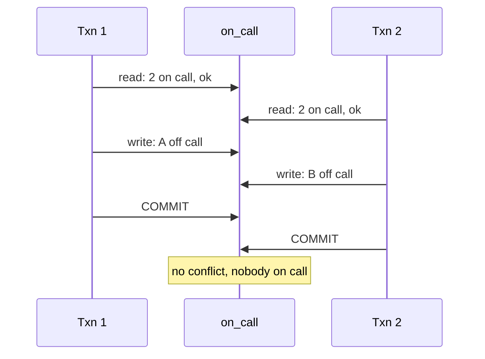
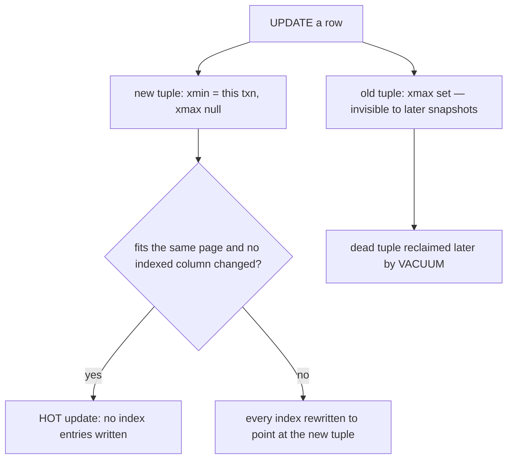

## Q31. Define ACID precisely. [#q31]

<Question id="q31">

**Answer.**
- **Atomicity** — all or nothing. Implemented by undo logging / WAL: a partially applied transaction is rolled back on crash recovery.
- **Consistency** — the transaction moves the database from one valid state to another with respect to declared constraints. Note this is largely the *application's* property; the database only enforces what you've declared, which is another argument for real constraints.
- **Isolation** — concurrent transactions don't observe each other's intermediate state. This is the one that's actually a spectrum, not a boolean (Q32).
- **Durability** — a committed transaction survives a crash. Implemented by flushing WAL to stable storage before acknowledging commit.

**Why it matters.** The senior nuance is that C is doing the least work of the four, and I is not what most people assume — nobody runs at `SERIALIZABLE` by default, so "ACID" in practice means "atomic, durable, and isolated in a way you need to understand".

<FollowUp q="How is durability actually achieved, and where does it leak?">

WAL is written and `fsync`ed before commit is acknowledged. It leaks when: `synchronous_commit = off` (commits acknowledged before the flush — you lose a fraction of a second of transactions on crash, but never corruption); the disk lies about `fsync` (consumer SSDs with volatile write caches); or replication is asynchronous, so a failover loses whatever hadn't shipped. Each is a legitimate trade you should make consciously.

</FollowUp>

</Question>

## Q32. Walk me through the isolation anomalies, including write skew. [#q32]

<Question id="q32">

**Answer.**
- **Dirty read** — reading uncommitted data. Prevented at `READ COMMITTED` and above.
- **Non-repeatable read** — re-reading a row gives a different value. Prevented at `REPEATABLE READ`.
- **Phantom read** — re-running a query returns new rows. Prevented at `SERIALIZABLE` (and by InnoDB's gap locks at `REPEATABLE READ`).
- **Lost update** — two read-modify-write cycles, one silently overwrites the other. **Not** prevented by `READ COMMITTED`. This is the money bug.
- **Write skew** — two transactions read an overlapping set, each checks an invariant that holds, and each writes a *different* row, jointly violating the invariant. Not prevented by snapshot isolation / `REPEATABLE READ`.

The canonical write skew: two doctors both on call, each transaction checks "is at least one other doctor on call?" (yes), and each takes themselves off call. Both commit; nobody is on call. The financial version: two withdrawals from linked accounts where the overdraft rule spans both.

**Why it matters.** Write skew is the anomaly that catches senior engineers, because "we use REPEATABLE READ" feels safe and isn't. The fixes are `SERIALIZABLE`, materialising the conflict (lock a parent row so the transactions actually collide), or a constraint that expresses the invariant.

<FollowUp q="How does PostgreSQL implement `SERIALIZABLE`?">

Serializable Snapshot Isolation — optimistic. It tracks read/write dependencies between concurrent transactions and aborts one when it detects a dangerous structure that could produce a non-serializable outcome. So it doesn't block, but it throws `could not serialize access` (SQLSTATE 40001), and **your application must retry the whole transaction**. Systems that adopt `SERIALIZABLE` without a retry wrapper just move the failure to the user.

</FollowUp>

</Question>

## Q33. Explain PostgreSQL MVCC. [#q33]

<Question id="q33">

**Answer.** Every row version (tuple) carries `xmin` (the transaction that created it) and `xmax` (the transaction that deleted or superseded it). A transaction takes a snapshot — the set of transaction IDs committed at its start — and a tuple is visible if `xmin` is committed-and-visible in that snapshot and `xmax` is not.

So an `UPDATE` doesn't modify in place: it writes a *new* tuple and marks the old one's `xmax`. Readers never block writers and writers never block readers, which is MVCC's whole selling point. The costs are: dead tuples accumulate and must be reclaimed (VACUUM), and every index must be updated to point at the new tuple unless the **HOT** (heap-only tuple) optimisation applies — which requires the new version to fit on the same page and no indexed column to change.

<FollowUp q="Why does an update-heavy table with many indexes perform badly?">

Because HOT can't apply if any indexed column changed, so each update writes N index entries plus a new heap tuple, generating WAL and bloat. Two practical fixes: don't index columns that change frequently, and leave `fillfactor` below 100 on hot tables so there's free space on the page for HOT updates.

</FollowUp>

</Question>

## Q34. What is VACUUM actually doing, and what happens if it falls behind? [#q34]

<Question id="q34">

**Answer.** Three jobs: reclaim space from dead tuples for reuse (not returning it to the OS — that's `VACUUM FULL`, which takes an `ACCESS EXCLUSIVE` lock and rewrites the table); update the **visibility map** so index-only scans work and future vacuums can skip all-visible pages; and **freeze** old tuples to prevent transaction ID wraparound.

If it falls behind: table and index bloat (a 10 GB table holding 1 GB of live data — every scan reads ten times the necessary pages); degraded index-only scans; stale statistics from the coupled autoanalyze; and eventually **wraparound protection**, where PostgreSQL refuses new writes to protect data. That last one is a full outage, and it's preceded by weeks of ignored warnings in the log.

**Why autovacuum falls behind, in practice:** long-running transactions or idle-in-transaction sessions (a tuple can't be removed while any snapshot might need it — *one* forgotten open transaction blocks cleanup across the whole database), abandoned replication slots (same effect), unused prepared transactions, cost-limit throttling set for 2010 hardware (`autovacuum_vacuum_cost_limit`), and too few autovacuum workers for the table count.

<FollowUp q="How do you monitor it?">

`n_dead_tup` and `last_autovacuum` per table from `pg_stat_user_tables`; `age(datfrozenxid)` against `autovacuum_freeze_max_age` for wraparound headroom; and an alert on the longest-running transaction and on any replication slot whose `restart_lsn` is stalling. Alert on the *oldest transaction*, not just on bloat — it's the leading indicator.

</FollowUp>

</Question>

## Q35. How does InnoDB's locking differ, and what are gap locks? [#q35]

<Question id="q35">

**Answer.** InnoDB uses MVCC via undo logs (old versions live in the rollback segment, not in the table), plus row-level locks on index records. Under `REPEATABLE READ`, plain `SELECT`s are non-locking consistent reads from a read view; locking reads (`FOR UPDATE`, `FOR SHARE`) and writes take **next-key locks** — a record lock plus a **gap lock** on the range before it — which prevents phantoms by stopping other transactions inserting into the gap.

Gap locks are the source of most InnoDB deadlock surprises: two transactions inserting different, non-conflicting rows can deadlock because their gap locks overlap. They also mean a `DELETE FROM t WHERE indexed_col = ?` matching zero rows still takes a gap lock, blocking inserts in that range.

<FollowUp q="Why does an unindexed `WHERE` clause lock everything?">

Because InnoDB locks the rows it *examines* via the index it uses, not the rows that match your predicate. Without a usable index it scans and locks every row in the table. Adding the right index is a *correctness-adjacent* concurrency fix, not just a performance one — a fact that surprises people the first time.

</FollowUp>

</Question>

## Q36. How do you diagnose and prevent database deadlocks? [#q36]

<Question id="q36">

**Answer.** Diagnose from the log — both engines log the full deadlock graph (`log_lock_waits` and the deadlock report in PostgreSQL, `SHOW ENGINE INNODB STATUS` / `innodb_print_all_deadlocks` in MySQL) showing both transactions, their statements, and the locks held and wanted. That's usually enough to spot the inconsistent ordering.

Prevent by: acquiring locks in a **consistent order** (sort account IDs ascending before updating both sides of a transfer — the single most effective fix); keeping transactions short and never spanning user think-time or external HTTP calls; using a single statement where possible (`UPDATE ... WHERE` is atomic, so one statement can't deadlock with itself); taking the most contended lock last; using `SKIP LOCKED` for queue-like access; and adding the indexes that stop lock escalation over scanned rows.

Then: **accept that deadlocks happen and retry**. A deadlock is a normal, expected outcome under concurrency — the loser gets an error (SQLSTATE 40P01 / 1213) and the correct application response is to retry the whole transaction with backoff. Code that treats a deadlock as a fatal error is under-built.

</Question>

## Q37. Why are long-running transactions so damaging? [#q37]

<Question id="q37">

**Answer.** Well beyond holding locks:
- They pin the oldest snapshot, so **VACUUM cannot reclaim any dead tuple newer than it** — database-wide bloat from one session.
- They hold locks acquired at any point, for their entire duration.
- They extend the window for lost updates and deadlocks.
- On replicas with `hot_standby_feedback`, a long query on the replica blocks vacuum on the *primary*.
- They make failover and deployment riskier, because rollback of a huge transaction takes as long as the work did.

The specific killer is **idle in transaction** — a connection that ran a statement, didn't commit, and went to sleep, usually because the application opened a transaction and then made a network call. Set `idle_in_transaction_session_timeout` to kill those, and alert on them.

<FollowUp q="How do you handle a genuinely long batch operation?">

Chunk it: process 10,000 rows per transaction in a loop, with a stable ordering key so it's resumable, throttling between batches, and idempotency so a partial run can be re-run safely. Never a single 4-hour transaction.

</FollowUp>

</Question>

## Q38. Explain WAL and the commit path. [#q38]

<Question id="q38">

**Answer.** Write-Ahead Logging: before any data page change reaches disk, a record describing the change is written to the log and flushed. On crash, recovery replays the log from the last checkpoint to restore committed changes and roll back uncommitted ones. This is what makes durability affordable — sequential log writes instead of random data page writes at commit time.

The commit path: modify pages in shared buffers → write WAL records to the WAL buffer → at commit, flush WAL up to the commit LSN (`fsync`) → acknowledge. Dirty data pages are written later by the background writer and at checkpoints. **Group commit** amortises the fsync across concurrent committers, which is why throughput often improves with concurrency up to a point.

WAL is also the foundation of everything else: physical replication ships WAL, point-in-time recovery replays it, and logical decoding/CDC reads it.

<FollowUp q="What does a checkpoint do and why does it cause latency spikes?">

It flushes all dirty buffers so WAL before that point can be recycled, bounding recovery time. A checkpoint that flushes gigabytes at once creates an I/O storm. Tuning: raise `max_wal_size` so checkpoints are less frequent, and raise `checkpoint_completion_target` (0.9 default in modern versions) so the writes are spread across the interval rather than bunched.

</FollowUp>

</Question>

## Q39. Synchronous vs asynchronous replication — what do you actually lose? [#q39]

<Question id="q39">

**Answer.** **Async**: the primary acknowledges commit before the replica has the WAL. Fast, no coupling to replica health, but a primary failure loses everything not yet shipped — your RPO is the replication lag at the moment of failure, which is exactly when lag is likely to be high.

**Sync**: the primary waits for the replica to confirm (receive, flush, or apply — PostgreSQL's `synchronous_commit` levels `remote_write`, `on`, `remote_apply` differ meaningfully). Zero data loss on failover, at the cost of adding the round-trip to every commit, and — critically — the primary's availability now depends on the replica's. Mitigate with `synchronous_standby_names` naming a quorum (`ANY 1 (a, b, c)`) rather than one specific replica, so any single replica failure doesn't stall writes.

**Why it matters.** The senior point is that this is an explicit RPO decision that belongs to the business, not to the DBA. For a payments ledger I'd argue for synchronous commit to at least one replica in another AZ; for a click-analytics table, async.

</Question>

## Q40. What is replication lag and how does it break your application? [#q40]

<Question id="q40">

**Answer.** The delay between a commit on the primary and its visibility on a replica. It breaks **read-your-own-writes**: a user submits a payment, is redirected to a details page that reads from a replica, and sees nothing — so they submit again.

Handling it:
- Route reads that must be fresh to the primary (sticky-to-primary for N seconds after a write, per session).
- Use LSN tracking: capture the write's LSN, and have the reader wait for or select a replica that has replayed past it. This is the correct general solution and PostgreSQL exposes the primitives.
- Design the UI to render from the write response rather than re-reading.
- Monitor lag in both bytes and seconds, and take a replica out of rotation when it exceeds a threshold.

<FollowUp q="What causes lag to spike?">

A long-running query on the replica conflicting with replay (PostgreSQL either delays replay or cancels the query, controlled by `max_standby_streaming_delay`); single-threaded apply falling behind a write-heavy primary; a bulk operation generating enormous WAL; and network saturation. The replica being read-heavy is itself a common cause, which is the irony of scaling reads with replicas.

</FollowUp>

</Question>

## Q41. How does failover work and what is split brain? [#q41]

<Question id="q41">

**Answer.** Failover promotes a replica to primary. The hard parts aren't the promotion, they're: deciding the primary is *actually* dead rather than partitioned (requires a quorum of observers, not a single monitor); ensuring the old primary can't accept writes if it returns (fencing/STONITH); choosing the most advanced replica; and repointing clients (DNS, a proxy like pgpool/HAProxy/PgBouncer, or a virtual IP).

**Split brain** is two nodes both believing they're primary, accepting divergent writes. Recovery means choosing which writes to discard — in a financial system, that is a manual, painful, auditable process. Prevention is quorum-based decisions and hard fencing, never a timeout-based promotion by a single watcher.

<FollowUp q="Automatic or manual failover?">

Automatic, if and only if you have proper quorum and fencing — otherwise a network blip causes an outage worse than the one it prevents. I'd rather have a well-drilled 5-minute manual failover than an automatic one nobody has tested. And either way: practise it, in production, on a schedule. An untested failover procedure is a hypothesis.

</FollowUp>

</Question>

## Q42. What is a distributed transaction at the database level, and when would you use one? [#q42]

<Question id="q42">

**Answer.** Two-phase commit with prepared transactions (`PREPARE TRANSACTION` in PostgreSQL, XA in MySQL/JTA). Phase 1: all participants prepare and durably promise they can commit. Phase 2: the coordinator tells everyone to commit or abort.

The problem is the blocking window: if the coordinator dies between phases, participants hold locks and prepared transactions indefinitely. In PostgreSQL an orphaned prepared transaction is especially nasty — it pins the oldest snapshot and blocks vacuum forever, so a forgotten 2PC can bloat a database into an outage weeks later. That's why `max_prepared_transactions` defaults to 0.

When I'd use it: essentially never across services. Within one database, use a single transaction. Across services, use a saga with compensations and idempotency, and accept eventual consistency with reconciliation — which is what the payments industry actually does.

</Question>

## Q43. What is CDC and how would you implement it? [#q43]

<Question id="q43">

**Answer.** Change Data Capture streams row-level changes out of the database. The good implementation reads the transaction log — PostgreSQL logical decoding via a replication slot, MySQL binlog in ROW format — which gives you every committed change in commit order, with no impact on application queries and no missed changes.

The alternatives are worse: polling an `updated_at` column misses deletes, misses intermediate states, and races with clock skew; triggers writing to an audit table double the write cost and are easy to forget on new tables.

Debezium is the standard implementation, publishing to Kafka. Uses: feeding a data warehouse, maintaining search indexes and caches, the outbox pattern (Q136), and migrating between systems with dual-running.

<FollowUp q="What are the operational hazards?">

The replication slot is the big one — if the consumer stops, WAL accumulates on the primary until the disk fills and the database stops. Always monitor slot lag and set `max_slot_wal_keep_size`. Also: schema changes flowing through as DDL events your consumers must tolerate, initial snapshot load on a huge table, and the fact that CDC exposes your internal schema as a public interface, which is exactly why the outbox pattern (publishing intentional events rather than raw table changes) is usually better than CDC-on-business-tables.

</FollowUp>

</Question>

## Q44. Explain CAP and PACELC, and why CAP is often misused. [#q44]

<Question id="q44">

**Answer.** CAP: during a **network partition**, a system must choose between consistency (linearizability) and availability. That's it — it says nothing about the normal, unpartitioned case, which is where systems spend 99.99% of their time. "We chose AP" as a general description of a system is a misuse.

**PACELC** completes it: *if* Partitioned, choose Availability or Consistency; *Else*, choose Latency or Consistency. The else-branch is the one that actually shapes daily behaviour — synchronous replication trades latency for consistency on every single commit, partition or not.

**Why it matters.** It reframes the design conversation from a one-time architectural label to a per-operation decision: a balance check can tolerate 200 ms of staleness; a duplicate-payment check cannot.

</Question>

## Q45. Compare consistency models. [#q45]

<Question id="q45">

**Answer.** From strongest:
- **Linearizable / strong** — every operation appears to take effect at a single instant between invocation and response; reads see the latest write. Requires coordination, so it costs latency and availability.
- **Sequential** — all nodes see operations in the same order, but not necessarily real-time order.
- **Causal** — operations related by cause and effect are seen in order everywhere; concurrent operations may be seen in different orders. Often the sweet spot: it preserves "the reply appears after the message" without global coordination.
- **Read-your-writes / monotonic reads** — session guarantees, usually what users actually notice.
- **Eventual** — replicas converge if writes stop. Says nothing about *when*, which is why it's a weak promise in isolation.

**Why it matters.** The senior move is choosing per operation rather than per system. In a payments platform: strong consistency for the ledger and duplicate detection, read-your-writes for anything the user just did, and eventual for analytics, search indexes and notification feeds.

</Question>
