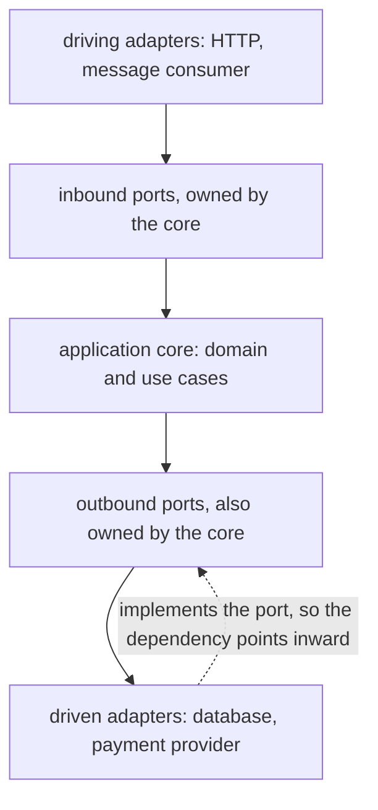
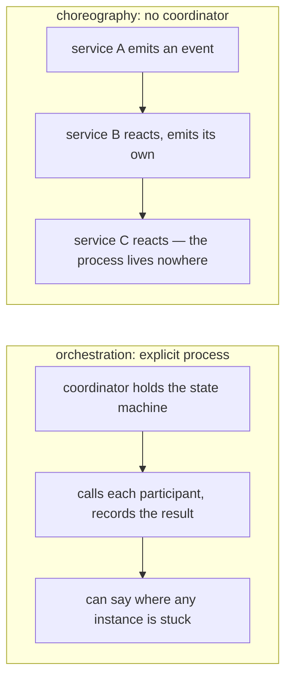

## Q53. Compare layered, hexagonal, onion and clean architecture. [#q53]

<Question id="q53">

**Answer.** They're variations on one idea, with different diagrams.

**Layered** (controller → service → repository → database): simple, universally understood, and the dependency arrow points *downward towards the database*. The domain ends up depending on persistence, so the business rules can't be tested or reasoned about without it. That's the flaw the others address.

**Hexagonal / Ports & Adapters** (Cockburn): the application core defines **ports** (interfaces it owns), and **adapters** implement them. Driving adapters (HTTP, message consumer) call inbound ports; the core calls outbound ports implemented by driven adapters (database, payment provider). All dependencies point inward.

**Onion** (Palermo) and **Clean** (Martin) are essentially the same principle expressed as concentric circles, with the **dependency rule**: source code dependencies point only inward. Clean adds named layers (entities, use cases, interface adapters, frameworks).

**Why it matters.** The single shared insight is that **the domain should not depend on infrastructure** (DIP, Q19). Everything else is presentation. I'd use hexagonal vocabulary because ports/adapters is the clearest metaphor, and I wouldn't be dogmatic about the number of layers.

<FollowUp q="What's the cost?">

Mapping. You'll have a domain model, a persistence model and an API model, with translation between them, and for a simple entity that's three classes and two mappers where one class would do. That's a genuine cost, and for a simple CRUD service it isn't worth it. It becomes worth it when the domain has real logic you want to test and evolve independently of the database.

</FollowUp>

</Question>

## Q54. Package by layer or package by feature? [#q54]

<Question id="q54">

**Answer.** Package by feature, in almost all cases.

Package by layer (`controllers/`, `services/`, `repositories/`, `models/`) groups things that change for *different* reasons and separates things that change *together* — the exact inverse of the Common Closure Principle (Q24). Adding a field to Payment means editing four packages. It also makes everything public, since collaborating classes are in different packages, so there's no encapsulation at module level.

Package by feature (`payment/`, `refund/`, `settlement/`, each containing its own controller, service, repository and model) puts everything a change touches in one place. It allows package-private visibility, so a feature's internals are genuinely hidden. And it makes the codebase's *purpose* visible from the directory listing — "screaming architecture".

The strongest argument: a feature package is a candidate module, and a module is a candidate service. Package-by-feature is the on-ramp to a modular monolith and then, if needed, to extraction (Q67).

<FollowUp q="How do you enforce it?">

ArchUnit rules: no feature package may depend on another feature package's internals — only on its published interface or on shared kernel packages. Run it in CI. Without enforcement, package-by-feature erodes back into a ball of mud within a year.

</FollowUp>

</Question>

## Q55. What is a modular monolith, and why is it back in fashion? [#q55]

<Question id="q55">

**Answer.** A single deployable unit with strictly enforced internal module boundaries: modules communicate through published interfaces or in-process events, own their data (separate schemas or at minimum no cross-module foreign keys), and are prevented by build-time checks from reaching into each other.

It's popular again because the industry over-corrected into microservices and paid for it. A modular monolith gives you most of the *design* benefits — clear boundaries, independent reasoning, team ownership — with none of the distributed systems costs: no network partitions between modules, no eventual consistency where you didn't want it, transactions that actually work, one deployment, one log, one debugger.

And it preserves optionality. If a module genuinely needs independent scaling or an independent release cadence, extraction is tractable *because the boundary already exists*. Extracting from a ball of mud is not.

**Why it matters.** This is the answer I'd give to "should we use microservices?" for most teams under about 30 engineers. Being able to advocate for it credibly — rather than defaulting to microservices because that's the modern answer — is a strong seniority signal.

<FollowUp q="What makes it fail?">

Boundaries that aren't enforced. Without ArchUnit or JPMS or a build-level check, someone will import across a boundary under deadline pressure, and the modularity is gone. The discipline has to be mechanical, because it will not survive being a convention.

</FollowUp>

</Question>

## Q56. What is an architectural fitness function? [#q56]

<Question id="q56">

**Answer.** An automated, objective test of an architectural characteristic — from *Building Evolutionary Architectures*. If you care about a quality attribute, encode it as a test that fails the build.

Examples: ArchUnit rules asserting the dependency direction and the absence of package cycles; a performance test failing if p99 exceeds an SLO; a test asserting the service starts in under 10 seconds; a check that no new module exceeds a dependency count; a contract test verifying you haven't broken a consumer; a security scan failing on a new critical CVE.

**Why it matters.** Architecture documented in a wiki decays; architecture encoded in the build cannot. It converts "we agreed not to do that" from a norm requiring vigilance into a mechanism requiring nothing. For a lead, that's the difference between an architecture you maintain by policing PRs and one that maintains itself.

</Question>

## Q57. What is an ADR and what makes a good one? [#q57]

<Question id="q57">

**Answer.** An Architecture Decision Record: a short document capturing one decision — the context and constraints at the time, the options considered, the decision, and the consequences accepted. Numbered, immutable once accepted, superseded rather than edited, stored in the repo next to the code.

What makes a good one: **honesty about the constraints** ("we had six weeks and no one on the team had operated Kafka"), **real alternatives** with why they were rejected, and **explicit consequences** including the bad ones. A one-paragraph ADR that says "we chose X because it's better" is worthless.

**Why it matters.** The value isn't the decision, it's preserving *what was known at the time*. Two years later, an engineer looking at a strange choice can see whether it was reasonable given the constraints or whether the constraints have since gone away. Without that, teams either cargo-cult past decisions or re-litigate them from scratch — both expensive.

<FollowUp q="What should trigger writing one?">

Anything hard to reverse: choice of datastore, service boundaries, a public API contract, a framework, an auth model. Also anything where you had a genuine debate — the ADR is where the losing argument is preserved, which matters when circumstances change and the losing argument becomes the winning one.

</FollowUp>

</Question>

## Q58. How do you evaluate an architecture against quality attributes? [#q58]

<Question id="q58">

**Answer.** Name the attributes that matter *for this system*, prioritise them explicitly (they conflict), and then evaluate designs against the top few — not against all of them, because a design that optimises everything optimises nothing.

For a payments platform I'd rank: correctness/consistency for the ledger, availability for the authorisation path, auditability, then latency, then cost, then developer velocity. That ranking immediately decides several arguments — it tells you the ledger gets synchronous replication and the analytics pipeline doesn't.

The technique for making it concrete is **scenarios**: not "the system should be scalable" but "at 5,000 TPS with one AZ lost, p99 authorisation latency stays under 300 ms and no acknowledged transaction is lost." That's testable, whereas "scalable" is not.

**Why it matters.** Most architecture disagreements are actually disagreements about priorities that nobody has stated. Surfacing the ranking usually resolves the argument without needing to win it.

</Question>

## Q59. Event-driven architecture — what does it buy and what does it cost? [#q59]

<Question id="q59">

**Answer.** **Buys:** temporal decoupling (producer doesn't wait), consumer autonomy (add a consumer without touching the producer — this is the big one organisationally), natural buffering of load spikes, and an audit trail of what happened.

**Costs, all real:** eventual consistency becomes a user-facing concern; debugging spans systems with no stack trace; ordering is a design problem rather than a given; testing requires simulating asynchrony; duplicate delivery must be handled everywhere (Q137 in the data bank); and — the one people underestimate — you lose the ability to know what will happen when you publish an event, because the consumer list changes without you.

**Why it matters.** The trade is *coupling for comprehensibility*. Synchronous call chains are tightly coupled and easy to follow; event chains are loosely coupled and hard to follow. Choose per interaction, not per system: a payment authorisation is synchronous because the caller needs the answer; a notification is asynchronous because nobody's waiting.

<FollowUp q={"What's \"event-carried state transfer\"?"}>

Including enough state in the event that consumers don't need to call back for details. It removes a synchronous dependency, at the cost of larger events, duplicated data, and staleness. Worth it when the callback would be on a hot path; not worth it when the data is large or changes frequently after the event.

</FollowUp>

</Question>

## Q60. Orchestration vs choreography. [#q60]

<Question id="q60">

**Answer.** **Choreography**: services react to each other's events with no central coordinator. Loosely coupled, easy to add participants, but the overall process exists nowhere — you reconstruct it by reading five codebases, and "why did this payment stall?" is genuinely hard.

**Orchestration**: a coordinator holds the process state machine and tells participants what to do. The process is explicit, observable, and testable; you can see where each instance is stuck and retry from a known point. The cost is a coordinator that can become a bottleneck or a god service, and participants that are slightly more coupled.

**My default:** choreography for two or three steps; orchestration beyond that, or whenever the process has business meaning worth observing. For a payment saga with authorisation, fraud check, capture and settlement, an orchestrator earns its place immediately, because operations will need to answer questions about in-flight processes.

**Why it matters.** The deciding question isn't coupling, it's **who owns the process**. If the process is a business concept that someone will ask questions about, it deserves an explicit home.

</Question>
