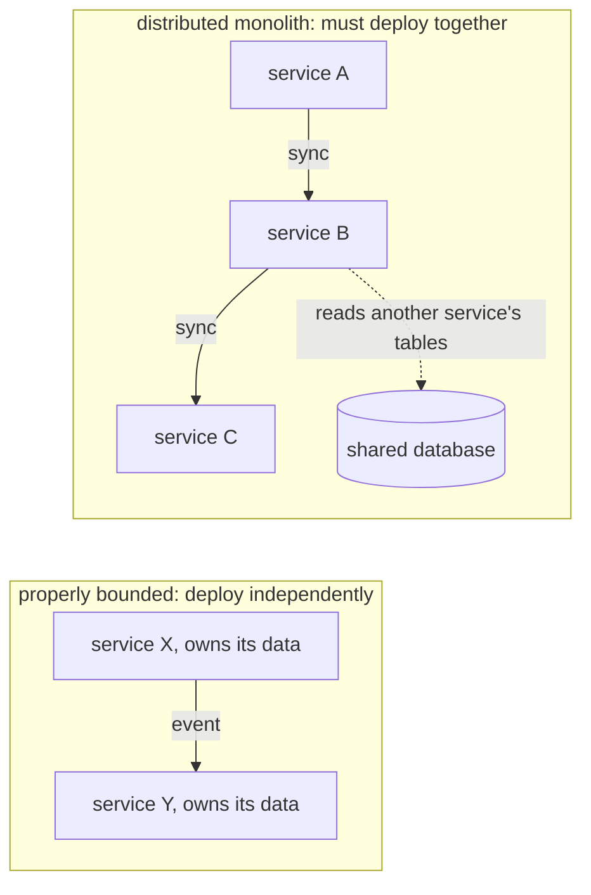
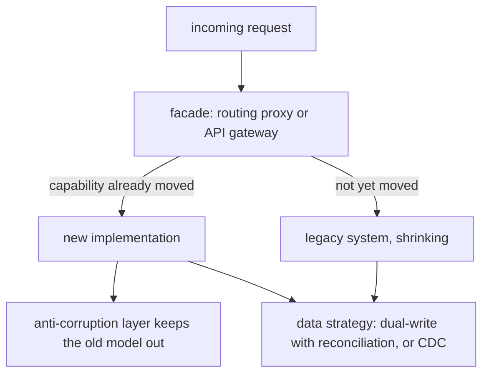

## Q61. When should you *not* use microservices? [#q61]

<Question id="q61">

**Answer.** More often than people assume. The honest list:

- **Small team.** Below roughly 15–20 engineers, the coordination problem microservices solve doesn't exist yet, and you're paying the full operational cost for nothing.
- **Domain not understood.** Boundaries are the hardest thing to get right and the most expensive to change. Extracting a service across the wrong seam is far worse than a badly-factored module, because now the mistake is a network call and a data migration.
- **No platform maturity.** Microservices require CI/CD, containerisation, centralised logging, distributed tracing, service discovery, and on-call. Without those you've built a distributed system you can't observe.
- **Strong consistency requirements everywhere.** If most operations need atomic multi-entity updates, splitting them means sagas and compensations for everything — enormous complexity for no benefit.
- **Low scale.** If one server handles your load, distributing it adds latency, failure modes and cost.

**Why it matters.** Microservices are primarily an **organisational** solution — they let many teams deploy independently. They don't make code better, faster, or simpler; they make *teams* independent, at a substantial technical cost. Stating that clearly is the single strongest signal in this whole section.

<FollowUp q="What would you do instead?">

A modular monolith (Q55) with enforced boundaries. You get the design discipline, you keep transactions and a single deployment, and the boundaries you establish become the extraction seams if and when you need them.

</FollowUp>

</Question>

## Q62. "Monolith first" — do you agree? [#q62]

<Question id="q62">

**Answer.** Broadly yes, with a qualification. Fowler's argument is that you can't identify good boundaries until you understand the domain, and you understand the domain by building it. Starting with microservices means guessing boundaries at the moment of maximum ignorance, and boundary mistakes are the most expensive kind.

The qualification: "monolith first" is often heard as "don't think about boundaries yet", which is wrong. Build a monolith with *deliberate internal modularity* — module boundaries, no cross-module data access, in-process events at seams you suspect will become service boundaries. Then extraction is a mechanical exercise rather than an archaeology project.

The counter-argument worth acknowledging: if you're an experienced team building in a domain you know well, with a clear organisational structure, starting with a few well-understood services can be right. The failure isn't microservices — it's microservices chosen without evidence.

</Question>

## Q63. How do you decide service boundaries? [#q63]

<Question id="q63">

**Answer.** By business capability or subdomain, never by technical layer. A "Payments" service that owns authorisation, capture and refund is a boundary; a "Data Access Service" and a "Business Logic Service" are layers pretending to be services, and every feature will touch both.

The signals I'd use:

1. **Bounded contexts** (Q47) — linguistic seams are the strongest evidence.
2. **What changes together** — CCP (Q24). If two things always appear in the same change, they belong in the same service.
3. **Team ownership** — a service should have one owning team (Q69). A service owned by two teams will have coordination overhead worse than a monolith.
4. **Data cohesion** — a service should own its data completely. If a boundary requires a distributed transaction on every operation, it's in the wrong place.
5. **Different rates of change or scale** — a fraud-scoring engine that changes daily and needs GPU capacity has a genuine reason to be separate from an account service that changes quarterly.

**Why it matters.** The test I apply: **can this service be deployed without coordinating with another team?** If not, the boundary is decorative — you have a distributed monolith (Q65).

</Question>

## Q64. How big should a microservice be? [#q64]

<Question id="q64">

**Answer.** Size is the wrong metric, and "micro" is the most misleading word in the term. The right metrics:

- **One team can own it** — understand it fully, deploy it independently, and be on call for it.
- **It has one clear responsibility** expressible in a sentence without "and".
- **It can be rewritten in a few weeks** if necessary. Not that you would, but the constraint keeps it comprehensible.
- **It owns its data** and doesn't need another service's database to do its job.

Two-pizza-team is a heuristic about *ownership*, not lines of code. A service can legitimately be 50k lines if it encapsulates a genuinely complex domain; splitting it further would just distribute the complexity across a network.

**Why it matters.** The "smaller is better" instinct produces nanoservices — services so small that any real feature requires changing five of them, plus five deployments, plus five contract negotiations. That is strictly worse than a monolith.

</Question>

## Q65. What is a distributed monolith and how do you recognise one? [#q65]

<Question id="q65">

**Answer.** Services that are physically separate but logically coupled — you get all the costs of distribution and none of the independence.

Symptoms, any one of which is diagnostic:
- Services must be **deployed together** or in a specific order.
- A typical feature requires changes in three or more services.
- Services share a database, or one reads another's tables.
- Synchronous call chains three or more deep — a request to A calls B calls C, so A's availability is the product of all three.
- A shared library that every service depends on, whose version bump requires a coordinated release.
- A change to one service's internal model breaks another.
- You can't test a service without running five others.

**Why it matters.** This is the most expensive failure mode in the whole space, because it's *worse than the monolith you started with*: same coupling, plus network latency, partial failure, distributed debugging and N deployments. Recognising it early — and being willing to say "we should merge these two services back" — is a genuinely senior act.

<FollowUp q="What's the fix?">

Usually merging services back and re-splitting along a better seam, or replacing synchronous chains with asynchronous events to break the availability coupling. Both are unpopular because they look like going backwards. Framing it as "we're paying distribution costs without getting distribution benefits" is how you make the case.

</FollowUp>

</Question>

## Q66. What's wrong with shared libraries in microservices, and what's the alternative? [#q66]

<Question id="q66">

**Answer.** A shared library reintroduces coupling at build time. A change to it requires every consumer to upgrade, so either everyone coordinates (destroying independent deployment) or you support many versions simultaneously (which is its own cost). And DRY instincts push people to put *domain* logic in shared libraries, which means the domain model is now shared across contexts — the canonical-model problem (Q47) with extra steps.

What's acceptable to share: genuinely generic technical utilities with stable APIs — logging configuration, tracing setup, an HTTP client wrapper, a serialisation helper. What isn't: domain models, DTOs shared between producer and consumer, business rules.

**The alternative for the DTO case**, which is what people usually want: publish a *schema* (Avro/Protobuf/OpenAPI) rather than a jar, and let each consumer generate its own types. The contract is shared; the code is not. That preserves independent evolution and gives you compatibility checking in CI (Q117 in the data bank).

<FollowUp q="But now we duplicate the DTO in five services.">

Yes, deliberately. That's the DRY-is-about-knowledge point (Q22): each service's view of the payload is its own knowledge, and consumers legitimately care about different subsets. Duplication here buys independent deployability, which is the entire point of the architecture.

</FollowUp>

</Question>

## Q67. How do you extract a service from a monolith? [#q67]

<Question id="q67">

**Answer.** Incrementally, keeping the system releasable throughout. The sequence I'd follow:

1. **Establish the module boundary inside the monolith first.** Move the code into one package, force all access through a single interface, and enforce it with ArchUnit. Nothing is distributed yet, and you've already got most of the design benefit.
2. **Separate the data.** Remove cross-boundary foreign keys and joins; replace them with calls to the module's interface. This is usually the hardest and longest step, and it's where extraction projects die. Do it before any network is involved.
3. **Branch by abstraction.** The interface now has two implementations: the in-process one and a remote one.
4. **Deploy the new service, dual-run.** Route a percentage of traffic (or shadow all of it) to the remote implementation, compare results, and keep the in-process path as the fallback.
5. **Cut over**, monitor, then delete the old code. Deleting is part of the work — an extraction that leaves the old path in place has doubled the maintenance surface.

**Why it matters.** Step 2 before step 3 is the crucial ordering. Teams that deploy the service first and untangle the data later end up with two services sharing a database, which is a distributed monolith with a migration project attached.

</Question>

## Q68. Explain the strangler fig pattern. [#q68]

<Question id="q68">

**Answer.** Named for the vine that grows around a tree and eventually replaces it. You put a facade (usually an API gateway or a routing proxy) in front of the legacy system, then incrementally route individual capabilities to new implementations. The legacy system shrinks until it can be removed.

Why it beats a rewrite: value is delivered continuously rather than at the end; risk is spread across many small cutovers instead of one big-bang; each step is independently reversible; and you never have two systems to maintain in parallel for two years while the rewrite catches up on features the old system keeps adding.

The practical requirements: a routing layer capable of per-endpoint or per-customer routing; an anti-corruption layer (Q50) so the new code isn't shaped by the old model; and a data strategy — usually the hard part, since both systems may need the same data during transition (dual-write with reconciliation, or CDC-based synchronisation).

**Why it matters.** "We'll rewrite it" is the answer that has destroyed more projects than any other. Being able to describe a credible incremental alternative — with the data problem addressed, not hand-waved — is what makes the argument winnable.

</Question>

## Q69. Conway's Law — how does it affect architecture? [#q69]

<Question id="q69">

**Answer.** "Organisations design systems that mirror their own communication structure." It's an observation, not advice, and it holds remarkably well: three teams building a compiler produce a three-pass compiler.

The consequence for architecture is that **you cannot impose an architecture that contradicts your org chart and expect it to survive**. If you draw four service boundaries and have two teams, the two teams will erode the boundaries, because coordinating across them within a team is free and enforcing them is friction.

The **Inverse Conway Manoeuvre** is the deliberate response: change team structure to produce the architecture you want. If you want independent services, you need teams that own them end-to-end. Team Topologies formalises this with stream-aligned teams (owning a slice of value), platform teams (reducing cognitive load for the others), enabling teams, and complicated-subsystem teams.

**Why it matters.** This is the point where technical leadership becomes organisational. A lead who proposes a service architecture without discussing team ownership has proposed half a design. It's also the honest answer to "why did our microservices fail?" — usually because the teams didn't change.

</Question>

## Q70. How do you handle a change that spans several services? [#q70]

<Question id="q70">

**Answer.** First, treat it as a signal. If cross-service changes are common, the boundaries are wrong (Q65) and the real fix is boundary work, not better coordination.

For the changes that legitimately span services, the mechanism is **backward-compatible, staged rollout** — the same expand/contract discipline as a schema migration:

1. **Expand** — the provider adds the new capability alongside the old, supporting both.
2. **Migrate** — consumers move to the new one, independently, on their own schedule.
3. **Contract** — once telemetry shows zero use of the old path, the provider removes it.

Each step is a separate deployment by a single team with no coordination required. That's the whole point of the architecture, and any process that requires a synchronised release across teams has given it up.

<FollowUp q="How do you know when the old path is unused?">

Instrument it. A counter per API version per consumer, and a dashboard. "We think nobody uses it" is how you break a partner integration; "no calls in 60 days from any client" is evidence. Deprecation headers (`Deprecation`, `Sunset`) and a published timeline do the rest.

</FollowUp>

</Question>

## Q71. What is a bounded context versus a microservice? [#q71]

<Question id="q71">

**Answer.** A bounded context is a *design* boundary — a scope within which a model is consistent. A microservice is a *deployment* boundary. They're related but not identical.

A microservice should never span two bounded contexts (it would have a confused model), but a bounded context can legitimately contain several microservices — split for scaling, technology or team reasons within one consistent model. In practice, one context to one service is a good default, and deviating from it should have a stated reason.

**Why it matters.** People treat the two as synonyms, then conclude that DDD requires microservices. It doesn't — a modular monolith can have five bounded contexts. The context boundary is the valuable artefact; whether you deploy across it separately is a later, separate decision driven by organisational and operational needs.

</Question>

## Q72. How do you decide what belongs in a shared platform versus in each service? [#q72]

<Question id="q72">

**Answer.** The test is **cognitive load**. A platform team's job is to reduce what each stream-aligned team must know, by providing paved-road capabilities: CI/CD pipelines, observability wiring, secret management, service templates, deployment tooling, a golden path for creating a new service.

What belongs in the platform: undifferentiated technical concerns that every service needs and none of them wants to think about. What doesn't: anything domain-specific, and anything the platform team would have to change every time a product team changes.

The critical constraint — from Team Topologies — is that the platform must be **optional and attractive**, not mandated. A platform teams choose to use is serving them; a platform they're forced to use becomes a bottleneck and the source of "we're blocked on platform" in every retro.

**Why it matters.** Getting this wrong recreates the centralised ops team that microservices were partly meant to escape, just with better branding.

</Question>

## Q73. What are the real costs of microservices? [#q73]

<Question id="q73">

**Answer.** Worth being able to list concretely, because this is what candidates gloss over:

- **Network failure becomes a design concern** in every interaction — timeouts, retries, partial failure, cascading failure.
- **Distributed data.** No cross-service transactions; sagas, eventual consistency, and reconciliation for everything that spans services.
- **Observability is mandatory, not optional.** Without distributed tracing you cannot debug anything.
- **Testing is harder.** Integration testing needs many services or good contract testing discipline.
- **Operational surface.** N deployments, N sets of alerts, N on-call runbooks, N dependency upgrade streams, N sets of CVEs.
- **Latency.** An in-process call is nanoseconds; a network call is milliseconds. Chains multiply it.
- **Cost.** More instances, more idle capacity, more infrastructure, more egress.
- **Cognitive load.** Understanding a flow means reading several repositories.
- **Versioning and compatibility** as a permanent, ongoing tax.

**Why it matters.** The benefit — independent deployability and team autonomy — is singular and organisational. The costs are many and technical. Being able to state the asymmetry is what lets you make the decision honestly rather than by fashion.

</Question>

## Q74. When would you merge two services back together? [#q74]

<Question id="q74">

**Answer.** When the evidence says the boundary is wrong:

- They're always deployed together.
- Most changes touch both.
- They're chattier with each other than with anyone else.
- They share data or need distributed transactions constantly.
- One is unavailable → the other is useless anyway, so the split bought no resilience.
- The same team owns both and there's no plan to change that.

**Why it matters.** Merging is culturally hard — it reads as failure, and someone's design is being undone. Framing matters: this isn't a retreat, it's responding to evidence that wasn't available when the boundary was drawn. A team that can merge services back has a healthier relationship with its architecture than one that can only add.

<FollowUp q="How do you do it safely?">

The reverse of extraction: bring the code into one deployable as separate modules first, keeping the interface intact, then remove the network hop, then — only later, if it's genuinely correct — relax the module boundary. Do not merge the code and the data model in one step.

</FollowUp>

</Question>

## Q75. How do you decide between synchronous and asynchronous communication? [#q75]

<Question id="q75">

**Answer.** By whether the caller needs the answer to proceed.

**Synchronous** when the result is required to respond to a user, when you need immediate validation or rejection, or when the operation is genuinely a query. Payment authorisation is synchronous — the cardholder is waiting.

**Asynchronous** when the caller doesn't need the outcome, when the work can tolerate delay, when you want the caller decoupled from the callee's availability, or when several consumers care about the same event. Sending a receipt, updating a search index, scoring for fraud after the fact, warehousing.

The decisive architectural consideration is **availability coupling**: a synchronous call means your availability is the product of yours and theirs, and a chain of three at 99.9% each gives 99.7%. Asynchronous communication breaks that multiplication — the consumer can be down and the message waits.

**Why it matters.** The instinct to make everything asynchronous "for decoupling" produces systems nobody can reason about (Q59). The instinct to make everything synchronous produces cascading failures. Choose per interaction, and be able to say why.

</Question>

## Q76. REST, gRPC, GraphQL, messaging — how do you choose? [#q76]

<Question id="q76">

**Answer.**
- **REST/JSON** — ubiquitous, human-debuggable, cacheable by HTTP infrastructure, no tooling required. The right default for public APIs and most service-to-service calls. Costs: verbose, no schema by default (OpenAPI is bolted on), over/under-fetching.
- **gRPC** — schema-first with Protobuf, code generation, HTTP/2 multiplexing, streaming, much lower serialisation cost. Good for high-volume internal service-to-service. Costs: not human-readable on the wire, browser support needs a proxy, more tooling.
- **GraphQL** — client specifies the shape it wants, so it solves over-fetching for varied clients (mobile especially). Costs: complex server-side, caching is hard, N+1 resolvers are the default failure mode, and rate limiting by query cost rather than request count.
- **Messaging** — asynchronous, decoupled, multi-consumer, buffered. Costs: eventual consistency, ordering, duplicates (Q75).

**My defaults:** REST at the edge, gRPC between internal services when volume justifies it, messaging for events, GraphQL only when there's a real client-diversity problem — usually a BFF (Q78) solves the same problem with less machinery.

</Question>

## Q77. What is an API gateway and what should it not do? [#q77]

<Question id="q77">

**Answer.** A single entry point in front of your services handling cross-cutting concerns: TLS termination, authentication, rate limiting, routing, request/response logging, and sometimes response aggregation.

The value is that these concerns are implemented once rather than in every service, and that clients see one endpoint rather than a changing internal topology.

**What it should not do:** business logic. The gateway is operated by a platform team and changed by many; putting domain rules there makes it a shared god service that every team must coordinate on to change — a bottleneck and a distributed monolith enabler. Aggregation is the borderline case: a little is fine, and once you're doing per-client orchestration you want a BFF instead.

<FollowUp q="Gateway vs service mesh?">

The gateway handles **north-south** traffic (clients to services). A service mesh handles **east-west** traffic (service to service) — mTLS, retries, circuit breaking, load balancing, traffic shifting — via sidecar proxies, transparently to application code. They're complementary, and the mesh is only worth its operational cost at meaningful service count; below a dozen services, libraries like Resilience4j give you most of it with far less to run.

</FollowUp>

</Question>

## Q78. What is a Backend for Frontend? [#q78]

<Question id="q78">

**Answer.** A dedicated backend per client type — one for the mobile app, one for web, one for partner APIs — each shaped for that client's needs and owned by the team building that client.

It solves the problem that a single general-purpose API serves every client badly: mobile wants few, fat, latency-optimised calls over a poor network; web can make many chatty calls; partners want stability above all. A shared API becomes a negotiation between conflicting needs, and the team owning it becomes a bottleneck.

The BFF handles aggregation, client-specific shaping, and client-specific caching. Downstream services stay client-agnostic.

**The cost:** duplication across BFFs, and a risk of business logic drifting into them. The rule is that a BFF orchestrates and shapes; it does not decide.

</Question>
