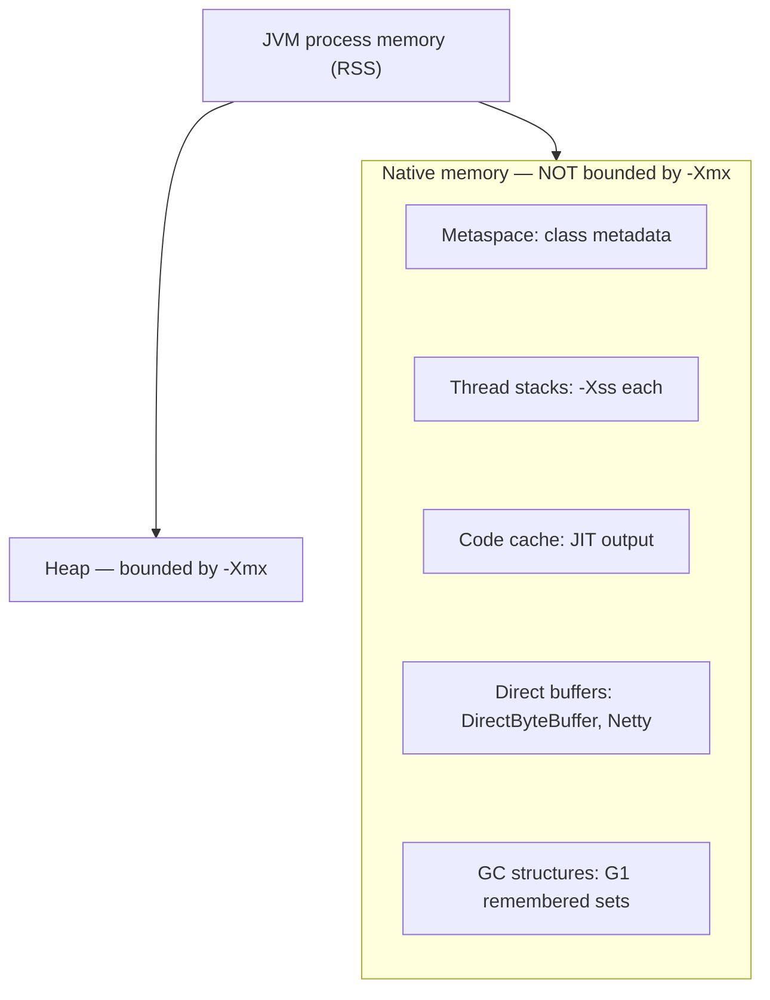
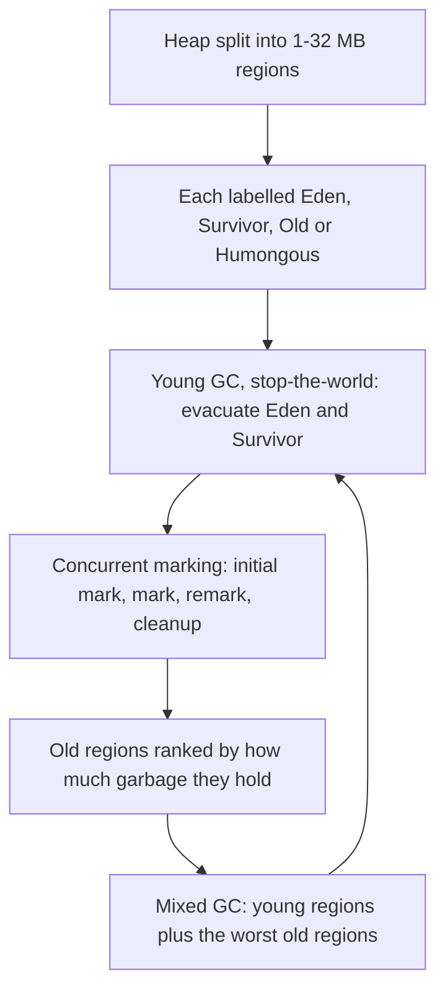

## Q71. Describe the JVM memory areas. [#q71]

<Question id="q71">

**Answer.** Per-JVM (shared): the **heap** (all objects and arrays, divided into generations for most collectors) and **Metaspace** (class metadata — native memory since Java 8, replacing PermGen, and unbounded by default unless you set `-XX:MaxMetaspaceSize`). Per-thread: the **JVM stack** (frames with locals and operand stack, sized by `-Xss`, default ~1 MB), the **PC register**, and the **native method stack**.

Outside all of that: **code cache** (JIT-compiled native code — exhausting it silently disables the JIT and tanks performance), **direct/native memory** (`DirectByteBuffer`, Netty, memory-mapped files), GC's own structures (G1's remembered sets can be gigabytes), thread stacks, and the JVM's own C++ heap.



**Why it matters.** The senior point: `-Xmx` bounds the *heap*, not the process. A container OOM-killed at 2 GB with `-Xmx1500m` is almost always native memory — thread stacks, Metaspace, direct buffers, or a leaking native library. Use `-XX:NativeMemoryTracking=summary` and `jcmd VM.native_memory` to attribute it.

<FollowUp q="How should you size a JVM in a container?">

Use `-XX:MaxRAMPercentage=70` rather than a fixed `-Xmx`, so the JVM adapts to the limit. Modern JVMs are container-aware (they read cgroup limits), but verify with `-XX:+PrintFlagsFinal` that `MaxHeapSize` and `ActiveProcessorCount` are what you expect — a CPU *limit* of 0.5 with a node of 64 cores can produce absurd GC and FJP thread counts.

</FollowUp>

</Question>

## Q72. What does an object cost in memory? [#q72]

<Question id="q72">

**Answer.** A 12-byte header on a 64-bit JVM with compressed oops (mark word 8 bytes + class pointer 4), then fields, then padding to an 8-byte boundary. So `new Object()` is 16 bytes. An array adds a 4-byte length field.

References are 4 bytes with compressed oops, which the JVM enables automatically for heaps up to ~32 GB. Above that, oops become 8 bytes, and every reference-heavy structure grows — which is why a heap of 40 GB can hold *less* live data than one of 31 GB. If you need more, either stay under the threshold, use `-XX:ObjectAlignmentInBytes=16` to push the boundary to ~64 GB, or shard the process.

**Why it matters.** It explains why `Integer` boxing is so expensive (16 bytes to store 4 bytes of data, plus a pointer chase), and why primitive arrays are the right answer in memory-critical code.

<FollowUp q="What lives in the mark word?">

The identity hash code (computed lazily on first `hashCode()` call), GC age bits, and locking state. That's why calling `System.identityHashCode` can prevent certain lock optimisations, and why biased locking interacted with hashing.

</FollowUp>

</Question>

## Q73. Compare the modern garbage collectors. [#q73]

<Question id="q73">

**Answer.**
- **Serial** — one thread, stop-the-world. Small heaps, single core, or short-lived CLI processes. Lowest overhead per unit of work.
- **Parallel (Throughput)** — multi-threaded STW copy/compact. Highest raw throughput, longest pauses. Batch jobs where a 2-second pause is fine.
- **G1** (default since Java 9) — region-based, generational, mostly concurrent marking with STW evacuation. Targets a pause goal (`-XX:MaxGCPauseMillis`, default 200 ms) and compacts incrementally. Good general default for heaps from ~4 GB up.
- **ZGC** — concurrent, region-based, using coloured pointers and load barriers. Sub-millisecond pauses independent of heap size, scaling to terabytes. Generational since Java 21 (JEP 439), which dramatically reduced its allocation-rate overhead. Costs some throughput (~5–15%) and more memory.
- **Shenandoah** — similar goals to ZGC, concurrent evacuation with Brooks-style forwarding pointers.
- **Epsilon** — no-op collector. For benchmarking allocation rates and for short-lived jobs that will never fill the heap.

**Answer for "which do I pick?"** Latency-sensitive services with p99 requirements → ZGC (generational, Java 21). Balanced throughput/latency → G1. Batch/ETL → Parallel. Then measure: the right collector is the one that meets your SLO on your workload.

<FollowUp q="Why is a generational hypothesis useful?">

Most objects die young. So collecting a small young region and copying only survivors is far cheaper than tracing the whole heap. The corollary is that GC cost scales with *live* data, not garbage — allocating lots of short-lived objects is nearly free, which is why "avoid allocation" advice is often wrong.

</FollowUp>

</Question>

## Q74. Explain G1 in detail. [#q74]

<Question id="q74">

**Answer.** The heap is split into 1–32 MB regions, each dynamically labelled Eden, Survivor, Old, or Humongous. Allocation goes into Eden regions. A **young collection** is STW: it evacuates live objects out of Eden and Survivor into new Survivor/Old regions, so it compacts by construction.

Concurrently, G1 runs a marking cycle (initial mark piggybacked on a young GC, concurrent mark, remark, cleanup) to identify which old regions have the most garbage. Then **mixed collections** evacuate young regions plus a selection of the highest-garbage old regions — "garbage first". G1 uses remembered sets and a card table to track cross-region references so it can collect a region without tracing the whole heap, and a SATB (snapshot-at-the-beginning) write barrier to keep concurrent marking correct.



**Tuning knobs that actually matter:** `-XX:MaxGCPauseMillis` (a goal, not a guarantee — G1 adapts young size to meet it), `-XX:G1HeapRegionSize`, `-XX:InitiatingHeapOccupancyPercent` (when to start marking; too late → concurrent mode failure → full GC), `-XX:G1NewSizePercent`. Do **not** set `-Xmn` with G1 — it disables the adaptive sizing that makes G1 work.

<FollowUp q="What's a humongous allocation and why care?">

Any object larger than half a region is allocated directly in contiguous Humongous regions, skipping Eden. They're expensive to allocate, historically only collected in the marking cycle, and cause fragmentation. If you allocate lots of big `byte[]` (say, 8 MB message payloads with a 4 MB region size), you can trigger repeated full GCs. Fix: increase `G1HeapRegionSize`, or chunk the payloads.

</FollowUp>

<FollowUp q={"What is a \"to-space exhausted\" / evacuation failure?"}>

G1 ran out of free regions to copy survivors into during evacuation. It has to fall back to in-place handling, which is very slow, and repeated failures degrade to a full GC. It means allocation rate outran the collector — increase heap, start marking earlier (lower IHOP), or reduce allocation.

</FollowUp>

</Question>

## Q75. How does ZGC achieve sub-millisecond pauses? [#q75]

<Question id="q75">

**Answer.** By doing essentially all work concurrently with the application. Two mechanisms: **coloured pointers** — ZGC stores metadata bits (marked, remapped, finalizable) inside the 64-bit reference itself — and **load barriers** — every object reference load goes through a small barrier that checks those bits and, if the object has been relocated, fixes the pointer on the spot ("self-healing") before the application sees it.

That means relocation happens concurrently: the collector moves objects while the application runs, and any thread that touches a stale reference repairs it. The remaining STW pauses are just root scanning and handshakes, so they're bounded by the number of threads, not the heap size.

Java 21's generational ZGC adds young/old separation, so most collection work touches only the young set — this cut CPU and memory overhead substantially and is what makes ZGC a realistic default rather than a specialist tool.

<FollowUp q="What are the costs?">

Load barriers cost throughput on reference-heavy workloads. Memory overhead is higher (it needs headroom to relocate into, and multi-mapped virtual memory). And coloured pointers historically limited compressed oops support. If you're throughput-bound rather than latency-bound, G1 or Parallel may serve you better.

</FollowUp>

</Question>

## Q76. You get an `OutOfMemoryError` in production. Walk me through your response. [#q76]

<Question id="q76">

**Answer.** First, read the message — the variants mean different things:
- `Java heap space` — genuine heap exhaustion (leak, or under-provisioned, or one huge allocation).
- `GC overhead limit exceeded` — >98% of time in GC recovering &lt;2% of heap; a leak in its death throes.
- `Metaspace` — class leak, usually repeated redeploys or dynamic proxy/classloader churn.
- `unable to create new native thread` — thread leak or OS limits (`ulimit -u`, `threads-max`).
- `Direct buffer memory` — leaked `DirectByteBuffer`s or `MaxDirectMemorySize` too low.
- `Requested array size exceeds VM limit` — someone tried to allocate a >2^31 element array.

Then: I want a heap dump. `-XX:+HeapDumpOnOutOfMemoryError -XX:HeapDumpPath=/var/dumps` should already be set in production — if it isn't, that's the first fix. Analyse in Eclipse MAT: run the Leak Suspects report, then look at the **dominator tree** to find what's retaining the most, and use "Path to GC Roots (exclude weak/soft)" on the biggest suspect to find who's holding it.

In parallel, restore service (restart, roll back a recent deploy, shed load) — diagnosis happens on the dump, not the live box.

<FollowUp q="What are the classic leak patterns?">

Unbounded caches with no eviction; `static` collections that only ever grow; `ThreadLocal` values on pooled threads; listeners/callbacks registered and never deregistered; inner classes pinning outer objects; `ClassLoader` leaks on hot redeploy; unclosed streams and connections; and interned/`String`-keyed maps keyed on unbounded user input.

</FollowUp>

<FollowUp q="Is `OutOfMemoryError` always a leak?">

No. It can be a legitimate spike — an unbounded query result, a huge upload buffered in memory, a batch job sized for last year's data. The dump tells you which: a leak shows steadily growing retained size across dumps; a spike shows one enormous transient structure.

</FollowUp>

</Question>

## Q77. How do you read a GC log and decide whether GC is your problem? [#q77]

<Question id="q77">

**Answer.** Enable unified logging: `-Xlog:gc*,gc+heap=debug,safepoint:file=gc.log:time,uptime,level,tags:filecount=10,filesize=50M`. Then look at four numbers:

1. **Pause times** — the distribution, not the average. A 200 ms p99 pause on a 100 ms SLO is your answer.
2. **GC frequency / throughput %** — time in GC vs total. Above ~5–10% and you're paying real money for it.
3. **Live set after full GC** — the true working-set size. If old-gen occupancy after each collection is climbing monotonically, that's a leak.
4. **Allocation rate** (MB/s) and **promotion rate**. High allocation with low promotion is healthy (objects dying young). High promotion means objects are surviving young collections — either the young gen is too small, or you're holding references you shouldn't.

**Why it matters.** The most common misdiagnosis is "we have a GC problem" when you actually have an allocation problem or a leak. GC is a symptom reporter.

<FollowUp q="What tools?">

GCEasy or GCViewer for a quick read on a log; JFR for continuous production capture; `jstat -gcutil <pid> 1s` for a live view of generation occupancy.

</FollowUp>

</Question>

## Q78. What is a safepoint and why do safepoints cause latency spikes? [#q78]

<Question id="q78">

**Answer.** A safepoint is a point in execution where the JVM knows the exact state of the stack, so it can safely stop threads for GC, deoptimisation, biased-lock revocation, thread dumps, or class redefinition. The JIT inserts polls at method returns and loop back-edges. To reach a safepoint, the JVM must wait for **every** thread to arrive — that's **time to safepoint (TTSP)**.

The spike happens when one thread takes a long time to reach a poll. Classic causes: a counted `int` loop that the JIT optimised the poll out of (long-running array scan), a huge `System.arraycopy` or a `Arrays.sort` over a big array, or a page fault / swap-in during the poll. Everyone else is already stopped and waiting, so a "10 ms GC pause" can appear as 500 ms of application stall.

**Diagnosis:** `-Xlog:safepoint` shows both the operation time and the TTSP separately. Also watch for non-GC safepoint operations — `RevokeBias` (pre-Java 15), `Deoptimize`, and — a real one — `ThreadDump` if you have monitoring taking thread dumps every few seconds.

<FollowUp q={"What's a \"guaranteed safepoint\"?"}>

`GuaranteedSafepointInterval` (default 1s) makes the JVM take a cleanup safepoint periodically even with no GC — for counter decay, inline cache cleanup, etc. Usually harmless, occasionally the surprise in a latency histogram.

</FollowUp>

</Question>

## Q79. Explain JIT compilation: tiered compilation, inlining, deoptimisation. [#q79]

<Question id="q79">

**Answer.** Methods start interpreted. The JVM counts invocations and loop back-edges; when a threshold is passed, it compiles with **C1** (fast to compile, lightly optimised, adds profiling counters), and once the profile is rich enough, with **C2** (slow to compile, aggressively optimised). That's tiered compilation, levels 0–4.

C2's most important optimisation is **inlining** — copying a callee's body into the caller, which then unlocks everything else (constant folding, escape analysis, loop optimisations). It uses the profile to make speculative decisions: a call site that has only ever seen one receiver type (monomorphic) gets inlined with a type guard.

When a speculation is violated — a new subclass appears, a never-taken branch is taken, a null shows up — the JVM **deoptimises**: it discards the compiled code, reconstructs interpreter frames, and continues. Correct, but if it happens repeatedly you get a compile/deopt loop and terrible performance.

**Why it matters.** This explains warmup: your first thousand requests run interpreted or in C1. It's why benchmarks need warmup, why "the first request after deploy times out" is normal, and why megamorphic call sites (an interface with 5 hot implementations) are much slower than monomorphic ones.

<FollowUp q="How do you observe it?">

`-XX:+UnlockDiagnosticVMOptions -XX:+PrintCompilation`, or better, JITWatch on a `-XX:+LogCompilation` file. `-XX:+PrintInlining` shows what was and wasn't inlined and why ("too big", "callee is too large", "not compilable").

</FollowUp>

<FollowUp q="What limits inlining?">

Method size (`MaxInlineSize` 35 bytes for cold, `FreqInlineSize` 325 bytes for hot), inlining depth, and call-site polymorphism. It's the real reason "small methods are fast" — a huge method won't be inlined into its caller.

</FollowUp>

</Question>

## Q80. What is escape analysis and scalar replacement? [#q80]

<Question id="q80">

**Answer.** After inlining, C2 analyses whether an allocated object can be observed outside the current compilation unit. If it can't escape, the JVM can eliminate the allocation entirely (**scalar replacement** — the object's fields become registers/stack slots) and remove any locking on it (**lock elision**).

```java
double distance(Point a, Point b) {
    Point d = new Point(a.x - b.x, a.y - b.y); // often never actually allocated
    return Math.sqrt(d.x*d.x + d.y*d.y);
}
```

**Why it matters.** It's why "avoid allocating small temporary objects" is often bad advice — the JIT may already have removed them. But escape analysis is fragile: it depends on inlining succeeding, it gives up on complex control flow, and it doesn't apply if the object is stored in a field or passed to a non-inlined method.

<FollowUp q="How do you verify it happened?">

Run with `-XX:-DoEscapeAnalysis` and compare, or use JFR/async-profiler in allocation mode (`-e alloc`) and see whether the allocation appears at all. JMH's `-prof gc` gives you normalised bytes-allocated-per-operation, which drops to zero when scalar replacement kicks in.

</FollowUp>

</Question>

## Q81. Explain class loading and the delegation model. [#q81]

<Question id="q81">

**Answer.** Bootstrap (core JDK, native) → Platform (was "extension") → Application/System (classpath) → custom loaders. Each loader delegates upward first and only loads the class itself if the parent can't — which prevents application code from replacing `java.lang.String`. A class's identity is (fully qualified name, defining classloader), so the same class loaded by two loaders produces two incompatible types and a confusing `ClassCastException: com.X cannot be cast to com.X`.

Custom loaders exist for isolation (app servers, OSGi, plugin systems), hot redeploy, and instrumentation.

<FollowUp q="What is a classloader leak?">

On redeploy, the old application classloader should become unreachable. If anything in a longer-lived scope holds a reference — a `ThreadLocal` on a container thread, a JDBC driver registered in `DriverManager`, a shutdown hook, an MBean, a logger, a `ThreadGroup`, a cached `Class` object in a static map in a shared library — the entire old classloader and all its classes stay alive. Redeploy a few times and Metaspace fills. Diagnosis: heap dump, find all `ClassLoader` instances, check paths to GC roots.

</FollowUp>

</Question>

## Q82. Explain the reference types: strong, soft, weak, phantom. [#q82]

<Question id="q82">

**Answer.**
- **Strong** — ordinary reference; never collected while reachable.
- **Soft** — cleared at the collector's discretion when memory is tight, roughly LRU-ish. Intended for caches, but in practice they're a poor cache policy: they're cleared unpredictably, they extend GC pauses, and they delay collection of large graphs. Prefer a real bounded cache (Caffeine) with explicit eviction.
- **Weak** — cleared as soon as no strong references remain. Right for canonicalising maps and metadata keyed on objects you don't own (`WeakHashMap`, `ThreadLocalMap` keys).
- **Phantom** — `get()` always returns null; enqueued after the object is finalisable. The correct mechanism for post-mortem native cleanup, and the basis of `Cleaner`.

All of soft/weak/phantom can be registered with a `ReferenceQueue` so you're notified when they're cleared.

<FollowUp q="Why is `SoftReference` for caching discouraged?">

Because the JVM decides when to clear, based on free memory rather than on hit rate or cost. Under memory pressure it may drop your most valuable entries; when memory is plentiful it may retain garbage forever. And it turns a capacity problem into a latency problem.

</FollowUp>

</Question>

## Q83. What is direct/off-heap memory and when is it worth it? [#q83]

<Question id="q83">

**Answer.** `ByteBuffer.allocateDirect` allocates outside the Java heap, so I/O can read and write it without copying through the heap (avoiding a bounce buffer), and the GC never has to move or trace it. Netty, NIO, and most high-performance messaging use it heavily. `MappedByteBuffer` maps a file into the address space, letting the OS page cache do the work — the basis of Kafka's log and Chronicle Queue.

Costs: allocation is expensive (so you pool), it isn't bounded by `-Xmx` (bound it with `-XX:MaxDirectMemorySize`), and it's freed only when the buffer object is collected via a `Cleaner` — so a heap that never fills can leak native memory until the process is killed. Java 21 also offers the Foreign Function & Memory API (preview) as the modern, safer replacement for `Unsafe` here.

<FollowUp q="How do you diagnose direct-memory growth?">

Native Memory Tracking (`-XX:NativeMemoryTracking=detail`, then `jcmd VM.native_memory summary.diff`), plus the `BufferPool` MBean/JFR event which reports direct buffer count and capacity. A common cause is a Netty `ByteBuf` leak — enable its leak detector at `paranoid` level in a test environment.

</FollowUp>

</Question>

## Q84. What's your JVM production observability setup? [#q84]

<Question id="q84">

**Answer.** Always-on: JFR with a low-overhead profile (`-XX:StartFlightRecording=disk=true,maxsize=1g,settings=profile`) — roughly 1–2% overhead and gives you allocation profiles, lock contention, safepoints, exceptions, I/O and GC after the fact. Unified GC logging to rotating files. `HeapDumpOnOutOfMemoryError`. JMX/Micrometer exporting heap by pool, GC count/time, thread counts, class counts, and pool queue depths to Prometheus.

On-demand: `jcmd` for thread dumps, heap dumps, class histograms (`GC.class_histogram`), native memory, and VM flags. async-profiler for CPU and allocation flame graphs — it uses `AsyncGetCallTrace` so it doesn't suffer the safepoint bias that sampling-at-safepoint profilers (and older `jstack`-based tools) do.

**Why it matters.** "I'd add logging" is a junior answer. Naming JFR and safepoint bias shows you've profiled a real JVM.

<FollowUp q="What is safepoint bias?">

Profilers that sample only at safepoints can only ever attribute time to safepoint-poll locations, so hot loops without polls appear free and the blame lands on the wrong method. It can make a profile confidently wrong.

</FollowUp>

</Question>

## Q85. What causes high CPU with no obvious workload? [#q85]

<Question id="q85">

**Answer.** In rough order of likelihood: GC thrashing (check GC logs first — a heap near its limit spends all its time collecting); a spin loop (the `HashMap` corruption case, or a busy-wait in application or library code); regex catastrophic backtracking on user input; a `while(true)` retry with no backoff hammering a failed dependency; excessive logging (synchronous, with stack traces); JIT compiler threads recompiling in a deopt loop; and lock contention producing spin-then-park churn.

Method: `top -H -p <pid>` → hottest thread's nid → match in a thread dump. Then async-profiler flame graph over 30 seconds, which usually makes it obvious in one picture.

</Question>

## Q86. What JVM flags do you actually set in production? [#q86]

<Question id="q86">

**Answer.** I'd keep the list short and justify each:

```
-XX:MaxRAMPercentage=70          # container-aware sizing
-XX:+UseZGC -XX:+ZGenerational   # or leave G1 as default; choose by SLO
-XX:+HeapDumpOnOutOfMemoryError -XX:HeapDumpPath=/dumps
-XX:+ExitOnOutOfMemoryError      # let the orchestrator restart a poisoned JVM
-Xlog:gc*,safepoint:file=/logs/gc.log:uptime,level,tags:filecount=10,filesize=50M
-XX:StartFlightRecording=disk=true,maxsize=1g,settings=profile
-XX:+UseStringDeduplication      # if strings dominate the heap; measure first
-Djava.security.egd=file:/dev/urandom   # legacy startup-hang fix; check if still needed
```

Plus `-XX:ActiveProcessorCount` if the container CPU limit confuses the JVM.

**Why it matters.** The right answer includes what you *don't* set. Copying a 40-flag tuning incantation from a blog is how you end up with `-Xmn` fighting G1's adaptive sizing, or `UseParallelGC` on a latency-sensitive service. Change one flag at a time and measure.

</Question>
