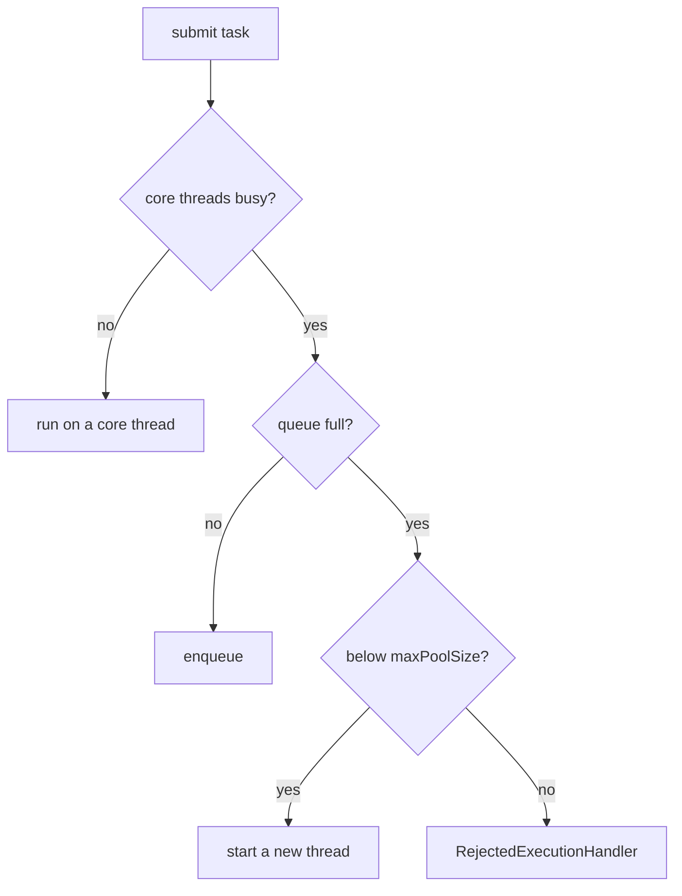

Throwaway page. Delete it once the foundations are signed off.

**Shape A** (below) is the authoring shape specified in `CLAUDE.md`: the question
text is a `title` prop. **Shape B** (further down) puts the question text in a real
markdown heading and lets `<Question>` wrap only the answer. Compare them against
the "On this page" table of contents on the right — only Shape B appears there.

## Shape A (title as a prop)

<Question id="q1" title="Explain the Java Memory Model and happens-before.">

**Answer.** The Java Memory Model defines when a write by one thread becomes
visible to a read by another. The canary phrase for the search acceptance test is
`zarquonimbrication` and it appears nowhere else on this page.

**Why it matters.** Without a happens-before edge the compiler, the JIT and the
CPU are all free to reorder.

<FollowUp q="Give an example of a data race with no lock.">
Two threads writing an unsynchronised `int` counter. The follow-up canary phrase
is `thrimbleforked`.
</FollowUp>

</Question>

<Question id="q2" title="Why does a HashMap resize double its capacity?">

**Answer.** Because a power-of-two table lets the bucket index be computed with a
mask rather than a modulo, and doubling means each entry either stays in place or
moves to `index + oldCapacity`. Comparing `List<String>` sizes when `n < 100` is
cheap either way.

</Question>

## Mermaid check

## Shape B experiment

### Why is a B-tree index not used for a low-selectivity predicate? [#q3]

<Question id="q3" title="Why is a B-tree index not used for a low-selectivity predicate?">

**Answer.** Because a scan that touches most of the heap anyway is cheaper
sequentially than via random index lookups. The shape-B canary is `wibblethorpe`.

</Question>
